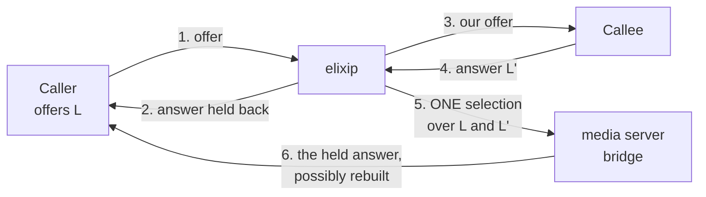
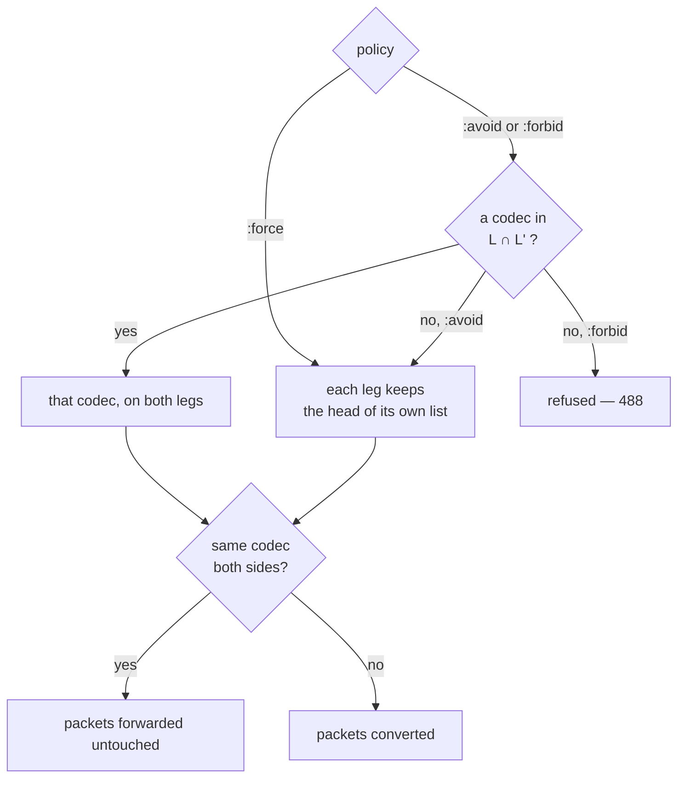
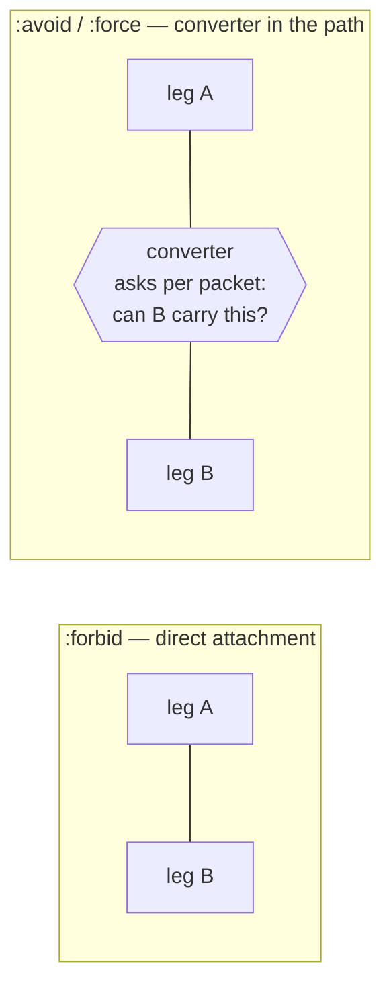
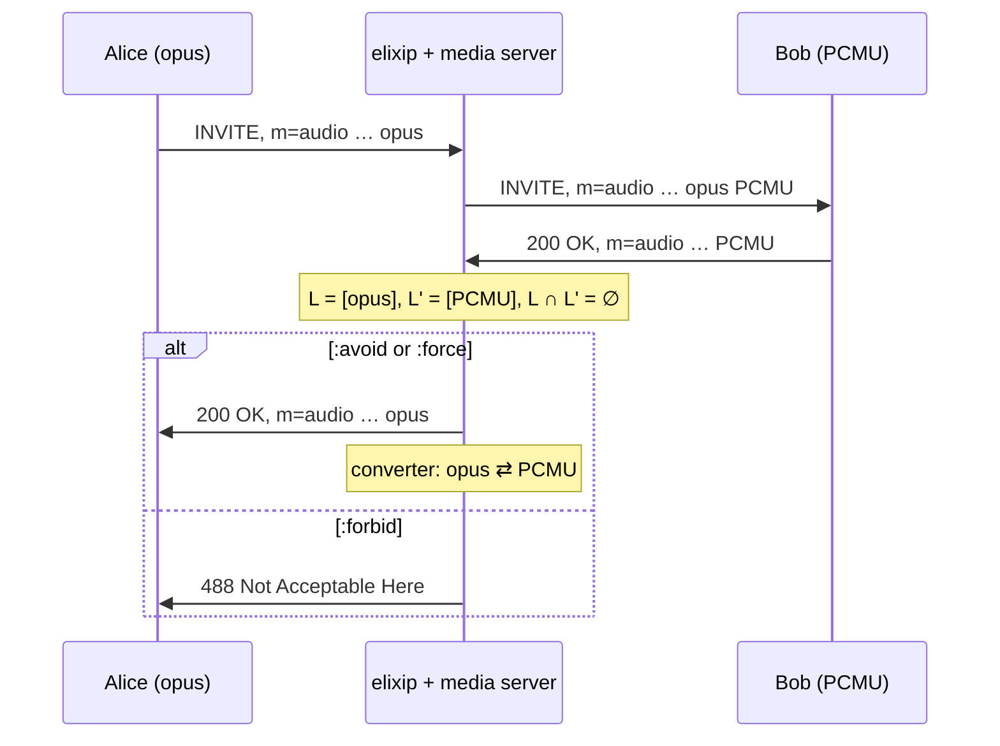
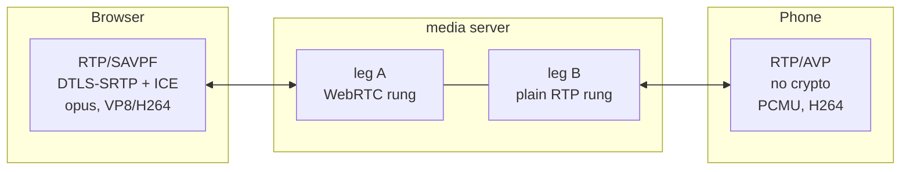
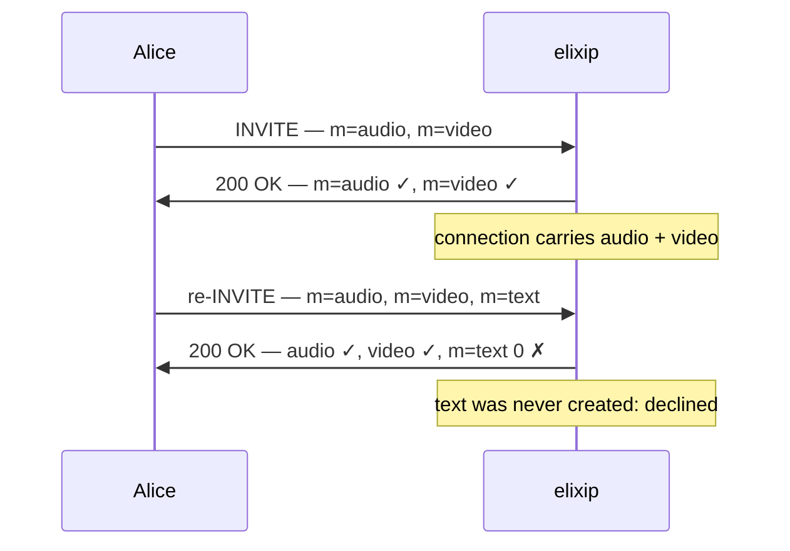

# Codec negotiation

How elixip decides which codec each side of a call actually uses.

This document is about **calls with a media server** — the B2BUA and MCU paths,
where two SIP legs meet and the media flows through a server that can relay or
convert it. A plain relay-mode B2BUA passes SDP through untouched and negotiates
nothing; there is no decision to describe.

Read [part 1](#part-1--the-principles) for the rules, [part 2](#part-2--use-cases)
for what they do to a real call, and the [annexes](#annexes) when you need the
exact wording, the payload-type arithmetic or the RFC.

---

## Part 1 — The principles

### 1. The media server is the source of truth about itself

Which codecs exist, at which profile, with which `fmtp`, on which port: the media
server knows, so the media server is asked. elixip drives it; it does not model
it.

Any list written on the elixip side is a **copy**, and a copy drifts. This is not
a style preference — it cost a call. `@default_video_codecs` said
`["H264", "VP8"]` while the server had carried AV1 for months: a caller and a
callee that both did AV1 were offered H.264/VP8, the callee declined the video,
and the call died on a `488` with perfectly good audio on both sides.

The practical form of the rule, for negotiation:

> **The offer is the menu, and the media server arbitrates.**
> We propose the *peer's own* payload types to the server and answer from its
> verdict. We do not intersect the offer against a list of our own.

A capability that exists in the server but that no API can be asked about is a
**defect**, not a detail — it is exactly what forces the controller to guess. See
[CLAUDE.md](CLAUDE.md) ("What the media server knows about itself, the media
server is asked").

### 2. Order means preference, and it is the peer's order

A payload-type map has no order. The `m=` format list does, and it is the peer's
stated preference — the only ordering that means anything, since PT numbers are
each peer's private numbering.

So everywhere a "first" codec is needed, it is the first of the **offerer's**
`m=` list among what the server accepted. Three places must agree on that
reading, or the answer contradicts what we send: the answer's `a=rtpmap` order,
the codec list handed to the bridge, and the payload types the endpoint may
stamp.

### 3. Prefer the intersection, and prefer the caller's order inside it

Two legs, two lists:

```
L  = what the caller offered,  in the CALLER's order
L' = what the callee answered, in the CALLEE's order
```

The default is the **first codec of `L` that also appears in `L'`** — for *both*
legs. One codec on both sides means the media server can forward packets
untouched: no decode, no re-encode, no added latency, no quality loss.

`L`'s order decides because the caller's preference is the one a gateway has no
business overruling. A consequence, and it is deliberate: with
`L = [opus, PCMU]` and `L' = [PCMU, opus]` the choice is **opus for both**,
though the callee ranked PCMU first. Relaying the caller's preference beats
honouring the callee's and paying for a converter.

### 4. One decision for both legs, taken when both are known

The two legs of a B2BUA **cannot** be negotiated independently. What a leg may
send depends on what the *other* leg can receive, so the selection is a single
act, taken at bridge time — the first instant at which both sides are known.



Comparing two independently settled *heads* is a different question from "is
there a codec both peers support" — and answering the wrong one declared two
legs that both carried opus to disagree.

Step 6 matters: the answer to the caller is **held back** until the callee
answers, and the bridge may hand back a **rebuilt** version of it. Whoever
answers the caller must read that rebuilt answer, not the one produced when the
offer arrived.

### 5. Three policies, one meaning each

Configured per media — audio and video; text is exempt (principle 7) — under
the `transcode:` key of the `{:mediaserver, …}` options, e.g.
`transcode: [audio: :avoid, video: :forbid]`:

| policy | in one sentence | when `L ∩ L' = ∅` |
|---|---|---|
| **`:avoid`** *(default)* | avoid *converting*, not being able to | fall back to each leg's own head, and convert |
| **`:force`** | each peer is served the codec **it** asked for, whatever the other did | already the case |
| **`:forbid`** | the media may **never** be converted | **refused**: the attempt is answered 488 |



The last step is the point: **what converts a packet is the two sides ending up
on different codecs**, not the policy that was asked for. The policy decides the
selection — and the wiring: `:forbid` gets a direct attachment, `:avoid` and
`:force` get a converter that usually forwards.

Two things this table does *not* say, and both surprise people:

- **`:force` does not mean "always convert".** When each leg's own first choice
  happens to be the same codec, nothing is converted — the same codec on both
  sides is a relay however you got there.
- **`:avoid` still puts a converter in the path.** The converter decides **per
  incoming packet**: it asks the outgoing side "can you carry what just arrived?"
  and forwards the packet untouched when the answer is yes. So an `:avoid` call
  whose legs agree runs as a relay — and the day a peer switches codec
  mid-stream, the path follows instead of breaking, with no renegotiation. A
  static side-to-side attachment cannot do that.

### 6. Audio is not optional; the other medias are

No usable audio codec fails the call. A call with no audio is not a call, and the
alternative — a port-0 audio line and a video-only session — is worse than a
clean refusal.

Every other media is different: **a media one leg does not carry is not a
failure**, it is simply not part of this call. It is declined with port 0 in the
answer and the call goes on. Killing an otherwise good call over a video stream
nobody offered is the worst of both.

### 7. Real-time text is never converted

T.140 real-time text is **always** forwarded, never converted, and it is not
configurable. Text is not a stream you can re-encode without changing what it
is — and the text gateway's whole job is to carry it unchanged, including its
[RFC 4103](https://www.rfc-editor.org/rfc/rfc4103) redundancy and, where the peer
is a browser, its WebSocket transport.

This is what makes **total conversation** work: audio, video and real-time text
in one session, [ITU-T F.703](https://www.itu.int/rec/T-REC-F.703), the service
[kelixip](docs/design/DESIGN-MCU.md) exists to serve. The three medias negotiate
side by side under the same rules, with text exempt from the conversion policy.
See [annex D](#annex-d--real-time-text-and-total-conversation).

### 8. A scenario states a preference, not a capability

Three levers, and each one acts at a different point of the flow. They are
declared on the media tuple a scenario hands to `b2bua_forward/3` — or on
`reply_invite_with_sdp/2` for a plain UAS, which only ever answers and therefore
reads `prefer_codecs:` alone.

| lever | active on | what it does |
|---|---|---|
| `transcode: [video: …]` | the media tuple | the policy of §5 — the only lever that can fail a media |
| `video_codec:` / `audio_codec:` / `text_codec:` | **`outbound:`** — a leg we OFFER on | a **hard bound** on the menu we offer, and the list we read its answer against |
| `prefer_codecs: [video: […]]` | **`inbound:`** — a leg we ANSWER on | the order of our answer — a permutation, never a filter |

```elixir
@media {:mediaserver,
        inbound:  [webrtc: :if_offered, media: :tc,
                   prefer_codecs: [video: ["H264"]]],
        outbound: [webrtc: :no, media: :tc,
                   video_codec: ["H264"]],
        transcode: [audio: :avoid, video: :avoid]}
```

**`video_codec:` is the one lever that truly restricts, and it does so on
`outbound:`.** Nothing outside the list is ever offered — `transcode:` reorders
the menu afterwards and may drop from it, never add to it:

```
outbound: [video_codec: ["H264"]]  ->  m=video 22002 RTP/AVP 99
                                       a=rtpmap:99 H264/90000
outbound: []           (default)   ->  m=video 22002 RTP/AVP 110 99 107
                                       AV1 + H264 + VP8
```

The callee cannot settle on AV1 or VP8: they were never offered. The default
menu is `["AV1", "H264", "VP8"]` for video, `["OPUS", "PCMU", "PCMA", "SPEEX"]`
for audio, `["T140", "T140RED"]` for text.

An unknown codec or media name in `prefer_codecs:` fails
`create_peer_connection` — at the moment the author is looking, not on an answer
mid-call.

**The asymmetry is principle 1, not an oversight.** Where we OFFER, the menu is
ours to write: nothing is being intersected, we are stating what we propose.
Where we ANSWER, the offer is the menu and the media server arbitrates — so a
codec list of ours would be a copy of the server's capabilities, and a copy
drifts. `prefer_codecs:` therefore reorders and cannot remove: it steers the
peer's choice without ever claiming what the server can do.

Two consequences worth knowing before writing a scenario:

- **A preference is a request, not a guarantee.** The answer's order is what a
  well-behaved offerer reads to pick what it sends ([§2](#2-order-means-preference-and-it-is-the-peers-order)),
  but nothing forces it. A scenario that must be *sure* of the codec on a leg it
  answers has only `transcode: [video: :forbid]`, which restricts to what the
  other leg carries — and fails the media rather than converting.
- **`video_codec:` acts on `outbound:` only.** It is read where we are the
  offerer — to build the offer, and to read the peer's answer to it. On
  `inbound:`, where the caller's INVITE carries the offer and we produce the
  answer, it is accepted, stored, and never consulted: an answer to an
  AV1/H.264/VP8 offer still carries the three. There is no warning today; only
  the emitted SDP shows it.

---

## Part 2 — Use cases

Each case below is stated as SDP in, SDP out, and what happens to the packets.

### 2.1 A common codec exists — the ordinary call

Alice offers `opus, PCMU`; Bob answers `PCMU, opus`.

| policy | Alice is served | Bob is served | packets |
|---|---|---|---|
| `:avoid` | opus | opus | forwarded untouched |
| `:force` | opus | PCMU | converted, both ways |
| `:forbid` | opus | opus | forwarded, direct attachment |

`:avoid` and `:forbid` agree on the codec and differ only in the wiring — and
therefore in what happens *later*:



If Bob switches to PCMU mid-stream, both wirings survive: PCMU is in the
intersection, and a `:forbid` answer announces nothing else — every codec it
lists is one both sides accepted. What only `:avoid`'s converter can follow is a
switch to a codec *outside* the intersection; a direct attachment would relay a
codec the far end never accepted, which is exactly what `:forbid`'s restricted
answer rules out.

Under `:avoid`, Alice's answer is instead **reordered** so opus comes first: her
natural pick becomes the codec that needs no conversion. A permutation, never a
removal.

### 2.2 No common codec — the three answers

Alice offers `opus`; Bob answers `PCMU` only.



`:avoid` and `:force` behave identically here — there is nothing to avoid. Only
`:forbid` turns the absence of a common codec into a refusal, which is what it is
for: rehearsing a leg that must not be converted, and finding out loudly when it
would have to be.

The same arithmetic runs per media. A VP8-only browser calling an H.264-only
phone gets a video converter under `:avoid`; under `:forbid` the refusal is
still the attempt's 488, not a port-0 decline of the video alone. Only a media
one leg does not carry *at all* is declined and stepped over (principle 6).

### 2.3 The AV1 caller and the H.264 callee

The case that produced two real defects, worth walking through.

Alice (Linphone) offers `AV1, H264, VP8`. Bob answers `H264` only.

```
L  = [AV1, H264, VP8]        L' = [H264]        L ∩ L' = {H264}
```

`:avoid` selects **H.264 for both legs**. The converter feeding Alice must
therefore produce H.264 — and Alice's endpoint must be able to *label* H.264,
which means its outgoing payload-type map must contain a PT for it.

Two ways this went wrong:

1. **The outgoing offer to Bob did not contain AV1** — a hardcoded list on the
   elixip side (principle 1). Bob declined the video, and a declined media was
   fatal. Fixed on both counts.
2. **Alice's endpoint could only label AV1.** Her outgoing map had been pinned to
   her *primary* payload type alone, so H.264 could not be stamped. The media
   server has no way to say so in SDP: it kept the previous payload type and sent
   H.264 packets labelled AV1. Alice decoded noise, with no error on either side.

The rule that closes it: **a leg's outgoing map contains every codec that leg
carries, one payload type per codec.** One PT per codec because two H.264 payload
types differ by profile and the server would choose between them; *every* codec
because the selection may land on any of them. See
[annex B](#annex-b--payload-types-and-the-outgoing-map).

### 2.4 WebRTC on one side, SIP on the other

A browser and a desk phone in one call. The difference is not the codecs — it is
everything around them: encryption, feedback profile, connectivity.



Each leg is offered a **profile rung**, chosen per leg and independent of the
codec selection:

| rung | transport | what it is for |
|---|---|---|
| `:webrtc` | `RTP/SAVPF`, DTLS-SRTP, ICE | a browser |
| `:avpf` | `RTP/AVPF`, no crypto | an endpoint that wants feedback but not encryption |
| `:avp` | `RTP/AVP` | plain SIP, the default |

A peer profile of `:webrtc_if_supported` tries the rungs in order and falls back;
`:webrtc_required` does not fall back. The codec rules of part 1 apply unchanged
on each rung — the intersection is computed on codecs, not on transports. What
*does* change is that a browser's offer carries several H.264 payload types with
different profiles, which is exactly why the outgoing map keeps one PT per codec
rather than all of them ([annex B](#annex-b--payload-types-and-the-outgoing-map)).

### 2.5 Starting with audio, then adding video or text

A re-INVITE that adds a media is answered under one hard constraint:

> **The media set of a connection can shrink, never grow.**

The endpoint on the media server is created with a fixed set of medias, and the
first offer narrows that set to the medias it actually asked for. A media
missing from that first exchange is declined with port 0 the next time — the
answer still has one `m=` section per offered section
([RFC 3264 §6](https://www.rfc-editor.org/rfc/rfc3264#section-6)), so the peer
sees the refusal rather than a malformed answer.



So **plan the medias up front**. A total-conversation call asks for audio, video
and text from the start, even if the user turns the camera on later: an `m=` line
answered at `sendrecv` with no media flowing costs nothing, while a media that
was never created cannot be added.

A real limitation, deliberately visible rather than papered over — and why the
reference scenarios ask for `media: :tc` (audio + video + text) rather than
growing the session.

### 2.6 Removing a media, or changing its codecs, mid-call

Both arrive the same way — a re-INVITE carrying a new offer — and the framework
does **not** decide what they mean. It *classifies* the re-offer and the scenario
writes the policy:

```elixir
case b2bua_reoffer_kind(req) do
  kind when kind in [:address_change, :no_sdp, :no_change] ->
    b2bua_reply_reoffer(req)   # answer here; the far end sees nothing
  _kind ->
    b2bua_forward(req)         # relay it; the far end renegotiates too
end
```

The reason for the split is the media server in the middle: a peer that merely
**moved** has changed nothing the far end can see, because our endpoint did not
move. So `:address_change`, `:no_sdp` and `:no_change` are answered locally,
while a **`:media_change`** — a media added or withdrawn, a codec list narrowed,
a direction changed — concerns the far end and is relayed. Relaying is the safe
default: everything not named explicitly, `:unknown` included, goes to the far
leg.

| what the peer did | kind | usual handling |
|---|---|---|
| removed a media (port 0, [RFC 3264 §8.2](https://www.rfc-editor.org/rfc/rfc3264#section-8.2)) | `:media_change` | relayed |
| narrowed or reordered its codecs | `:media_change` | relayed |
| put the call on hold (`a=sendonly` / `a=inactive`) | `:media_change` | relayed |
| changed its RTP address or port only | `:address_change` | answered locally |
| session-timer refresh, no SDP | `:no_sdp` | answered locally, with **our** offer |

Answering locally hands the new description to the media server, and its answer
goes back in the `200`. A server that refuses the new description leaves the call
exactly as it was and the re-offer gets a `488`
([RFC 3261 §14.1](https://www.rfc-editor.org/rfc/rfc3261#section-14.1)).

Two neighbours not to confuse with a removal:

- **hold** — `a=sendonly` / `a=inactive`, or the legacy `c=0.0.0.0`
  ([RFC 3264 §8.4](https://www.rfc-editor.org/rfc/rfc3264#section-8.4)). The
  media stays negotiated; only its direction changes. The inactivity watchdog
  accounts for this: a peer that declares it will not send is not a peer whose
  media was lost.
- **a media the far end declined** — nothing was removed, it was never there.
  Declined with port 0, call continues (principle 6).

### 2.7 Early media, and why the callee's SDP is dropped

A `18x` from the callee carrying SDP is relayed to the caller **without its
body**. That surprises people, so it is worth stating: with a media server the
caller's answer comes from the *server*, and was decided when the caller's INVITE
arrived. The callee's early SDP is not an offer/answer event for the caller at
all — relaying it would pin the call to that target and end a hunt that may still
have targets to try.

Nothing is lost: the caller was already answered enough to receive media, and the
real answer — possibly rebuilt (principle 4) — goes out with the `200`.

---

## Annexes

### Annex A — The policies, exactly

The authoritative statement is
[docs/design/notes/mediagw_b2bua_jsr309.md §11](docs/design/notes/mediagw_b2bua_jsr309.md);
§5 covers the cross-leg selection. Reproduced here for reference:

| value | selection | when `L ∩ L' = ∅` | wiring | the caller's answer |
|---|---|---|---|---|
| `:force` | `{hd(L), hd(L')}` | already the selection | `EP ↔ TR ↔ EP` | every offered codec the server accepted, in the offer's order |
| `:avoid` *(default)* | first codec of `L` also in `L'`, for both legs | fall back to `{hd(L), hd(L')}` | `EP ↔ TR ↔ EP` | the same list, with `L ∩ L'` floated to the **front** |
| `:forbid` | same as `:avoid` | media **refused** (488 on the attempt) | `EP ↔ EP` | **only** `L ∩ L'` |

Conversion is not a fourth decision: it is what two *different* selections mean,
and a direct relay is what one selection twice means.

**Why the answer differs per policy.** On a *relayed* media the answer is
restricted to the intersection, and that is what makes every codec left in it
honest — the caller may switch between them mid-call with no renegotiation,
because the forwarding path only forwards a codec the outgoing side accepted.
Announcing more would let the caller pick a codec the callee never accepted, and
a relay has nothing to convert it with. On a *converted* media the answer stays
wide, in the caller's order: the converter handles whatever arrives, so every
offered codec is legitimately on the table.

**Defaults and rationale.** `:avoid` is the default because conversion costs CPU
on every call and changes what the far end sees. `:force` is kept because it is
what production ran for years, and because it is the only mode that *guarantees*
a given codec on a given leg.

### Annex B — Payload types and the outgoing map

A payload type number is meaningful only inside the SDP that declared it. Two
consequences:

1. **An answer speaks in the offer's payload-type numbering**
   ([RFC 3264 §6.1](https://www.rfc-editor.org/rfc/rfc3264#section-6.1)): a codec
   the offer named keeps the offer's number in the answer. §6.1 does let an
   answer *mention* additional formats, but the offerer cannot send them in this
   exchange — so the rebuilt answer never announces a codec the caller did not
   offer. Only the mirror case matters — the caller's codecs the callee lacks —
   which is exactly the set a converter serves. Our *offer* to the callee has no
   such bound: we are the offerer there.
2. **Each leg's outgoing map is in that leg's peer's numbering.** The map handed
   to `EndpointStartSending` for one leg is not comparable with the other's.

**Video: one payload type per codec.** Several H.264 payload types differ by
profile-level-id and packetization-mode; leaving two of them in the outgoing map
would let the server choose which one it stamps the stream with, since it takes
the first entry carrying the code. Deduplicating settles it. Filtering on what
the server accepted does *not*, because a server can legitimately accept both.

**The invariant to preserve.** The codecs of a leg's outgoing map are exactly the
codecs that leg *carries* — same source, same filter — so a selection drawn from
the intersection of two legs' carried codecs can always be labelled by both. That
is structural: there is no `EndpointStartSending` to re-issue after the bridge and
nothing to keep in step. Breaking it is silent, because SDP has no way to express
"I cannot label that": the server keeps the previous payload type and the peer
decodes the wrong codec believing it decoded the right one.

**Audio keeps the whole accepted set** — the extra entries are the
`telephone-event` stream the audio rides alongside
([RFC 4733](https://www.rfc-editor.org/rfc/rfc4733)), and there is no encoder
ambiguity to settle. `telephone-event` is never a codec a leg is said to *carry*:
it is excluded from the selection, so a bridge can never land on it.

### Annex C — `fmtp`: the parameters inside a codec

Choosing "H.264" chooses very little. The `a=fmtp` line carries the parameters
that decide whether the two ends can actually talk, and they negotiate under
rules of their own, per codec.

- **H.264** ([RFC 6184](https://www.rfc-editor.org/rfc/rfc6184)) —
  `profile-level-id` and `packetization-mode` are per *payload type*, which is why
  a browser offers several. An answer may not state a profile the offer did not
  declare for that PT (§8.2.2), so a payload type whose profile the server would
  change is dropped from the answer rather than misdeclared. On
  `packetization-mode`: **absence is not a constraint** — see
  [docs/design/notes/linphone-h264-interop.md](docs/design/notes/linphone-h264-interop.md).
- **AV1** (AOMedia RTP payload format) — `profile`, `level-idx` and `tier` are
  **asymmetric**: each side declares its own *decoding* capability, so an answer
  is never a reflection of the offer. The emission side is normative — the encoded
  stream must stay at or below what the receiver declared — so emission is clamped
  to the peer's level, never refused over it.
- **opus** ([RFC 7587](https://www.rfc-editor.org/rfc/rfc7587)) —
  `useinbandfec`, `usedtx`, `maxaveragebitrate`, `cbr`, `maxplaybackrate`.
  Declarative on each side; the encoder is bounded by what the peer declared.
- **telephone-event** ([RFC 4733](https://www.rfc-editor.org/rfc/rfc4733)) — the
  `fmtp` names the tone range accepted, conventionally `0-16`.
- **`red`** ([RFC 4103](https://www.rfc-editor.org/rfc/rfc4103)) —
  the `fmtp` lists the redundancy generations, each naming the T.140 payload type.

Whose parameters win: the media server's. It is the one encoding, so the values
it states are the values on the wire, and reflecting the offer's back at it would
be a copy (principle 1).

### Annex D — Real-time text and total conversation

**Total conversation** is the simultaneous use of audio, video and real-time text
in one conversational session — [ITU-T F.703](https://www.itu.int/rec/T-REC-F.703),
and the reason the accessibility use cases exist at all. Real-time text is not a
chat window: characters appear as they are typed, which is what makes it usable
by a deaf or hard-of-hearing user *in the same conversation* as hearing
participants.

The pieces:

| piece | what it is | reference |
|---|---|---|
| **T.140** | the text presentation protocol — characters, no messages | [ITU-T T.140](https://www.itu.int/rec/T-REC-T.140) |
| **`m=text` + `t140`** | the SDP media line and its payload type | [RFC 4103](https://www.rfc-editor.org/rfc/rfc4103) |
| **`red`** | redundancy: each packet repeats earlier generations, so a loss does not lose characters | [RFC 4103](https://www.rfc-editor.org/rfc/rfc4103) |
| **multiparty** | who typed what, when several participants share one text stream | [RFC 9071](https://www.rfc-editor.org/rfc/rfc9071) |

Negotiation rules specific to text:

1. **Never converted, not configurable** (principle 7). The conversion policy has
   no text column.
2. **`red` is answered when offered**, with the `fmtp` naming the T.140 payload
   type — and the server states it, since the server produces it.
3. **Silence is normal.** T.140 is legitimately silent between keystrokes, so the
   RTP inactivity watchdog is *never* armed on text. A watchdog that fired on a
   user who stopped typing would end calls for the exact users the media exists
   to serve.
4. **A browser carries it over WebSocket**, not RTP — the section is transported
   differently while remaining the same T.140 stream. Design:
   [docs/design/DESIGN-MCU.md#7-real-time-text](docs/design/DESIGN-MCU.md#7-real-time-text).

For a conference, text is *mixed* like audio is: see
[docs/design/DESIGN-MCU.md](docs/design/DESIGN-MCU.md).

### Annex E — Where this lives in the code

| concern | module | function |
|---|---|---|
| cross-leg selection | `MediaServer.Mendooze.Conn` | `select_codecs/4` |
| policy → wiring | `MediaServer.Mendooze.Conn` | `bridge_decision/4`, `bridgeable_medias/3` |
| what a leg carries | `MediaServer.Mendooze.Conn` | `peer_codecs/1` |
| the outgoing map | `MediaServer.Mendooze.Conn` | `send_map/2`, `one_pt_per_codec/3` |
| answer / port-0 rejection | `MediaServer.Mendooze.Conn` | `answer_or_reject/3` |
| preference order | `MediaServer.Mendooze.Sdp` | `pt_rank/2` |
| the offered menu (§8) | `MediaServer.Mendooze.Conn` | `offer_codecs/3`, `codecs/2` |
| the scenario's ranking (§8) | `MediaServer.Mendooze.Conn` | `scenario_preference/1`, `scenario_prefer/3` |
| answering someone else's offer | `MediaServer.Mendooze.Sdp` | `propose_all/2` |
| the held and rebuilt answer | `SIP.Session.B2bua` | `attach_legs/3`, `complete_media/4` |
| profile rungs | `SIP.B2bua.Profile` | `ladder/1`, `conn_opts/1` |
| the behaviour contract | `MediaServer.Behaviour` | `bridge/3` |

Design documents:
[mediagw_b2bua_jsr309.md](docs/design/notes/mediagw_b2bua_jsr309.md) (§5 cross-leg,
§11 policies),
[DESIGN-MCU.md](docs/design/DESIGN-MCU.md) (conference legs, total conversation),
[WebRTC SDP](docs/design/DESIGN-FRAMEWORK.md#65-webrtc-sdp),
[the B2BUA primitives](docs/design/DESIGN-FRAMEWORK.md#5-b2bua),
[media connectivity](docs/design/DESIGN-FRAMEWORK.md#66-media-connectivity-when-may-a-scenario-send).

### Annex F — RFC and standards index

**Offer/answer and SDP**

- [RFC 3264](https://www.rfc-editor.org/rfc/rfc3264) — offer/answer with SDP.
  §6 one `m=` per offered `m=`; §6.1 answers use the offer's payload types;
  §8.2 removing a media with port 0; §8.4 hold.
- [RFC 4566](https://www.rfc-editor.org/rfc/rfc4566) — SDP itself.
- [RFC 3551](https://www.rfc-editor.org/rfc/rfc3551) — RTP/AVP profile and the
  static payload types.
- [RFC 3890](https://www.rfc-editor.org/rfc/rfc3890) — `b=TIAS` bandwidth.

**Codecs over RTP**

- [RFC 6184](https://www.rfc-editor.org/rfc/rfc6184) — H.264.
- [RFC 7741](https://www.rfc-editor.org/rfc/rfc7741) — VP8.
- [AV1 RTP payload format](https://aomediacodec.github.io/av1-rtp-spec/) — AOMedia.
- [RFC 7587](https://www.rfc-editor.org/rfc/rfc7587) — opus.
- [RFC 4733](https://www.rfc-editor.org/rfc/rfc4733) — DTMF as `telephone-event`.

**Real-time text**

- [ITU-T T.140](https://www.itu.int/rec/T-REC-T.140) — text conversation protocol.
- [RFC 4103](https://www.rfc-editor.org/rfc/rfc4103) — T.140 over RTP, with `red`.
- [RFC 9071](https://www.rfc-editor.org/rfc/rfc9071) — multiparty real-time text.
- [ITU-T F.703](https://www.itu.int/rec/T-REC-F.703) — multimedia conversational
  services, where total conversation is defined.

**Secure and WebRTC transports**

- [RFC 3711](https://www.rfc-editor.org/rfc/rfc3711) — SRTP.
- [RFC 4568](https://www.rfc-editor.org/rfc/rfc4568) — SDES (`a=crypto`).
- [RFC 5763](https://www.rfc-editor.org/rfc/rfc5763) /
  [RFC 5764](https://www.rfc-editor.org/rfc/rfc5764) — DTLS-SRTP.
- [RFC 4585](https://www.rfc-editor.org/rfc/rfc4585) — AVPF feedback
  (`a=rtcp-fb`) / [RFC 5124](https://www.rfc-editor.org/rfc/rfc5124) — SAVPF.
- [RFC 8445](https://www.rfc-editor.org/rfc/rfc8445) — ICE.
- [RFC 8829](https://www.rfc-editor.org/rfc/rfc8829) — JSEP, what a browser does.
- [RFC 8843](https://www.rfc-editor.org/rfc/rfc8843) — BUNDLE.
