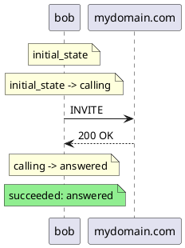

# elixipp — the SIP testing tool

> `elixipp` is the **test tool** of the Elixip project: a sipp replacement that
> drives DSL scenarios and can control a media server to fully simulate SIP
> calls. It is one of the two artifacts built from this repo — the other is the
> [kelixip](docs/kelixip/README.md) application server.
>
> * Scenario language: **[DSL.md](DSL.md)**
> * Building the escript: **[BUILD.md](BUILD.md)**
> * TLS / WSS certificates: **[TLS_WSS.md](TLS_WSS.md)**

## Quickstart

Five minutes, from nothing to a REGISTER against a real proxy.

```bash
# 1. Get the tool (needs an Erlang/OTP runtime on the host, nothing else).
cd apps/elixipp && mix escript.build          # -> ./elixipp
cp elixipp ~/.local/bin/                      # optional

# 2. Describe your account. Copy the template and fill it in.
cp ../../scenario-config.json accounts.json
$EDITOR accounts.json

# 3. Run the built-in REGISTER scenario against it.
elixipp -c accounts.json UAC.Register
```

```
Scenario UAC.Register succeeded.
```

That is the whole contract: **exit code 0 and a `succeeded` line**, or a non-zero
exit and the reason. The SIP trace of the run is in `elixipp.log`.

Nothing to fill in yet? `elixipp UAC.Invite` and `elixipp UAC.Register` are compiled
into the binary and need no file at all, and `apps/elixip2/scenarios/` holds
editable copies of everything (see [Scenarios](#scenarios)).

## Reading the outcome

`elixipp` answers in three places: the exit code, the summary, and the log.

| Exit code | Meaning |
|---|---|
| `0` | no failure — every run either succeeded or was **aborted** on purpose (`scenario_aborted`, e.g. a graceful stop) |
| `1` | at least one run failed (`scenario_failure`, a crash, or an unexpected SIP response) |
| `2` | the tool refused to start: bad option, missing file, no listener could bind |

A multi-run or server run ends with a summary:

```
══ Résumé ══════════════════
  Scénario    : UAS.RegisterExample
  Total       : 12        ← instances started
  Succès      : 11        ← scenario_success
  Interrompus : 1         ← scenario_aborted (graceful stop, peer hung up…) — not a failure
  Échecs      : 0         ← scenario_failure
  Refusés 503 : 3         ← turned away: the -l quota was full
  Refusés 604 : 1         ← turned away: R-URI domain not in the scenario's `domains:`
════════════════════════════
```

The two `Refusés` lines only appear when something was actually refused. They are
the answer to "my phone got a 503 and the tool says nothing".

## Running a scenario

Two ways, same scenarios.

### From the repo, with mix (writing and debugging)

```bash
mix deps.get && mix compile
mix scenario apps/elixip2/scenarios/uac_register.exs
mix scenario --config accounts.json UAC.Register
```

`mix scenario` starts the stack, loads the file (or the built-in module name),
locates the scenario module, runs **one** instance, logs the outcome and exits `0`
or `1` — usable in CI as-is.

### Standalone, with the escript (running tests anywhere)

`apps/elixipp` builds a self-contained [escript](https://hexdocs.pm/mix/Mix.Tasks.Escript.Build.html):
all the compiled BEAM of `elixipp`, the SIP stack and their dependencies in one file.
It still needs an Erlang runtime (`erl` / `escript`) on the host — but no Elixir, no
mix, no source tree.

```bash
cd apps/elixipp && mix escript.build
./elixipp --help
./elixipp ../elixip2/scenarios/uac_register.exs
```

Copy the binary anywhere (`cp elixipp ~/.local/bin/`). Same exit codes as
`mix scenario`.

### Scenarios

The scenario argument is **either a path to a `.exs` file, or the name of a built-in
module**. A path is yours: it is taken as given, relative to the current directory.
Inside a scenario, a sub-scenario (`sub_fsm "other.exs"`) is looked up next to the
file that declares it — so a scenario and its children stay a self-contained unit
wherever you run them from.

Two built-ins ship inside the binary and need no file on the host:

```bash
elixipp UAC.Invite      # outbound INVITE + media
elixipp UAC.Register    # REGISTER + keepalive + refresh + un-REGISTER
```

Their sources are in [`apps/elixip2/lib/scenarios/`](apps/elixip2/lib/scenarios/).
The editable copies in [`apps/elixip2/scenarios/`](apps/elixip2/scenarios/) are the
same logic under a different module name (`UAC.InviteExample`,
`UAC.RegisterExample`), so both can coexist:

| File | What it does |
|---|---|
| `uac_register.exs` | REGISTER, digest auth, OPTIONS keepalive, one refresh, un-REGISTER |
| `uac_invite.exs` | outbound call with media |
| `uac_invite_webrtc.exs` | the same over WebRTC SDP |
| `uas_register.exs` | **registrar**: challenges, verifies, accepts/refreshes/un-registers |
| `uas_invite.exs` | **call server**: answers inbound INVITEs |
| `uac_register_and_uas_invite.exs` | registers, then waits for an inbound call (uses `sub_fsm`) |
| `smoke.exs` | no SIP traffic; checks the tool itself end to end |
| `http_get_example.exs` | an HTTP call from a scenario |

Start from one of these to write your own, and combine either form with `--config`
to inject real accounts.

## Server (UAS) mode — registrar and call server

A scenario declaring `uas :register` or `uas :invite` is a server: `elixipp` binds
the `--listen` sockets and lets inbound requests drive it, one instance per dialog.

```bash
# Registrar on UDP/5060, with the password it must verify taken from the JSON
elixipp -c accounts.json --listen udp:5060 uas_register.exs

# Several protocols at once, and a cap on concurrent registrations
elixipp -l 200 --listen udp:5060 --listen tcp:5060 uas_register.exs

# Call server: answer inbound INVITEs
elixipp --listen udp:5060 uas_invite.exs
```

What to expect:

- **`-l N` caps concurrent instances** — registrations or calls. Beyond it, requests
  are answered `503 Service Unavailable` and counted in the summary. Default: 50.
- **`--max-run N`** stops accepting after N instances in total, then exits when the
  last one ends. `0` means no limit.
- **A call server checks the INVITE R-URI** against the scenario's `config domains:`
  (a list, or `:any`); a domain it does not serve gets `604 Does Not Exist Anywhere`.
- **`--config` behaves differently here**: a server has no run counter to cycle
  accounts on, so the header and the **first** account are shared by every instance.
  That is how the reference registrar gets the password it verifies — without
  `-c`, it accepts any well-formed `Authorization`.
- **Stopping**: type `q` then Enter for a graceful stop (no new instances, the active
  ones are asked to wind down), or `Ctrl+D` to stop now. Instances that ignore the
  request are forced after 5 s, with a line saying how many.
- **An OPTIONS received outside any dialog is answered `500`.** Answering a liveness
  ping is the application's business — what a node supports depends on what it runs —
  and `elixipp` registers no handler yet, so a proxy that pings it will consider it
  down. In-dialog OPTIONS keepalives are answered `200` by the dialog layer as usual,
  so this only concerns a bare ping. kelixip answers those properly (200 with its
  `Allow`, 503 while draining).

Both listeners and the summary tell you what happened:

```
elixipp — mode serveur UAS Register (UAS.RegisterExample)
  instances max : 50
  listeners     : udp:127.0.0.1:5060 (:ok), tcp:*:5060 ({:error, :eaddrinuse})
```

A listener that fails says why on stderr; if **every** listener fails, the tool exits
`2` rather than pretending to serve.

### TLS and WSS

Both need an X.509 certificate, given on the command line (or through
`ELIXIPP_TLS_CERT` / `ELIXIPP_TLS_KEY`):

```bash
elixipp --listen tls:5061 --tls-cert certs/cert.pem --tls-key certs/key.pem uas_register.exs
elixipp --listen wss:5065 --tls-cert certs/cert.pem --tls-key certs/key.pem uas_register.exs
```

Generating a self-signed pair, mutual TLS, cipher suites and the operational
guidance: **[TLS_WSS.md](TLS_WSS.md)**. As a **client**, `elixipp` needs no
certificate of its own (it does not verify the server's either, by default), so
dialling a TLS or WSS proxy works with nothing but the URI. Connection caps default
to 100 per protocol (`:tcp_max_connections`, `:tls_max_connections`,
`:wss_max_connections` in `config/config.exs`).

Internals, if you need them: [docs/design/tls_listener.md](docs/design/tls_listener.md),
[docs/design/wss_listener.md](docs/design/wss_listener.md).

### Testing kelixip with elixipp

The two artifacts of this repo are made to be pointed at each other: kelixip is the
registrar under test, `elixipp` the client fleet.

```bash
# 1. kelixip, with a domain and a subscriber (see docs/kelixip/installation.md)
KELIXIP_CONFIG=/etc/kelixip/config.toml $REL daemon

# 2. one client, verbose, to see the exchange end to end
elixipp -c accounts.json --log-level debug UAC.Register

# 3. what the server thinks
kelictl registration list

# 4. then the same at scale: 200 accounts, 20 new registrations per second
elixipp -c accounts.json -l 200 --rate 20 --monitor UAC.Register
```

The reverse direction works too: run `elixipp` as the registrar
(`--listen udp:5060 uas_register.exs`) and point a real handset or a proxy at it.

### Two elixipp processes on one host

A REGISTER exchange between two `elixipp` needs **two OS processes** (a single BEAM
has one transaction registry, so it cannot be both ends of the same transaction), on
different local ports. The client picks a free port ≥ 5000 by itself, so
`--local-port` is only for reproducibility:

```bash
# Terminal 1 — the registrar
elixipp -c accounts.json --listen udp:127.0.0.1:5060 uas_register.exs

# Terminal 2 — the client, pointed at it
elixipp -c loopback.json --local-port 5070 --local-addr 127.0.0.1 uac_register.exs
```

with `loopback.json` pointing the client at the local registrar:

```json
{
  "domain": "example.com",
  "proxyuri": "sip:127.0.0.1:5060",
  "proxyusesrv": false,
  "accounts": [ { "username": "alice", "password": "changeme", "domain": "example.com" } ]
}
```

For TCP, TLS or WSS, add the transport to the proxy URI
(`"sip:127.0.0.1:5060;transport=tcp"`, `;transport=tls`, `;transport=wss`) and give
the server its certificate.

## Command-line options

```bash
elixipp [OPTIONS] <scenario.exs | ModuleName>
```

| Option | Meaning | Default |
|---|---|---|
| `-m`, `--monitor` | Live table of the instances in progress. | off |
| `-l N`, `--limit N` | Concurrent instances: calls in client mode, registrations/calls in server mode (503 beyond). Without `--max-run`, client slots are recycled indefinitely. | `1` client, `50` server |
| `--max-run N` | Stop after `N` instances in total. `0` = no limit. | `1` for a bare run, unlimited as soon as `-l` or `--max-run` is given |
| `--rate N` | New calls started per second (client mode); each creation is spaced by `1000 / N` ms. Values outside `0 < N ≤ 100` are ignored with a warning. | `2` |
| `-c FILE`, `--config FILE` | JSON file parameterizing the scenario (header + N accounts). See [JSON parameterisation](#json-parameterisation). | none |
| `--listen PROTO:PORT` | (server) Listen for inbound requests. Repeatable. `PROTO:ADDR:PORT` also pins the advertised local IP; `PROTO` alone picks a free port ≥ 5000. Protocols: `udp`, `tcp`, `tls`, `wss`. | `udp:5060` |
| `--tls-cert FILE` | X.509 certificate (PEM) for the TLS/WSS listeners. Env: `ELIXIPP_TLS_CERT`. | `certs/certificate.pem` |
| `--tls-key FILE` | Its private key. Required together with `--tls-cert`. Env: `ELIXIPP_TLS_KEY`. | `certs/private_key.pem` |
| `--local-port PORT` | (client) Local UDP port to send from. | a free port ≥ 5000 |
| `--local-addr ADDR` | (client) Local IP advertised in Via/Contact. | first local IPv4 |
| `--log-file PATH` | Log file. | `elixipp.log` |
| `--log-level LEVEL` | `debug` \| `info` \| `warning` \| `error`. `debug` is the one that shows the SIP messages. | `info` |
| `--log-sequence` | Write a PlantUML sequence diagram per instance. One instance at a time only (refused with `-l > 1`, client or server). | off |
| `-h`, `--help` | Show the help. | — |

Keys, in live mode:

| Key | Action |
|---|---|
| `q` | Graceful stop: no new instances, wait for the active ones (forced after 5 s). |
| `Ctrl+D` | Stop now: print the summary and halt. |
| `↑` / `↓` | Scroll the table when it exceeds the terminal height. |

## Live monitor (`--monitor`)

One row per running instance — the account it uses, the last high-level command it
issued, its current FSM state and the event that caused the last transition:

```
╭────────────────┬────────────────┬────────────────┬──────────────────┬────────────────────────────╮
│Scénario        │Compte          │Commande        │État              │Événement                   │
├────────────────┼────────────────┼────────────────┼──────────────────┼────────────────────────────┤
│UAC.Register    │33970262546     │send_REGISTER   │registered        │200 OK                      │
│UAC.Invite      │1001            │media_play      │call_established  │toto.mp4: start             │
│  └ callee      │1001            │reply_invite    │answered          │INVITE                      │
╰────────────────┴────────────────┴────────────────┴──────────────────┴────────────────────────────╯
  Actifs: 3/5  |  Succès: 41  |  Interrompus: 0  |  Échecs: 2  |  Total: 44/100  [q: arrêt propre | Ctrl+D: immédiat]
```

- **Compte** is the account in use — set from the scenario config, or learned from
  the REGISTER once a server scenario has authenticated it.
- A **sub-FSM** (`sub_fsm`) is indented under its parent with `└`.
- On a real terminal the cells are colour-coded: light green for `:sip`, orange for
  `:media`, light blue otherwise; **État** turns green on success, red on failure.
  Colours are emitted only on a TTY.
- `--monitor` on a pipe or a CI log degrades to one final snapshot in plain text.
  Without `--monitor`, a parallel run prints nothing until the summary.

The type carried by an event comes from `on_events`, which infers it from the matched
pattern; `goto target, desc, type` overrides it:

```elixir
goto call_answered, "200 OK", :sip
goto start_play, "media connected", :media
```

## JSON parameterisation

A scenario takes its parameters from its `config` block, from an external JSON file
(`--config`), or both — the block provides the defaults, the file overrides them.

```json
{
  "domain": "example.com",
  "proxyuri": "sip:sip.example.com:5060",
  "proxyusesrv": false,
  "optionkeepaliveperiod": 15,
  "mediaserver": { "module": "mendooze", "url": "http://10.0.0.1:8080" },
  "accounts": [
    { "username": "1000", "password": "secret1" },
    { "username": "1001", "password": "secret2", "displayname": "Bob" },
    { "username": "1002", "password": "secret3", "domain": "other.example.com" }
  ]
}
```

A ready-to-copy template lives in [`scenario-config.json`](scenario-config.json).

**Header keys** (all optional):

| Key | Effect |
|---|---|
| `domain` | default domain for accounts that omit it |
| `proxyuri` | `"sip:host:port"`, with `;transport=tcp\|tls\|wss` if needed |
| `proxyusesrv` | boolean: resolve the proxy through SRV records |
| `optionkeepaliveperiod` | OPTIONS keepalive period, in seconds |
| `mediaserver` | `{"module": "mockup" \| "mendooze", "url": …}` — which media server `media_connect/0` drives |

**Account keys**: `username` and `password` are required; `domain` (falls back to the
header), `authusername` (defaults to `username`) and `displayname` are optional.

Validation is **strict**: an unknown key, a missing `username`/`password`, an
unresolved domain or a type mismatch aborts before the run, naming the culprit.

Precedence: `scenario config block  <  JSON header  <  JSON account`.

### Which account runs

Each instance takes one account, round-robin on a monotonic run counter:
`accounts[rem(run_index, N)]`. So with the default `--limit 1`, walking every account
means recycling slots:

```bash
elixipp -c accounts.json uac_register.exs              # first account, one run
elixipp -c accounts.json --max-run 0 uac_register.exs  # every account, in sequence, forever
elixipp -c accounts.json -l 3 uac_register.exs         # three accounts in parallel
mix scenario --config accounts.json uac_register.exs   # single instance, first account
```

In **server** mode there is no run counter: the header and the first account are
shared by every instance (that is the password a registrar verifies).

> **Credentials** — keep real account files out of version control. `ives.json` and
> `ives-wss.json` are ignored by git anywhere in the tree for that purpose; copy
> `scenario-config.json` to start.

## Logging

`elixipp` writes its own log file and keeps the console for its verdict.

| Option | Meaning | Default |
|---|---|---|
| `--log-file PATH` | log file | `elixipp.log` |
| `--log-level LEVEL` | `debug` \| `info` \| `warning` \| `error` | `info` |
| `--log-sequence` | PlantUML sequence diagram per instance (one instance at a time) | off |

```bash
elixipp mon_scenario.exs                                   # elixipp.log, at info
elixipp --log-file ci_run.log --log-level debug mon_scenario.exs
```

**`--log-level debug` is what shows the SIP messages** — every request and response,
in full, plus each FSM transition. At `info` you get the lifecycle (transactions
sent, responses received, scenario outcome) without the message bodies. The console
stays at warnings and above, since the tool prints its own success/failure line.

`mix scenario` and `mix test` use the project configuration instead
(`config/config.exs`): warnings to the console, `:info` and above to `elixip.log`.

## Troubleshooting

**The tool exits 2 immediately.** It refused to start, and said why on stderr: an
unknown option, a scenario file that is not where you said, `--tls-cert` without
`--tls-key`, or no listener able to bind.

**`écoute … impossible — port déjà utilisé`.** Something already holds that port
(another `elixipp`, kamailio, kelixip). Pick another `--listen`, or find the culprit
with `ss -lunp | grep 5060`. In client mode the local port is picked automatically, so
this only concerns servers.

**`écoute … impossible — permission refusée`.** A port below 1024 as a normal user.
Run as root, grant `CAP_NET_BIND_SERVICE`, or listen on 5060 and above.

**`certificat/clé TLS manquants`, or a TLS listener that will not start.** The paths
in `--tls-cert` / `--tls-key` are checked before binding; the message names the file
it could not read. Default paths are `certs/certificate.pem` and
`certs/private_key.pem`, relative to the current directory.

**REGISTER loops on 401.** The digest is being refused. Check `--log-level debug` for
the `realm` in the challenge and the `username` in your `Authorization`: a wrong
`authusername`, a realm the scenario does not expect, or a password from the wrong
account. The framework challenges with `MD5` because a client holds one HA1 computed
from its own `algorithm` — a scenario answering a `SHA256` challenge must set
`algorithm: "SHA256"` in its config block.

**The registration is granted, then dies about a minute later.** The registrar granted
a lifetime shorter than the refresh the client scheduled, or the refresh is being
refused. The dialog layer logs the lifetime it read and where from
(`REGISTER lifetime 60s (per-contact: [60], Expires header: nil)`).

**`REGISTER failed with 503` against your own `elixipp` registrar.** The `-l` quota is
full: every slot is held by a live registration. Raise `-l`, or check the summary's
`Refusés 503` line.

**`INVITE` refused with 604.** The R-URI domain is not in the server scenario's
`config domains:`. Add it, or use `:any`.

**The monitor table says `(aucun appel actif)`.** No instance is running: in client
mode the run may already be over (look at the summary), in server mode nothing has
arrived yet.

**A phone behind NAT registers but calls never reach it.** Its Contact carries a
private address. `elixipp`'s registrar keeps the flow the registration came in on for
connected transports; over UDP, check that the `received` address is being used.

**A scenario dies with `"exception!"`.** The reason and its stacktrace are in the log
file, right after `Exception in scenario state <name>` — an undefined variable, a
missing sub-scenario file, a misspelled macro.

## Sequence diagram (`--log-sequence`)

A PlantUML sequence diagram of an instance can be produced either with
`--log-sequence`, or by setting the debug flag in the scenario itself:

```elixir
ctx_set(:debug, true)
```

Either way, one file per instance is written, named `<scenario>_<pid>.puml` (the pid
sanitized to digits and dots). It opens with the SIP configuration applied —
passwords masked — as PlantUML comments, then renders every command sent, every state
transition and the terminal outcome. It is restricted to a **single simultaneous
instance** (refused with `--limit > 1`), since one file is written per instance.

The fidelity is deliberately coarse (v1): outbound commands become request arrows
(`send_INVITE` → `INVITE`), state changes become notes, and a transition triggered by
a SIP event carries its description as an inbound arrow.



## Under the hood (elixipp)

Command reporting is fed by the instrumented `SIP.Session.*` macros, which
report their name to the monitor as they run: the SIP send_* macros (`send_INVITE`,
`send_BYE`, `send_REGISTER`, …) report as type `:sip`, and the media macros
(`media_connect`, `media_play`, `media_record`, …) as type `:media`. The command
category (`:sip` / `:media` / `:http` / `:db` / …) is recorded alongside the name
to drive the future sequence-diagram output. Columns have a fixed width (long
values are truncated with an ellipsis).
