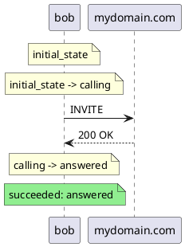

# Elixip

**Elixip is a personal project to write a multipurpose SIP application layer.**

It provides a [Domain Specific Language](https://elixir.hexdocs.pm/1.20.1/domain-specific-languages.html)
specialized to describe call scenarios. It is vaguely inspired by the K language developed by the N-SOFT
company as part of their Rekoll product. The scenario itself is an .exs file and takes advantage of the
Elixir syntax to provide a finite state machine (FSM) programming model. This is to me the most explicit
way to handle cleanly the asynchronous logic of programmable telecommunication.

The scenario engine itself is a framework similar to ExUnit. It sits on top of a SIP stack fully developed in Elixir.
Such call / telecom scripts are actually Elixir scripts so they can take full advantage of the SIP stack and interact
at dialog / transaction or event message level if needed. Furthermore, external libs and APIs can be easily called and used
within such scenarios as long as they comply with the asynchronous nature of finite state machines.

The framework will also provide a control interface to the
[Medooze media server](https://github.com/1760002018/medooze-media-server/tree/main/media-server)
in order to handle the media part of telecommunication over IP. A clean abstraction (Behaviour) is defined
and other media servers could easily be interfaced as well if needed.

## The roadmap

The project will provide in the long term:

- a testing tool called **elixipp**, similar to sipp, capable of running elixip scenarios to test other SIP servers.
- a mini scriptable Session Border Controller, called **borderline**, using the DSL to fine-tune message handling.
- a scriptable and extensible SIP proxy inspired by kamailio. Let's call it **kelixip** for now. If someone has a better or funnier name, let me know.

In terms of capabilities, the emphasis will be on:
- support for Total Conversation calls with any combination of audio/video/realtime text media
- support for SIP over UDP, TCP, TLS and WSS
- support of WebRTC bitstream and regular RTP bitstream using the Medooze Media Server
- support for clustering and load sharing

## What is available, what is not.

- Fully native Elixir SIP stack: implemented
- Support for SIP over UDP, TCP, TLS and WSS: implemented
- Media Control interface: implemented
- Domain Specific Language definition: see [DSL.md](DSL.md)
- SIP.Scenario Scripting Engine: done
- Interactive command elixpp for testing tools: done
- Interactive display for elixipp: done
- multple calls + max duration of test and final reporting: to be done

- Interface with Medooze: to be done (priority)


- distributed cluster tech: later
- **borderline**: later
- **kelixip**: later

## The Domain Specific Language for SIP scenarios

Elixip provides a [Domain Specific Language](https://elixir.hexdocs.pm/1.20.1/domain-specific-languages.html)
to describe SIP / call scenarios as finite state machines, written as `.exs` files. It covers the `config`
block, the `state` / `on_events` / `goto` finite-state-machine model, the scenario context (`sip_ctx`),
sub-scenarios (`sub_fsm`) and cooperative shutdown, exception handling, how the engine works under the hood,
and the `SIP.Session.*` macro helpers.

**👉 The full DSL reference now lives in [DSL.md](DSL.md).**

# elixipp: the testing tool

Elixip testing tool is ment to be a sipp replacement capable of controlling a mediaserver to
fully simulate SIP calls.


## Writing and running a SIP scenario


There are two ways to run a scenario.

### Prerequisites

- **Erlang/OTP** must be installed on the machine (the BEAM runtime).
- **Elixir** is required for the `mix` mode; it is *not* required at run time for
  the standalone `elixipp` mode (the escript only needs the Erlang runtime).

### Mode 1 — with mix (development)

Use this while writing and debugging scenarios.

```bash
# fetch dependencies and compile once
mix deps.get
mix compile

# run a scenario file
mix scenario scenarios/my_call_scenario.exs
```

`mix scenario` compiles the project, loads the given `.exs`, locates the scenario
module, calls its `run/1`, logs the outcome and exits with status `0` on success
or `1` on failure (so it can be used in CI).

Without the custom task, the plain equivalent is:

```bash
mix run -e "MyCallScenario.run()" scenarios/my_call_scenario.exs
```

### Mode 2 — standalone executable of elixipp

Use this to ship a self-contained tool that runs scenarios without a mix/Elixir
install. The project builds an [escript](https://hexdocs.pm/mix/Mix.Tasks.Escript.Build.html)
named `elixipp` (configured via `escript: [main_module: Elixipp.CLI, name: "elixipp"]`
in `mix.exs`).

```bash
# build the self-contained executable once
mix escript.build          # produces ./elixipp
```

Then run scenarios directly:

```bash
./elixipp scenarios/my_call_scenario.exs   # by file path
./elixipp MyCallScenario                   # by module name (if bundled in the escript)
```

Install it on your `PATH` to call it from anywhere:

```bash
mix escript.install        # or simply: cp elixipp ~/.local/bin/
elixipp my_call_scenario.exs
```

The escript bundles the compiled BEAM modules of Elixip and its dependencies into
a single file, but it still relies on an Erlang/OTP runtime (`erl` / `escript`)
being available on the host. Like `mix scenario`, it exits with `0` on success
and `1` on failure.

### Command-line options

```bash
elixipp [OPTIONS] <scenario.exs | ModuleName>
```

| Option | Meaning | Default |
|---|---|---|
| `-m`, `--monitor` | Display a live table of the calls in progress. | off |
| `-l N`, `--limit N` | Run `N` calls simultaneously. Without `--max-run`, slots are recycled indefinitely. The live table is shown only with `--monitor`; otherwise the run is silent and prints the final summary. | `1` |
| `--max-run N` | Stop after `N` executions in total. | unlimited (`1` when neither `--limit` nor `--max-run` is set) |
| `--rate N` | Number of calls started per second. Each new call creation is spaced by `1000 / N` ms. Values greater than `100` are ignored and fall back to the default. | `10` |
| `--log-file PATH` | Log file path. | `elixipp.log` |
| `--log-level LEVEL` | File log level: `debug` \| `info` \| `warning` \| `error`. | `debug` |
| `-h`, `--help` | Show the help text. | — |

```bash
# 5 simultaneous calls, starting at most 20 new calls per second
elixipp -l 5 --rate 20 scenarios/my_call_scenario.exs
```

In live mode the following keys are available:

| Key | Action |
|---|---|
| `q` | Graceful shutdown: stop starting new calls, wait for the active ones. |
| `Ctrl+D` | Immediate stop: print the summary and halt right away. |
| `↑` / `↓` | Scroll the call table when it exceeds the terminal height. |

### Live monitor (`--monitor`)

The `--monitor` (or `-m`) flag displays a live table of the calls in progress —
one row per running scenario instance — with the scenario name, the last command
it issued, its current FSM state and the event that triggered the last transition:

```bash
elixipp --monitor scenarios/my_call_scenario.exs
```

```
╭────────────────┬────────────────┬──────────────────┬────────────────────────────╮
│Scénario        │Commande        │État              │Événement                   │
├────────────────┼────────────────┼──────────────────┼────────────────────────────┤
│UAC.Invite      │send_INVITE     │call_established  │toto.mp4: start             │
╰────────────────┴────────────────┴──────────────────┴────────────────────────────╯
```

- The **Commande** column display the last high level macro command used by the scenario.
- the **Etat** column report the current state
- the **Evènement


Transition **events** can be categorized the same way, via an optional third
argument to `goto` (`goto target, desc, type`):

```elixir
goto call_answered, "200 OK", :sip
goto start_play, "media connected", :media
```

In practice you rarely write the type by hand: using `on_events` (instead of
`receive`) infers it from the matched event pattern, so SIP events show green and
media events orange automatically. The explicit third argument is only needed to
override the inference or to type a `goto` outside an `on_events`. The event type
is stored next to the event text (also for the sequence diagram).

On a real terminal the cells are color-coded: the **Commande** and **Événement**
cells use light green for `:sip`, orange for `:media` and light blue for anything
else, and the **État** cell turns green on success and red on failure. Colors are
emitted only on a TTY — the non-interactive snapshot stays plain text.

The view is rendered with [Owl](https://hexdocs.pm/owl) (pure Elixir, bundled in
the escript). On a real terminal the table refreshes in place; on a non-interactive
device (a pipe, a CI log) it degrades to a single final snapshot. Today a single
row is shown; the table is built to hold one row per call once scenarios run in
parallel.

## Logging

Logs are written through Elixir's `Logger`. There are two distinct logging
policies depending on how a scenario is run.

### `mix scenario` and `mix test`

These use the project configuration in `config/config.exs`: warnings and above
go to the console, everything from `:debug` up is written to `elixip.log`. Change
the level or the file there. `mix scenario` starts the application before running
the scenario, so this configuration is fully applied.

### Standalone `elixipp`

A self-contained escript does not reliably apply `config/config.exs` (and never
runs `config/runtime.exs`), so `elixipp` sets up **its own logging at startup**,
overriding whatever was baked into the binary. It is driven by command-line
options:

| Option | Meaning | Default |
|---|---|---|
| `--log-file PATH`   | log file path | `elixipp.log` |
| `--log-level LEVEL` | file log level: `debug` \| `info` \| `warning` \| `error` | `debug` |
| `--log-sequence`    | write a PlantUML sequence diagram per instance (single call only) | off |

The console is kept quiet (warnings and above) since `elixipp` prints its own
success/failure line.

```bash
# default: writes elixipp.log at :debug level
elixipp scenarios/my_call_scenario.exs

# override the file and level for a single run (e.g. in CI)
elixipp --log-file ci_run.log --log-level info scenarios/my_call_scenario.exs
```

## Troubleshooting

elixipp produces a log file (`elixipp.log` by default — see [Logging](#logging)
for how to configure it).

### Sequence diagram (`--log-sequence`)

A PlantUML sequence diagram of a scenario instance can be produced either by
passing `--log-sequence` to `elixipp`, or by setting the debug flag in the
scenario `initial_state`:

```Elixir
# Storing some info into the context
ctx_set(:debug, true)
```

Either way, a file specific to each scenario execution (instance) is generated,
named `<scenario_name>_<pid>.puml` (the pid is sanitized to digits and dots). It
starts with the SIP configuration applied — passwords masked — as PlantUML
comments, then renders every command sent, state transition and the terminal
outcome of the FSM. `--log-sequence` is restricted to a **single simultaneous
call** (rejected with `--limit > 1`), since one file is written per instance.

The fidelity is reduced (v1): outbound commands become request arrows
(`send_INVITE` → `INVITE`), state changes become notes, and a transition
triggered by a SIP event carries its description as an inbound arrow. Example
output:



## Under the hood (elixipp)

Command reporting is fed by the instrumented `SIP.Session.*` macros, which
report their name to the monitor as they run: the SIP send_* macros (`send_INVITE`,
`send_BYE`, `send_REGISTER`, …) report as type `:sip`, and the media macros
(`media_connect`, `media_play`, `media_record`, …) as type `:media`. The command
category (`:sip` / `:media` / `:http` / `:db` / …) is recorded alongside the name
to drive the future sequence-diagram output. Columns have a fixed width (long
values are truncated with an ellipsis).


Exchanges between