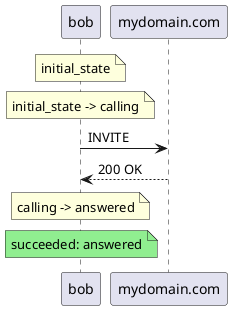

# Elixip

**Elixip is a personal project to write a multipurpose SIP application layer.**

It provides a [Domain Specific Language](https://elixir.hexdocs.pm/1.20.1/domain-specific-languages.html)
specialized to describe call scenarios. It is vaguely inspired by the K language developed by the N-SOFT
company as part of their Rekoll product. The scenario itself is an .exs file and takes advantage of the
Elixir syntax to provide a finite state machine (FSM) programming model. This is to me the most explicit
way to handle cleanly the asynchronous logic of programmable telecommunication.

The scenario engine itself is a framework similar to ExUnit. It sits on top of a SIP stack fully developed in Elixir.
Such call / telecom scripts are actually Elixir scripts so they can take full advantage of the SIP stack and interact
at dialog / transaction or event message level if needed. Furthermore, external libs and APIs can be easily called and used
within such scenarios as long as they comply with the asynchronous nature of finite state machines.

The framework will also provide a control interface to the
[Medooze media server](https://github.com/1760002018/medooze-media-server/tree/main/media-server)
in order to handle the media part of telecommunication over IP. A clean abstraction (Behaviour) is defined
and other media servers could easily be interfaced as well if needed.

## The roadmap

The project will provide in the long term:

- a testing tool called **elixipp**, similar to sipp, capable of running elixip scenarios to test other SIP servers.
- a mini scriptable Session Border Controller, called **borderline**, using the DSL to fine-tune message handling.
- a scriptable and extensible SIP proxy inspired by kamailio. Let's call it **kelixip** for now. If someone has a better or funnier name, let me know.

In terms of capabilities, the emphasis will be on:
- support for Total Conversation calls with any combination of audio/video/realtime text media
- support for SIP over UDP, TCP, TLS and WSS
- support of WebRTC bitstream and regular RTP bitstream using the Medooze Media Server
- support for clustering and load sharing

## What is available, what is not.

- Fully native Elixir SIP stack: implemented
- Support for SIP over UDP, TCP, TLS and WSS: implemented
- Media Control interface: implemented
- Domain Specific Language definition: see [DSL.md](DSL.md)
- SIP.Scenario Scripting Engine: done
- Interactive command elixpp for testing tools: done
- Interactive display for elixipp: done
- multple calls + max duration of test and final reporting: to be done

- Interface with Medooze: to be done (priority)


- distributed cluster tech: later
- **borderline**: later
- **kelixip**: later

## The Domain Specific Language for SIP scenarios

Elixip provides a [Domain Specific Language](https://elixir.hexdocs.pm/1.20.1/domain-specific-languages.html)
to describe SIP / call scenarios as finite state machines, written as `.exs` files. It covers the `config`
block, the `state` / `on_events` / `goto` finite-state-machine model, the scenario context (`sip_ctx`),
sub-scenarios (`sub_fsm`) and cooperative shutdown, exception handling, how the engine works under the hood,
and the `SIP.Session.*` macro helpers — for both **client (UAC)** scenarios and **server (UAS)** scenarios
(a REGISTER registrar, or a call server that answers incoming `INVITE`s with the `reply_invite*` macros).

**👉 The full DSL reference now lives in [DSL.md](DSL.md).**

# elixipp: the testing tool

Elixip testing tool is ment to be a sipp replacement capable of controlling a mediaserver to
fully simulate SIP calls.


## Writing and running a SIP scenario


There are two ways to run a scenario.

### Prerequisites

- **Erlang/OTP** must be installed on the machine (the BEAM runtime).
- **Elixir** is required for the `mix` mode; it is *not* required at run time for
  the standalone `elixipp` mode (the escript only needs the Erlang runtime).

### Mode 1 — with mix (development)

Use this while writing and debugging scenarios.

```bash
# fetch dependencies and compile once
mix deps.get
mix compile

# run a scenario file
mix scenario scenarios/my_call_scenario.exs
```

`mix scenario` compiles the project, loads the given `.exs`, locates the scenario
module, calls its `run/1`, logs the outcome and exits with status `0` on success
or `1` on failure (so it can be used in CI).

Without the custom task, the plain equivalent is:

```bash
mix run -e "MyCallScenario.run()" scenarios/my_call_scenario.exs
```

### Mode 2 — standalone executable of elixipp

Use this to ship a self-contained tool that runs scenarios without a mix/Elixir
install. The project builds an [escript](https://hexdocs.pm/mix/Mix.Tasks.Escript.Build.html)
named `elixipp` (configured via `escript: [main_module: Elixipp.CLI, name: "elixipp"]`
in `mix.exs`).

```bash
# build the self-contained executable once
mix escript.build          # produces ./elixipp
```

Then run scenarios directly:

```bash
./elixipp scenarios/my_call_scenario.exs   # by file path
./elixipp UAC.Invite                       # by name, built-in scenario (no file)
```

Install it on your `PATH` to call it from anywhere:

```bash
mix escript.install        # or simply: cp elixipp ~/.local/bin/
elixipp my_call_scenario.exs
```

The escript bundles the compiled BEAM modules of Elixip and its dependencies into
a single file, but it still relies on an Erlang/OTP runtime (`erl` / `escript`)
being available on the host. Like `mix scenario`, it exits with `0` on success
and `1` on failure.

### Built-in scenarios

A scenario can be **bundled into the tool** instead of loaded from a `.exs` file:
its module is compiled into `lib/` (so it ships inside the escript) and is run by
**module name**, with no file on the host:

```bash
elixipp UAC.Invite      # outbound INVITE + media (built-in)
elixipp UAC.Register    # REGISTER + keepalive + refresh (built-in)
```

The built-ins live in [`lib/scenarios/`](lib/scenarios/). The matching files in
[`scenarios/`](scenarios/) (`uac_invite.exs`, `uac_register.exs`) are editable,
file-loadable copies — same logic, but a distinct module name (`UAC.InviteExample`
/ `UAC.RegisterExample`) so they do not collide with the bundled modules. Use the
`.exs` files as a starting point to write your own, and combine either form with
`--config` to inject real accounts:

```bash
elixipp -c ives.json UAC.Register                 # built-in, JSON-parameterized
elixipp -c ives.json --max-run 0 UAC.Register      # walk through every account
```

Both `elixipp` and `mix scenario` accept a built-in name in place of a file path.

### Running Server (UAS) scenarios — registrar and call server

Run it as a server UAS with one or more `--listen PROTO:PORT` listeners:

```bash
elixipp --listen udp:5060 scenarios/uas_register.exs         # registrar on UDP/5060
elixipp --listen tcp:5060 scenarios/uas_register.exs         # registrar on TCP/5060
elixipp --listen udp:5060 --listen tcp:5060 scenarios/uas_register.exs  # both protocols
elixipp -l 50 --listen tcp:5060 scenarios/uas_register.exs   # cap at 50 concurrent registrations
elixipp --listen udp:5060 scenarios/uas_invite.exs           # call server: answer inbound INVITEs
elixipp -l 20 --listen udp:5060 scenarios/uas_invite.exs     # cap at 20 concurrent calls
```

`elixipp` reads the scenario type (`uas :register` → `:uas_register`,
`uas :invite` → `:uas_invite`), starts the listeners and registers a single
factory (`Elixip.ScenarioUAS`) as either the registration or the call processing
module. The factory enforces the concurrency quota (`-l` → `503` beyond it) and,
for a call server, checks the INVITE R-URI against the scenario's `config
domains:` (a virtual-server domain list, or `:any` catch-all) — a non-served
domain is rejected with `604 Does Not Exist Anywhere`. One scenario instance is
spawned per inbound dialog. See the `SIP.Session.CallUAS` reply macros in
[DSL.md](DSL.md).

For TCP, the listener accepts inbound connections and spins up one
`SIP.Transport.TCP` process per connection. The maximum number of simultaneous
TCP connections defaults to 100 and can be overridden in `config/config.exs`:

```elixir
config :elixip2, :tcp_max_connections, 200
```

Connections exceeding the limit are dropped at the transport level (TCP RST).

A TLS listener (`SIP.Transport.TLSListener`) is now implemented on the same model as
TCP. See [docs/tls_listener.md](docs/tls_listener.md) for certificate setup, runtime
configuration, and security recommendations.

A WSS listener (`SIP.Transport.WSSListener`) is also implemented: it binds a TLS
server socket, performs the WebSocket HTTP upgrade handshake (RFC 6455), and spawns
one `SIP.Transport.WSS` instance per accepted connection. Certificates are shared with
the TLS listener (`:tls_certfile` / `:tls_keyfile`). The connection cap defaults to 100
and can be overridden with `:wss_max_connections`. See [docs/wss_listener.md](docs/wss_listener.md)
for details.

Scenario can be parametrized using json files as described above.

### Testing the UAS with the UAC, locally (two terminals)

You can exercise the registrar with the client scenario over a real UDP loopback
on `127.0.0.1`. A genuine REGISTER exchange needs **two OS processes** (each BEAM
has a single SIP transaction registry, so a single process can't be both the UAC
and the UAS for the same transaction). They must bind different local UDP ports.
Since the client now defaults to a random free port (≥ 5000), `--local-port` is
optional; the examples below keep it explicit for reproducibility:

**UDP loopback:**

```bash
# Terminal 1 — the registrar (UAS), bound to 127.0.0.1:5060
elixipp --listen udp:127.0.0.1:5060 scenarios/uas_register.exs

# Terminal 2 — the client (UAC), bound to a different local port, proxy → the UAS
elixipp --local-port 5070 --local-addr 127.0.0.1 -c uac-loopback.json scenarios/uac_register.exs
```

**TCP loopback:**

```bash
# Terminal 1 — the registrar (UAS) on TCP/5060
elixipp --listen tcp:127.0.0.1:5060 scenarios/uas_register.exs

# Terminal 2 — the client (UAC) targeting the UAS over TCP
elixipp --local-port 5070 --local-addr 127.0.0.1 -c uac-loopback-tcp.json scenarios/uac_register.exs
```

`uac-loopback-tcp.json` is identical to the UDP version except the proxy URI uses the `sip-tcp` scheme (or the transport parameter, depending on how your scenario resolves it):

```json
{
  "domain": "example.com",
  "proxyuri": "sip:127.0.0.1:5060;transport=tcp",
  "proxyusesrv": false,
  "accounts": [ { "username": "alice", "password": "changeme", "domain": "example.com" } ]
}
```

**TLS loopback:**

TLS requires a certificate and private key on the UAS side. See [docs/tls_listener.md](docs/tls_listener.md)
for how to generate or obtain them. The certificate paths can be set globally in
`config/runtime.exs` or passed via environment variables before launching `elixipp`.

```bash
# config/runtime.exs (or export before running)
# config :elixip2, tls_certfile: "certs/certificate.pem", tls_keyfile: "certs/private_key.pem"

# Terminal 1 — the registrar (UAS) on TLS/5061
elixipp --listen tls:127.0.0.1:5061 scenarios/uas_register.exs

# Terminal 2 — the client (UAC) targeting the UAS over TLS
elixipp --local-port 5071 --local-addr 127.0.0.1 -c uac-loopback-tls.json scenarios/uac_register.exs
```

`uac-loopback-tls.json` points the UAC at the TLS listener:

```json
{
  "domain": "example.com",
  "proxyuri": "sip:127.0.0.1:5061;transport=tls",
  "proxyusesrv": false,
  "accounts": [ { "username": "alice", "password": "changeme", "domain": "example.com" } ]
}
```

> The UAC uses `SIP.Transport.TLS` which connects outbound; it does not verify the
> server certificate by default (suitable for self-signed certs in development).
> See [docs/tls_listener.md](docs/tls_listener.md) for enabling mutual TLS or strict cert
> verification.

**WSS loopback:**

WSS uses the same certificate files as TLS. The UAC must target the server with a
`sips:` URI or `transport=wss` parameter.

```bash
# config/runtime.exs (or export before running)
# config :elixip2, tls_certfile: "certs/certificate.pem", tls_keyfile: "certs/private_key.pem"

# Terminal 1 — the registrar (UAS) on WSS/5065
elixipp --listen wss:127.0.0.1:5065 scenarios/uas_register.exs

# Terminal 2 — the client (UAC) targeting the UAS over WSS
elixipp --local-port 5075 --local-addr 127.0.0.1 -c uac-loopback-wss.json scenarios/uac_register.exs
```

`uac-loopback-wss.json` points the UAC at the WSS listener:

```json
{
  "domain": "example.com",
  "proxyuri": "sip:127.0.0.1:5065;transport=wss",
  "proxyusesrv": false,
  "accounts": [ { "username": "alice", "password": "changeme", "domain": "example.com" } ]
}
```

See [docs/wss_listener.md](docs/wss_listener.md) for the full design, certificate
requirements, and browser/WebRTC client interoperability notes.

`uac-loopback.json` points the client at the UAS:

```json
{
  "domain": "example.com",
  "proxyuri": "sip:127.0.0.1:5060",
  "proxyusesrv": false,
  "accounts": [ { "username": "alice", "password": "changeme", "domain": "example.com" } ]
}
```

### Command-line options

```bash
elixipp [OPTIONS] <scenario.exs | ModuleName>
```

| Option | Meaning | Default |
|---|---|---|
| `-m`, `--monitor` | Display a live table of the calls in progress. | off |
| `-l N`, `--limit N` | Run `N` calls simultaneously. Without `--max-run`, slots are recycled indefinitely. The live table is shown only with `--monitor`; otherwise the run is silent and prints the final summary. | `1` |
| `--max-run N` | Stop after `N` executions in total. | unlimited (`1` when neither `--limit` nor `--max-run` is set) |
| `--rate N` | Number of calls started per second. Each new call creation is spaced by `1000 / N` ms. Values greater than `100` are ignored and fall back to the default. | `10` |
| `-c FILE`, `--config FILE` | JSON file parameterizing the scenario (header + N accounts). Overrides the scenario `config` block. See [Paramétrage par fichier JSON](#paramétrage-par-fichier-json-externe). | none |
| `--listen PROTO:PORT` | (server mode) Listen for inbound requests on this protocol/port. Repeatable. `PROTO:ADDR:PORT` also pins the advertised local IP; `PROTO` alone (e.g. `--listen udp`) picks a random free port (≥ 5000, availability checked). Protocols: `udp`, `tcp`, `tls`, `wss`. TLS and WSS share the same certificate files; see [docs/tls_listener.md](docs/tls_listener.md) and [docs/wss_listener.md](docs/wss_listener.md) for setup. | `udp:5060` |
| `--local-port PORT` | (client mode) Local UDP port used to send. Without it, a random free UDP port (≥ 5000) is picked, so a UAC always starts even on a host already serving a UAS on 5060. | random free port ≥ 5000 |
| `--local-addr ADDR` | (client mode) Local IP advertised in Via/Contact. | first local IPv4 |
| `--log-file PATH` | Log file path. | `elixipp.log` |
| `--log-level LEVEL` | File log level: `debug` \| `info` \| `warning` \| `error`. | `debug` |
| `--log-sequence` | Write one PlantUML sequence diagram per scenario instance. Single call only (`--limit 1`). | off |
| `-h`, `--help` | Show the help text. | — |

```bash
# 5 simultaneous calls, starting at most 20 new calls per second
elixipp -l 5 --rate 20 scenarios/my_call_scenario.exs
```

In live mode the following keys are available:

| Key | Action |
|---|---|
| `q` | Graceful shutdown: stop starting new calls, wait for the active ones. |
| `Ctrl+D` | Immediate stop: print the summary and halt right away. |
| `↑` / `↓` | Scroll the call table when it exceeds the terminal height. |

### Live monitor (`--monitor`)

The `--monitor` (or `-m`) flag displays a live table of the calls in progress —
one row per running scenario instance — with the scenario name, the last command
it issued, its current FSM state and the event that triggered the last transition:

```bash
elixipp --monitor scenarios/my_call_scenario.exs
```

```
╭────────────────┬────────────────┬──────────────────┬────────────────────────────╮
│Scénario        │Commande        │État              │Événement                   │
├────────────────┼────────────────┼──────────────────┼────────────────────────────┤
│UAC.Invite      │send_INVITE     │call_established  │toto.mp4: start             │
╰────────────────┴────────────────┴──────────────────┴────────────────────────────╯
```

- The **Commande** column display the last high level macro command used by the scenario.
- the **Etat** column report the current state
- the **Evènement


Transition **events** can be categorized the same way, via an optional third
argument to `goto` (`goto target, desc, type`):

```elixir
goto call_answered, "200 OK", :sip
goto start_play, "media connected", :media
```

In practice you rarely write the type by hand: using `on_events` (instead of
`receive`) infers it from the matched event pattern, so SIP events show green and
media events orange automatically. The explicit third argument is only needed to
override the inference or to type a `goto` outside an `on_events`. The event type
is stored next to the event text (also for the sequence diagram).

On a real terminal the cells are color-coded: the **Commande** and **Événement**
cells use light green for `:sip`, orange for `:media` and light blue for anything
else, and the **État** cell turns green on success and red on failure. Colors are
emitted only on a TTY — the non-interactive snapshot stays plain text.

The view is rendered with [Owl](https://hexdocs.pm/owl) (pure Elixir, bundled in
the escript). On a real terminal the table refreshes in place; on a non-interactive
device (a pipe, a CI log) it degrades to a single final snapshot. Today a single
row is shown; the table is built to hold one row per call once scenarios run in
parallel.

## Paramétrage par fichier JSON externe

A scenario can be parameterized programmatically with its `config` block, **or**
from an external JSON file passed with `--config` / `-c`. The two are not
exclusive: the `config` block provides the defaults and the JSON file, when
given, overrides them. Without `--config`, behavior is unchanged.

The file holds a **header** (global / per-session defaults) and a list of **N
accounts**:

```json
{
  "domain": "example.com",
  "proxyuri": "sip:sip.example.com:5060",
  "proxyusesrv": false,
  "optionkeepaliveperiod": 15,
  "accounts": [
    { "username": "1000", "password": "secret1" },
    { "username": "1001", "password": "secret2", "displayname": "Bob" },
    { "username": "1002", "password": "secret3", "domain": "other.example.com" }
  ]
}
```

A ready-to-copy template lives in [`scenario-config.json`](scenario-config.json).

**Header keys** (all optional):

| Key | Routed to | Note |
|---|---|---|
| `domain` | `%SIP.Context{}` | default domain for accounts that omit it |
| `proxyuri` | `:elixip2` app env | `"sip:host:port"`, parsed to a `%SIP.Uri{}` |
| `proxyusesrv` | `:elixip2` app env | boolean |
| `optionkeepaliveperiod` | `:elixip2` app env | integer (seconds) |

**Account keys**: `username` and `password` are **required**; `domain` (falls
back to the header), `authusername` (defaults to `username`) and `displayname`
are optional.

The `proxyuri` / `proxyusesrv` / `optionkeepaliveperiod` keys are *global* — the
runner routes them to the `:elixip2` application env instead of the per-session
context. They can equally appear in a scenario `config` block, so scenarios no
longer call `Application.put_env` in `initial_state`:

```elixir
config username: "1000", domain: "example.com", passwd: "changeme",
       proxyuri: "sip:sip.example.com:5060",
       proxyusesrv: false,
       optionkeepaliveperiod: 15
```

### Merge precedence

```
scenario config block   <   JSON header   <   JSON account
```

### Selecting accounts

Each scenario instance is built from one account, chosen round-robin on a
monotonic run counter: `accounts[rem(run_index, N)]`. With the default
`--limit 1`, one account is used per run, so to walk through every account you
recycle slots with `--max-run`:

```bash
# one-shot, first account only
elixipp -c ives.json scenarios/uac_register.exs

# walk through all accounts sequentially (slots recycled, unlimited runs)
elixipp -c ives.json --max-run 0 scenarios/uac_register.exs

# N accounts in parallel
elixipp -c ives.json --limit 3 scenarios/uac_register.exs

# also available from mix (single instance, first account)
mix scenario --config ives.json scenarios/uac_register.exs
```

Validation is **strict**: an unknown key (header or account), a missing
`username`/`password`, an unresolved domain or a type mismatch aborts before the
run with a clear message.

> **Credentials** — keep real account files out of version control. The repo
> ignores `ives.json` for that purpose; copy `scenario-config.json` to start.

## Logging

Logs are written through Elixir's `Logger`. There are two distinct logging
policies depending on how a scenario is run.

### `mix scenario` and `mix test`

These use the project configuration in `config/config.exs`: warnings and above
go to the console, everything from `:debug` up is written to `elixip.log`. Change
the level or the file there. `mix scenario` starts the application before running
the scenario, so this configuration is fully applied.

### Standalone `elixipp`

A self-contained escript does not reliably apply `config/config.exs` (and never
runs `config/runtime.exs`), so `elixipp` sets up **its own logging at startup**,
overriding whatever was baked into the binary. It is driven by command-line
options:

| Option | Meaning | Default |
|---|---|---|
| `--log-file PATH`   | log file path | `elixipp.log` |
| `--log-level LEVEL` | file log level: `debug` \| `info` \| `warning` \| `error` | `debug` |
| `--log-sequence`    | write a PlantUML sequence diagram per instance (single call only) | off |

The console is kept quiet (warnings and above) since `elixipp` prints its own
success/failure line.

```bash
# default: writes elixipp.log at :debug level
elixipp scenarios/my_call_scenario.exs

# override the file and level for a single run (e.g. in CI)
elixipp --log-file ci_run.log --log-level info scenarios/my_call_scenario.exs
```

## Troubleshooting

elixipp produces a log file (`elixipp.log` by default — see [Logging](#logging)
for how to configure it).

### Sequence diagram (`--log-sequence`)

A PlantUML sequence diagram of a scenario instance can be produced either by
passing `--log-sequence` to `elixipp`, or by setting the debug flag in the
scenario `initial_state`:

```Elixir
# Storing some info into the context
ctx_set(:debug, true)
```

Either way, a file specific to each scenario execution (instance) is generated,
named `<scenario_name>_<pid>.puml` (the pid is sanitized to digits and dots). It
starts with the SIP configuration applied — passwords masked — as PlantUML
comments, then renders every command sent, state transition and the terminal
outcome of the FSM. `--log-sequence` is restricted to a **single simultaneous
call** (rejected with `--limit > 1`), since one file is written per instance.

The fidelity is reduced (v1): outbound commands become request arrows
(`send_INVITE` → `INVITE`), state changes become notes, and a transition
triggered by a SIP event carries its description as an inbound arrow. Example
output:



## Under the hood (elixipp)

Command reporting is fed by the instrumented `SIP.Session.*` macros, which
report their name to the monitor as they run: the SIP send_* macros (`send_INVITE`,
`send_BYE`, `send_REGISTER`, …) report as type `:sip`, and the media macros
(`media_connect`, `media_play`, `media_record`, …) as type `:media`. The command
category (`:sip` / `:media` / `:http` / `:db` / …) is recorded alongside the name
to drive the future sequence-diagram output. Columns have a fixed width (long
values are truncated with an ellipsis).


Exchanges between

# License

Elixip is distributed under the **Business Source License 1.1 (BSL 1.1)**, a
source-available license. See [LICENSE.md](LICENSE.md) for the full terms.

A French translation is available in [LICENSE_fr.md](LICENSE_fr.md) for
convenience; the English [LICENSE.md](LICENSE.md) is the only legally binding
version.