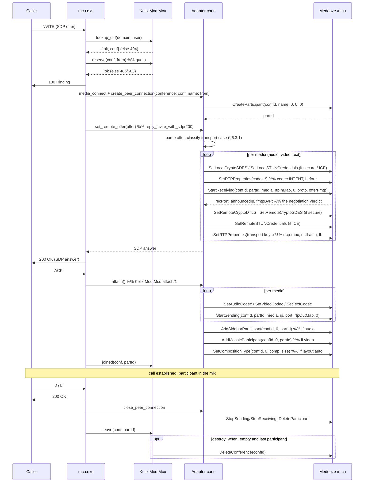

# Reduced MCU — design & specification

A conferencing (MCU) function for **kelixip**, distilled from the Java
`mcuGold` application server and rebuilt on the **Medooze MCU XML-RPC API**
(`POST /mcu`) exposed by `../mediaserver`.

> This document is the **why**: every decision, what was left out and on what
> grounds. For the **how** — configuring a node, the REST/CLI surface, writing a
> script, and reading the logs of a call that failed — see
> [docs/kelixip/modules/mcu_module_guide.md](../kelixip/modules/mcu_module_guide.md). Delivery status is §14.

The deliverable is deliberately **two artefacts** — no new frontal, no new
daemon:

| Artefact | Where | What it holds |
|---|---|---|
| `kelixip-mod-mcu` — a loadable module (`Kelix.Mod.Mcu`) | `apps/kelix_modules/lib/kelix/mod/mcu/` | conference registry, MCU XML-RPC client, event queue, the `MediaServer.Behaviour` adapter, the REST + CLI control surface |
| `mcu.exs` — a call script | `apps/kelixip/scripts/mcu.exs` | the SIP side of an inbound call: DID → conference, 180, SDP answer, join on ACK, teardown |

Everything else is existing kelixip machinery: `Kelix.Router` routes the INVITE
through the dial-plan to `mcu.exs`, `Kelix.InstancePool` spawns one scenario
instance per call, `Kelix.ControlAPI` exposes the module's commands under
`/modules/mcu/…`, and `kelictl mcu …` gets the same surface for free
(`docs/design/kelixip_basic_design.md` §8.1, §10).

---

## 1. Scope

### 1.1 In scope

1. **Inbound call handling.** An INVITE whose R-URI user-part matches a
   conference DID joins that conference: SDP offer/answer against the MCU,
   participant creation, mixer join, teardown on BYE/CANCEL/timeout.
2. **A REST API to create, modify and destroy a conference** (plus list/show,
   without which the other three are unusable), exposed through the existing
   module-command mechanism, therefore available identically on `kelictl`.
3. Audio + video mixing on the **default mosaic** and the **default sidebar**,
   with an optional automatic layout that follows the participant count
   (`Kelix.Mod.Mcu.auto_comp/1`: a ladder over the `comp` values of §3.6 — two
   participants side by side rather than a 2x2 with two black tiles). Only **video**
   legs count, and a conference with none issues no mosaic RPC at all.
4. **Total conversation**: T.140 real-time text alongside audio and video, with
   RFC 4103 redundancy (`red`) when the caller offers it. Text is mixed by the
   MCU's own text mixer, which needs no join RPC — the server wires every
   participant into it at `CreateParticipant` — and no layout: a text leg is not
   a mosaic tile. Dropping `"text"` from a conference's `medias` turns it off, and
   its `m=text` section is then declined with port 0.
5. Plain **RTP/AVP and RTP/AVPF**, **SDES-SRTP** (`RTP/SAVP(F)`) and **DTLS-SRTP +
   ICE-lite** (`UDP/TLS/RTP/SAVPF`) call legs, so SIP phones, text terminals and
   WebRTC gateways can join. The three cases are classified and traced explicitly
   (§6.3.1) rather than falling out of per-attribute handling.

### 1.2 Explicitly out of scope

Dropped from mcuGold, and *why it is safe to drop*:

| Dropped | Rationale |
|---|---|
| Conference **templates** & ad-hoc conference creation on an unknown DID | requested; an INVITE to an unknown DID is answered `404` |
| **Admin web UI** (`mcuWeb`, `sip2ajax`, `S2F`) | requested; REST + `kelictl` only |
| Outbound calls (`invitor`, `callParticipant`) | needs the B2BUA leg primitives (`docs/design/b2bua_module.md`), not yet available |
| RTMP / Flash participants, broadcaster, publishing | dead transports |
| Recording (participant & broadcaster), players/announcements | not needed for the reduced perimeter; the RPCs are documented in §3 for later |
| Document sharing / BFCP / slides (`VIDEO_SLIDES` role) | large, self-contained subsystem; the role parameter is still passed correctly (always `0`) so adding it later is additive |
| Extra mosaics & sidebars, per-slot layout pinning, overlay images, display names | only mosaic `0` / sidebar `0` are used |
| SOAP/B2B event listeners, per-conference HTTP callback URLs | replaced by kelixip logs + Prometheus metrics; the event vocabulary is frozen (§11.1) so the transport can be added later |
| Join-time authentication (PIN, digest challenge) | decided out (§6.1.1): the reference script admits whoever reaches the DID; auth belongs to a derived script |
| CDR engine | kelixip has its own observability layer |
| Three-way conferences, RFC 5366 resource lists, profiles as a first-class managed object | a conference carries **one inline video profile** instead |

### 1.3 Non-goals that are worth stating

- **No multi-MCU conference.** One conference lives on exactly one media
  server. A conference is pinned to the MCU chosen at creation time.
- **No conference persistence.** Conferences live in memory; a kelixip restart
  loses them (and §9.4 says what happens to the MCU-side leftovers).
- **No admission control.** Reaching the DID is joining; the conference has no
  notion of an invited or authorised caller (§6.1.1).

---

## 2. What we keep from mcuGold

The Java code is the reference for *call flow correctness*, not for structure.
The three things worth transcribing faithfully:

1. **The RPC ordering** of an inbound call (`RTPParticipant2.onInviteRequest` →
   `accept` → `onAckRequest`). Reproduced in §6.2; getting the order wrong
   yields a media server that answers `returnCode: 1` to everything and sends
   no RTP.
2. **The split between "answer-time" and "ACK-time" work.** mcuGold starts
   *receiving* before answering (it needs the local ports for the SDP) and
   starts *sending* + joins the mixer only on ACK. We keep that split: a caller
   that never ACKs never enters the mix, and no RTP leaves the MCU before the
   call is established.
3. **Who generates what secret.** For SDES the *controller* generates the local
   key and pushes it with `SetLocalCryptoSDES`; for ICE the *controller*
   generates ufrag/pwd and pushes them with `SetLocalSTUNCredentials`; only the
   DTLS fingerprint comes from the server
   (`GetLocalCryptoDTLSFingerprint`, server-wide, cacheable).

Discarded from mcuGold by design: the `Participant`/`RTPParticipant2` god
object (3 700 lines mixing SIP dialog state, SDP parsing, XML-RPC and mixer
policy). Here the SIP state is the scenario instance, the SDP/RPC work is the
adapter, and the mixer policy is the module.

---

## 3. The Medooze MCU API — the subset we use

Reference implementation: `mediaserver/mcu/src/xmlrpcmcu.cpp` (command table
`mcuCmdList`), Java client `XmlRpcMcuClient.java`.

### 3.1 Transport

| Channel | Endpoint |
|---|---|
| Control | `POST http://<host>:8080/mcu` — standard XML-RPC, `Content-Type: text/xml` |
| Events | `GET http://<host>:8080/events/mcu/<queueId>` — HTTP chunked long-poll |

This is a **different endpoint from JSR-309** (`/jsr309`) used by
`MediaServer.Mendooze`; the two APIs are disjoint object models on the same
daemon. The response envelope is the same one documented in
`mediaserver/xmlrpc_jsr309_api.md` §2:

```
success  →  { "returnCode": 1, "returnVal": [ … ] }
error    →  { "returnCode": 0, "errorMsg": "…" }
```

> An HTTP `200` with `returnCode: 0` is an **application error**. Only a
> parameter-parsing failure produces a real XML-RPC fault.

> **`returnVal` *is* the returned value**, not a list wrapping it: the server builds
> `{s:i,s:A}` with the array passed straight in (`mcu/src/xmlhandler.cpp:xmlok`). A
> method returning one integer answers `returnVal: [42]`; a method returning a *list*
> answers `returnVal: [row, row, …]`, and a server holding nothing answers
> `returnVal: []`. Reading the second kind as "the list is at index 0" is a mistake a
> stub happily reproduces — it cost us a garbage collector that silently collected
> nothing (§9.4).

Type notation below: `i` int, `s` string, `S` struct, `A` array.

### 3.2 Conference lifecycle

| Method | Params | Returns |
|---|---|---|
| `EventQueueCreate` | `()` | `(i queueId)` |
| `EventQueueDelete` | `(i queueId)` | — |
| `CreateConference` | `(s tag, i vad, i rate, i queueId)` — 3-arg variant `(s, i vad, i queueId)` omits the rate | `(i confId)` |
| `UpdateConference` | `(i confId, i vad, i rate)` | — |
| `DeleteConference` | `(i confId)` | — |
| `GetConferences` | `()` | `A` of `(i id, s tag, i numPart)` — the rows **are** `returnVal` |
| `SetCompositionType` | `(i confId, i mosaicId, i comp, i size)` | — |
| `SetMosaicSlot` | `(i confId, i mosaicId, i num, i id)` | — |
| `GetMosaicPositions` | `(i confId, i mosaicId)` | `A` of `i` — one per slot, in slot order |
| `StartRecordingBroadcaster` | `(i confId, s filename, i mosaicId, i sidebarId)` | — |
| `StopRecordingBroadcaster` | `(i confId)` | — |
| `SetParticipantBackground` | `(i confId, i partId, s filename)` | `(i)` |

`tag` is the conference's external name (we pass the kelixip UID); it is echoed
in the event stream, which is how an event is mapped back to a conference.

The last five are the ones §8.3.8 drives (mosaic slots, the mix recording and the
empty-slot logo); the slot values and the slot count per composition are tabulated
there, with the server file each was read from.

> **`GetConferences` truncated the tag** until 2026-07-30: `ConferenceInfo::name` is a
> `std::wstring` and was handed to xmlrpc-c's `%s`, which reads it as `char*` and stops
> at the first embedded NUL — `"c-a8592bc0"` came back as `"c"`. Fixed in
> `mcu/src/xmlrpcmcu.cpp` (serialise through `UTF8Parser`, as
> `GetBroadcastPublishedStreams` already did), but **deployed builds may predate the
> fix**, so the orphan sweep keys on the MCU-side id instead (§9.4). The *event*
> stream was never affected: it serialises the tag properly.

### 3.3 Participant lifecycle

| Method | Params | Returns |
|---|---|---|
| `CreateParticipant` | `(i confId, s name, i type, i mosaicId, i sidebarId)` | `(i partId)` |
| `DeleteParticipant` | `(i confId, i partId)` | — |
| `AddMosaicParticipant` / `RemoveMosaicParticipant` | `(i confId, i mosaicId, i partId)` | — |
| `AddSidebarParticipant` / `RemoveSidebarParticipant` | `(i confId, i sidebarId, i partId)` | — |
| `SetMute` | `(i confId, i partId, i media, i muted)` | — |
| `SendFPU` | `(i confId, i partId)` | — |
| `GetParticipantStatistics` | `(i confId, i partId)` | `A` of one row per media: `(s media, i isReceiving, i isSending, i lostRecvPackets, i numRecvPackets, i numSendPackets, i totalRecvBytes, i totalSendBytes)` |

`type` is `0` (RTP) for every participant we create; `1` (RTMP) is unused.
`name` must not contain `.` — mcuGold replaces it with `_`; we do the same.

> The statistics rows are **positional, and `isReceiving` precedes `isSending`** —
> the reverse of the order this table used to list them in. `participant.show` names
> the fields (`receiving:`, `sending:`, `lost_recv_packets:`, …) so no caller has to
> know the wire order.

### 3.4 Media setup

| Method | Params | Returns |
|---|---|---|
| `StartReceiving` | `(i confId, i partId, i media, S rtpMap, i role[, i proto[, S offer]])` | `(i recPort, s announcedIp[, S fmtpByPt])` — the address to advertise for this media (§16.5); `returnVal[0]` stays the port. `offer` and `fmtpByPt` are the delegated negotiation of **S3/P8** (§16.3) |
| `StopReceiving` | `(i confId, i partId, i media[, i role])` | — |
| `StartSending` | `(i confId, i partId, i media, s sendIp, i sendPort, S rtpMap[, i role])` | — |
| `StopSending` | `(i confId, i partId, i media[, i role])` | — |
| `SetAudioCodec` | `(i confId, i partId, i codec[, S params])` | — |
| `SetVideoCodec` | `(i confId, i partId, i codec, i mode, i fps, i bitrate, i intraPeriod, S params[, i role])` | — |
| `SetTextCodec` | `(i confId, i partId, i codec)` | — |
| `SetRTPProperties` | `(i confId, i partId, i media, S props[, i role])` | — |

`rtpMap` is a struct **keyed by payload type as a string**, valued with the
Medooze codec constant: `%{"96" => 99, "0" => 0}`. Same shape as the JSR-309
`rtpMap` already produced by `MediaServer.Mendooze.Sdp.local_rtp_map/3`.

`SetRTPProperties` keys **actually recognised** by the server
(`RTPSession::SetProperties`, `mcu/src/rtpsession.cpp:486-561` — anything else is
answered with an `Unknown RTP property` log line and dropped):

| Group | Keys |
|---|---|
| Transport | `rtcp-mux`, `natLatch`, `ssrc`, `cname`, `rtpTimeout` |
| RTCP feedback | `useNACK`, `useFEC`, `tmmbr`, `useRtcpFIR`, `useExtFIR`, `useOriSeqNum` |
| Header extensions | `urn:ietf:params:rtp-hdrext:toffset`, `http://www.webrtc.org/experiments/rtp-hdrext/abs-send-time` |
| Codec | anything prefixed `codec.` — kept by `VideoStream`/`AudioStream::SetRTPProperties` into the stream's own property map, and *ignored* by `RTPSession` |

Two corrections to what this table used to claim. **`secure` is not a recognised
key** — it was listed here from mcuGold's call sites, but the server has no such
property: it is a no-op once the SDES or DTLS material is configured, which is
why the adapter deliberately does not send it. And **`h264.profile-level-id`
unprefixed goes nowhere**: only `codec.`-prefixed keys survive
`VideoStream::SetRTPProperties`, the unprefixed one falls through to
`RTPSession`, which rejects it (the incident recorded in §6.3 rule 9).

The feedback keys are what make the AVPF cases of §6.3.1 more than an SDP
attribute: `useNACK`, `useRtcpFIR`/`useExtFIR` and `tmmbr` are the server-side
switches behind `a=rtcp-fb: … nack`, `ccm fir` and `ccm tmmbr`. `nack pli`
rides the FIR switch: the server handles an incoming PLI exactly like a FIR
(both reach `onFPURequested`), so confirming it costs nothing — and a peer
that negotiated it may send PLI *instead of* FIR (Linphone does).

### 3.5 Security

| Method | Params | Returns |
|---|---|---|
| `SetLocalCryptoSDES` | `(i confId, i partId, i media, s suite, s key[, i role])` | — |
| `SetRemoteCryptoSDES` | `(iiissii)` = `confId, partId, media, suite, key, role, keyRank` — **or** the legacy `(iiiss)` with neither. Not six: `role` without `keyRank` is the one arity the server has no format string for, and it answers a parse fault | — |
| `GetLocalCryptoDTLSFingerprint` | `(s hash)` | `(s fingerprint)` |
| `SetRemoteCryptoDTLS` | `(i confId, i partId, i media, i role, s setup, s hash, s fingerprint)` — 6-arg variant drops `role` | — |
| `SetLocalSTUNCredentials` | `(i confId, i partId, i media, s ufrag, s pwd[, i role])` | — |
| `SetRemoteSTUNCredentials` | `(i confId, i partId, i media, s ufrag, s pwd[, i role])` | — |

### 3.6 Enumerations

| Enum | Values |
|---|---|
| `MediaType` | `0` audio, `1` video, `2` text, `3` application |
| `MediaRole` | `0` main, `1` slides (always `0` here) |
| `MediaProtocol` | `0` RTP, `1` RTMP, `2` WS, `3` TCP, `4` UDP |
| `Participant type` | `0` RTP, `1` RTMP |
| VAD | `0` none, `1` basic, `2` full |
| Mosaic layout | `0` 1x1, `1` 2x2, `2` 3x3, `3` 3+4, `4` 1+7, `5` 1+5, `6` 1+1, `7` PIP1, `8` PIP3, `9` 4x4, `10` 1+4, `11` 2+8 — those names are also the accepted *input*, §8.3.7 |
| Video size | `0` QCIF, `1` CIF, `2` VGA, `3` PAL, `4` HVGA, `5` QVGA, `6` HD720P, `7` WQVGA, `14` XGA, `15` WVGA … (`XmlRpcMcuClient` constants) |

Audio/video codec constants are the ones already tabulated in
`MediaServer.Mendooze.Sdp` (`codecs.h`): PCMU 0, GSM 3, PCMA 8, G722 9,
OPUS 98, telephone-event 100, AMR 118, AMRWB 120 … / H263 34, H264 99,
H263-1998 103, MPEG4 104, VP8 107.

### 3.7 Event stream

`GET /events/mcu/<queueId>` streams XML-RPC-encoded arrays. Two event types
exist (`MediaMixerMCUEventQueue.onEvent`):

| type | payload | meaning |
|---|---|---|
| `1` | `(i confId, s tag, i partId)` | the MCU wants a **full intra-frame** from that participant |
| `2` | `(i confId, s tag, i partId, s status)` | doc-sharing status — **ignored** (out of scope) |

Type `1` is the only one we act on: it becomes a SIP `INFO` carrying
`application/media_control+xml` with `picture_fast_update` (§6.4).

### 3.8 Gaps versus the JSR-309 API — consequences for the design

These are *facts about the MCU API as it stands today*, and each one costs us
something. Three of them are **scheduled to be closed server-side** (§16) — the
design must work without that, and get better with it.

| # | Gap | Consequence | Closed by |
|---|---|---|---|
| G1 | `StartReceiving` returns the port and the announced address, but **no accepted-PT/fmtp struct**, and there is no way to hand the server the peer's `a=fmtp` either — the conference API has neither the enriched return of JSR-309 nor its `codec.<x>.fmtp` intake | the SDP answer is arbitrated **entirely by kelixip**, from its own codec name lists, and the fmtp it advertises is a guess about what the mixer will emit. `MediaServer.Mendooze.Sdp.accepted_pts/2` and friends are *not* usable; `parse/1`, `negotiate/3`, `build/1`, `local_rtp_map/3` are | **S3 / P8** (§16.3) |
| G2 | No `GetMediaCandidates` equivalent | ~~the media IP for `c=` and the ICE host candidates come from **configuration** (`rtp_ip` / `public_ip`), exactly like mcuGold's `MediaMixer.getIp()`~~ — **closed**: `StartReceiving` now returns the address to announce next to the port, so kelixip holds none | **S4** (§16.5) |
| G3 | No `EndpointStartRTPTimeout` equivalent | **no media watchdog**. A silent leg is only detected by SIP (session timers / idle timeout in the script) | **S1 / P7** (§16.1) |
| G4 | No per-participant "media started" event | `:ice_connected` cannot be emitted by the adapter. Scripts must not wait for it | **S2 / P7** (§16.2) |
| G5 | No trickle-ICE input | `add_remote_candidate/2` is a no-op returning `:ok`; ICE-lite + the offerer's candidates are enough for the gateway/WebRTC cases we serve | — (not needed) |

---

## 4. Architecture

```
                                 kelixip node
 ┌───────────────────────────────────────────────────────────────────────────┐
 │  SIP  ──INVITE──▶ Kelix.Router ──dial-plan──▶ InstancePool                 │
 │                                                   │ spawns                 │
 │                                                   ▼                        │
 │                                            ┌─────────────┐                 │
 │                                            │  mcu.exs    │  1 per call     │
 │                                            │ (scenario)  │                 │
 │                                            └──────┬──────┘                 │
 │                        facade calls               │  media DSL             │
 │                    ┌──────────────────────────────┼───────────────┐        │
 │                    ▼                              ▼               │        │
 │        ┌────────────────────────┐      ┌──────────────────────┐   │        │
 │  REST  │      Kelix.Mod.Mcu     │      │ Kelix.Mod.Mcu.Adapter│   │        │
 │  CLI ─▶│  (GenServer + ETS)     │◀────▶│ MediaServer.Behaviour│   │        │
 │        │  conferences, DIDs,    │      │  1 process per call  │   │        │
 │        │  participants, quota   │      └──────────┬───────────┘   │        │
 │        └───────────┬────────────┘                 │               │        │
 │                    │              ┌───────────────┴────────┐      │        │
 │                    ▼              ▼                        │      │        │
 │        ┌───────────────────────────────────┐   ┌───────────▼──┐   │        │
 │        │      Kelix.Mod.Mcu.Client         │   │  Mcu.Sdp     │   │        │
 │        │  XML-RPC POST /mcu (per MCU)      │   │ (offer/answer│   │        │
 │        └───────────────┬───────────────────┘   │  helpers)    │   │        │
 │                        │                       └──────────────┘   │        │
 │        ┌───────────────▼───────────────────┐                      │        │
 │        │    Kelix.Mod.Mcu.EventQueue       │──── FPU ─────────────┘        │
 │        │  GET /events/mcu/<queueId>        │   {:mcu_event, …}             │
 │        └───────────────────────────────────┘                               │
 └───────────────────────────────────────────────────────────────────────────┘
                                    │  HTTP
                                    ▼
                       Medooze mediaserver (mcu :8080)
```

### 4.1 Processes

| Process | Kind | Lifetime | Role |
|---|---|---|---|
| `Kelix.Mod.Mcu` | `GenServer`, registered under the module name | node | conference registry (ETS), DID index, per-MCU connection supervision, control commands |
| `Kelix.Mod.Mcu.Client` | `GenServer`, one per `mendooze` pool entry | node | XML-RPC channel + `queueId`; serialises calls, applies `xmlrpc_timeout_ms` |
| `Kelix.Mod.Mcu.EventQueue` | `GenServer` + a task, one per MCU | node | chunked long-poll, decode, dispatch to the owning participant's scenario pid |
| `Kelix.Mod.Mcu.Adapter` conn | `GenServer`, one per **call leg** | call | holds `{conf_id, part_id, media map, crypto, ports}`; implements `MediaServer.Behaviour` |
| `mcu.exs` instance | scenario | call | the SIP state machine |

Supervision: the module's `child_spec/2` returns a `Supervisor` (rest_for_one — the
registry owns the ETS tables the others read) holding `Kelix.Mod.Mcu` + one
`{Client, EventQueue}` pair per media server. The list comes from
`[mediaserver.pool.*]` (§8.4), read once at boot from `Kelix.Config` — not from
`Kelix.MediaPool`, which the node starts *after* its modules. An MCU that is
unreachable at boot does **not** prevent the module from starting: its client is up
but marked `down`, conferences on it are refused with a clear error (§9.4).

### 4.2 Why the adapter is a `MediaServer.Behaviour`

Because the whole media DSL then works unchanged: `media_connect()`,
`reply_invite_with_sdp/2`, `media_stop()` in `mcu.exs` are the *same* macros
`uas_invite.exs` already uses. The mapping is:

| `MediaServer.Behaviour` | MCU API |
|---|---|
| `connect/1` | resolve the `Client` for that URL; `{:ok, client_pid}` |
| `create_peer_connection/3` | `CreateParticipant` in the conference given by `opts[:conference]` |
| `set_remote_offer/2` | the whole answer-time sequence (§6.2 steps 3-6) → SDP answer |
| `set_remote_answer/2` | unused inbound-only; returns `{:error, :not_supported}` until B2BUA legs exist |
| `get_local_offer/1` | idem |
| `add_remote_candidate/2` | `:ok`, no-op (G5) |
| `close_peer_connection/1` | `StopSending`/`StopReceiving` + `DeleteParticipant` |
| `disconnect/2` | release the client reference (the client itself is node-scoped, not per call) |
| player / recorder / echo callbacks | `{:error, :not_supported}` — out of scope, the MCU API has the RPCs (§1.2) for a later increment |

The conference-level operations have no place in `MediaServer.Behaviour` and
are **not** forced into it: they are plain functions on `Kelix.Mod.Mcu`
(§8.2) and, for the participant-level extras (mute, FPU, stats), on
`Kelix.Mod.Mcu.Adapter`.

---

## 5. Data model

### 5.1 Conference

```elixir
%Kelix.Mod.Mcu.Conference{
  uid:         "c-3f9a…",        # kelixip id, = the MCU `tag`, in the REST Location
  name:        "Sales weekly",
  domain:      "example.com",    # the served domain the DID belongs to
  did:         "8001",           # R-URI user-part that reaches it; unique per domain
                                 #   supplied by the caller, else allocated (§5.3)
  mcu:         "mcu1",           # pool entry name; a conference never migrates
  conf_id:     42,               # MCU-side integer id
  vad:         1,                # 0 none | 1 basic | 2 full
  rate:        32000,            # mixer sampling rate (default, §8.4)
  medias:      [:audio, :video, :text],   # which m= sections it answers at all (§8.4)
  video:       %{size: 6, fps: 30, bitrate: 1500, intra_period: 300},  # inline profile
                                 #   `size` goes away with S6 (§16.7); `fps` is a maximum
  preferred_video_codec: "H264", # stated FIRST in the answers, nil for no preference:
                                 #   a preference, not a codec list (§8.4)
  layout:      %{comp: 1, size: 6, auto: true},   # mosaic 0; `size` = `video.size`
                                 #   the two are one value, and S6 keeps only this one
  max_participants: 20,
  auto_accept: true,
  destroy_when_empty: false,
  created_at:  ~U[…],
  participants: %{part_id => participant}
}
```

Storage: one ETS table (`:set`, `read_concurrency`) keyed by `uid`, owned by
`Kelix.Mod.Mcu`, plus a `{domain, did} => uid` index table. Reads (the hot path:
one DID lookup per INVITE) go straight to ETS without touching the GenServer —
same pattern as `Kelix.Mod.Registrar` (design §6.1). Writes go through the
GenServer, which is what serialises "create conference" against the MCU.

### 5.2 Participant

```elixir
%{
  part_id:   7,
  conf_uid:  "c-3f9a…",
  name:      "alice@example.com",
  scenario:  #PID<0.812.0>,        # the mcu.exs instance — event routing target
  conn:      #PID<0.813.0>,        # the adapter connection
  state:     :ringing | :connected | :leaving,
  medias:    %{audio: %{rec_port: 52014, send: {"1.2.3.4", 40000}, codec: 98}, …},
  joined_at: ~U[…]
}
```

The participant row is owned by the module (so `list`/`show` can report it and
so the quota is authoritative), but the *media detail* is owned by the adapter
connection; the module keeps only what a human wants to see.

### 5.3 Identity & lifetimes

- A conference `uid` is stable for the conference's life and is what REST
  clients use. The MCU-side `conf_id` is an implementation detail that changes
  if the conference is ever recreated after an MCU restart.
- `did` is unique **per domain**; creating a second conference with the same
  `(domain, did)` is refused (mcuGold does the same, `searchConferenceByDid`).
- **DID allocation.** `create` may omit `did`, in which case the module picks
  the lowest free number in the domain's configured range (`did_range`, §8.4)
  and returns it. An explicit `did` is always honoured, *including one outside
  the range* — the range is an allocation pool, not an admission filter. An
  exhausted range is `{:error, :no_did_available}` (HTTP 409). The allocation
  runs inside the `create` GenServer call, so two concurrent creates cannot get
  the same number.
- A participant dies with its scenario instance: the module monitors
  `participant.scenario` and reaps the MCU-side participant if the instance
  crashes without a clean `leave` (§9.3).

---

## 6. Inbound call handling

### 6.1 Routing

Existing kelixip dispatch, no new mechanism (design §4):

```toml
[[domain.call]]
pattern = "8XXX"          # conference DIDs
script  = "mcu.exs"
```

`Kelix.Router` resolves domain → `calls` → `mcu.exs` and `Kelix.InstancePool`
spawns the instance with `domain:` injected. The script then asks the module
which conference the R-URI user-part designates. **No template, no ad-hoc
creation**: an unknown DID is `404 Not Found`.

Two operational consequences:

- the dial-plan pattern must cover the DID allocation range (§8.4) — the module
  allocates numbers, it does not touch `domains.toml`. A `did_range` outside the
  pattern yields conferences nobody can dial, so `create` **warns** (log +
  `warning` field in the reply) when the allocated DID matches no `mcu.exs`
  dial rule on that domain;
- **no admission control at join time**: anyone who reaches the DID enters the
  conference. Authentication, if a deployment wants it, is a *script* concern —
  see §7.

### 6.1.1 Joining is not authenticated

Decided: the reference `mcu.exs` challenges nobody. The rationale is that the
module has no business owning an auth policy the SIP layer already has three
ways to express (upstream proxy trust, a digest challenge against
`[module.auth_db]`, or a shared secret in the R-URI). A deployment that needs
one copies `mcu.exs`, inserts the challenge before `Kelix.Mod.Mcu.admit/2`, and
points its dial rule at the copy — **no module change, no core change**. What
this costs is recorded as limitation L8 (§12).

### 6.2 Sequence



**S3 leaves the RPC order alone** (decision 11, which superseded decision 8 the same
day). An earlier draft split `SetRTPProperties` in two so the negotiator would see
the conference's codec intent before negotiating. That split has no content: the
adapter sends **no `codec.*` property at all** — `merge_video_props/3` has been a
no-op since the 2026-08-01 correction — because the media server owns its own decode
capability and the controller declares none.

What the negotiation needs from the peer travels in `StartReceiving`'s **`offer`**
parameter, so the remote half arrives with the call that needs it and cannot be stale
from a previous re-INVITE. `SetVideoCodec` keeps carrying the codec **choice** plus
encoder tuning at the ACK, because the chosen codec does not exist until the
negotiation has run — asking for it earlier is circular. Two things, two moments,
and no third.

### 6.3 SDP rules (answerer side)

kelixip is the answerer for every leg in this scope, which removes most of the
hard cases:

1. **Payload types.** RFC 3264 §6: the answer reuses the offer's PT numbering
   for every accepted codec. Both `rtpMap` structs (`StartReceiving` and
   `StartSending`) are therefore keyed with the **offered** PTs — no local
   renumbering, unlike the UAC path in `MediaServer.Mendooze`.
2. **Codec selection is the media server's** (S3/P8, §16.3). kelixip does not
   arbitrate codecs and holds no per-conference codec list: **the offer is the
   menu**. It proposes to `StartReceiving` every payload type the offer contains
   that it can name (§6.3.2), passes the offer's `a=fmtp` along, and the server
   answers with the payload types it actually accepted and the fmtp it will
   actually use. The answer is built from that return, verbatim.

   **Per-media outcome.** Negotiation is per `m=` line, and an empty accepted set
   means that media is declined — the `m=` line is answered with **port 0**
   (`Mendooze.Sdp.build/1` already supports the `reject_fmt` media spec) and the
   call proceeds on whatever is left. `488 Not Acceptable Here` is answered only
   when **every** offered media came back empty, i.e. there is nothing to
   establish at all.

   > **This lifts the audio-mandatory guard** (`ensure_audio/1`, which answered
   > `488` on an empty *audio* intersection whatever video did). Decided
   > 2026-08-05: with the server as the arbiter, "no audio" is no longer evidence
   > of a misconfiguration worth refusing the call over, and a video-only leg —
   > a display wall, a recording-only viewer — is a legitimate conference
   > participant. The visible consequence is that a leg with no audio now gets a
   > `200 OK` where it used to get a `488`; it joins the mosaic and not the
   > audio mixer.
3. **`c=` line and ICE candidates** carry the address `StartReceiving` returned
   for this leg (§16.5, G2 closed) — the media server's own announced address,
   which is the only party that knows it. One host candidate for RTP, plus one
   for RTCP when `rtcp-mux` was not offered (component ids 1 and 2, as mcuGold).
4. **Transport line.** The offered profile is **mirrored**, not recomputed — see
   §6.3.1, which is where the three cases this module must serve (plain RTP,
   SDES-SRTP, DTLS-SRTP) are pinned down together with the RTCP-feedback
   attributes each one carries.

   > **Correction.** This rule used to say "the same `protocol_for/1` logic
   > already in `Mendooze.Sdp`". That was wrong on two counts, and the mistake is
   > worth recording because it is the kind that produces a `200 OK` no one
   > refuses and media no one receives. `Mendooze.Sdp.protocol_for/1`
   > (`MediaServerMendoozeSdp.ex:419-423`) derives the profile from the **crypto
   > alone** — `:none → RTP/AVP`, `{:sdes,…} → RTP/SAVP`,
   > `{:dtls,…} → UDP/TLS/RTP/SAVPF` — so it never appends `F` for a plain
   > `RTP/AVPF` offer and never answers `RTP/SAVPF` to an SDES offer that asked
   > for feedback. The MCU adapter never used it: it mirrors `desc.protocol`
   > (`conn.ex:745`), which is the correct answerer behaviour. §6.3.1 states the
   > rule the MCU actually follows, and §19 records the JSR-309 gap.
5. **ICE-lite.** When the offer carries ICE credentials we answer `a=ice-lite`
   with our generated ufrag/pwd. We never gather reflexive candidates.
6. **DTLS.** `a=setup:` mirrors an offer that already committed (`active` →
   `passive`, `passive` → `active`); an `actpass` offer is answered **`passive`**,
   i.e. the MCU is the DTLS *server* and the peer initiates the handshake.
   `a=fingerprint:` is the server's, fetched once per MCU with
   `GetLocalCryptoDTLSFingerprint("SHA-256")` and cached.

   > **Decided 2026-07-30.** RFC 5763 §5 *recommends* `active` for the answerer
   > (it can start the handshake immediately), and this rule said so. It is
   > overruled by interop experience on this same daemon: `MediaServer.Mendooze`
   > answers `passive` on the JSR-309 path with the note "the safe role a
   > browser/gateway expects from the answerer". Since P4's whole point is that a
   > WebRTC gateway leg joins, the empirically-working role wins over the
   > recommendation.
   >
   > What is pushed to `SetRemoteCryptoDTLS` is the peer's **resolved** role — the
   > complement of ours for an `actpass` offer, its own choice otherwise — never the
   > literal `actpass`: the server would otherwise have to resolve it exactly as we
   > did, and a disagreement about who initiates produces a DTLS stall neither side
   > reports.
7. **`a=sendrecv`** is the direction for a mixed participant; a `recvonly`
   offer is answered `sendonly` and vice-versa (`reverse_direction/1`).
8. **Bandwidth.** `b=AS:` on video is `min(offered, conference video.bitrate)`. That
   bitrate is `[module.mcu] video_bitrate`, which defaults to the node's
   `[mediaserver] video_bitrate` (1500 kb/s) — the same value the point-to-point path
   encodes and answers with (`kelixip_basic_design.md` §9.2).
9. **H.264 profile — decided by the server** (S3/P8). `profile-level-id`,
   `packetization-mode` and `level-asymmetry-allowed` are whatever the fmtp string
   `StartReceiving` returned for the H.264 payload type says they are, copied into
   the answer verbatim. The offer's own fmtp reaches the negotiator through the
   `offer` parameter (§16.3), so the whole decision is taken by the party that
   will actually encode.

   The rule it applies is **not** "reflect the caller" but RFC 6184 §8.2.2, whose
   two halves this document used to conflate (§16.3.4 decision (b)): what we
   *announce* is what **we** can decode — same profile as the offer, our own level
   when both sides sent `level-asymmetry-allowed=1`, the offer's level otherwise —
   while what bounds **our encoder** is the level the *peer* declared it can
   decode. On an offer without `level-asymmetry-allowed`, the two coincide and the
   answer is the reflection this rule used to prescribe; it is on WebRTC and
   gateway legs that they diverge.

   kelixip keeps exactly one job here, and it is a **relay, not a decision**: the
   params the server returned are echoed back to it in `SetVideoCodec`'s
   properties map at ACK time (`codec.h264.profile-level-id=…`), because that call
   *replaces* the stream's property map and would otherwise drop what the
   negotiation established. Announced and encoded therefore remain the same
   string by construction — the invariant the old rule protected with a local
   decision, now protected by copying the server's.

   > **Before S3** this rule read: reflect the offer's `profile-level-id` when it
   > states one, else announce the conference's own `video_fmtp` (default
   > `profile-level-id=42e01f;packetization-mode=1`) rather than nothing, since
   > silence means RFC 6184's Baseline level 1.0 to the peer while the mixer
   > encodes HD720p. That reasoning was right and is now the *server's* to apply
   > (`H264Encoder::GetFmtpParams` derives it from the encoder's own properties);
   > `video_fmtp` goes away with the codec lists (§8.4).

   > **Where it is pushed, and why not where it was.** It goes in
   > `SetVideoCodec`'s properties map, *not* `SetRTPProperties`. The module used
   > to send `h264.profile-level-id` in the latter and it never arrived:
   > `VideoStream::SetRTPProperties` keeps only keys prefixed `codec.`, so the
   > unprefixed one fell through to `RTPSession::SetProperties`, which answered
   > `Unknown RTP property` — the reflected profile of §3.4 was therefore never
   > applied either. Prefixing it is not enough: `SetVideoCodec` runs later (ACK
   > time) and **replaces** the whole map (`videoProperties = properties`), which
   > is precisely why that map is the right place. Verified on the live server:
   > `H264Encoder: … profile-level-id 42e01f` where it used to log its own
   > default `42801F`.

   Rule 9 was **L4 in miniature** — kelixip deciding what the MCU encodes. S3
   settles it in the only place that can be right about it.
10. **T.140 redundancy — the server's fmtp too.** `t140` and `red` are answered
   like any other codec, in the offerer's numbering, and when both are accepted
   `red` carries the RFC 4103 fmtp naming the T.140 payload type — primary plus
   two redundant, `a=fmtp:<red> <t140>/<t140>/<t140>`. That string now comes from
   the server, which already builds it correctly and with the same guard kelixip
   applied: `CodecNegotiator::Negotiate` emits the T140RED fmtp **only** when a
   T140 companion is itself proposed and supported, and an empty fmtp otherwise
   (`negotiator.cpp:79-93,119-122`) — `red` quoting a payload type absent from the
   answer is not decodable. `Sdp.add_red_fmtp/5` and the adapter's own
   `red_fmtp/2` are therefore dead code on the delegated path. Preference is no
   longer configured (`text_codecs` is gone, §8.4): it is the **caller's** own
   order, which is what an answerer should honour anyway.
11. **`a=mid` is mirrored, on every section.** The offer's mid is echoed verbatim on
   each answered `m=` line **and on each port-0 rejection** — never rebuilt from the
   media name, which would name a section the peer does not have. This is a JSEP
   requirement (RFC 8829 §5.3.1), and it is how a browser pairs the answer with the
   transceivers it offered: a Chrome offer carries `a=group:BUNDLE 0 1` with numeric
   mids, and its data-channel section — declined here, there being no `application`
   media to answer — is one of the sections that must still be named.

   > **Added 2026-08-06.** The MCU adapter mirrored the whole transport plane except
   > this: ICE, DTLS, `rtcp-mux`, candidates and feedback were all answered, and the
   > sections were anonymous. It worked with the SIP handsets and the gateway (which
   > offer no mid at all, so there is nothing to echo) and was invisible until a
   > browser offered directly. `a=group:BUNDLE` is still **not** answered — bundling
   > stays declined by omission, each `m=` keeping its own port (§19, D2 of
   > `webrtc_sdp_design.md`); mirroring the mid is what makes declining it legible
   > rather than malformed.

12. **The verdict is checked against the offer, per payload type.** The answer may not
   describe, for a payload type, a codec the offer did not describe for **that** payload
   type (RFC 3264 §6.1). An accepted PT whose returned fmtp contradicts the offered one
   is dropped from the answer — and from the send map and the encoder configuration with
   it, so all three keep saying the same thing. If that empties a media, the media is
   declined with port 0 (rule 2) and its receive plane is closed again.

   This is **not** a re-entry of the codec arbitration that §16.3 moved to the server:
   nothing is chosen here. It is the answerer's own conformance duty (§6.3.2 — "SDP-level
   answerer duties"), and it exists because a browser enumerates one codec under many
   payload types precisely to describe several configurations of it.

   Where it bites is H.264, whose payload-type identity is its `profile-level-id`
   *profile* (the first two bytes) plus its `packetization-mode` — RFC 6184 §8.2.2. The
   *level* may legitimately differ, that is what level asymmetry is for, so only the
   profile and the mode are compared. An offer that states no `profile-level-id` for a
   payload type has nothing to contradict and is left alone: a gateway or a handset that
   lists `H264/90000` bare decodes what it is sent, and declining its video over a
   parameter it never wrote would be the harder failure.

   The **mode is compared only when the peer wrote one**. RFC 6184 §8.1 makes the absent
   value 0; we deliberately read absence as *no constraint* (decided 2026-08-06, §6.3.3),
   so an asymmetry there contradicts nothing the peer stated and the payload type is
   kept.

   > **Found 2026-08-06** on `webrtc.pcap`: an Electron/Chrome 138 client offered seven
   > H.264 payload types (four profiles × two packetization modes) and got all seven
   > accepted — each answered with `profile-level-id=64001f;packetization-mode=1`, the
   > *server's own* capability. Six of them therefore described a codec the caller never
   > offered; libwebrtc refused the whole answer and the app sent `BYE` 16 ms after its
   > `ACK`. With the check, the one payload type the caller did offer as `64001f`/pm=1
   > survives and the call carries video.
   >
   > **The server was fixed the same day**, which makes this check a safety net rather
   > than the load-bearing part: against a per-payload-type verdict it drops nothing.
   > It stays because an answerer must not state a verdict it cannot state, and because
   > a controller upgrade and a media-server upgrade never land at the same minute.
   >
   > **What was wrong server-side** (`negotiator.cpp`, `rtpparticipant.cpp`,
   > `h264encoder.cpp`): H.264 was resolved per *codec*, not per payload type.
   > `RTPParticipant::StartReceiving` collapsed the offer's per-PT fmtp into a single
   > `h264.fmtp` property (`remoteFmtp[name + ".fmtp"] = …` in a loop over payload
   > types, so the last one iterated won), and `CodecNegotiator::Negotiate` then handed
   > that one entry to every H.264 PT it accepted. `H264Encoder::ResolveNegotiation`
   > itself was correct — it announces the *peer's* profile — it was simply given the
   > wrong peer. The remote fmtp is now keyed by payload type (`pt.<pt>.fmtp`, the
   > codec-name key kept as the JSR-309 shortcut, which has one PT per codec), and
   > `GetFmtpParams` stopped hard-coding `packetization-mode=1` — announcing our own
   > mode on a PT offered as mode 0 was the same contradiction. All seven payload types
   > of that capture now come back with their own parameters.
   >
   > One consequence lands back here: a truthful seven-PT verdict means the mixer has
   > to pick **one** payload type to send on, and the encoder must be configured with
   > *that* one's profile — `send_map/2` restricts video to the primary payload type
   > and `answered_profile_level_id/2` reads the profile off it. Otherwise we encode
   > `42001f` and stamp it with a payload type the peer reads as `4d001f`.
   >
   > Still open server-side: the packetiser does not honour mode 0 (it emits FU-A),
   > which `ResolveNegotiation` now logs when a peer offers it.

13. **One offered `a=crypto` line is selected, and everything follows from it**
   (RFC 4568 §6.2). The line is the first the offer lists whose suite this mixer
   implements; the answer echoes **that line's tag**, states our own key for the same
   suite, and the key pushed to `SetRemoteCryptoSDES` is the one published on **that**
   line. An offer whose every line names a suite we do not implement is refused
   (`:no_common_sdes_suite` → `488`), which is the honest outcome: the alternative is a
   call that establishes and decrypts nothing.

   > **Found 2026-08-06** with Linphone 6.2.0 (`linphone.pcap`). It offers four lines
   > per media, `AEAD_AES_128_GCM` first — a suite the mixer does not do. The adapter
   > read only the first line, answered `AES_CM_128_HMAC_SHA1_80` (a suite it does),
   > and handed the server the **GCM line's key**: three inconsistent things at once.
   > `Sdp.parse/1` now exposes every offered line (`sdes_offers`) and the selection is
   > the adapter's, where the list of implemented suites lives.
   >
   > The same call also failed on an arity: `SetRemoteCryptoSDES` was sent with six
   > arguments (role, no `keyRank`), the one form the MCU API does not parse — see the
   > §3.5 table. It answered a parse fault, which kelixip turned into a `500`. A stub
   > that accepts any arity is why no test caught either: both are contract bugs, and
   > the contract is `MCU-API.md`.

#### 6.3.3 `packetization-mode`, and the deviation we take

RFC 6184 §8.1 says an absent `packetization-mode` means **0** — single-NAL-unit mode,
no FU-A. Linphone 6.2 with OpenH264 offers H.264 with `profile-level-id` alone and no
mode, and reading that as 0 cost it H.264 entirely: the media server answered its own
mode 1, rule 12 saw two different modes, and the payload type was dropped (the call ran
on VP8). **Decided 2026-08-06: absence is read as "no constraint", i.e. mode 1.** A peer
that omits the parameter is an incomplete SDP more than a single-NAL-only decoder — every
modern decoder depacketizes FU-A. The bet is falsifiable and cheap to check: H.264
negotiated and no picture with that client, and the explicit-0 branch below is what it
falls back to.

The three cases, and what each does:

| Offered | Announced | Encoder |
|---|---|---|
| `packetization-mode=1` | 1 | slices bounded loosely (10000 B) — the FU-A fragments, so the constraint has no reason to exist |
| `packetization-mode=0` | 0 | slices bounded to the RTP payload (no NALU exceeds one packet, hence no FU-A) **and libx264 forced**: VAAPI cannot bound a slice. The server logs `falling back to software encoding because of requested packetization_mode 0` |
| absent | 1 | as the `=1` case |

Before this, x264 was configured `slice-max-size=RTPPAYLOADSIZE-8` for **every** leg, so
all of them paid the mode-0 cost — many slices per frame, intra prediction cut at each
boundary, more bitrate for the same quality — including the ones that accept FU-A.

The mode reaches the encoder the same way the profile does, through `SetVideoCodec`'s
properties map (§6.3 rule 9): it is the only channel that gets there, and reading it off
the **announced** fmtp is exact rather than convenient — the server puts the peer's mode
there when the peer stated one and 1 otherwise, so announced and emitted are the same
mode by construction.

Still open server-side: the packetiser does not *enforce* mode 0, it merely never needs
FU-A once the slices are bounded. Making it refuse to fragment on such a leg would turn a
property of the current settings into a guarantee.

Two answerer details that are not rules of their own but have bitten once each:

- **A payload type is re-announced with the clock rate the offer gave *that* PT.**
  Chrome offers one telephone-event per clock (`110 telephone-event/48000`,
  `126 telephone-event/8000`), the server picks one, and the answer must state the
  clock that came with the PT it picked — not the primary codec's. Announcing
  `126 telephone-event/48000` because the primary is OPUS at 48 kHz describes a
  codec the peer never offered: libwebrtc discards it and DTMF stops working. The
  offer's clock→PT map travels with the accepted set into `answer_rtpmaps/2`.
- **The answer's format list is the offer's order.** In an answer the order *is* a
  preference statement (RFC 3264 §6.1) and a mixer has none of its own to make, so the
  caller's order is honoured — in the `a=rtpmap` list **and** in the codec the mixer is
  told to encode, which must be the same reading or the SDP and the wire disagree.
  Ascending payload type, which is what sorting the accepted map gives, is not a
  preference at all: a browser offering `111 9 0` (OPUS first) was answered `0 9 111`
  and then sent G.711 to a conference that could have had OPUS.

  The **one** preference a mixer does have is the conference's
  `preferred_video_codec` (§8.4): the payload types carrying that codec move to the
  front, the offer's order deciding everything else and their own order among
  themselves. It reorders and never adds — a codec the caller did not offer, or one
  the media server's verdict left out, cannot be moved anywhere — so it states no
  capability. Both misses are logged per leg, naming which of the two dropped it,
  and both sides of the one reading follow it: `answer_rtpmaps/2` for the SDP and
  `primary_entry/1` for the encoder.
- **ICE credentials use the `ice-char` alphabet** (`ALPHA / DIGIT / "+" / "/"`, RFC
  8839 §5.4) — hex, as the field-proven gateway emits. Base64**url** produces `-`
  and `_`, outside that grammar: browsers do not check, strict SDP parsers do, and
  a leg refused over a stray dash is a `488` no log explains.

The implementation reuses `MediaServer.Mendooze.Sdp` for `parse/1`, `build/1`,
`local_rtp_map/3`, `answer_rtpmaps/2`, `host_candidates/3`,
`negotiate_bandwidth/2` and `reverse_direction/1`, through the neutral alias
**`MediaServer.SdpTools`** — a rename with no move, so the MCU adapter does not
claim a dependency on the JSR-309 API whose module they happen to live in. S3
**adds** `accepted_pts/2`, `code_rtpmap/2` and `restrict_send_map/3` to that
re-export (the module currently withholds them, saying in as many words that "the
MCU API returns no accepted-PT struct yet") and **removes** `negotiate/3` from the
MCU's usage: intersecting codec lists is exactly the job that moves to the server.

`parse/1` needs one new field for this work. It already exposes **`fmtp`** as
parsed structs per payload type — the right shape for an answerer that must reflect
`profile-level-id` and must *not* reflect `sprop-parameter-sets`, which describes
the offerer's own encoder. But S3 does not reflect anything locally: it
**forwards** the offer's fmtp to the server, and forwarding a re-serialised struct
would silently drop every parameter ExSDP does not model. So `parse/1` also returns
**`fmtp_raw: %{pt => String.t()}`**, the parameter string exactly as it arrived,
and that is what travels in the `offer` parameter of `StartReceiving`. Two
representations of one input, each with one job: `fmtp` to reason about, `fmtp_raw`
to relay.

### 6.3.1 The three transport cases, named and traced

The module must serve three kinds of caller, and they differ in more than a
profile string. They were being handled *incidentally* — the code did roughly the
right thing per attribute without ever naming the case — which is why an operator
reading a log could not tell which one a leg took. Each leg is now **classified
once**, at answer time, and the classification is logged.

| Case | Recognised by | Answered profile | RTCP feedback | Server calls |
|---|---|---|---|---|
| **`:rtp`** — plain SIP | no `a=crypto`, no `a=fingerprint` | mirror: `RTP/AVP` or `RTP/AVPF` | intersection, any profile (rule 3) | — |
| **`:sdes`** — SIP with SRTP keys in the SDP (RFC 4568) | `a=crypto` present, no `a=fingerprint` | mirror: `RTP/SAVP` or `RTP/SAVPF` | intersection, any profile (rule 3) | `SetLocalCryptoSDES` + `SetRemoteCryptoSDES` |
| **`:dtls`** — WebRTC | `a=fingerprint` present (whatever `a=crypto` says) | mirror: `UDP/TLS/RTP/SAVPF` | always | `GetLocalCryptoDTLSFingerprint` (cached) + `SetRemoteCryptoDTLS`, plus `Set{Local,Remote}STUNCredentials` when ICE is offered |

Rules that hold across all three:

1. **The profile is mirrored, never recomputed.** RFC 3264 §6 leaves an answerer
   no choice: the answer's `m=` line must carry the transport the offer named.
   Mirroring also gets `RTP/AVPF` and `RTP/SAVPF` right for free, which deriving
   the profile from the crypto cannot (§6.3 rule 4).
2. **`a=fingerprint` wins over `a=crypto`.** A browser or gateway that offers both
   is offering DTLS-SRTP; picking SDES because its attribute parsed first would
   negotiate a key exchange the peer never completes. This is what the adapter
   already does — DTLS is looked for across all medias first — and it is now
   stated as a rule rather than left as an ordering accident.
3. **Feedback asked for is feedback confirmed, whatever the profile says.** The
   set answered is the **intersection** of what the offer asked for with what
   this server can do — `nack`, `nack pli`, `ccm fir`, `ccm tmmbr` — and never a fixed list,
   so a caller asking for nothing gets nothing back. The rule used to gate this
   on a feedback profile (`…AVPF`) on RFC 4585 §4 grounds — `a=rtcp-fb` is
   defined for AVPF — but real endpoints do not read it that way: Linphone 6.2.0
   offers `RTP/SAVP` while listing `a=rtcp-fb:* ccm tmmbr`, `ccm fir` and more,
   and drives its NACK/FIR/TMMBR off the answer's *attributes*, not its profile
   string. Refusing to confirm them cost those calls their loss recovery, so the
   emission is now decoupled from the profile — an **assumed deviation** from
   RFC 4585, the same posture as the H.264 packetization-mode default (§6.3).
   The answered *profile* is a separate question and is untouched: rule 1
   mirroring and the RFC 5939 upgrade (§6.3.1) decide it exactly as before.
4. **What is announced is what is switched on.** Each answered feedback type has
   its `SetRTPProperties` counterpart (§3.4), and they travel together:
   `nack → useNACK`, `nack pli → useRtcpFIR`, `ccm fir → useRtcpFIR`,
   `ccm tmmbr → tmmbr`. Announcing
   `ccm fir` while never asking the server for RTCP FIR is the same class of bug
   as rule 9's unprefixed property — a capability the peer is told it has and that
   nothing implements.
5. **`goog-remb` is not answered.** It has no server-side switch (`tmmbr` is the
   `ccm` one), and announcing congestion-control feedback the mixer never sends
   invites the peer to wait for it.

**The trace.** One `Logger.info` per leg, at answer time, naming the case and what
came with it — the line an operator greps when a WebRTC leg is silent:

```
[info] mcu: leg conf=42 part=7 case=:dtls profile=UDP/TLS/RTP/SAVPF \
       medias=[audio: 2 pt, video: 1 pt, text: declined] \
       ice=yes rtcp-mux=yes setup=passive fb=[nack, ccm fir] negotiated-by=server
```

`negotiated-by=server` versus `negotiated-by=local` is what distinguishes a
delegated negotiation from the compatibility fallback of §16.3, and it is
deliberately on the same line: "which of my two code paths ran" is the first
question any codec complaint raises.

### 6.3.2 What kelixip still owns

Delegation is not abdication. After S3 the answer is assembled from the server's
verdict, but these remain kelixip's, and it is worth being explicit about why:

| Owned by kelixip | Why it cannot be the server's |
|---|---|
| Which `m=` sections are answered at all (`medias`, §8.4) | a deployment policy — audio-only conferences are a product decision, not a codec capability |
| The order of the answer, and the conference's `preferred_video_codec` (§8.4) | the answerer states the preference (RFC 3264 §6.1), and the server's verdict is a *set* — it says what it accepts, never in which order. The preference can only move what that set already holds |
| Codec **name → Medooze constant** mapping | the server's API speaks integer codec ids; something must turn `H264` into `99`. An offered codec absent from that table cannot even be proposed, and is logged — this is the one residual local filter, and it is a vocabulary, not a policy |
| The RTP profile, ICE, DTLS role resolution, `c=` line assembly, direction, `b=AS:` | SDP-level answerer duties; the server has no view of the SDP |
| The `a=rtcp-fb` intersection and its `SetRTPProperties` counterparts | RFC 4585 semantics, and the server has no feedback-capability query to delegate to |
| `488` versus per-media port 0 | a SIP response-code decision (§6.5) |

### 6.4 In-call events

| Event | Handling |
|---|---|
| MCU event type `1` (FPU) | `EventQueue` → owning scenario `{:mcu_event, :fpu_requested}` → script sends `INFO` with `application/media_control+xml` / `picture_fast_update` |
| Inbound `INFO` with `media_control+xml` | script → `Kelix.Mod.Mcu.send_fpu(part)` → `SendFPU(confId, partId)` |
| re-INVITE / UPDATE with SDP | re-run §6.2 steps 3-6 on the **same** participant (`StartReceiving`/`StartSending` are idempotent per media; only changed medias are restarted, following mcuGold's `needUpdateRec`/`needUpdateSend` flags), answer 200 |
| re-INVITE with hold (`a=sendonly`/`inactive`, or `c=0.0.0.0`) | `StopSending` on the held medias; the participant stays in the mix (muted upstream), no mosaic change. From P7: **disarm the watchdog** on those medias (`StartRTPTimeout(…, 0)`), else a legitimate hold reads as a dead leg |
| `CANCEL` | the IST answers 487; script tears the participant down |
| Idle timeout (script `after`) | BYE + teardown; **today the only protection against a dead leg** (G3) — from P7 it becomes the last resort behind the RTP watchdog |
| MCU event type `3` (media timeout) — **P7**, §16.1 | per-media `participant.media_timeout` for the operator view, **always**; the scenario is told — and BYEs, `leave(:media_timeout)` — only once **every** watched media is silent (§16.1, the AND). Event `4` on a media clears its flag |
| MCU event type `4` (media connected) — **P7**, §16.2 | `{:ms_event, conn, :ice_connected}` (behaviour-conformant) → optional mosaic join on real video instead of at ACK time |

### 6.5 SIP response mapping

| Situation | Response |
|---|---|
| DID matches no conference | `404 Not Found` |
| Conference full (`max_participants`) | `486 Busy Here` (mcuGold answers `603`; `486` is the correct in-dialog semantics for a full resource) |
| Node/domain call quota reached | `503` — existing `InstancePool` behaviour, untouched |
| No codec accepted on **any** offered media (§6.3 rule 2) | `488 Not Acceptable Here` |
| No codec accepted on *some* media | not a failure: that `m=` line is answered with port 0 |
| MCU unreachable / RPC error | `500 Server Internal Error` + `Retry-After` when the MCU is marked down |
| Conference exists but its MCU is down | `503 Service Unavailable` |
| Offer unparsable | `400 Bad Request` |

---

## 7. `mcu.exs` — the call script

Reduced, single-purpose, and — like `registrar.exs` — it **composes SIP
responses from module verdicts**, it does not decide policy.

It is shipped as a **reference script**, not as a fixed part of the module: it
lives in `script_dir`, a domain points at it through an ordinary dial rule, and
a deployment is expected to copy and adapt it (adding a digest challenge, an
IVR-style welcome prompt, a PIN state, a per-caller reject list). The module
API in §8.2 is the stable contract; the script is not.

```elixir
# Sketch, not final code.
defmodule Kelix.Mcu.Call do
  use SIP.Scenario
  use SIP.Session.CallUAS

  uas(:invite)
  config(uses_modules: [:mcu])

  state initial_state do
    goto(wait_invite)
  end

  state wait_invite do
    on_events do
      {:INVITE, req, _trans, dlg} ->
        case Kelix.Mod.Mcu.admit(sip_ctx.domain, req) do
          {:ok, conf, part} ->
            appdata_set(:mcu_part, part)
            # tells the media layer which conference this leg joins (§10, FW-1)
            appdata_set(:media_conn_opts, conference: conf.uid, participant: part.name)
            media_connect()
            reply_invite(180, "Ringing")
            goto(answering)

          {:error, :no_such_conference} -> reply_invite(404, "Not Found") ; scenario_success("404")
          {:error, :full}               -> reply_invite(486, "Busy Here") ; scenario_success("486")
          {:error, :mcu_down}           -> reply_invite(503, "Service Unavailable") ; scenario_success("503")
        end
    after
      30_000 -> scenario_failure("no INVITE")
    end
  end

  state answering do
    reply_invite_with_sdp(200, media: :audio_video)   # → adapter set_remote_offer
    goto(in_call)
  end

  state in_call do
    on_events do
      {:ACK, _req, _trans, _dlg} ->
        Kelix.Mod.Mcu.attach(appdata_get(:mcu_part))   # StartSending + join the mix
        goto(loop, "ACK")

      {:INVITE, _req, _trans, _dlg} -> reply_invite_with_sdp(200) ; goto(loop, "re-INVITE")
      {:UPDATE, _req, _trans, _dlg} -> reply_invite_with_sdp(200) ; goto(loop, "UPDATE")

      {:mcu_event, :fpu_requested}  -> send_info_media_control() ; goto(loop, "FPU")

      {:INFO, req, _trans, dlg} ->
        if media_control?(req), do: Kelix.Mod.Mcu.send_fpu(appdata_get(:mcu_part))
        reply_request(req, 200, "OK")
        goto(loop, "INFO")

      {:BYE, req, _trans, _dlg} ->
        reply_request(req, 200, "OK")
        leave()
        scenario_success("BYE")

      {:CANCEL, _req, _trans, _dlg} -> leave() ; scenario_success("cancelled")
      {:dialog_terminated, _dlg, _r} -> leave() ; scenario_success("dialog ended")
    after
      7_200_000 -> send_BYE() ; goto(hanging_up)      # G3: the only stale-leg guard
    end
  end

  state hanging_up do
    leave()
    on_events do
      {200, _rsp, _t, _d} -> scenario_success("clean shutdown")
    after
      10_000 -> scenario_failure("BYE not answered")
    end
  end

  on_shutdown do
    send_BYE(); leave(); scenario_aborted("mcu stopped gracefully")
  end

  # leave/0 = media_stop() + Kelix.Mod.Mcu.leave(part) — idempotent, safe to call twice.
end
```

Three properties this script must keep:

1. **Idempotent teardown.** `leave/0` is called from five places; the module's
   `leave/1` must tolerate an already-removed participant.
2. **No policy.** Quota, DID resolution, mixer joining and layout live in the
   module. The script maps verdicts onto SIP codes, that is all.
3. **Rescue like `registrar.exs`.** A raised exception in a module call must
   become a `500`, never a silent dead instance — the caller would otherwise
   retransmit into the void.

---

## 8. `Kelix.Mod.Mcu` — the module

### 8.1 `Kelix.Module` callbacks

| Callback | Content |
|---|---|
| `validate_config/1` | rejects unknown keys — including a leftover `mediaserver` sub-block, whose error message names its replacement (§8.4) — and validates the defaults block, the codec vocabulary, the allocation ranges and the timeouts. The media servers are validated by `Kelix.Config`, which owns `[mediaserver.pool.*]` |
| `child_spec/2` | the supervisor described in §4.1 |
| `describe/0` | `%{version: "1.0", exports: [admit: 2, attach: 1, leave: 1, send_fpu: 1, lookup_did: 2, conference: 1]}` |
| `reload/2` | in-place: adds/removes MCU entries and changes defaults **without touching live conferences**; changing an MCU's URL while it hosts conferences is refused (`{:error, :mcu_in_use}`) |
| `describe_control/0` | §8.3 |
| `handle_control/2` | §8.3 |

### 8.2 Facade API (used by `mcu.exs`)

All of these go through `Kelix.Module.safe_call/3`, so a wedged module yields
`{:error, :timeout}` and the script answers `500` instead of hanging the call.

| Function | Returns | Notes |
|---|---|---|
| `admit(domain, req)` | `{:ok, conference, participant}` \| `{:error, :no_such_conference \| :full \| :mcu_down}` | DID lookup + quota reservation + participant row creation, atomically in the GenServer. Does **not** talk to the MCU |
| `attach(part)` | `:ok \| {:error, term}` | ACK-time: codecs, `StartSending`, mixer join, auto-layout |
| `leave(part)` | `:ok` | idempotent; releases the quota slot, deletes the MCU participant, may destroy the conference |
| `send_fpu(part)` | `:ok \| {:error, term}` | `SendFPU` |
| `mute(part, media, bool)` | `:ok \| {:error, term}` | `SetMute` — backs `participant.update` (§8.3.3), exported for completeness |
| `kick(uid, part_id)` | `:ok \| {:error, :not_found}` | backs `participant.delete`: BYE the scenario, then the `leave/1` path |
| `lookup_did(domain, did)` | `{:ok, conference} \| :error` | pure ETS read, no GenServer hop |
| `conference(uid)` | `{:ok, conference} \| :error` | idem |

**Where the MCU-side participant is created.** `admit/2` deliberately does not
call `CreateParticipant`: the adapter does, inside
`create_peer_connection/3`, so that the participant's MCU lifetime is exactly
the adapter connection's lifetime and a crash cannot orphan it. `admit/2`
reserves the *slot* (quota) and the row.

### 8.3 Control surface — REST + CLI

A **resource-oriented** REST surface (`/modules/mcu/conferences/<uid>/…`) is the
target, because that is what a conference API is and what any external client
expects. **Decided: the module control layer gains nested resources** — the
change is generic, lands in the core (FW-4), and every later module inherits it.

§8.3.1 states what the frontal does today, §8.3.2 the mismatches and how each is
settled, §8.3.3 the surface, §8.3.4 the core change, §8.3.5 the compromise that
keeps the module shippable before the core change lands, and §8.3.6 the CLI
parity analysis.

#### 8.3.1 What the module control layer provides today

Verified against `apps/kelixip/lib/kelix/control_api.ex`,
`lib/kelix/control.ex`, `lib/kelix/control/registry.ex`,
`lib/kelix/control/cli.ex` and `lib/kelix/module.ex`:

| Fact | Consequence |
|---|---|
| The only generic route is `match "/modules/:name/:cmd"` — a Plug path param matches **exactly one** segment | `/modules/mcu/conferences/c-123` reaches `match _` ⇒ **404**. Sub-resources are unreachable |
| Dispatch is `Control.module_command(name, cmd, body_map(conn))` → `module.handle_control(cmd, args)` | the command is a **flat identifier**; nothing injects path variables into `args` |
| `control_command.rest` is `{:get \| :post \| :delete, String.t()}` and the **path element is stored but never read** — the route is derived from `name` | the declared path is dead metadata *designed for exactly this*, and `:put`/`:patch` are not in the type |
| `respond/2` maps results to 200 / 400 / 404 only | no `201 Created` + `Location`, no `409` |
| `Plug.Parsers` parses JSON bodies for POST/PUT/PATCH/**DELETE**, not GET | a body works on DELETE/PATCH; GET arguments need FW-2 (query params) |
| `Kelix.ControlAPI.Auth` runs before `:match`, path-agnostic | nesting costs nothing on the auth side |
| `kelictl` parses `[module, cmd | rest]` into `%{"args" => rest}` and **never consults the registry** | CLI parity is by convention, not by construction, whatever we do here |
| `rw: :r \| :w` is stored and currently unused | keep declaring it (it is the hook for read-only tokens) but do not rely on it |

#### 8.3.2 Coherence check of the proposed tree, and how each point is settled

| # | Issue | Settled as |
|---|---|---|
| 1 | **Nested paths are unroutable** (`:cmd` matches one segment) | **FW-4**: the frontal gains generic multi-segment templates. Accepted as a core change |
| 2 | **`UPDATE` is not an HTTP method** | **`PUT`**, with partial-merge semantics stated explicitly (§8.3.3). `PATCH` is accepted as an alias on the same template so a strict client is not forced to send a full representation |
| 3 | **Path variables must reach `handle_control/2`** | FW-4 merges them into the args map; `uid`/`part_id` arrive exactly as they do from the CLI |
| 4 | **`mosaics` / `mixers` exceed the perimeter** | **mosaic `0` + mixer (sidebar) `0` only, in a first step.** The sub-resource paths are **reserved and documented**, and answer `404` until implemented — a REST client must never meet a half-working mosaic API |
| 5 | **`201 Created` + `Location` not expressible** | **Required**, and solved *declaratively*: the command declares `status:` / `location:` / `errors:` and the frontal derives them (§8.3.4). The module never manipulates HTTP |

Nothing in the proposal conflicts with the *module model* itself — the module
still declares its surface once, still holds no auth, still routes through
`handle_control/2`. What it conflicts with is the frontal's **route shape**,
which is a kelixip core limitation, not an MCU one. Fixing it generically is
worth more than working around it locally: any future module (b2bua, presence)
gets resource routes for free, and the `rest:` field finally does what its type
always announced.

**On PUT vs PATCH.** Our update is a merge of the fields present in the body; it
is not a replacement (a conference has server-owned fields — `conf_id`, `uid`,
`created_at`, the participant list — that a client cannot send back). Declaring
`PUT` and implementing a merge is a small, common and *stated* deviation from
RFC 7231 §4.3.4; leaving `PATCH` open on the same template gives a strict client
the honest verb. What we do **not** do is accept a `PUT` that silently resets
omitted fields to their defaults — that would be the dangerous reading of PUT,
and it is explicitly rejected in §8.3.3.

#### 8.3.3 The specified surface

`<base>` = `/modules/mcu`. Every command id below is what `handle_control/2`
receives and what `kelictl mcu <id>` names.

| Command id | Method + path | rw | Args | Result |
|---|---|---|---|---|
| `conference.create` | `POST <base>/conferences` | w | `domain`, `name`, opt. `did` (allocated when absent), `mcu`, `vad`, `rate`, `medias`, `dtmf`, `video`, `layout`, `max_participants`, `destroy_when_empty` (the codec lists are gone — §8.4) | `201` + `Location: <base>/conferences/<uid>`, body `{uid, did, conf_id, mcu}` |
| `conference.list` | `GET <base>/conferences` | r | opt. `domain` (query) | `[{uid, did, name, mcu, participants, created_at}]` |
| `conference.show` | `GET <base>/conferences/:uid` | r | `uid` | conference + participants |
| `conference.update` | `PUT` (or `PATCH`) `<base>/conferences/:uid` | w | `uid` + any subset of `name`, `vad`, `rate`, `layout`, `max_participants`, `video`, `destroy_when_empty` (the enums by name, §8.3.7) | `{uid, changed: [...]}` |
| `conference.delete` | `DELETE <base>/conferences/:uid` | w | `uid`, opt. `force` | `{uid, disconnected: n}` |
| `participant.list` | `GET <base>/conferences/:uid/participants` | r | `uid` | `[{part_id, name, state, medias, joined_at}]` |
| `participant.show` | `GET <base>/conferences/:uid/participants/:part_id` | r | `uid`, `part_id` | participant + `GetParticipantStatistics` |
| `participant.update` | `PUT` (or `PATCH`) `<base>/conferences/:uid/participants/:part_id` | w | `uid`, `part_id`, subset of `muted` (`%{audio: bool, video: bool}`) | `{part_id, changed: [...]}` |
| `participant.delete` | `DELETE <base>/conferences/:uid/participants/:part_id` | w | `uid`, `part_id` | `{part_id}` — BYE + teardown (the former `kick`) |

`mute` and `kick` disappear as standalone verbs: muting is
`participant.update`, kicking is `participant.delete`. That is the one real
simplification the resource shape buys us.

Two more sub-resources are specified in §8.3.8 and shipped with **P9**: the mix
recording (`recording.start|show|stop`) and the mosaic slot map
(`slot.list|update`), plus a `logo` field on the two conference commands. Fourteen
commands in total.

**`PUT` semantics (explicit).** A `PUT` on a conference or a participant **merges
the fields present in the body** and leaves every other field untouched. It never
resets an omitted field to its default, and it never accepts a server-owned
field (`uid`, `conf_id`, `created_at`, `participants`, `part_id`) — sending one
is a `400`, not a silent ignore. `PATCH` on the same path is the same command
with the same semantics; only the verb differs.

**Reserved, not implemented** — a `404`, and §1.2 says why. The first step is
**mosaic `0` and mixer `0` only** (the default mosaic and the default sidebar,
which is what the MCU API calls a sidebar and what mcuGold's UI calls the audio
mixer), so there is nothing to enumerate or create yet:

| Reserved path | Becomes |
|---|---|
| `<base>/conferences/:uid/mosaics[/:mosaic_id]` | video layout management beyond mosaic `0`. Mosaic `0`'s own state stays on the conference: its composition is the `layout` field, and its slots are `<base>/conferences/:uid/slots` (§8.3.8) — `/mosaics/0/slots` will alias that, never duplicate it |
| `<base>/conferences/:uid/mixers[/:mixer_id]` | audio sidebars beyond mixer `0` (`CreateSidebar` & co.) |
| `<base>/conferences/:uid/listeners` | the deferred event callbacks (§11.1) |
| `<base>/mediaservers[/:name]` | this module's own per-MCU view, if it ever needs one the core cannot carry — today the core serves it (`kelictl mediaserver list\|show`, `GET /mediaservers[/<name>]`), reading our `mediaserver/1` for the control-channel health it cannot probe itself |

Reserving them now is what keeps the URL space free of future incompatibilities:
the layout of a *single* mosaic is a field of the conference resource
(`layout` in `conference.update`), and it stays that way even once
`/mosaics` exists — `/mosaics/0` will then be an alias view of it, never a
second source of truth.

**Addressing by DID.** The `(domain, did)` pair is a legitimate second key
(§5.3) but not a second URL: a client that only knows the DID uses
`GET <base>/conferences?domain=example.com&did=8001` and follows the `uid`. One
canonical resource identifier, no aliasing.

Semantics:

- **`conference.create`** validates, allocates the `uid` **and the `did` when
  the caller did not supply one** (§5.3), picks the MCU (explicit `mcu` name,
  else `Kelix.MediaPool.checkout/0`), calls `CreateConference(uid, vad, rate,
  queueId)` then `SetCompositionType(confId, 0, comp, size)`, and only then
  inserts into ETS. A failure at any step leaves **nothing** registered and
  deletes what was created MCU-side. Duplicate `(domain, did)` ⇒
  `{:error, :did_in_use}` (400); exhausted range ⇒
  `{:error, :no_did_available}` (409). The response always carries the
  effective `did`, allocated or not — that is what the client dials.
- **`conference.update`** is a partial update. `vad`/`rate` ⇒
  `UpdateConference`; `layout` ⇒ `SetCompositionType`; `video`,
  `max_participants`, `destroy_when_empty`, `name` are local and apply to
  **new** participants (existing ones keep their negotiated video profile —
  renegotiating a live encoder is out of scope). Lowering `max_participants`
  below the current count never disconnects anyone; it just refuses new ones.
  An unknown field is a `400`, not a silent no-op.
- **`conference.delete`** refuses a non-empty conference unless `force: true`;
  with `force` it sends a BYE to every participant scenario, waits up to
  `shutdown_grace_ms`, then `DeleteConference`. `404` unknown uid, `409`
  non-empty-without-force.
- **`participant.delete`** is idempotent: deleting an already-gone participant
  is `404`, deleting one whose scenario is mid-teardown is `200`.

#### 8.3.4 FW-4 — nested resources for module commands (core change)

The declaration stays the single source of truth; what grows is what the
frontals may derive from it. A command becomes:

```elixir
%{
  name:     "conference.create",            # command id: handle_control/2 + kelictl
  rest:     {:post, "/conferences"},        # method (or [methods]) + path template
  status:   201,                            # success status for REST (default 200)
  location: "/conferences/:uid",            # Location template, filled from the result map
  errors:   %{did_in_use: 400, no_did_available: 409, unknown_mcu: 400},
  rw:       :w,
  args:     [%{name: "domain", required: true}, …],
  help:     "Create a conference"
}
```

Five changes, in `Kelix.Module` (type) and `Kelix.ControlAPI` (derivation):

1. **Templates.** `rest` becomes `{method | [method], path_template}` with
   `method ∈ {:get, :post, :put, :patch, :delete}`; the template is relative to
   `/modules/<name>` and may contain `:param` segments. A method list is what
   lets `conference.update` answer both `PUT` and `PATCH` from one declaration.
2. **Routing.** Replace `match "/modules/:name/:cmd"` with
   `match "/modules/:name/*rest"`, declared *after* the fixed
   `post "/modules/:name/reload"` so config-reload keeps winning. Resolve the
   rest-path against the module's declared templates **most-literal-first**
   (`/conferences` before `/conferences/:uid`); an ambiguous pair is refused at
   **registration** time, not resolved arbitrarily at request time.
3. **Path params into args.** Matched `:param` values are merged into the args
   map under their names, then the query string (FW-2), then the body
   (POST/PUT/PATCH/DELETE). Precedence ascending: **path < query < body**, and a
   body that tries to override a path param is a `400` (`:path_conflict`) —
   never a silent divergence between the URL and the effect.
4. **Declared statuses (the `201 Created` requirement).** The frontal answers
   `status:` on success, adds `Location:` when declared (rendering `:param`
   segments from the result map, so `location: "/conferences/:uid"` needs the
   result to carry `uid`), and maps `{:error, reason}` through `errors:` before
   falling back to today's 404/400 defaults. **`handle_control/2` keeps returning
   plain domain results** — no HTTP tuple, no status in the module. That is what
   makes the same function serve `kelictl` unchanged, and it is why this is
   better than letting the module return `{:ok, value, status: 201}`.
5. **405 vs 404.** A path matching a template but not its method ⇒ `405` with an
   `Allow` header built from the sibling declarations; no template match ⇒
   `404`. Unchanged: auth runs first, so an unauthenticated probe enumerates
   nothing.

Scope: items 1-3 are ~40 lines in `control_api.ex` plus a type widening, item 4
is ~25 lines in `respond/2` + a `Location` renderer, item 5 falls out of item 2.
**No change** to `Kelix.Control`, to `Kelix.Control.Registry` (it already stores
the whole command map) or to any existing module: a current command declares a
single-segment template with no `status`/`errors` and behaves exactly as before.
That backward compatibility is the regression test of §13.

#### 8.3.5 The compromise — the module ships before the core change

The two deliverables must not be serialised behind a core refactor. They are
not, thanks to one deliberate naming choice: **every command id is also a valid
single-segment path** (`conference.create`, `participant.delete`). Therefore

| | Before FW-4 | After FW-4 |
|---|---|---|
| REST | `POST /modules/mcu/conference.create` — works on **today's** frontal, no core change | `POST /modules/mcu/conferences` (canonical) **and** the flat form, both live |
| CLI | `kelictl mcu conference.create …` | identical |
| Module code | unchanged | unchanged |

So the module can be written, packaged and tested against the existing frontal,
and FW-4 later *adds* the canonical URLs without touching the module: only the
`rest:` field of its declaration is read where it previously was ignored.

Consequences we accept:

- the flat form is **kept, not deprecated**. It costs one extra resolution step
  (match the whole rest-path against the command ids before the templates), it
  is what the CLI names, and it is a useful escape hatch for a client that
  cannot build URLs;
- during the transition the same operation has two URLs. Documented, and the
  reserved-path rule of §8.3.3 (single source of truth per field) means they can
  never disagree — they dispatch to the same `handle_control/2` clause.

This turns FW-4 from a blocker into an **independent improvement**: P0 can land
before, with, or after P1 (§14).

#### 8.3.6 CLI parity — examined

Parity is claimed "by construction" in the design (§8.1/§10): both frontals
derive from `describe_control/0`. With nested resources that claim needs
qualifying, because REST gains expressiveness the CLI has no equivalent for.
Where the two stand, honestly:

| Aspect | REST | `kelictl` | Parity |
|---|---|---|---|
| Command set | declared templates | declared ids | **exact** — same registry, same list |
| Arguments | path + query + body, merged | named `k=v` tokens | **exact in content**: the same `%{"uid" => …, "part_id" => …}` map reaches `handle_control/2` either way. Path variables are *ordinary named args* on the CLI |
| Result payload | JSON | rendered text (`render/2`) | **equivalent** — same term, two encodings |
| Status / headers | declared `status`, `Location`, `errors` | exit code from the declared `errors:` | **as close as the media allow** — `Location` and the success status stay HTTP-only, but the failure *class* is now shared: `Kelix.Control.Route.error_status/2` is the single reading of `errors:`, which the REST frontal answers with as a status and the CLI classifies into `2` bad argument / `3` not found / `4` conflict / `5` unavailable. A reason declared `409` is a conflict on both frontals or on neither. (Propagating the code past the `kelixip rpc` overlay to the shell is its own, still-open item — see `docs/kelixip/administration.md`) |
| Discovery | a client can be handed the template list | `kelictl <module> help` + `kelictl module list` render the registry | **closed** — FW-5's discovery half landed: `Kelix.Control.module_commands/0,1` reads the registry once (the `rest:` tuple becomes an explicit method list + template, through `Kelix.Control.Route`) and both frontals format it, REST included (`GET /modules`, `GET /modules/<name>`) |
| Arg shape | decoded JSON object | `%{"args" => ["k=v", …]}` | **gap, pre-existing**: today the *module* normalises both. Fix: FW-3 (CLI builds the map) |

Verdict: parity holds where it matters (command set, arguments, results) and the
two divergences are pre-existing CLI limitations, not consequences of nesting.
Nesting makes them more visible, which is an argument for doing FW-3 and FW-5 —
both small, both optional, neither blocking.

**One of those limitations was worse than "a gap": it lost arguments.** The
`bin/kelictl` overlay runs the CLI inside the node through `kelixip rpc`, and it
joined `argv` into a single string for `OptionParser.split/1` to re-split — which
cannot recover the shell's quoting. `name='Sales weekly'` arrived as *two*
arguments (`unknown argument(s): weekly`) and `muted='{"audio":true}'` reached the
module as `{audio:true}`, its inner quotes eaten by the re-split. Both are forms
this document and the user docs show. The overlay now emits an Elixir **list**, one
element per shell argument, and `rpc_main/1` takes it as such — there is no
re-splitting left to get wrong. The string clause stays for a partial deploy (a new
release under an old overlay), with its limitation documented rather than hidden.
It is what makes the space-separated `layout` form of §8.3.7 usable at all, and the
reason that form also accepts commas is independent: `layout=2x2,vga` needs no
quoting from the operator in the first place.

The recommended CLI form is named arguments, mirroring the merged map:

```
kelictl mcu conference.create domain=example.com name=Weekly
kelictl mcu conference.list   domain=example.com
kelictl mcu conference.update uid=c-3f9a layout='2x2 hd720p'
kelictl mcu participant.delete uid=c-3f9a part_id=7
```

Positional path parameters (`kelictl mcu participant.delete c-3f9a 7`) are
deliberately **not** specified: deriving the order requires the CLI to read the
templates, and a template edit would silently change the CLI's argument order.
If FW-5 lands, positional sugar becomes safe (both come from the same
declaration) and can be added then.

#### 8.3.7 One vocabulary for the wire enums, and the online help

The mosaic, the video size and the VAD mode are integers on the wire (§3.6) and
were integers in the *arguments* too, while `kelictl` had already been rendering
them as names for two releases:

```
kelictl mcu conference.update uid=c-a22db61a layout='{"comp":32,"size":6,"auto":false}'
                                        ↑ 32 is not even a mosaic; the reply said so
                                          in numbers, and the display says `2x2`
```

The output spoke the operator's language and the input did not, which is the
whole of the problem: a value an operator can *read* off `conference.show` is a
value they should be able to type back. So the names become the accepted input
everywhere a value enters — CLI, REST body, `[module.mcu]`, scenario facade — and
`Kelix.Mod.Mcu.Vocabulary` is the **single** table, in both directions.

That single table is the point, not the shorthand. The CLI labels
(`@conference_labels`), the parser, the config validation and the help text now all
read the same list; three of them used to hold their own copy of a fragment of it,
which is how `layout_comp` could accept an id no label could render.

**The short `layout` form.** One string of tokens, separated by spaces or commas —
commas so the common case needs no shell quoting — in **any order**, because the
three vocabularies are disjoint:

| Group | Values |
|---|---|
| mosaic | `1x1` `2x2` `3x3` `3+4` `1+7` `1+5` `1+1` `pip1` `pip3` `4x4` `1+4` `2+8` |
| size | `qcif` `cif` `vga` `pal` `hvga` `qvga` `hd720p` `wqvga` `xga` `wvga`, plus the one alias `720p` = `hd720p` |
| mode | `auto` \| `manual` |

```
layout='2x2 hd720p'    layout=auto,vga    layout=1+1    layout=cif    layout=manual
```

Four decisions, each of which could have gone the other way:

1. **Only what is named changes.** `layout=vga` keeps the current mosaic. This is
   the partial merge of §8.3.3 applied one level down, not a new rule — the
   alternative (an unnamed field resets) is the dangerous reading of `PUT` that
   §8.3.3 already refuses.
2. **Naming a mosaic implies `manual`.** On a conference in `auto`, a fixed mosaic
   is undone by the next arrival (`follow_auto_layout/1`), so `layout=2x2` would
   have been a command that appeared to work and lasted seconds. `layout='auto
   2x2'` is the explicit "set it now, keep following". The short form is an intent
   ("show me a 2x2"); the **wire form stays literal** — a `PUT` body means exactly
   what it says — which is the one deliberate asymmetry between the two.
3. **Two tokens of one group is a refusal**, not last-one-wins: `layout='2x2 3x3'`
   is a mistake, and silently honouring one of them hides it.
4. **A bare number is refused as ambiguous.** `layout=6` is mosaic `1+1` *and*
   size `hd720p`; guessing is exactly the failure mode this section exists to
   remove. The error names both ways out.

A refusal carries the vocabulary (`layout: unknown "2+2" — mosaics: 1x1 2x2 …`),
because the moment of the typo is the moment the list is wanted.

**The short `video` form.** The encoder profile takes the same grammar — tokens
separated by spaces or commas, in any order, only what is named changes — with one
token shape per field so the four vocabularies stay disjoint:

| Field | Token |
|---|---|
| size | a size name (`vga`, `hd720p`, `720p`) |
| frame rate | `<n>fps` |
| bitrate | `<n>k` or `<n>kbps`, in kbit/s |
| intra period | `intra=<n>`, in frames |

```
video='vga 30fps 1024k'    video=hd720p    video=25fps,intra=300
```

The intra period is the one named token: a frame count has no unit anybody writes,
and inventing one would have been a suffix only this parser knows. The wire form
stays literal here too (`video='{"fps":30}'`).

**One size, named from either side.** `layout.size` and `video.size` are the same
picture: the mosaic canvas *is* what the encoder encodes. Composing at one geometry
and encoding at another means rescaling between the two, and the media server does
that without preserving the aspect ratio (`PipeVideoInput`/`VideoRescaler`, no
letterbox) — a VGA canvas encoded as HD720p widens every tile by 33 %. Found
2026-08-06 on a Linphone call whose 4:3 camera came out at 16:9 (D1 of the media
server's `mosaic_aspect_ratio_plan.md`).

So the two are held equal, on create and on update alike, and whichever side names
a size carries the other with it:

* `layout='2x2 vga'` composes **and** encodes in VGA;
* `video='hd720p'` moves the canvas to HD720p, which is why an encoder resize
  re-issues `SetCompositionType`;
* naming both, differently, is that same confusion spelled out: the **encoded** size
  wins and the canvas size is reported ignored.

The profile still applies to the participants that join next, not to the ones
already encoding (§8.3, L7) — a resize does not renegotiate a live leg.

**The online help.** A command's arguments already travelled to both frontals
(`Kelix.Control.module_commands/0`); an argument may now also declare its own
`help:` — one line or several — printed under the command by
`kelictl <module> help` and by the new `kelictl <module> help <cmd>`, which narrows
the listing to one command (a whole module's surface plus every vocabulary is a
screenful). It is declared **by the module**, next to the parser that enforces it,
for the same reason `labels:` is: the CLI has no idea what a mosaic is, and must
not be able to advertise one the module would refuse. It travels in the JSON of
`GET /modules` too, so a REST client discovers the vocabulary as well.

**Backward compatibility, by construction.** Wire ids are still accepted
everywhere (quoted or not — a REST client may send `"6"`), the JSON `layout` form
is untouched, and names are simply *also* accepted inside it
(`layout='{"comp":"2x2"}'`). The only behaviour change for an existing caller is
the error *text*, which now names the vocabulary instead of the id range.

#### 8.3.8 The inspection surface — recording, slot pinning, logo (P9) ✔

Three media-server tests cannot be run today, and each is blocked by a *missing
command*, not by a missing capability: the server implements all three, and nothing
on this side asks for them.

| Test | What it checks | Blocked on |
|---|---|---|
| 5 | a logo fills an **empty** mosaic slot | no way to set the mixer's logo |
| 6 | `vad = basic` then `full`, watching the slots **reshuffle** | `vad` is settable (§8.3.7) but the slot map is **invisible**, and nothing can be pinned to hold still for comparison |
| 7 | a conference recorded to `record.mp4` for **visual inspection** | no way to start or stop a recording |

Test 6 is the one that shows why the read matters. The two VAD modes differ in the
mixer, not in the mix: `BasicVAD` points the VAD slot at the loudest speaker with no
hold, so a speaker can be on screen **twice** (own slot + VAD slot); `FullVAD` holds
the election for `vadDefaultChangePeriod` (5 s, server-side), frees the speaker's own
slot (`SlotReset`) so it is shown once, and re-elects the previous speaker during
silence (`mcu/src/videomixer.cpp`). "Le reshuffle des slots" *is* that difference, and
it is only observable if the slot map can be read.

##### What the server actually offers

Verified against the deployed tree (`mcu/src/xmlrpcmcu.cpp`, `multiconf.cpp`,
`mosaic.cpp`), not assumed — the JSR-309 `Recorder*` family of
`docs/design/mendooze_interface.md` is a **different endpoint** and does not apply to
the `/mcu` one:

| Method | Params | Returns | Note |
|---|---|---|---|
| `StartRecordingBroadcaster` | `(i confId, s filename, i mosaicId, i sidebarId)` | — | records the **mix**, independent of `StartBroadcaster` (it builds its own `RecorderId` mixers). The **extension decides the container**: `.mp4` ⇒ `MP4Recorder`, `.flv` ⇒ `FLVRecorder`, anything else ⇒ error, and no extension at all ⇒ error |
| `StopRecordingBroadcaster` | `(i confId)` | — | |
| `StartRecordingParticipant` / `StopRecordingParticipant` | `(i confId, i partId, s filename)` / `(i confId, i partId)` | — | one leg instead of the mix — a neighbour, not needed by the three tests |
| `SetMosaicSlot` | `(i confId, i mosaicId, i num, i id)` | — | `num` is **0-based** and out of range is an error; `id` is a `partId` or one of the special values below |
| `GetMosaicPositions` | `(i confId, i mosaicId)` | `A` of `i` | one entry per slot, in slot order: the `partId` **currently displayed** there, or `0` for nobody. It is `mosaicPos`, the occupancy — never a slot state, which only ever lives in `mosaicSlots` and is *not* exposed. **The read test 6 needs** |
| `SetParticipantBackground` | `(i confId, i partId, s filename)` | `(i)` | `partId <= 0` ⇒ `videoMixer.LoadLogo(filename)`: the picture drawn in **every empty slot**. `partId > 0` ⇒ the still shown for that participant while it sends no video. Also reachable as `SetParticipantOrMosaicImage(confId, mosaicId, partId, filename, imageRole)` with `imageRole = 0` |
| `SetMosaicOverlayImage` / `ResetMosaicOverlay` | `(i confId, i mosaicId, s filename)` / `(i confId, i mosaicId)` | `(i mosaicId)` | a transparent PNG over the **whole** mosaic — a frame or a watermark, *not* the empty-slot logo. A neighbour |

Slot values (`mcu/include/mosaic.h`) and the slot count per composition
(`Mosaic::GetNumSlotsForType`):

| Slot value | Means |
|---|---|
| `> 0` | that `partId` is nailed to the slot |
| `0` `SlotFree` | free — the mixer may place anyone |
| `-1` `SlotLocked` | locked: shows nobody |
| `-2` `SlotVAD` | follows the active speaker |
| `-3` `SlotReset` | back to free, and forget the pin |

| Composition | `1x1` | `1+1` `pip1` | `2x2` `pip3` | `1+5` | `3+4` | `1+7` | `3x3` | `2+8` | `4x4` | `1+4` |
|---|---|---|---|---|---|---|---|---|---|---|
| Slots | 1 | 2 | 4 | 6 | 7 | 8 | 9 | 10 | 16 | **16** |

That split decides the whole shape of `slot.list`: the **pins are ours** (nothing can
be read back from the server) and the **occupancy is the mixer's** (nothing else knows
it). Which is a gift rather than a nuisance — `holds: "vad"` beside a `part_id` that
moves *is* the reshuffle test 6 looks for.

`1+4` really does report **16** slots, not 5: the server's table is the authority and
the module must read it from there rather than derive it from the name (a check
written as arithmetic would refuse a legal pin). A composition change **preserves the
slot map** — `VideoMixer::SetCompositionType` copies the old slots and re-nails every
*fixed* participant that still fits in the new mosaic — so a pin survives a layout
change but is silently dropped when the new mosaic is smaller.

##### The commands

Two sub-resources of a conference plus one field. Both paths are new; `/mosaics`
**stays reserved** (§8.3.3, decision 6b) because a single mosaic's state belongs to
the conference resource, exactly as `layout` does — `/slots` will become an alias of
`/mosaics/0/slots` when the multi-mosaic increment lands, never a second truth.

| Command id | Method + path | rw | Args | Result |
|---|---|---|---|---|
| `recording.start` | `POST <base>/conferences/:uid/recording` | w | `uid`, opt. `file` | `201` + `Location: <base>/conferences/:uid/recording`, body `{uid, file, mcu, host_path}` |
| `recording.show` | `GET <base>/conferences/:uid/recording` | r | `uid` | `{recording: bool, file, started_at, duration_s, mcu}` |
| `recording.stop` | `DELETE <base>/conferences/:uid/recording` | w | `uid` | `{uid, file, duration_s}` |
| `slot.list` | `GET <base>/conferences/:uid/slots` | r | `uid` | one row per slot: `{slot, holds, part_id, name, fixed?}` |
| `slot.update` | `PUT` (or `PATCH`) `<base>/conferences/:uid/slots/:slot` | w | `uid`, `slot`, `holds` | `{slot, holds}` |
| — | `conference.create` / `conference.update` gain the field `logo` | w | `logo` | as today |

They need **no core change**: a fixed last segment (`/recording`) and a one-param
sub-collection (`/slots/:slot`) are what FW-4 already routes. They are also
unambiguous by `Kelix.Control.Route.ambiguous?/2`'s rule — same length, and the third
segment is a *different literal* from `participants` — so the registration check that
refuses an undecidable command set passes without a special case.

##### The CLI, typed by a human

The standard of §8.3.7 applies: a value an operator can read must be a value they can
type, so `holds` is a vocabulary and not a signed integer, and the file is a name and
not a path.

```
kelictl mcu recording.start uid=c-3f9a                 # -> /var/lib/kelixip/rec/c-3f9a-20260803-141212.mp4
kelictl mcu recording.start uid=c-3f9a file=record.mp4
kelictl mcu recording.show  uid=c-3f9a
kelictl mcu recording.stop  uid=c-3f9a

kelictl mcu slot.list   uid=c-3f9a
kelictl mcu slot.update uid=c-3f9a slot=0 holds=vad     # the active speaker, here
kelictl mcu slot.update uid=c-3f9a slot=1 holds=7       # nail participant 7
kelictl mcu slot.update uid=c-3f9a slot=1 holds=alice   # …or name it
kelictl mcu slot.update uid=c-3f9a slot=2 holds=locked
kelictl mcu slot.update uid=c-3f9a slot=2 holds=free

kelictl mcu conference.update uid=c-3f9a logo=ives.png
kelictl mcu conference.update uid=c-3f9a vad=full       # §8.3.7, already there
```

`slot.list` answers a `:detail` view — the mixer's state as a header, then the slots as
an indented table — so an operator reads the reshuffle against the layout and the VAD
mode that produce it:

```
$ kelictl mcu slot.list uid=c-3f9a
Layout:  auto=false;comp=2x2;size=hd720p
Vad:     full
Logo:    ives.png
Slots:
  slot  holds  pinned  part_id  name
  0     vad    -       7        alice@phone_example_com
  1     part   9       9        bob@phone_example_com
  2     free   -       -        -
  3     free   -       -        -
```

Four columns, and the reason there are four: `holds` is what the slot was **told**,
`pinned` **whom** we pinned there, `part_id`/`name` who the mixer shows **now**. A
pinned participant with no video reads `holds: part`, `pinned: 9`, `part_id: -` — the
pin stays visible even when nothing is drawn, which a three-column view would have
hidden.

**No ASCII grid**, although this section first specified one. It would have needed a
new `render:` kind in the core for exactly one command, and the CLI's `:detail` +
nested-table machinery already carries the header and the numbered slots. An empty slot
reads `free`: the logo is what is *drawn* there, never a slot assignment, and putting it
in the `holds` column would invent a state the mixer does not have. If the geometry
turns out to be what is missing in practice, a `:grid` render kind is the increment —
declared by the module like everything else.

The command ids stay `<resource>.<verb>`, as every other one does, so `mcu help` reads
as one list and a new operator has one convention to learn. `holds` is a **state**, not
an action, and that is why it is not called `pin`: the same argument un-pins
(`holds=free`), locks a slot, or hands it to the VAD — three things a verb named `pin`
could not honestly name.

Two ergonomic decisions and their cost:

* **Slots stay 0-based**, as the server numbers them. A human counts from one, and
  1-based would read better in isolation — but an operator comparing `slot.list` with
  the media server's own `mcu.log` (`pos:0`, `-SetOverlayImage [id:0…]`) would then be
  off by one on every line, which is worse than starting at zero. The printed grid is
  what removes the counting, and the help says "0-based, as the mixer logs them".
* **`holds` accepts a participant name** when it resolves to exactly one leg of that
  conference; two matches is a `400` naming both, so a guess is never made. A
  participant's name is its full AOR with the dots replaced (`alice@phone_example_com`,
  which the MCU requires), and nobody will type that — so the **user part alone matches
  too**. `part_id` always works and is what the reply echoes.

`holds` joins `Kelix.Mod.Mcu.Vocabulary` (§8.3.7), so it gets its online help, its
labels and its refusal-with-the-vocabulary for free:

| `holds` | Wire | Means |
|---|---|---|
| `vad` | `-2` | follows the active speaker |
| `locked` | `-1` | shows nobody |
| `free` | `0` | the mixer may place anyone |
| `reset` | `-3` | free **and** forget the pin |
| `<part_id>` / `<name>` | `partId` | nail that participant |

##### Decisions

1. **A recording file is a name, not a path.** `file` must be a bare basename —
   no `/`, no `..`, no leading dot — resolved by the module under the configured
   `record_dir`, and its extension must be `.mp4` or `.flv`. `record_dir` and
   `image_dir` have **no default**: a directory guessed for a host kelixip cannot see
   would fail inside the media server one recording at a time, so an unset key answers
   "record_dir is not set in [module.mcu]: there is nowhere on the media server to
   write" instead. The alternative (an arbitrary absolute path) is
   a file-write primitive on the media server host for anyone holding the control
   token, and the server writes wherever it has rights. An operator who needs another
   directory edits `record_dir`, which is a deployment decision and belongs in
   `config.toml`.
2. **The file lands on the media server, not on kelixip.** They are the same host in
   the dev deployment and will not be in production, so both the reply and
   `recording.show` carry the `mcu` name next to the path — otherwise "inspection
   visuelle" means hunting for a file on the wrong machine.
3. **One recording per conference**, because that is what the server enforces
   (`recorder != nullptr` ⇒ "Recording is already active"). A second `recording.start`
   is `409 :already_recording` rather than a silent no-op or a stopped-and-restarted
   file, and the module holds the state (file, `started_at`) so `recording.show`
   answers without an RPC — there is no `GetRecording` to ask.
4. **Pinning a slot implies `manual`**, exactly as naming a mosaic does (§8.3.7): the
   automatic layout changes `comp`, a smaller mosaic drops the pins that no longer
   fit, and an operator who pins a slot has stopped delegating the layout.
5. **Pins are re-applied on MCU-restart recovery, a recording is not.** A pin is
   *our* policy (like the composition, §9.2 already re-applies that), so the module
   remembers the slot map it set and replays it on recreate; a recording is a *file*,
   and silently reopening one after a media-server restart would produce a second
   truncated file that nobody asked for. `recording.show` reports `false` after a
   recovery and the operator restarts it.
6. **`logo` is a conference field, not a command.** It is a default of the mix, like
   `video` or `layout`, and the useful production form is `logo_file` in
   `[module.mcu]` so every conference gets the company logo with no command at all.
   Same basename-under-`image_dir` rule as the recording file.

   Its two paths are deliberately **not** symmetric. At **create** the RPC is
   best-effort: a picture must never be why a conference cannot be created, or a
   mistyped `logo_file` would take the whole MCU down one call at a time — so a
   refusal is logged and the row keeps `logo: nil`, which is what is actually on the
   mixer and what `conference.show` then reports. On **update** the operator asked
   explicitly, so the server's refusal is returned to them and the field is left
   alone.

   That asymmetry only covers a **transport** failure, and the live run said why:
   `MultiConf::SetParticipantBackground` returns `1` unconditionally for the mixer
   logo (`if (id <= 0) { videoMixer.LoadLogo(filename); ret = 1; }`), so an image the
   server cannot read is **never reported** — `Pict::Load`'s failure exists only in the
   server's log. `logo` therefore records what was *asked for*, and the mix (or
   `mcu.log`) is the only place that says whether it took. L14.
7. **The slot map is read on demand, never pushed.** The mixer reshuffles on its own
   every `vadDefaultChangePeriod`, and the server emits no event for it, so there is
   no `slot_changed` event to declare — inventing one would mean polling
   `GetMosaicPositions` on a timer for every conference on the node. `slot.list` is
   the read; a test loop is `watch -n1 kelictl mcu slot.list uid=…`.

##### Configuration (§8.4 additions)

```toml
[module.mcu]
# Where the media server writes recordings, and where it reads images from. Both are
# paths on the MEDIA SERVER's filesystem, resolved there, and the module only ever
# appends a basename it validated.
record_dir = "/var/lib/kelixip/rec"
image_dir  = "/var/lib/kelixip/img"
# Drawn in every empty mosaic slot, on every conference, unless `logo` overrides it.
logo_file  = "ives.png"
```

##### Events (§11.1 additions)

| Event | `data` | Emitted when |
|---|---|---|
| `conference.recording_started` | `file, mcu` | after `StartRecordingBroadcaster` |
| `conference.recording_stopped` | `file, mcu, duration_s, reason: :api \| :destroyed \| :mcu_lost` | after `StopRecordingBroadcaster`, and on the paths that end a recording without one |
| `conference.slot_changed` | `slot, holds, part_id` | after `SetMosaicSlot` — **our** change only; a VAD reshuffle emits nothing (decision 7) |

##### Limitations this adds

Listed in §12's table too, with what would lift them:

| # | Limitation |
|---|---|
| L11 | The empty-slot logo **cannot be unset** on a live conference: `LoadLogo` has no reset RPC, and an empty filename fails `Pict::Load` (the *overlay* does reset — different picture). Changing it means another `logo`, destroying the conference, or a server increment |
| L12 | A recording started by kelixip is **not resumed** after a media-server restart (decision 5), and the partial file is left where it is — the module never deletes a file it did not write in full |
| L13 | Only mosaic `0` and sidebar `0`, as everywhere else in this increment: `recording.start` always records mosaic `0` + sidebar `0`, and `slot.*` always addresses mosaic `0` |
| L14 | An **unreadable logo is not reported**: `SetParticipantBackground` answers `1` whatever `Pict::Load` did, so `logo` is what was asked for and only the mix or `mcu.log` says whether it loaded |

##### Tests (§13 additions)

| Level | What |
|---|---|
| Unit, mocked MCU | `recording.start` ⇒ `StartRecordingBroadcaster(confId, "<record_dir>/…", 0, 0)` with the resolved path; a second start ⇒ `409` and **no** RPC; `stop` without a start ⇒ `404`; a `file` with a `/`, with `..`, or with an unknown extension ⇒ `400` before any RPC; `slot.update` maps every `holds` name to its wire value and refuses an out-of-range slot **from the server's own table** (`1+4` accepts slot 15); a pin turns `auto` off; a name matching two participants ⇒ `400` naming both |
| Unit, recovery | after an MCU restart (§9.2) the pins are replayed with the composition, and `recording.show` reports `false` |
| `:live`, test 7 | a two-leg conference recorded to `record.mp4`, stopped, and the file plays back with both legs in the mosaic |
| `:live`, test 6 | slot `0` pinned to `vad`, a second leg pinned to slot `1`; with `vad=basic` the speaker appears twice, with `vad=full` its own slot frees and the election holds ~5 s — read through `slot.list` |
| `:live`, test 5 | `logo=…` on a `2x2` with one leg: the three empty slots show the logo, and a leg joining takes one of them |

### 8.4 Configuration

`[module.mcu]` lives in **`config.toml`** (it holds infrastructure: mixer
defaults, allocation ranges, timeouts), while the DIDs it serves are ordinary
dial-plan entries in `domains.toml`. The **media servers are not in it**: see the
end of this section.

```toml
[module.mcu]
# defaults applied to a conference created without the corresponding field.
# `vad`, `layout_comp` and `video_size` take a name or the wire id (§8.3.7).
vad                 = "basic"        # none | basic | full  (or 0 | 1 | 2)
# Mixer sampling rate. The server accepts 8000 / 16000 / 32000 / 48000
# (`AudioMixer::Init`) and resamples each participant to its own codec rate
# (`PipeAudioInput`/`PipeAudioOutput`, libswresample), so a wideband mixer costs
# a narrowband participant nothing but the transrating.
rate                = 32000
# Which m= sections this conference answers at all. Codecs are NOT listed: the media
# server arbitrates them (§6.3 rule 2, S3/P8). Dropping a media here declines its
# m= section with port 0 — `medias = ["audio"]` is an audio-only conference, and
# omitting "text" is what `text_codecs = []` used to mean.
medias              = ["audio", "video", "text"]
# telephone-event (RFC 4733). A policy switch, not a codec list: when false the DTMF
# payload type is dropped from what is proposed, so the server never accepts it.
dtmf                = true
max_participants    = 20
destroy_when_empty  = false
auto_layout         = true
layout_comp         = "2x2"          # 1x1 2x2 3x3 3+4 1+7 1+5 1+1 pip1 pip3 4x4 1+4 2+8
# DID allocation pool used when `create` omits `did` (§5.3). `did_range` is the
# fallback for any domain absent from `did_ranges`; omit both to make `did`
# mandatory. An explicit DID outside the range is still accepted.
did_range           = "8000-8099"
did_ranges          = { "example.com" = "8000-8199", "lab.example.com" = "9000-9099" }
# inline video profile
video_size          = "hd720p"  # qcif cif vga pal hvga qvga hd720p wqvga xga wvga
video_fps           = 30
video_bitrate       = 1500     # kbps; default = [mediaserver] video_bitrate
video_intra_period  = 300
# The video codec every conference of this node states FIRST in its answers, hence what
# the mixer encodes towards a leg that offered it. A preference, not a codec list: it
# moves a payload type the caller offered AND the media server accepted, and nothing
# else — a miss is logged per leg, naming which of the two dropped it. Unset (or
# "none"): the caller's own order decides.
preferred_video_codec = "H264"   # H264 VP8 AV1 | none
# timeouts
xmlrpc_timeout_ms   = 10000
call_timeout_ms     = 5000     # facade bound (Kelix.Module.safe_call)
shutdown_grace_ms   = 5000
# RTP inactivity watchdog, armed per media after the SDP answer. Ignored until the
# server-side `StartRTPTimeout` of §16.1 ships (P7); 0 disables it. Never applied
# to text (T.140 is legitimately silent between keystrokes).
rtp_timeout_ms      = 10000
# The conference DEFINITIONS (§9.5), on THIS host. Rooms created through REST/CLI (and
# the scripts that ask for `owner: :none`) are written here and recreated at the next
# start. Unset: no persistence, said once at start.
conference_file     = "/var/lib/kelixip/conferences.json"
# Recording + images (§8.3.8, P9). Paths on the MEDIA SERVER's filesystem: the module
# only ever appends a basename it validated, never a path a client sent.
record_dir          = "/var/lib/kelixip/rec"
image_dir           = "/var/lib/kelixip/img"
logo_file           = "ives.png"     # drawn in every empty mosaic slot
```

#### Keys S3/P8 removes, and what happens to a config that still has them

`audio_codecs`, `video_codecs`, `text_codecs` and `video_fmtp` **are deleted** —
from `[module.mcu]`, from `conference.create` / `conference.update`, from the
`Conference` struct, and from the CLI/REST argument lists. With the server
arbitrating codecs there is nothing for them to mean, and keeping them as
"preferences" would be worse than removing them: an operator would list a codec,
watch the server ignore it, and have no way to tell whether the list or the mixer
was at fault. `Config.validate_codecs/2` goes with them, and with it the codec
vocabulary the module maintained in parallel with the server's.

What answers that objection, and is therefore allowed, is `preferred_video_codec`
(§6.3): **one** codec name, an *order* rather than a set, applied to the payload types
the offer proposed and the verdict accepted — and logged per leg when it applies to
none of them, naming which of the two dropped it. The operator gets the answer the
lists could not give: "the caller never offered it" or "the media server refused it".
It states no capability, filters nothing, and cannot make a call fail.

Three consequences that need a home rather than a silent drop:

1. **`text_codecs = []` was the only way to turn text off.** Its replacement is
   `medias`, which says the same thing for all three medias instead of encoding it
   in an empty codec list. `medias = ["audio", "video"]` is the migration.
2. **`audio_codecs` doubled as the DTMF switch** (`TELEPHONE-EVENT` in the list).
   It is promoted to its own boolean `dtmf`, which the config block already had
   internally — the switch survives, the list does not.
3. **A deployed `config.toml` still carries the old keys.** They are
   **accepted and ignored for one release**, each with a `Logger.warning` naming
   its replacement, then rejected. Refusing them outright would turn an upgrade
   into a node that will not boot, and this module ships as an RPM installed
   next to a config file nobody edits during the upgrade. The same tolerance
   applies to `conference.create` arguments, which come from scripts we do not
   own — there they are ignored with a warning and never a `400`.

> **Landed 2026-08-06** (P8a, step 3b). Exactly as specified above: the four keys are
> gone from `Config` (struct, defaults, `@keys`, `@string_keys`), from the `Conference`
> struct (`codecs:` and `video.fmtp`), from `build_conference/4` and from the published
> `conference.create` argument list. `Config.validate_codecs/2` and the three codec
> vocabularies went with them, as did `Args.codec_list/3`. `dtmf` is now a first-class
> boolean key of the block (it was reachable only through `conference.create` before).
> The tolerance is one function, `Config.warn_retired/2`, fed by `Config.retired_keys/0`
> — read by the config block and by `drop_retired/2`, which strips the retired arguments
> off `conference.create` / `conference.update` before any vocabulary sees them. What an
> operator sees on the two behaviour changes: an `audio_codecs` list without
> `TELEPHONE-EVENT` no longer turns DTMF off, and `text_codecs = []` no longer turns
> text off — each named in its warning, with the key that does it now.

### The media servers: `[mediaserver.pool.*]`, and only there

They are the pool entries of design §9 — `module` + `url` + `enabled`, nothing
else — and the module opens one control channel per entry whose `module` is
`mendooze` (the dialect its `Client` speaks; the others are named in the boot log
and left to their own adapter).

This **reverses an earlier decision** of this section, which had the module keep
its own `[module.mcu.mediaserver.<name>]` list on the grounds that a per-call pool
does not express a pinned conference. The reasoning was wrong in one step: a
conference is indeed pinned for its whole life (§1.3), but that pinning is a
property of the *conference row* (`Conference.mcu`, honoured by `pick_mcu/2`
whenever `create` names a server), not of the block the list is declared in.
Nothing about a shared declaration unpins anything.

What the duplication actually cost, and why it is gone:

* the same address had to be written twice, and a node whose media server moved
  worked on one path and failed on the other until both were edited;
* `rtp_ip`/`public_ip` were kelixip's answer to G2, and both were **optional**, so
  a perfectly valid config produced a leg that raised at answer time. That whole
  class of failure disappears with S4 (§16.5): the media server reports the
  address to announce on every `StartReceiving`, kelixip stores none, and a server
  too old to report one gets a refused call with an explicit log line rather than
  a guessed address;
* pool entries were never validated (the pool logged and skipped a malformed one).
  They are now decoded and checked in `Kelix.Config`, once, for both consumers: a
  typo aborts the boot.

What the module still asks the pool at `create` time, when no `mcu` is named: the
`enabled` flag (the operator's switch — disabling stops *new* conferences landing
there, live ones stay) and a round-robin turn over what is left. What it
deliberately does **not** ask is the pool's `healthy` flag: that is probed on the
point-to-point adapter's channel (`/jsr309`), whereas a conference rides the one
this module holds (`/mcu`). A server can be up for one and down for the other, so
the health that decides here is the module's own — which is also why §11 exposes
two metrics rather than one.

---

## 9. Failure modes

### 9.1 RPC failure mid-setup

Every multi-RPC sequence is written as "acquire → on error, release what was
acquired". A failure during the answer-time sequence ⇒ `DeleteParticipant`,
`500` to the caller, participant row removed, quota slot released. A failure in
`create` ⇒ `DeleteConference` if the conference had been created.

### 9.2 MCU restart

Detected by the event-queue poller (connection lost, `poller_max_failures`
consecutive failures) or by an RPC returning a transport error. Consequences:

- the MCU entry is marked `down`; `create` on it fails, `admit` on its
  conferences returns `{:error, :mcu_down}` ⇒ `503`;
- every conference on it is marked `stale` and every live participant scenario
  receives `{:mcu_event, :server_disconnected}` ⇒ the script BYEs;
- when the MCU comes back, stale conferences are **recreated** (same `uid`,
  new `conf_id`) so their DIDs work again. Participants are not restored — the
  calls are gone. This is the mcuGold `Conference.restart()` behaviour, minus
  the mosaic/sidebar zoo.

### 9.3 Scenario crash

The module monitors each participant's scenario pid. On `:DOWN`, it runs the
same teardown as `leave/1`. Since P5b it also monitors the **creator** of a
script-made conference (§17.3), which is the same mechanism with a different verdict:
a dead participant is always removed, a dead creator only takes an **empty**
conference with it. This is the safety net that makes the
"participant lifetime = adapter connection lifetime" rule true even for a
`kill`.

### 9.4 kelixip restart

The **calls** are gone with the node: dialogs, transactions and scenarios were in
memory. The **definitions** come back when `conference_file` is set (§9.5); without
it, nothing does, and the MCU may hold orphan conferences either way. At module
start — and again whenever a control channel comes back up —
`GetConferences` is called on that MCU and every conference **whose id our registry
does not hold** is deleted: a garbage collection pass.

It keys on the MCU-side `conf_id` rather than on the `tag`, although the tag *is* our
uid, because a server built before the fix of §3.2 truncates it (`"c"`), so tag
matching would match nothing — and the consequence is not an under-collecting sweep
but the opposite: run right after the recovery of §9.2, it would delete every
conference that recovery had just rebuilt. The pass also **deletes nothing** when the
reply cannot be decoded with confidence, since a misparse here destroys live
conferences rather than leaking dead ones. This is safe because a kelixip node
owns its MCUs exclusively; if that ever stops being true, gate the pass behind
a `gc_orphans = true` config key (recommended default: `true`, with the key
present from day one).

### 9.5 Conference definitions across a restart

A conference has two halves, and only one of them can survive the node: the
**definition** (`domain`, `did`, `name`, `vad`, `rate`, `medias`, `dtmf`, `video`,
`preferred_video_codec`, `layout`, `logo`, the pinned `slots`, `max_participants`,
`destroy_when_empty`, and the `mcu` it is pinned to) and the **runtime** (`conf_id`,
`participants`, `stale`, `recording`). `Kelix.Mod.Mcu.Store` writes the first one and
cannot write the second: its encoder names the fields it emits, one by one, so a field
added to the struct stays out of the file until someone decides otherwise.

**One JSON file**, `[module.mcu] conference_file`, rewritten whole on every change to a
definition and read once at module start. Not `:mnesia`: its schema is bound to the
node name an `/etc/default/kelixip` edit can change, the module is hot-loadable and
would own tables across its own reloads, and the data set fits in a page. Not TOML
either — the `toml` dependency only reads. A whole-file rewrite rather than a delta,
because the file *is* the set of persistent rooms and a set written in one move cannot
half-apply; atomically, through a sibling `.tmp` and a rename.

**Only rooms somebody declared.** `owner: :none` — every REST/CLI create, and the
scripts that ask for one — is written. An `owner: :caller` conference (§17.3) is not: it
was made for one call, so bringing it back at every boot would be a room nobody asked
for, and a conference per call would mean a file write per call. A mosaic the automatic
layout moved on its own is not written either: it is derived from the roster and
recomputed as legs join.

**Restoring reuses the recovery of §9.2 rather than duplicating creation.** A row read
from the file is inserted `stale`, with no `conf_id`, before anything can allocate a DID
or sweep a media server — so `recreate_stale/2` gives it its MCU-side existence when
its control channel comes up, exactly as after a media server restart, and the §9.4
sweep already runs after that. There is no second code path that creates a conference,
and a DID cannot be handed twice.

**Failure has a direction: never destroy the operator's file.** A file that does not
parse — or that announces a version this node does not know — disables persistence for
the run and is left untouched; restoring nothing is recoverable, overwriting is not. A
single malformed *row* costs only its own room, named in the log, because one bad entry
must not cost every room. A failed write is logged and the command still succeeds: a
conference that exists is worth more than a file that is up to date.

**Values may be written by hand.** `"vad": "full"`, `"video": {"size": "hd720p"}`,
`"layout": {"comp": "3x3"}` are read by the same `Vocabulary` functions that accept an
operator's input at the control surface, so an entry means here exactly what it means
there — and pre-provisioning a room by editing the file is a supported thing to do,
knowing kelixip rewrites the file on the next change.

---

## 10. Framework touch-points

One change is required to make a call work at all (FW-1); one is the decided
evolution of the module control layer (FW-4, detailed in §8.3.4); the rest are
CLI quality-of-life.

| # | Change | Where | Required? |
|---|---|---|---|
| **FW-1** | `ensure_peer_connection/3` must merge extra options from the context (`appdata[:media_conn_opts]`) into the `create_peer_connection/3` opts, instead of passing only `[webrtc_support:, media:]` | `apps/elixip2/lib/framework/SIPSessionMedia.ex` | **yes** — this is how the script tells the adapter which conference the leg joins — **landed** as `SIP.Session.Media.extra_conn_opts/1` |
| **FW-1b** | `on_media_error` accepts a `(reason -> {code, reason})` **function**, not only a fixed pair | `apps/elixip2/lib/framework/SIPSessionInvite.ex` | **yes**, discovered while implementing P2: without it §6.5's table is not expressible. "No codec in common" is a `488` (the offer is unusable, retrying is pointless) and a media-server RPC failure a `500` (ours, a retry may work); one code for both tells the peer the wrong thing about what to do next |
| **FW-0** | `Kelix.Router` implements `SIP.Session.Call` and **registers itself** as the call processing module | `apps/kelixip/lib/kelix/router.ex` | **yes**, and it was not in this list: the design assumed the `calls` path was wired. Resolve → quota → spawn was all there, but nothing had registered the callback, so an INVITE was answered `500` however complete the dial plan was |
| **FW-4** | **Nested resources for module commands**: `match "/modules/:name/*rest"` resolved against the path templates already carried by `control_command.rest`, method lists incl. `:put`/`:patch`, path params merged into args (path < query < body), and declared `status:` / `location:` / `errors:` so `201 Created` + `Location` and `409` are derived by the frontal | `apps/kelixip/lib/kelix/control_api.ex`, `lib/kelix/module.ex` | **decided** — but *not* a blocker: §8.3.5 keeps the module reachable at the flat route until it lands |
| **FW-2** | Merge `conn.query_params` into the args map so a `GET` command can be filtered | `apps/kelixip/lib/kelix/control_api.ex` | yes, in practice — `conference.list?domain=…` has no other way to receive its filter. Best done **inside** FW-4: same function, same precedence rule |
| FW-3 | `Kelix.Control.CLI` parses trailing `k=v` tokens into the args map instead of `%{"args" => [...]}` | `apps/kelixip/lib/kelix/control/cli.ex` | no — the module normalises both shapes (§8.3.6) |
| FW-5 | `kelictl` reads `Kelix.Control.Registry` to offer `kelictl <module> help`, and maps a command's declared `errors:` onto non-zero exit codes | `apps/kelixip/lib/kelix/control/cli.ex` | **landed** — discovery (`kelictl module list`, `kelictl <module> help`, `GET /modules[/<name>]`, all from `Kelix.Control.module_commands/0,1`) **and** the exit-code mapping (`Kelix.Control.command_error_status/3` → `Kelix.Control.Route.error_status/2`, shared with the REST frontal). It closes the last parity gap of §8.3.6 and is the prerequisite for positional CLI arguments. Not included: propagating the code past the `kelixip rpc` overlay to the shell, which is a shell-protocol change of its own |
| **FW-6** | `Kelix.Control.status/0` collects `status/0` from every loaded module, and `Kelix.Metrics.Poller` samples every module exporting `poll_metrics/0` | `apps/kelixip/lib/kelix/control.ex`, `lib/kelix/metrics/poller.ex` | **landed with P5** — what gives `kelictl status` its `mcu:` line and the §11 gauges their clock. Generic: the core names no module, a module that exports neither contributes nothing |
| **FW-7** | An **argument** may declare its own `help:` (a string or a list of lines), carried by `Kelix.Control.module_commands/0` and printed under the command by `kelictl <module> help` and the new `kelictl <module> help <cmd>` | `apps/kelixip/lib/kelix/control.ex`, `lib/kelix/control/cli.ex`, `lib/kelix/module.ex` | **landed with §8.3.7** — the vocabulary of a value belongs next to the parser that enforces it, exactly as `labels:` does for rendering. Generic: an argument that declares none prints as before |

FW-1 is small and additive (an unknown key in `conn_opts` is ignored by every
existing adapter), and it unblocks any future adapter that needs per-call
context — which is why it is preferred over the alternative of letting the
script poke `:mediapeerconnectionid` into the context by hand.

FW-4 is **backward compatible by construction**: an existing command declares a
single-segment template with no `status`/`errors`, which the new resolver matches
exactly as the old `:cmd` route did, and the module keeps returning plain domain
results — the HTTP concerns stay in the frontal, derived from the declaration.

**No change to `MediaServer.Behaviour`.** Conference-level operations stay
outside it (§4.2); the unsupported callbacks return `{:error, :not_supported}`,
which the DSL already surfaces as a `500`.

---

## 11. Observability

Prometheus, through the existing `Kelix.Metrics.Emit`:

| Metric | Type | Labels |
|---|---|---|
| `kelix_mcu_conferences` | gauge | `mcu` |
| `kelix_mcu_participants` | gauge | `mcu`, `conference` |
| `kelix_mcu_calls_total` | counter | `result` (`joined`,`404`,`486`,`488`,`503`,`500`) |
| `kelix_mcu_rpc_duration_seconds` | histogram | `method` |
| `kelix_mcu_rpc_errors_total` | counter | `method`, `reason` |
| `kelix_mcu_mediaserver_up` | gauge | `mcu` |
| `kelix_mcu_media_timeouts_total` | counter | `media` — **P7** (§16.1); a non-zero rate here is the operator's signal that legs are dying silently, which is invisible today |

Logs: one `info` line per conference create/delete and per participant
join/leave (uid, did, part_id, codecs negotiated), `warning` on any
`returnCode: 0`, `error` on an MCU going down. Every line carries the
conference `uid` so a call can be followed end to end.

`kelictl status` gains an `mcu:` line (conferences, participants, MCUs up) via
the module's `describe/0` — no change to `Kelix.Control.status/0` needed beyond
what modules already contribute.

### 11.1 Event vocabulary — frozen now, transported later

Per-conference HTTP callbacks (mcuGold's `listeners` URL) are **out of scope**
for this increment, but the *vocabulary* is fixed here so that adding them later
is a transport change and not a redesign. Everything the module observes is
emitted internally as one canonical event; today three consumers read it (the
logger, the metrics emitter, and — for two of them — the owning scenario), and a
callback fan-out is a fourth consumer.

```elixir
%Kelix.Mod.Mcu.Event{name: :"participant.joined", uid: "c-3f9a…", at: ~U[…], data: %{…}}
```

| Event | `data` | Emitted when |
|---|---|---|
| `conference.created` | `domain, did, name, mcu, conf_id, allocated_did?` | after the MCU accepted `CreateConference` |
| `conference.updated` | `changed: [atom]` | after `update` succeeded |
| `conference.destroyed` | `reason: :api \| :empty \| :mcu_lost, participants_at_end` | before the row is dropped |
| `conference.layout_changed` | `comp, size, auto?` | after `SetCompositionType` |
| `participant.ringing` | `part_id, name, from, did` | `admit/2` succeeded (before the 180) |
| `participant.joined` | `part_id, name, medias: %{audio: codec, video: codec}` | `attach/1` succeeded (after the ACK) |
| `participant.left` | `part_id, reason: :bye \| :cancel \| :kick \| :timeout \| :media_timeout \| :crash \| :mcu_lost, duration_ms` | teardown, exactly once |
| `participant.rejected` | `did, reason: :no_such_conference \| :full \| :no_codec \| :mcu_down \| :rpc_error, sip_code` | `admit/2` or the answer sequence failed |
| `participant.muted` | `part_id, media, muted` | after `SetMute` |
| `participant.fpu_requested` | `part_id` | MCU event type `1` (§3.7) |
| `participant.media_connected` | `part_id, media` | MCU event type `4` — first validated RTP packet (**P7**, §16.2) |
| `participant.media_timeout` | `part_id, media` | MCU event type `3` — RTP inactivity watchdog (**P7**, §16.1) |
| `conference.recording_started` / `conference.recording_stopped` | `file, mcu` / `+ duration_s, reason` | **P9**, §8.3.8 |
| `conference.slot_changed` | `slot, holds, part_id` | **P9**, §8.3.8 — our `SetMosaicSlot`, never a VAD reshuffle |
| `participant.message` | `from_part_id, kind, size, delivered` | **P10**, §20 — one per fan-out. The **payload is never carried here**, nor logged |
| `mediaserver.up` / `mediaserver.down` | `mcu, reason` | health transition (§9.2) |

The last two are declared here from the start although the server does not emit
them before P7: freezing them now is the whole point of §11.1, and a consumer
written today needs no change when they begin to arrive.

Two rules that make this vocabulary usable by an external UI later:

1. **`participant.left` is emitted exactly once per participant**, whatever the
   teardown path (BYE, kick, crash reaper, MCU loss). This is the invariant the
   idempotent `leave/1` of §8.2 exists to guarantee.
2. **A rejected call never emits `participant.ringing`.** A UI can therefore
   count `ringing − joined` as "abandoned before answer" without correcting for
   404s and 486s.

Of these, only `participant.fpu_requested` and `mediaserver.down` are forwarded
to the scenario instance (as `{:mcu_event, …}`); the rest are node-level
observations the script has no use for.

---

## 12. Known limitations

| # | Limitation | Origin | Lifted by |
|---|---|---|---|
| L1 | No media inactivity watchdog: a leg whose RTP stops is only detected by SIP | G3 | **P7** (§16.1) |
| L2 | No `:ice_connected` notification; scripts cannot gate on media flowing | G4 | **P7** (§16.2) |
| L3 | No trickle ICE | G5 | not planned |
| L4 | Codec arbitration is done by kelixip, not the media server, so an fmtp subtlety the MCU dislikes surfaces as one-way media rather than a negotiation failure. Narrowed 2026-08-01: the H.264 profile is now stated in every answer and imposed on the encoder (§6.3 rule 9), so the two at least agree — but it is still kelixip that decides, from a codec list an operator maintains in parallel with the server's real capabilities | G1 | **P8** (§16.3), which deletes the list rather than syncing it |
| L5 | Conferences do not survive a kelixip restart | §1.3 | not planned (§15.1) |
| L6 | No outbound calls (dial-out into a conference) | needs B2BUA legs | not planned (§15.1) |
| L7 | A live participant's video profile is not renegotiated when the conference profile changes, and every leg is encoded at the same size and frame rate | §8.3 | **S6** (§16.7), which makes both a consequence of the rate controller instead of a setting |
| L8 | **Anyone who can dial the DID joins the conference.** No PIN, no digest challenge in the reference script; the perimeter must be protected upstream (trusted proxy, ACL) or by a derived script | §6.1.1 |
| L9 | Event callbacks to an external UI are not delivered — only logged/metered. The vocabulary is frozen (§11.1), the transport is not built | §1.2 |
| L10 | With **P5b**, a script may create conferences, so the perimeter protection L8 recommends stops being merely prudent: whoever reaches an ad-hoc DID can create a room, not just join one. The module still creates nothing by itself (§17.4) | §17 |
| L11 | The empty-slot logo cannot be **unset** on a live conference (no reset RPC for `LoadLogo`) | server API | §8.3.8, a server increment |
| L12 | A recording is **not resumed** after a media-server restart, and the partial file is left in place | §8.3.8 decision 5 | deliberate |
| L13 | `recording.*` always records mosaic `0` + sidebar `0`, and `slot.*` always addresses mosaic `0` | §1.2 decision 6b | with `/mosaics` |
| L14 | An unreadable `logo` is not reported — the server answers OK whatever the picture did | server API | a server increment |
| L15 | ~~**No real-time text over WebSocket for a conference participant.**~~ **Lifted (S5, 2026-08-08)**: the conference API grew `ConfigureParticipantMediaConnection` (one RPC, returns the full URL) and the `/mcu/<confId>/<token>` WebSocket door, and this adapter answers the section on a text-admitted leg (§16.6). What remains true: a text-less admit — or a media server that cannot host the WebSocket — **omits** every `m=text` section from the answer, never a port-0 echo | — | interop campaign with the deployed client |
| L16 | A script that does not declare `accepts_messages` receives no collaboration message — by design (§20.5 G-2), and the first thing to check when one "does not arrive" | §20 |
| L17 | The collaboration channel has no total order across senders and no delivery receipt | §20.7 |

---

## 13. Test plan

| Level | What |
|---|---|
| Unit (`apps/kelix_modules/test/`) | conference registry (create/update/delete, DID uniqueness, **DID allocation**: lowest free number, explicit DID outside the range accepted, exhausted range ⇒ `:no_did_available`, no collision under concurrent creates), quota, auto-destroy, arg normalisation (REST map vs CLI `k=v`), the control-command table (every declared command answers), SDP answer construction per transport (AVP / SAVP-SDES / DTLS+ICE) against captured offers |
| Unit, events | the §11.1 invariants: exactly one `participant.left` per participant on each teardown path, no `ringing` for a rejected call |
| Unit, core (FW-4, `apps/kelixip/test/`) | template resolution most-literal-first, ambiguous templates refused **at registration**, path params merged into args, `path < query < body` precedence, `:path_conflict` ⇒ 400, method list (`PUT` **and** `PATCH` on one declaration), method mismatch ⇒ 405 + `Allow`, no template ⇒ 404, declared `status`/`location`/`errors` → `201` + `Location` + `409`, and two **regression tests**: every pre-existing single-segment command still routes, and the flat form of a nested command still dispatches to the same clause (§8.3.5) |
| Unit, REST surface | each command of §8.3.3 reachable at its declared method+path **and** at its flat form; a `PUT` with an omitted field leaves that field untouched; a `PUT` carrying a server-owned field ⇒ 400; reserved paths (`mosaics`, `mixers`, `listeners`) answer 404 |
| Unit, the vocabulary (§8.3.7) | every label round-trips to the id it was rendered from, so the CLI cannot print a name the parser refuses; the short `layout` form in both token orders and both separators; a size alone leaves the mosaic and its `auto` flag; naming a mosaic implies `manual` unless `auto` is in the same value; two tokens of one group, an unknown token, a bare number and an empty value are each a refusal that names the vocabulary; the wire form stays literal; the short `video` form reads a size, `<n>fps`, `<n>k` and `intra=<n>` in any order and refuses a bare number; a size named by the mosaic alone moves the encoder and vice versa, and two sizes that disagree leave the encoded one and a warning; `[module.mcu]` accepts `vad`/`layout_comp`/`video_size` by name and `0` is not mistaken for absent |
| Unit, mocked MCU | a `Kelix.Mod.Mcu.Client` stub asserting the **exact RPC order** of §6.2 — this is the regression net for the ordering rule of §2 |
| Integration | `mcu.exs` driven by the existing scenario test harness with the mocked client: 404 on unknown DID, 486 when full, 488 with no common codec, full join/leave, ACK-less caller (no mixer join), CANCEL before answer, scenario crash ⇒ participant reaped |
| Integration, two legs | two `elixipp` UAC scenarios joining the same conference against a **real** mediaserver, tagged `:live`, asserting `GetParticipantStatistics` shows RTP in both directions |
| Manual | one SIP phone + one WebRTC gateway leg in the same conference, checking audio mix and the 1+1 mosaic |
| P7, unit ✔ | the RPC-order tests of §6.2 assert the arming: one `StartRTPTimeout` per receiving media at the ACK, and **two on a three-media leg** — text is never armed. The AND has its own four: one silent media is reported but does not hang up (and the `silent` flag is recorded), the last one does, a media coming back **clears** its flag so a later timeout on another media is not fatal, and an audio-only leg hangs up on its single timeout. Hold has three, pinning the criterion rather than the word: an `inactive` re-INVITE disarms both medias, a `sendonly` one leaves them armed (the holder still sends music-on-hold), and resuming re-arms |
| P7, `:live` | a real leg whose network is cut is reaped within `rtp_timeout_ms`, and a leg that answers but never sends media is reaped too (the "answered, no media" case a SIP-only timeout never catches) |
| P8a, unit ✔ | the RPC order is **unchanged** (decision 11): `StartReceiving` gains the `offer` struct and returns three elements, and that is all. Tests pin the arguments (`offer == %{"fmtp" => …}`, the peer's parameters verbatim) and the answer built from the verdict. Answer construction from a server-returned `fmtpByPt`, including the two boundary cases of the contract — an accepted PT with an **empty** fmtp is advertised with an `a=rtpmap` and no `a=fmtp`, an **absent** PT is not advertised at all. The fmtp string reaches the answer **byte-for-byte** (round-trip parse), and `fmtp_raw` forwards a parameter ExSDP does not model without losing it |
| P8, unit | per-media outcomes: one empty media ⇒ that `m=` line at port 0 and a `200 OK`; **all** medias empty ⇒ `488`; a video-only leg (empty audio) is now accepted and joins the mosaic but not the audio mixer — the test that pins the lifted `ensure_audio` guard |
| P8, unit | the **fallback**: a stub returning `[port, ip]` with no third element reproduces the pre-S3 answer byte-for-byte, and logs `negotiated-by=local`. This is the rolling-upgrade path, so it is a first-class test and not an afterthought |
| P8, unit | the three transport cases of §6.3.1 against captured offers: `RTP/AVP`, `RTP/AVPF`, `RTP/SAVP` + `a=crypto`, `RTP/SAVPF` + `a=crypto`, and `UDP/TLS/RTP/SAVPF` + `a=fingerprint`. Each asserts the mirrored profile, the classification in the trace, the `a=rtcp-fb` set as the **intersection** with the offer (a caller asking for nothing gets nothing, `goog-remb` is never answered), and the matching `SetRTPProperties` switches (`nack→useNACK`, `nack pli→useRtcpFIR`, `ccm fir→useRtcpFIR`, `ccm tmmbr→tmmbr`). Plus the precedence case: an offer carrying **both** `a=crypto` and `a=fingerprint` is classified `:dtls` |
| P8, config | the removed keys (§8.4) are accepted with a warning naming their replacement and change nothing; `medias` declines the medias it omits; `dtmf = false` drops the telephone-event PT from what is proposed |
| P8c, unit (server) | the RFC 6184 §8.2.2 rules of §16.3.4 (b), against the negotiator directly: the answer keeps the **offer's profile**; with `level-asymmetry-allowed=1` on both sides the announced level is **ours**; without it, the **offer's** level — the case that must keep producing today's byte-for-byte answer for a plain SIP handset; the encoder is bound to `min(ours, the peer's)`; `sprop-parameter-sets` is neither reflected nor emitted |
| P8c, unit (server) | the pragmatic escape: an offer naming a level **above** our decoding capability is answered with **our maximum**, the payload type is **kept**, and a `warning` naming `offered=`, `announced=` and the participant is emitted — the log being the only evidence, its absence is a test failure, not a detail. And the escape does **not** leak into the send direction: the encoder is still bound by the peer's declared level and packetization mode |
| P8, `:live` | an H.264 leg against a real server: the `profile-level-id` in the answer is the one the server negotiated, and `H264Encoder` logs the level it was actually bound to — the announced/encoded invariant of §6.3 rule 9, verified end to end rather than asserted. Run twice: once from a SIP handset (no asymmetry ⇒ the offer's level), once from a browser (asymmetry ⇒ ours) |
| P9, unit | the recording and slot commands of §8.3.8: the resolved `record_dir` path, a second start ⇒ `409` with no RPC, a `file` containing `/` or `..` or a foreign extension ⇒ `400` **before** any RPC, every `holds` name to its wire value, an out-of-range slot judged by the *server's* slot table (`1+4` accepts slot 15), a pin turning `auto` off, and a participant name matching twice ⇒ `400` naming both |
| P6, packaging | inspection of the built artifacts, not a unit test: **every** `Elixir.Kelix.Mod.Mcu*.beam` is claimed by `kelixip-mod-mcu` (rpmbuild's unpackaged-files check is the assertion — shipping the named module alone would install one whose every call fails), `Requires: kelixip = <version>`, the two documents under `/usr/share/doc/kelixip-mod-mcu/` with their cross-link rewritten for a flat directory, and the shipped `config.toml` still valid TOML whose commented `[module.mcu]` block is accepted verbatim by `Config.parse/1` — a sample that would be refused at boot is worse than none |
| P9, `:live` (tests 5-7) | test 7: a two-leg conference recorded to `record.mp4`, stopped, and played back. Test 6: slot `0` pinned to `vad` and a leg pinned to slot `1`, read through `slot.list` under `vad=basic` then `vad=full` — the speaker shown twice, then moved with a ~5 s hold. Test 5: a `2x2` with one leg shows the logo in the other three slots |

---

## 14. Delivery phases

Status as of 2026-08-03: **P0′ through P6 are implemented**, each verified against
the live media server as well as against the recording stub. **S4 (§16.5) shipped
out of order**, on the server *and* in the module, because it removes a whole class
of configuration failure rather than adding a feature; **P10 (§20) shipped**; **P9 (§8.3.8) and TC shipped**
likewise, as did **P7**, **P8a** and **P8c**. What remains is **P8b**, which needs no
server change, **S6** (§16.7), which is server work with a small subtraction on this
side, and the deliberately-deferred items of §15.1.

| Phase | Status | Content | Done when |
|---|---|---|---|
| **P1** | ✔ | `Client` (XML-RPC subset §3.2-3.5), `EventQueue`, conference registry + DID allocation, `conference.create/list/show/delete` declared with their templates | `kelictl mcu conference.create domain=… name=…` returns an allocated DID, the flat REST form answers, and the conference shows in `GetConferences` |
| **P0′** | ✔ | FW-4 (+FW-2) in the kelixip core: nested templates, path params in args, declared `status`/`location`/`errors` | `POST /modules/mcu/conferences` answers `201` + `Location`, `GET …/conferences/:uid/participants` routes, **and** every pre-existing flat command still answers identically |
| **P2** | ✔ | Adapter + FW-1 + `mcu.exs`, audio only, plain RTP | a SIP phone joins and hears the mix |
| **P3** | ✔ | Video: mosaic join, `SetVideoCodec`, auto-layout, FPU both ways | two video phones see each other |
| **P4** | ✔ | SDES + DTLS/ICE-lite legs | a WebRTC gateway leg joins |
| **P5** | ✔ | `conference.update`, `participant.*`, metrics, orphan GC, MCU-restart recovery | §9 and §11 fully covered |
| **P5b** | ✔ | **Conference lifecycle from a scenario** (§17): `create_conference/2`, `ensure_conference/3`, `update_conference/2`, `destroy_conference/1` as plain Elixir functions a script calls in-call, with creator ownership | a script creates a conference on an unknown DID, the caller joins it, and the conference goes away with the call that made it |
| **P5c** | ✔ | **Documentation** (§18): the design doc reconciled with what shipped, the operator/developer guides, and the "test without packaging" recipe | a reader who never saw this work can configure a node, dial a conference and drive it from a script, from the docs alone |
| **P6** | ✔ | Packaging: `kelixip-mod-mcu` RPM/deb, the commented `[module.mcu]` block in the shipped `config.toml`, and each module package carrying its own document | `dnf install kelixip-mod-mcu` + a config snippet gets a working conference. The RPM is **built and inspected on AL9** (four packages, every `Mcu*` beam claimed, `mcu.md` + the guide under `/usr/share/doc/kelixip-mod-mcu/`, the sample block accepted by `Config.parse/1`); the deb is wired but not yet built, which must happen on the target release |
| **P7** | ✔ | **Server-side (Mendooze), §16.1-16.2**: `StartRTPTimeout` RPC + MCU event types `3` and `4`, wired `RTPSession::Listener` → `RTPParticipant` → `MultiConf` → `MCU` event queue; kelixip arms per media at the ACK (never on text), ANDs the timeouts (§16.1) and routes both events to the operator view and the scenario | unplugging a phone's network mid-call frees its slot and its mosaic tile within `rtp_timeout_ms`, a leg that answered and never sent media is reaped, and a *single* dead media no longer kills a working call — **L1 lifted**. **L2 only partly**: event `4` reaches the scenario as `{:mcu_event, :media_connected, media}`, not yet as the behaviour's `{:ms_event, conn, :ice_connected}` — that mapping needs the conn ref, which the module does not hold, and the mosaic-join-on-real-video it would enable is not done |
| **P8a** | ✔ | **Delegated negotiation — the plumbing, §16.3.1-16.3.3**: `StartReceiving` takes the offer's fmtp and returns `(recPort, announcedIp, fmtpByPt)`; the server calls the negotiator and installs the **filtered** map; `SetRTPProperties` splits around it (decision 8); kelixip deletes its local arbitration and its four codec config keys, classifies and traces the three transport cases of §6.3.1, and answers `a=rtcp-fb` as an intersection | the accepted payload types and their fmtp come from the server, verbatim — **most of L4 lifted**; a plain-RTP, an SDES and a WebRTC leg are each identifiable from one log line; mcuGold and a pre-S3 kelixip on the same server are unaffected. Ships without P8c thanks to the fallback |
| **P8c** | ✔ | **Remote-fmtp ingestion, §16.3.4 (b)** (server phase 5, mediaserver 1.12.1): `CodecNegotiator::Negotiate` stops ignoring `remoteFmtp`; `H264Encoder::GetFmtpParams` implements RFC 6184 §8.2.2 (profile kept, level per `level-asymmetry-allowed`, that parameter emitted); `effectiveProps` bound to `min(ours, the peer's)` and applied to the encoder; `CODECS.md` documents the new key | a caller that allows level asymmetry is answered our real decoding capability and receives a stream bounded by *its* declared level — **L4 fully lifted**, and a plain SIP handset's answer is unchanged byte-for-byte |
| **S6** |  | **Server-side (Mendooze), §16.7**: the encoding size is derived from the leg's bitrate and recomputed — aspect ratio preserved, resizer inserted in the videopipe — when the send-side estimate drops; `fps` becomes a maximum the controller may lower to `max(fps − 10, 5)`. kelixip drops `video.size` and keeps `fps`/`bitrate`/`intra_period` as the policy ceiling | a congested leg falls back to fewer pixels instead of worse ones without a single command being typed, the two names for one geometry collapse to the canvas — **L7 lifted** on the geometry and cadence axis |
| **P8b** |  | **JSR-309 answerer alignment** (§19.3, C2-C4): the point-to-point path adopts the answerer rule of §6.3.1 — mirror the offered profile, intersect `a=rtcp-fb`, send `useRtcpFIR`, drop `goog-remb` — through the shared helpers in `MediaServer.SdpTools`. **kelixip-only, no server change.** Gated on P8 being implemented *and tested* against real callers | an `RTP/AVPF` offer is answered `RTP/AVPF` on both paths, the feedback answered is the feedback asked for, and every announced type has its server-side switch — one rule, one implementation, two adapters |
| **P9** | ✔ | **The inspection surface** (§8.3.8): `recording.start\|show\|stop`, `slot.list\|update`, the `logo` field and its `[module.mcu]` defaults | media-server tests 5, 6 and 7 are runnable from `kelictl` alone: a `record.mp4` to look at, a slot map that shows the VAD reshuffle, and a logo in the empty slots |
| **TC** | ✔ | **Total conversation** (§1.1 point 4): T.140 + RFC 4103 redundancy on the conference leg — `@supported_medias` gains `:text`, `SetTextCodec` at ACK time, the `red` fmtp in the answer, and the reference scripts ask for `media: :tc` | a terminal offering `m=text` with `red`+`t140` is answered on both, `SetTextCodec` carries `T140RED`, and the three medias flow on one leg |
| **S4** | ✔ | **Server-side (Mendooze), §16.5**: `--public-ip` as the one announced address, read by `GetMediaCandidates` *and* returned by `StartReceiving`; the module drops `rtp_ip`/`public_ip` and takes its media servers from `[mediaserver.pool.*]` | a conference leg's `c=` line carries the address the *server* reported, a node behind NAT is fixed by one server flag, and the module declares no media server of its own — **G2 lifted** |
| **P10** | ✔ | **The collaboration channel** (§20): `send_message/4` on the roster (`:all` / `:others` / one participant), the `{:mcu_message, …}` envelope, the `accepts_messages` load-time declaration, the per-sender token bucket in a public ETS table and the `participant.message` event | two admitted legs exchange a `hand.raised` through their scripts, a leg that declared nothing is reported skipped rather than silently leaking a mailbox, and a sender over its rate is refused `:rate_limited` — **no payload in any log line** |

Phases P1-P2 are the minimum viable increment; everything after is additive and
independently shippable. **P0′ is deliberately not numbered first**: it is the
core evolution of §8.3.4 and, thanks to the flat-route compromise of §8.3.5, it
can land before, between or after P1-P2 without changing a line of the module.
The only ordering constraint is that the canonical URLs (and therefore `201` +
`Location`) are not advertised to any client until P0′ is in.

---

## 15. Decisions (resolved)

The questions this design opened, and how they were settled. Each is now
reflected in the body of the document — this section is the record, not the
specification.

| # | Question | Decision | Where it lands |
|---|---|---|---|
| 1 | Conference addressing | **One DID per conference**, fixed at creation time. No `?conf=` parameter, no PIN-based routing | §5.1, §6.1 |
| 2 | DID allocation | `create` **allocates** the lowest free DID in the domain's range when the caller omits `did`, and **honours an explicit one** — including outside the range | §5.3, §8.3, §8.4 (`did_range` / `did_ranges`) |
| 3 | Authentication of joiners | **None in the module.** The reference `mcu.exs` challenges nobody; a deployment needing auth derives its own script. Recorded as limitation L8 | §6.1.1, §7, §12 |
| 4 | Per-conference event callbacks | **Deferred**, but the event vocabulary is **frozen now** so adding a transport later is not a redesign. Recorded as limitation L9 | §11.1, §12 |
| 5 | Mixer rate | **Fixed 32 kHz**, with the server transrating to each participant's codec rate. Still overridable per conference via `rate` | §5.1, §8.4 |
| 6 | REST shape | **Nested resources**, adopted as a generic evolution of the module control layer (FW-4), not as an MCU workaround. `mute`/`kick` collapse into `participant.update`/`participant.delete` | §8.3, §10, §14 (P0′) |
| 6a | Update verb | **`PUT`** (`UPDATE` was a slip), with `PATCH` accepted as an alias and **partial-merge semantics stated** — a `PUT` never resets an omitted field | §8.3.2, §8.3.3 |
| 6b | Mosaics / mixers | **mosaic `0` + mixer `0` only** in a first step; the sub-resource paths are reserved and answer `404`, and a single mosaic's layout stays a *field* of the conference resource | §8.3.3 |
| 6c | `201 Created` | **Required**, obtained **declaratively**: the command declares `status:` / `location:` / `errors:` and the frontal derives status, `Location` and the error codes. `handle_control/2` keeps returning plain domain results | §8.3.4 |
| 6d | Sequencing | **Compromise**: command ids are valid single-segment paths, so the module ships on today's flat route and FW-4 *adds* the canonical URLs later — the two coexist, dispatching to the same clause | §8.3.5, §14 |
| 6e | CLI parity | **Examined** (§8.3.6): exact on command set, arguments and results; HTTP status/headers are REST-only by design; the two real gaps (arg shape, discoverability) are pre-existing CLI limitations ⇒ FW-3 and the new FW-5, both optional | §8.3.6, §10 |
| 7 | `fmtpByPt` and codecs that have **no** fmtp — the struct omits them (the server's `nego_fmtp.md` §5.2/§8-E) or lists them with an empty value (what the code does)? | **Align on the code: every accepted payload type is a key, empty value included.** Decided 2026-08-05. The presence of the key *is* the accept signal, because it is the controller's only source for the accepted set — omitting fmtp-less codecs would erase PCMU, PCMA, G722 and T140 from every SDP it builds. The alternative was never tenable: it would have required a second, parallel channel to say which PTs were accepted, next to the one already carrying it | §16.3.1, §19.1 C1 |
| 8 | Where does the negotiator get the **local** codec properties, given that `StartReceiving` runs before anything sets them? | **~~The reorder~~ — SUPERSEDED 2026-08-05, same day.** The answer turned out to be *nowhere, and that is correct*: the adapter sends no `codec.*` property at all (`merge_video_props/3` is a no-op since the 2026-08-01 correction), so there was nothing to reorder. Settled by decision 11 instead — the server owns its own decode capability, so the controller declares no codec intent | §16.3.4 (a), §6.2 |
| 11 | Does the controller declare a codec **intent** (a level derived from the mixer's real size/fps), or does the media server own its decode capability outright? | **The server, outright.** Decided 2026-08-05. A controller that derives a level becomes, again, the place that decides what the server can do — the very coupling P8 exists to remove, and the one that produced the `42801F` vs `42e01f` incident. The case it was meant to guard (the mixer encoding above what the peer decodes) is already covered from the correct side: `effectiveProps`, bounded by what the peer declared. Kills decision 8, and removes the same open question from the AV1 work (`nego_fmtp.md` phase 5b) | §16.3.4, decision 8 |
| 9 | H.264: does the answer **reflect** the caller's `profile-level-id`, or announce our own decoding capability? | **Correct semantics, with `level-asymmetry-allowed`.** Decided 2026-08-05. What we announce is what *we* decode (same profile as the offer; our level only when both sides allow asymmetry, the offer's level otherwise); what bounds our encoder is the level the *peer* declared. The two coincide on an offer that omits the parameter — the answer then echoes the caller's `profile-level-id` byte for byte — so the visible change is confined to WebRTC and gateway legs, where reflection was a polite fiction. **One pragmatic exception**, taken knowingly: a level we cannot decode is answered with our maximum plus a `warning`, never by declining the payload type — refusing video is a harder failure than understating a receive capability, and understating is what lets a correct peer encode down to us | §6.3 rule 9, §16.3.4 (b), P8c |
| 10 | Does a single silent media kill the leg, and who decides — the media server or the controller? | **The controller, and only when EVERY watched media (all but text) is silent.** Decided 2026-08-05. Whoever ANDs needs the same state machine, the reset signal is already on the wire (event 4 clears a media's flag), and "how many dead medias make a dead leg" is policy. Doing it server-side would also have destroyed information — one-way video is the most common video-call complaint and this event is its only witness — and forced a wire-contract question, the `media` field of an "everything is silent" event having no honest value | §16.1, §6.4, P7 |

Three consequences worth flagging to whoever implements P0-P1:

- decision 2 makes the module an allocator but *not* a dial-plan editor — the
  `did_range` and the `mcu.exs` dial rule are configured independently and can
  drift apart. §6.1 specifies the warning that makes the drift visible instead
  of silent;
- decision 5 is safe against the server: `AudioMixer::Init` accepts
  8000/16000/32000/48000 and refuses anything else, and the per-participant
  resampling is unconditional (`PipeAudioInput`/`PipeAudioOutput`), so a G.711
  phone in a 32 kHz conference works without special-casing;
- decision 6 changes the **kelixip core**, for what is otherwise a self-contained
  module. Accepted deliberately: the alternatives were a second HTTP frontal
  (rejected, §1.2) or flat verbs no REST client will like, and FW-4 is generic —
  the cost is paid once, for every module that follows. The compromise of §8.3.5
  keeps it off the critical path, so the *only* thing that must not happen is
  publishing the canonical URLs before P0′ ships.

### 15.1 Still open

Nothing blocking P1-P2. Deliberately left for later, in rough priority order:

1. the **event callback transport** of decision 4 (`mcu.listener` command,
   per-conference URL, retry policy);
2. **outbound calls** into a conference (L6), gated on the B2BUA leg primitives;
3. **conference persistence** across a kelixip restart (L5) — only worth doing
   if scheduled/long-lived conferences become a requirement.

Recording the mix was the fourth item of this list; it **shipped with P9** (§8.3.8),
along with slot pinning and the empty-slot logo. What it left behind is narrower and
recorded as L11-L14.

The two *server-side* evolutions that close L1/L2/L4 are not "open questions":
they are specified in §16 and scheduled as P7/P8.

---

## 16. Server-side evolutions (Mendooze) — P7, P8 and beyond

§3 documents the MCU API **as it is today**; this section specifies the changes
to make to the media server (`../mediaserver`, the Mendooze fork) so that the MCU
API reaches feature parity with JSR-309 on the two points that actually hurt: no
media watchdog (G3/L1) and no delegated codec negotiation (G1/L4). A third
capability (G4/L2, "media established") falls out of the same wiring as the
first, for free.

**Why this is small.** The mechanisms already exist in **shared** server code and
are already exercised by the JSR-309 path; what is missing is the MCU-side
wiring and the RPC/event surface:

| Mechanism | Where it already lives | Used today by |
|---|---|---|
| RTP inactivity watchdog | `RTPSession::ArmRTPTimeout` + `Listener::onRTPTimeout` (`mcu/src/rtpsession.cpp`, `mcu/include/rtpsession.h`) | JSR-309 (`MediaSession::EndpointStartRTPTimeout`) |
| "first RTP packet received" | `RTPSession::Listener::onRTPPacketReceived` + `ArmRTPReceivedNotification` | JSR-309 (`EndpointConnectedEvent`) |
| Codec negotiation + local fmtp derivation | `CodecNegotiator::Negotiate` (**libmedikit**, `third_party/fontventa/libmedikit/medkit/negotiator.h`) | JSR-309 (`Endpoint::Port::NegotiateReceiving`) |
| `codec.*` property intake | `VideoStream::SetRTPProperties` / `AudioStream::SetRTPProperties` (`mcu/src/videostream.cpp:199`, `audiostream.cpp:127`) | **the MCU path itself** — the JSR-309 code documents that it copied this convention |

Both listener hooks are **non-pure** virtuals, so `RTPParticipant` can implement
them without touching JSR-309 or any other `RTPSession::Listener`.

> **Wire contract.** `MCU::Events` codes (`mcu/include/mcu.h`) are shared with
> every controller — mcuGold included. New types are **appended**; existing codes
> are never renumbered nor reused. Same discipline as `JSR309Event::Events`.

### 16.1 S1 — RTP inactivity watchdog for MCU participants (P7)

Closes **L1 (G3)**: today a participant whose RTP stops stays in the mix, holds
its quota slot and keeps a mosaic tile, until the script's idle timeout — hours.

**New RPC**, mirroring `EndpointStartRTPTimeout`:

| Method | Params | Returns |
|---|---|---|
| `StartRTPTimeout` | `(i confId, i partId, i media, i timeoutMs[, i role])` | `[]` |

`timeoutMs > 0` (re)configures the threshold **and arms** the watchdog, with the
chronometer starting *now*; `0` disarms. Arming from the answer instant (not from
participant creation) is what makes "answered but no media ever arrived"
detectable while never surveilling the ringing phase — the same reasoning as the
JSR-309 flow, where the call is armed after the SDP answer is sent.

**New event**, appended to `MCU::Events`:

| Type | Name | Tuple |
|---|---|---|
| `3` | `ParticipantMediaTimeout` | `(i type, i confId, s tag, i partId, i media, i role)` |

Emitted **once** per active→inactive transition, following the existing FPU
path: `RTPParticipant::onRTPTimeout` (new override) → new
`MultiConf::Listener::onParticipantMediaTimeout` → `MCU::onParticipantMediaTimeout`
→ `eventMngr->AddEvent(queueId, new ParticipantMediaTimeoutEvent(…))`, next to
`PlayerRequestFPUEvent` in `mcu/include/mcu.h`.

**kelixip side.** The adapter arms the watchdog per media **at the ACK**, once
`start_sending_all/1` has put the leg in the mix — the first moment the 200 OK is
known to have gone out. That is what makes "answered but no media ever arrived"
detectable while never surveilling the ringing phase; a caller that never ACKs is
the script's idle timeout to catch. It **never arms text** (T.140 is legitimately
silent between keystrokes) and treats a failed arm as non-fatal but logged: a leg
that carries media is worth more than a leg that is monitored, and a fleet where
nothing is ever armed must not pass for working. `rtp_timeout_ms` travels on the
**conference** (from `[module.mcu]`, default `10000`, `0` disables), like `video`,
so the adapter reads it off the leg it is setting up rather than from a script knob.

**Hold disarms, and the criterion is not "hold".** The watchdog watches *our
reception*, so what matters is whether the **peer will send**: `a=recvonly`,
`a=inactive` or `c=0.0.0.0` (RFC 3264 §8.4, the legacy hold every old handset uses)
⇒ disarm that media. A caller holding with `a=sendonly` keeps sending music-on-hold,
so its RTP never stops and its watchdog stays armed — treating that as a hold would
have disarmed a leg that is perfectly observable. A **renegotiation** applies this at
the *answer* rather than waiting for an ACK: the dialog is already established, so
there is no ringing phase to avoid surveilling, and the ACK path returns early on an
attached leg — waiting for it would leave a resumed media unwatched for good.

Without this half, P7 hangs up held calls: ten seconds of `rtp_timeout_ms` is an
ordinary consultation transfer.

**One dead media is not a dead leg — the AND (decided 2026-08-05).** The server
reports one media at a time; the *controller* decides what constitutes a dead leg,
and it only tells the scenario once **every watched media is silent** (watched = the
medias this leg negotiated, minus text). Per-media events are still emitted for the
operator view: "video died, audio alive" is the most common complaint about a video
call and this event is its only witness, so suppressing it would be a real loss.
The AND's state is a `silent` map on the participant row — event 3 sets a media's
flag, **event 4 clears it**, which is what makes a media that comes back forgettable.
Without that clearing, a leg that flapped once would be reaped the next time any
*other* media hiccupped.

The decision to do this in the controller rather than the media server rests on three
things: whoever ANDs needs that state machine anyway (the server would build the same
one), the reset signal is already on the wire, and "how many dead medias make a dead
leg" is policy — while a server-side AND would also have forced a wire-contract
question, since the `media` field of an "everything is silent" event has no honest
value. An **empty** watched set (a timeout reaching a leg whose ACK was never
processed) satisfies the AND on the first event, deliberately: one dead media is then
all the evidence there will ever be.

`mcu.exs` gains `{:mcu_event, :media_timeout, media}` → BYE + `leave(:media_timeout)`,
in **both** the `in_call` and `in_conference` states, plus a 3-tuple catch-all — its
existing catch-all only matched 2-tuples, so these messages would have gone
unhandled. New event `participant.media_timeout` in the §11.1 vocabulary (already
declared), and `silent` is exposable in `participant.show` so an operator sees *which*
media died rather than a boolean.

### 16.2 S2 — "media established" event (P7, same wiring)

Closes **L2 (G4)** at no extra cost, since `onRTPPacketReceived` is the sibling
hook of `onRTPTimeout` on the same listener:

| Type | Name | Tuple |
|---|---|---|
| `4` | `ParticipantMediaConnected` | `(i type, i confId, s tag, i partId, i media, i role)` |

Emitted once per media **per reception cycle** — the first validated RTP/SRTP
packet, which for a secure leg intrinsically proves the DTLS handshake completed
— and re-armed by a `StopReceiving` → `StartReceiving` cycle.

**kelixip side.** The adapter can finally honour the behaviour's
`{:ms_event, conn, :ice_connected}`, which makes `Kelix.Mod.Mcu.Adapter`
event-complete against `MediaServer.Behaviour` and lets a script gate on media
actually flowing. Two immediate uses: joining the mosaic **when video really
arrives** rather than at ACK time (materially better for WebRTC legs, and it is
what mcuGold approximates with its `onMediaChanged` heuristic), and reporting a
`participant.media_connected` event for the operator view.

### 16.3 S3 — delegated codec negotiation on the MCU API (P8)

Closes **L4 (G1)**: today kelixip arbitrates codecs alone and guesses the fmtp the
MCU will actually use, so a disagreement surfaces as one-way media instead of a
negotiation failure.

Scope decided 2026-08-05: the conference API gains the **same delegation the
JSR-309 API already has**, in both directions — the offer goes down, the verdict
comes back — and the module's own codec configuration is deleted rather than
demoted (§8.4).

#### 16.3.1 The wire change

| Method | Params | Returns |
|---|---|---|
| `StartReceiving` | `(i confId, i partId, i media, S rtpMap, i role[, i proto[, S offer]])` | `(i recPort, s announcedIp[, S fmtpByPt])` |

**`offer` (new, 7th param)** — the offered media's codec-level attributes, the
part the `rtpMap` cannot carry:

```
offer = {
  "fmtp": { "<pt>": "<params>" }    // the offer's a=fmtp, PARAMS ONLY, verbatim
}
```

A struct with one member rather than a bare fmtp struct, deliberately: it is the
extension point for whatever the negotiator needs next (remote header extensions,
per-PT constraints) without a further positional parameter and its fallback
signature. It carries the *offer's* payload-type numbering, which for an answerer
is also the numbering everything else uses.

> **Why not the raw SDP.** "Pass the whole offer" is tempting and wrong: it would
> put a second SDP parser in the media server, one release away from disagreeing
> with the first about header precedence and malformed values. The same rule
> kelixip applies to itself — message interpretation lives in exactly one place —
> applies across the control channel. kelixip parses SDP; the server negotiates
> codecs; the struct is the contract between the two.

**`fmtpByPt` (new, 3rd return element)** — the verdict. Contract, identical to the
JSR-309 one and the part that must not be approximated: **every accepted payload
type is a key**, *including codecs that have no fmtp* (value = empty string); an
**absent** PT means filtered/unsupported. Presence of the key is the accept signal,
which is how the controller derives the accepted set — so "accepted with no fmtp"
and "rejected" have to stay distinguishable.

**Ascending compatible on both ends.** `returnVal[0]` is still the port and
`returnVal[1]` still the announced address of §16.5, so mcuGold's
`XmlRpcMcuClient` (which reads index 0) is unaffected, and a kelixip that predates
S3 keeps working against an S3 server. The parameter follows the same
already-established pattern as `role` and `proto`: the handler tries the widest
signature `(iiiSiiS)` first and falls back to `(iiiSii)` then `(iiiSi)`.

#### 16.3.2 Server work

Smaller than it looks, because the negotiator is shared code that the JSR-309 path
already exercises — the MCU side is wiring, not algorithm.

1. **`xmlrpcmcu.cpp:StartReceiving`** (`mcu/src/xmlrpcmcu.cpp:2012`): parse the
   optional `offer` struct into a `Properties` of remote fmtp; pass it down; build
   the `fmtpByPt` struct into the return. The serialisation is the same ~20 lines
   as `xmlrpcjsr309.cpp:1204`, and the return grows from `(is)` to `(isS)`.
2. **`MultiConf::StartReceiving` → `RTPParticipant`**: call
   `CodecNegotiator::Negotiate(media, proposedMap, localProps, remoteFmtp, result)`,
   install `result.acceptedMap` — the **filtered** map — on the stream instead of
   the proposed one, and memorise `negotiatedFmtp[pt] = codec.fmtp` plus
   `negotiatedProps[pt] = codec.effectiveProps` per media. This mirrors
   `Endpoint::Port::NegotiateReceiving` (`mcu/src/jsr309/Endpoint.cpp:516`) closely
   enough to be read side by side with it.
3. **Remote fmtp ingestion — P8c, since implemented server-side** ("phase 5" in the
   server's own `nego_fmtp.md`, shipped in mediaserver 1.12.1). `CodecNegotiator::Negotiate`
   resolves per payload type through the codec's `ResolveNegotiation` (`negotiator.cpp`,
   `ResolveAudio`/`ResolveVideo`): **H.264** applies rules 1-4 of §16.3.4 — offer's
   profile kept, level per `level-asymmetry-allowed`, that parameter emitted, and
   `effectiveProps` bound to `min(our capability, the peer's declared level)`
   (`h264encoder.cpp:430`); **AV1** clamps emission to the peer's declared level
   (phase 5b); **opus** announces the *local* receive preference per RFC 7587 §7
   (never a reflection — the answered `useinbandfec=0;usedtx=0` is the local
   default, honest while the decoder does not exploit FEC) while ingesting the
   peer's `useinbandfec`/`maxaveragebitrate` into the emitting encoder's
   `effectiveProps`. Verified against a live Linphone 6.2 offer on 2026-08-07.
   `H264Encoder::GetFmtpParams` grows the level and asymmetry logic; the
   `codec.*` vocabulary in `CODECS.md` grows `level-asymmetry-allowed`. Without this
   step the delegation still filters payload types correctly but announces the
   server's *default* profile at a caller that asked for another — today's bug with
   the decision moved one process to the left, which is why P8a and P8c ship in that
   order and not in the other.
4. **Feedback switches**: nothing new. `useNACK`, `useRtcpFIR`/`useExtFIR` and
   `tmmbr` already exist in `RTPSession::SetProperties`
   (`mcu/src/rtpsession.cpp:486-561`) and keep arriving through `SetRTPProperties`
   after `StartReceiving`, as transport properties always have.
5. **What the encoder gets.** `negotiatedProps` must reach the participant's
   encoder or the announced fmtp is again a claim nobody honours. On the MCU path
   this is *easier* than the JSR-309 one, whose hard part is wiring an endpoint to
   whatever produces its outgoing stream (`nego_fmtp.md` §6.3): an MCU participant
   owns its `VideoStream`, whose `SetVideoCodec` properties map feeds the encoder
   directly. For P8 the module **relays** the negotiated params back in
   `SetVideoCodec` (§6.3 rule 9) — no server change, announced and encoded are the
   same string by construction. Making the server merge `negotiatedProps` into the
   stream's own map is the cleaner follow-up, and it is blocked on one thing worth
   knowing before starting: `VideoStream::SetRTPProperties` *merges* into
   `videoProperties` but `SetVideoCodec` **replaces** it wholesale
   (`videoProperties = properties`), so the merge has to happen on the
   `SetVideoCodec` side or be reapplied after it.

Two server-side documents need the same correction while we are in there, and it
is not cosmetic — a client written against them would break:

- **`MCU-API.md`** §6.7: the new parameter, the third return element, and the
  contract wording (copied from `xmlrpc_jsr309_api.md` §5.2 so the two APIs read
  identically).
- **`nego_fmtp.md`** §5.2 and decision **§8-E**, which stated that "un codec sans
  fmtp est **absent** de la struct". **The shipped code does the opposite** and is
  right to: `NegotiateReceiving` pushes every accepted codec into `negotiatedFmtp`,
  empty fmtp included (`Endpoint.cpp:551-555`), and `xmlrpcjsr309.cpp` serialises
  the map as it stands. Elixip's JSR-309 delegation depends on the code's
  behaviour, not that document's. **Settled on the code** (decision 7, §15); both
  the plan and the misleading comment above the serialisation loop are corrected,
  and the MCU inherits the contract that actually shipped.

The **wording to copy** for `MCU-API.md` is `xmlrpc_jsr309_api.md` §6.7, which
already gets this right and is what any client of either API reads: *"un codec sans
`fmtp` (PCMU, PCMA, G722, T140…) est **présent** avec la valeur **chaîne vide
`""`**"*, plus the accepted-set rule at its steps 6 and 10. Two APIs, one sentence —
that is the point of doing S3 as a mirror rather than as a fresh design.

#### 16.3.3 kelixip work — mostly deletion

| Deleted | Replaced by |
|---|---|
| `Sdp.negotiate/3` call in the adapter, and the conference codec lists behind it | the offer's own payload types, proposed as-is |
| `configured_video_fmtp/1`, and the configured-profile half of `codec_fmtp/3` | `fmtpByPt`, emitted verbatim |
| `dtmf_fmtp/1` (`0-16`), `red_fmtp/2` (RFC 4103), `codec_fmtp/3` + `reflected_params/1` **on the delegated path** | the server's, which owns those ranges and the T140-companion guard (`negotiator.cpp:43,79-93`). They survive as the **no-verdict** path only, reached by a media server that predates P8a — a rolling upgrade runs on it |
| `Config.validate_codecs/2` and the module's codec vocabulary | the server's `IsSupported` catalogue |
| `ensure_audio/1` | the all-medias-empty rule of §6.3 rule 2 |

What is added is small: `fmtp_raw` in `SdpTools.parse/1` (§6.3), the `offer` struct,
reading `returnVal[2]`, the three delegated helpers re-exported through
`MediaServer.SdpTools`, the transport-case classification and trace of §6.3.1, and
the `a=rtcp-fb` intersection.

#### 16.3.4 The two H.264 decisions (resolved 2026-08-05)

Both were open long enough to be worth recording with their reasoning, because both
would otherwise be re-derived — badly — inside the C++.

**(a) → nothing to send** (superseded the same day, decision 11). The question assumed
the controller declares a codec intent. It does not: `merge_video_props/3` is a no-op,
so no `codec.*` key is sent, and the media server owns its own decode capability. There
is therefore no ordering constraint to satisfy and no reorder — the paragraph below is
kept only because the *failure mode* it describes is what a future intent-sending
controller would walk back into.

**(a), as originally resolved — for the record.** `SetRTPProperties(codec.*)` before
`StartReceiving`; the transport keys after it. Chosen over carrying the local
intent in the `offer` struct (which would have mixed "what the peer said" with "what
we want" under one parameter) and over letting the server derive it from conference
state (largest server change, and it would make the announced profile depend on
state the controller cannot see). The deciding argument is that this is **already
how the JSR-309 path primes the negotiator** — decisions A and C of the server's
`nego_fmtp.md`, `EndpointSetRTPProperties` first — so both paths feed it identically
and the server keeps one intake convention instead of two.

Consequences, all of them wanted:

- `SetRTPProperties` **splits in two calls** per media: the codec intent before
  `StartReceiving`, the transport keys (`rtcp-mux`, `natLatch`, the feedback
  switches) after it. §6.2's sequence and §13's order test both reflect this.
- `SetVideoCodec` still runs at ACK time and still carries the negotiated params:
  it needs the *chosen* codec, which does not exist until the negotiation has run.
  **Intent and choice are two calls at two moments** — the distinction the old
  single-call design blurred, and the reason rule 9's incident was possible at all.
- The intent sent is the conference's video configuration expressed as `codec.*`
  keys, so the value the negotiator derives its announcement from is the one the
  mixer will actually encode with.

**(b) → correct semantics, with `level-asymmetry-allowed`.** The two things today's
rule 9 conflates are separated:

| | What it is | Where it comes from |
|---|---|---|
| The `profile-level-id` **we announce** | what *we* can decode | our own capability (the conference's intent, per (a)) — bounded by the RFC rule below |
| The bound on **our encoder** | what the *peer* can decode | the peer's offered `profile-level-id`, ingested as `effectiveProps` |

The RFC 6184 §8.2.2 rule an answerer must respect, and it is narrower than "announce
whatever we like":

1. The answer's `profile-level-id` carries the **same profile** (profile_idc and
   constraint flags) as the offer's. We do not answer a profile the offerer did not
   name.
2. The **level** may differ from the offer's **only if both sides allow asymmetry** —
   `level-asymmetry-allowed=1` present in the offer *and* in our answer. Absent, or
   `=0`, asymmetry is **not** allowed and the answer's level must be the **offer's**.

   > **Combined with rule 1, "no asymmetry" means we echo the offer's
   > `profile-level-id` byte for byte.** Confirmed 2026-08-05. The value is
   > `profile_idc || profile_iop || level_idc`; rule 1 pins the first two to the
   > offer's and rule 2 pins the third, so there is nothing left to choose — the
   > answer carries the caller's own string. This is worth stating as one sentence
   > rather than leaving the reader to compose two rules, because it is the case
   > that covers most SIP handsets and it is the one a regression test asserts.
   >
   > Two consequences that follow from it and are easy to miss:
   >
   > - **If we cannot decode the offered level, we answer our own maximum and log
   >   it** — we do *not* decline the payload type. **Decided 2026-08-05**, and it is
   >   a deliberate deviation from RFC 6184 §8.2.2, which under no-asymmetry leaves an
   >   answerer only "echo or drop". Same reasoning as the DTLS `passive` decision of
   >   §6.3 rule 6: a conference bridge that refuses video because a caller offered
   >   level 5.1 has failed harder than one that answers 3.1 and works.
   >
   >   What the deviation actually trades, stated so nobody has to rediscover it:
   >   announcing a level *below* the offer's is what a well-behaved peer needs in
   >   order to encode down to us, so in the common case this **raises** the success
   >   rate rather than lowering it. Two residual risks, both narrower than declining:
   >   a peer that strictly validates offer/answer level equality may reject the
   >   answer, and a peer that ignores it altogether sends above our capability and we
   >   decode nothing from that leg. The second is a *visible* decode failure, not a
   >   silent one — which is precisely why the log is load-bearing here and must name
   >   **both** values and the participant (`offered=… announced=… part=…`), at
   >   `warning`: it is the only evidence linking "no video from that leg" to its
   >   cause.
   >
   >   This escape hatch exists for what we **announce** (a receive capability, where
   >   understating is safe). It does **not** extend to what we **send**: the peer's
   >   declared level and packetization mode are hard bounds on our encoder, because
   >   overstepping them produces a stream it cannot decode and there is no
   >   pragmatic version of that.
   > - **`packetization-mode` is not governed by the asymmetry rule** and must not be
   >   swept into the reflection. It is a per-direction receiving capability, and
   >   `GetFmtpParams` currently **hard-codes `packetization-mode=1`**
   >   (`h264encoder.cpp:322`) — so a caller that only supports single-NAL mode 0 is
   >   answered mode 1 today. Latent, pre-existing, and squarely in P8c's path since
   >   that is where the offer's fmtp becomes readable: the mode we *send* must be
   >   one the peer declared, the mode we *announce* is our own.
3. We do emit `level-asymmetry-allowed=1`. A mixer transcodes in both directions by
   construction, so the one case the parameter exists for — decode at one level,
   encode at another — is exactly ours.
4. The encoder is configured with `min(our capability, the peer's declared level)`:
   the peer told us what it can decode and sending above it is how a stream is
   negotiated successfully and decoded by nobody.

> **This makes the change smaller than it sounds**, which is the useful part. When
> the offer omits `level-asymmetry-allowed`, rule 2 requires us to answer the
> offer's own level — i.e. **today's blanket reflection is already correct in that
> case**, and it is the common case for SIP handsets. What changes is the WebRTC and
> gateway case, where the peer does allow asymmetry and we may finally announce our
> real decoding capability instead of pretending to match theirs.
>
> `sprop-parameter-sets` is still never reflected (it describes the offerer's
> encoder) and still never emitted — `GetFmtpParams` deliberately omits it.

**Where it is implemented.** Rules 1-3 are the answer string, produced by
`H264Encoder::GetFmtpParams` from the local properties plus the ingested remote
fmtp; rule 4 is `effectiveProps` reaching the encoder. Both are server-side, in the
negotiator — which is the entire point of S3 — and both are **P8c**, since they are
what "remote fmtp ingestion" means concretely. `level-asymmetry-allowed` therefore
joins the `codec.*` vocabulary of `CODECS.md`.

#### 16.3.5 The problem those two decisions solved

Kept because the failure mode is instructive, and because anyone reordering these
calls again should know what the order is protecting.

**(a) The negotiator had no local properties when `StartReceiving` ran.**
`H264Encoder::GetFmtpParams` derives the announced string from
`h264.profile-level-id` in the properties it is handed, defaulting to **`42801F`**
(`h264encoder.cpp:312-323`). On the MCU path those properties live in the stream's
own map, filled by `SetRTPProperties(codec.*)` and `SetVideoCodec` — **and both run
after `StartReceiving`** (§6.2: the transport properties follow it, `SetVideoCodec`
waits for the ACK). So a first INVITE would negotiate against an empty map and
announce `42801f`, which is precisely the default the live-server fix of §6.3 rule 9
replaced with `42e01f`. Worse, it would work on a **re-INVITE** — by then the map is
populated from the previous cycle — so the regression would look intermittent.

The reorder of (a) is what prevents it: by the time `StartReceiving` runs, the
stream's property map carries the conference's codec intent, so the string the
negotiator derives is the one the mixer will encode with. Two lessons worth keeping
attached to the order rather than to this paragraph:

- **an empty property map is not an error the server can report** — it produces a
  plausible default, and a plausible default is what makes a bug intermittent;
- the JSR-309 path had the same exposure and closed it the same way, which is why
  the two now share an intake convention rather than each having its own.

**(b) had two answers that look alike on a SIP handset.** Announcing our own decode
capability and reflecting the peer's give the *same* string whenever the offer omits
`level-asymmetry-allowed` — see rule 2 of §16.3.4 — so the distinction only becomes
visible on the WebRTC and gateway legs, which is exactly where it would have been
found last.

**Phasing.** Neither decision blocks the *plumbing*, so P8 splits:

- **P8a** — the `offer` parameter, the third return element, the negotiator call,
  the filtered map, the reorder, and kelixip's whole deletion. Delivers accepted-PT
  delegation and lifts most of L4, using the server's own default fmtp. Testable end
  to end on its own.
- **P8c** — remote-fmtp ingestion: rules 1-4 of §16.3.4, `level-asymmetry-allowed`
  in `CODECS.md`, and `effectiveProps` reaching the encoder.

The fallback below is what makes P8a safe to ship alone.

**Fallback.** One detection rule, the same as the JSR-309 path: `returnVal[2]`
present and a map ⇒ delegated; absent ⇒ the pre-S3 local arbitration, kept intact
so a kelixip upgrade does not require the server to move first. The trace of
§6.3.1 says which ran (`negotiated-by=server|local`). Unlike S4 — which chose to
fail rather than guess an address — a stale server here degrades to today's
behaviour, because guessing a codec set is exactly what today's behaviour *is*.
That fallback is the one thing S3 must not leave untested: it is the path every
node takes for the duration of a rolling upgrade.

### 16.4 Sequencing and risk

| | P7 (S1 + S2) | P8a (S3 plumbing) | P8c (ingestion) | S4 (done) |
|---|---|---|---|---|
| Server change | additive: 1 RPC, 2 event types, 2 listener overrides | 1 optional param, 1 return element, 1 negotiator call, filtered map installed | `remoteFmtp` honoured, RFC 6184 §8.2.2 in `GetFmtpParams`, `effectiveProps` to the encoder — **the only genuinely new algorithm in S3** | 1 argument, 1 global setting, 1 return value enriched |
| Breaks an existing client? | no (append-only) | no (`returnVal[0..1]` unchanged, param optional) | no (fmtp values change, shape does not) | no (`returnVal[0]` unchanged) |
| kelixip change | arm/disarm + 2 event handlers | **deletes** local arbitration and 4 config keys; adds the offer struct, the property split, the transport-case trace and the `a=rtcp-fb` intersection | none | reads the address, deletes two config keys |
| Closes | L1, L2 | most of L4 | the rest of L4 | G2 |
| Risk if skipped | dead legs occupy the mix for hours | silent one-way media on exotic fmtp | media that connects and never arrives behind NAT |

P7 first: it is smaller, purely additive on both sides, and fixes an operational
hazard rather than an interop refinement. Both are independent of P0′-P6 and of
each other — S3 does not need the watchdog, and the watchdog does not need the
enriched return.

### 16.5 S4 — the media server announces its own address (DONE, 2026-08-01)

Closes **G2**, and it is the one server-side change already shipped.

The address to put in the SDP answer (`c=` line and ICE host candidates) was the
only thing about a leg that kelixip could not learn from the media server. The
conference API has no `GetMediaCandidates`, so §8.4 carried `rtp_ip`/`public_ip`
per MCU entry — an address duplicated in the controller's config, optional (hence a
leg that raised at answer time when both were absent), and impossible to get right
behind a NAT for the *point-to-point* path, which derived it server-side from
`gethostname()` with no way to override.

Both halves are now one server-wide setting:

| Where | What changed |
|---|---|
| `mcu/src/main.cpp` | new `--public-ip <ip>`, resolved **before** any server starts. Absent ⇒ the previous auto-detection (first non-loopback IPv4 of the host name), now done once at startup and logged |
| `RTPSession::Set/GetAnnouncedIp` | the single holder, next to `SetPortRange` — the RTP sockets bind `INADDR_ANY`, so what is *announced* is the only address there is to choose |
| `Endpoint::GetMediaCandidates` (JSR-309) | reads it instead of re-deriving it per call. Fixes the p2p path behind NAT with **no** kelixip change — the adapter already parses the candidate |
| `StartReceiving` (MCU) | returns `(i recPort, s ip)` |

**Return shape.** Positional append: `returnVal[0]` is still the port, so
mcuGold's `XmlRpcMcuClient` (which reads that index and ignores the rest) is
unaffected, and the `fmtpByPt` struct of S3 (§16.3) appends at index 2 rather than
displacing anything. Breaking the Java client was authorised and turned out to be
unnecessary.

**No announceable address ⇒ the server refuses to start**, naming the host name it
tried and the two fixes. That is what lets the controller treat the value as always
present: a server that answers has one.

**kelixip side.** `Adapter.Conn` reads the address off the first `StartReceiving`
and keeps it for the leg (it is server-wide, so not per `m=` line);
`rtp_ip`/`public_ip` are gone from the config, and with them the `raise` that had no
answer. A server that returns the port alone yields `{:error, :no_media_ip}` — a
`500` with a log line naming the remedy. **No fallback on purpose**: a guessed
address produces a `200 OK` whose media silently goes nowhere, which is strictly
worse than a refused call. Consequence to plan for: **the media server must be
upgraded before or with kelixip** on any node running conferences.

---

### 16.6 S5 — text over WebSocket for a conference participant (SHIPPED, 2026-08-08)

**Shipped on both repos** following
[mcu_text_over_wss_impl_plan.md](mcu_text_over_wss_impl_plan.md), and proven
end to end against the binary twice over: raw XML-RPC + two WebSockets
exchanging text through the mixer (U+FFFD, token lifecycle, guards), then the
real module + adapter answering the Chrome offer with the URL and a 101 on it.

- **Server** (mediaserver, 3 commits): `ParticipantTextWS` bridges the
  WebSocket to the participant's own mixer pipes (no RTP, no RED on that leg);
  `MultiConf::ConfigureParticipantMediaConnection` switches the text plane,
  registers the token — which **dies with the participant**, unlike the
  JSR-309 registry — and refuses `StartReceiving/StartSending(TEXT)`
  afterwards; the `/mcu/<confId>/<token>` door resolves a token to the bridge.
  One RPC returns the full URL, scheme decided by the server.
- **This module** (2 commits + the groundwork): the adapter drives that RPC on
  a `transport: :ws` section of a text-admitted leg and answers proto-mirrored
  `t140` + `a=setup:passive` + `a=connection:new` + the URL in the gateway
  form; nothing else runs on the leg. Omission is the only "no" (§D7): peer
  `setup:passive`, RPC failure, or a **text-less admit — which now omits every
  `m=text` section, RTP included, never a port-0 echo**. The Mockup aligned on
  omission.

Remains: the interop campaign with the deployed Elioz client (the TLS `a=wss`
defect n°6 in particular — the `https://` absolute-URL fallback is proven).

---

The original statement of the gap, for the record. The whole media plane
already existed and was proven: `WSEndpoint`
converts T.140/RED ⇄ WebSocket frames, the `/jsr309/<sessionId>/<token>` handler
accepts the browser's connection, and the JSR-309 adapter drives it end to end
(design and status: `jsr309_text_over_wss.md` in the media-server repo). What is
missing is the **door on the conference API**, and it is exactly two things:

1. **Server**: an equivalent of `ConfigureMediaConnection` for a *participant* —
   switch its text port to a `WSEndpoint` and register a token against
   `(confId, partId, media)` — plus a WebSocket handler that resolves a token to
   a conference participant instead of a `MediaSession`. `Endpoint::
   ConfigureMediaConnection` is the template; `RTPParticipant` holds the text
   stream to swap. `GetMediaCandidates` has no conference equivalent either, so
   the participant's WebSocket address has to come back from that same call (or
   from `StartReceiving`, which already announces the media address since S4).
2. **This module**: the mirror of what the JSR-309 adapter now does — recognise
   the section (the SDP layer already parses it, `transport: :ws`), call the two
   RPCs before `StartReceiving`, and answer with the URL. The T140RED half is
   free: the rtpMap already carries it.

Worth knowing before starting: the answer is signalling only (the client strips
the section before handing the SDP to the browser), the URL form is the
gateway's (value relative to the protocol, scheme in the attribute name), and a
section we cannot configure must be **omitted** rather than declined with port 0
— an echo the deployed client does not digest. All three are recorded in
`jsr309_text_over_wss.md` §5.3 and §6.

Not scheduled: it only becomes worth doing when a WebRTC participant needs chat
*in a conference*, which no requirement asks for today.

---

### 16.7 S6 — the encoded geometry is a consequence of the bitrate, not a setting

Decided 2026-08-20. **A leg's encoding size is not something anyone configures: it
is what the bitrate that leg can actually carry allows.** Encoding 720p at 300 kb/s
is a bad trade — the right answer is fewer pixels, not worse ones — and nobody
outside the rate controller knows when that moment arrives. So the size stops being
a knob and becomes an output of the regulation loop, which lifts **L7** on the
geometry axis without adding a single argument to the control surface.

**All of it runs in the media server.** kelixip does not see the send-side bandwidth
estimate, and deriving a resolution from an estimate we do not observe is the exact
coupling `CLAUDE.md` forbids — what the media server knows about itself, the media
server is asked. This is also why the answer is *not* a per-participant `size` field
on `conference.update`: a field would have to be set by someone who cannot know when
to change it.

What the server does:

1. **At leg setup**, derive the encoding size from the requested bitrate — the one
   `SetVideoCodec` carries, itself already bounded by the offer's `b=AS`.
2. **When the send-side estimate forces the bitrate down**, recompute the size and
   reconfigure the encoder by inserting a resizer into the videopipe. The new size
   **preserves the aspect ratio**, which is free by construction when it derives
   from scaling the canvas rather than from picking another entry in the medooze
   size enum — where `hd720p` is the only 16:9 and every step down distorts.
   `VideoRescaler::Letterbox` (landed 2026-08-06) stays as the safety net; it is no
   longer the nominal path.
3. **Frame rate follows the same logic, within bounds.** The configured `fps` is a
   **maximum**. The controller may lower it to `max(fps − 10, 5)` and no further:
   below that, cadence stops being the useful knob and resolution takes over. A
   conference at the default 30 can therefore be regulated down to 20 fps; one
   configured at 12 hits the floor of 5.

What this removes from kelixip: **`video.size` disappears** — from the `Conference`
struct (§5.1), from `conference.create` / `conference.update`, from the
`[module.mcu]` key `video_size` (§8.4) and from the rendering. The one geometry that
remains configured is the **canvas**, `layout.size`, which `SetCompositionType`
already carries; it is the only one that stays conference-level once each leg
encodes at its own size. Migration through `Config.retired_keys/0` and
`drop_retired/2`, like the codec keys P8a retired: accepted one release with a
warning naming the replacement, refused after.

What kelixip keeps: `fps` as the **maximum** described above, `bitrate` as the
initial target, and `intra_period`. The setting stays operator-facing because the
ceiling is a policy — how much of a node's uplink one conference may claim — and
policy is the half kelixip owns.

Three things this cleans up on the way:

- `align_sizes/4`, `sized_by/2` and their "canvas size ignored" warning cease to
  exist, along with the precedence rule they encode. They only ever arbitrated a
  conflict between two names for one number;
- the standing incoherence between `answer_bandwidth/2`, which announces
  `min(offered b=AS, conference bitrate)`, and `SetVideoCodec`, which receives the
  conference bitrate unconditionally: the announced value becomes the regulator's
  initial ceiling, so what we promise is what we send;
- `videopipe.cpp:214`, still on `Rescale(…, false)` for the point-to-point path,
  moves to `Letterbox` — scheduled with P8b (§19.3) rather than on its own.

Open before implementation, all server-side:

- the **CPU/VAAPI budget** of N encoders at N geometries, which is the reason the
  single profile was attractive in the first place;
- **reconfiguring without a keyframe storm**: a resizer inserted mid-stream forces
  an IDR, and N legs re-sizing on the same congestion event must not all emit one
  at once;
- the interaction with the **H.264 level we announce** (§6.3 rule 9). A level bounds
  resolution × frame rate, so regulating *downwards* is always legal, but the
  announced level must remain the ceiling the encoder is bound by;
- whether `SetVideoCodec` keeps its `size` argument for compatibility with mcuGold,
  as `SetCompositionType` kept its own under S4.

---

## 17. P5b — driving a conference from a scenario

### 17.1 What it is for

Today a conference is an *administrative* object: REST or `kelictl` creates it, and
`mcu.exs` only ever **joins** the one a DID already designates. That covers the
booked-conference case and nothing else. Three requested flows need a script to own
the conference itself:

| Flow | What the script does |
|---|---|
| **Ad-hoc room on a DID nobody booked** | the first caller on `8042` creates the conference, later callers join the same one |
| **Room per caller / per account** | the conference is created with the caller's own DID range, name or codec set, from data only the script has (the `From`, an `auth_db` lookup, a REFER) |
| **Room that outlives its creator, or does not** | a "meet me" room the script tears down when the last leg goes, versus a room the operator keeps |

None of this is expressible through the control API from inside a call: the script
would have to talk HTTP to its own node.

### 17.2 The API

Five functions on `Kelix.Mod.Mcu`, alongside `admit/2` and friends, all going through
`Kelix.Module.safe_call/3` so a wedged module is an error the script answers with —
never a hung call:

| Function | Returns |
|---|---|
| `create_conference(domain, opts)` | `{:ok, conference}` \| `{:error, :did_in_use \| :no_did_available \| :did_required \| :unknown_mcu \| :no_mediaserver \| :mcu_down \| :rpc_error}` |
| `ensure_conference(domain, did, opts)` | `{:ok, conference, :created \| :existing}` \| the same errors |
| `update_conference(uid, changes)` | `{:ok, changed :: [atom]}` \| `{:error, :not_found \| …}` |
| `destroy_conference(uid, opts)` | `:ok` \| `{:error, :not_found \| :not_empty}` |
| `conferences(domain)` | `[conference]` — pure ETS read, for a script that lists |

`opts` is a **keyword list with atom keys** (`name:`, `did:`, `mcu:`, `vad:`,
`rate:`, `medias:`, `dtmf:`, `video:`, `layout:`,
`max_participants:`, `destroy_when_empty:`, `owner:`), not the string-keyed map the
control commands receive. That is the one real asymmetry, and it is the right one: a
script writes Elixir, not JSON. The **values** are not an asymmetry: the vocabulary of
§8.3.7 is read by the same code, so `layout: "1+1 vga"`, `layout: %{comp: "1+1"}` and
`layout: %{comp: 6}` are one request.

**One validation, two shapes.** The control commands become thin: `handle_control/2`
normalises its arguments (`Args`) and then calls these functions. The GenServer
messages, the RPC sequences and the §11.1 events stay where they are, so a
conference created from a script and one created from REST are indistinguishable
afterwards — same rollback on failure (§9.1), same DID allocation (§5.3), same
recovery (§9.2).

### 17.3 Ownership — the decision that shapes the rest

A conference created from a script starts with **zero** participants, and
`destroy_when_empty` only fires when the *last participant leaves*. A script that
creates a conference and then dies before anyone joins would therefore leak it
permanently: the §9.4 sweep cannot help, since our own registry still holds the row.

**Decided (2026-07-30): the creating scenario owns it.** `create_conference/2`
defaults to `owner: :caller`: the module monitors the calling instance and, when it
dies, destroys the conference **if it is empty**. A conference with participants
survives — the creator was merely the first to arrive, and dropping a live mix
because one leg hung up would be absurd.

```elixir
create_conference(domain, owner: :caller)   # default: dies empty with its creator
create_conference(domain, owner: :none)     # a persistent room, destroyed explicitly
```

Rejected alternatives, and why:

* **no ownership at all** (consistent with REST): one crashed instance leaks a
  conference for good, and nothing collects it. The consistency is not worth a
  permanent leak on a path scripts will take by the thousand;
* **a TTL on an empty conference**: it covers REST typos and abandoned rooms too, and
  subsumes ownership. But it is a timer per conference and it changes the semantics
  of conferences this module did not create. Kept as a later refinement (§17.6), not
  a prerequisite.

Implementation: the same `monitors` map that reaps participants (§9.3), keyed the
same way. Nothing new to invent, and the reaper already runs in the registry.

### 17.4 Ad-hoc creation, and what §1.2 actually forbade

§1.2 drops "conference **templates** & ad-hoc conference creation on an unknown DID"
and §6.1 says an unknown DID is a `404`. `ensure_conference/3` appears to reopen
that. It does not, and the distinction is worth stating precisely:

> The **module** still never creates a conference by itself. There is no template, no
> implicit creation, no rule in the module that turns an unknown DID into a room. What
> changes is that a **script** may now decide to, with an explicit call, on a DID
> pattern its own dial-plan rule matched.

That is the same separation the whole design rests on (§7: the module decides
resource policy, the script decides SIP policy) and the same reason joining is not
authenticated (§6.1.1): the reference `mcu.exs` keeps answering `404` on an unknown
DID, and a deployment that wants ad-hoc rooms copies it and inserts the call. L8
already says the perimeter must be protected upstream; ad-hoc creation makes that
advice load-bearing rather than merely prudent, and §12 gains a limitation row
saying so.

`ensure_conference/3` is **atomic** — it runs inside the registry GenServer — because
the alternative is a race a script cannot fix: two INVITEs arriving together on the
same unknown DID would both see "no conference", both create one, and the second
would fail on `:did_in_use` with a caller already ringing.

### 17.5 What the reference script gains

`mcu.exs` stays as it is — it is the *booked-conference* reference and must keep
answering `404` on an unknown DID. P5b ships a second reference script,
`mcu_adhoc.exs`, differing in one clause:

```elixir
{:INVITE, req, _trans, dialog_pid} ->
  did = ruri_user(req)

  case Kelix.Mod.Mcu.ensure_conference(sip_ctx.domain, did, name: "Ad-hoc #{did}",
                                       destroy_when_empty: true) do
    {:ok, conf, _created_or_existing} ->
      # …identical to mcu.exs from here: admit, media_connect, 180, answer
    {:error, reason} ->
      reply(dialog_pid, req, code_for(reason), ...)
  end
```

`destroy_when_empty: true` plus `owner: :caller` is the pair that makes an ad-hoc
room behave the way a caller expects: it appears on the first INVITE, it survives as
long as someone is in it, and it disappears with the last leg — or with the creating
call if nobody ever joined.

### 17.6 Scope, and what is deliberately left out

| In | Out |
|---|---|
| the five functions, creator ownership, the `mcu_adhoc.exs` reference | a TTL on empty conferences (a refinement of §17.3, its own increment) |
| `handle_control/2` refactored to call them, so both frontals share one validation | per-script quotas on how many conferences one instance may create — the node-wide `max_calls` and the DID range already bound it |
| `participant`-level functions: already there (`attach/1`, `leave/2`, `mute/3`, `send_fpu/1`) | creating a conference on an MCU the module does not have configured |

### 17.7 Test plan

| Level | What |
|---|---|
| Unit | each function against a recording client: the same RPC sequence as the equivalent control command, the same rollback on failure |
| Unit, ownership | the creator dies **empty** ⇒ `DeleteConference` and the row gone; the creator dies **with participants** ⇒ the conference survives; `owner: :none` ⇒ survives either way |
| Unit, atomicity | N concurrent `ensure_conference/3` on the same unknown DID produce **one** conference and N `:existing`/`:created` answers that agree on its uid |
| Unit, parity | a conference created from a script and one created from REST are byte-identical in `conference.show`, minus `created_at` |
| Integration | `mcu_adhoc.exs` driven by the scenario harness: first INVITE creates + joins, second INVITE joins the same conference, last BYE destroys it |
| Integration | the creating call is killed (`Process.exit`) before anyone joins ⇒ nothing leaks, on the MCU or in the registry |

---

## 18. P5c — documentation

The code shipped ahead of the prose in several places, and three of those gaps are
the kind that cost a reader an afternoon. P5c closes them **before** packaging, so
what P6 ships is documented rather than merely installed.

### 18.1 This design document

| Where | What it says today | What shipped |
|---|---|---|
| §6.3 rule 6 | amended in place already (DTLS `passive`) | ✔ done |
| §3.2 / §3.3 | `GetConferences` "A of (id, name, numPart)", statistics as "S per media" | `returnVal` **is** the row list, and both are arrays of positional rows; `isReceiving` precedes `isSending`. The tag was truncated by the server until the `xmlrpcmcu.cpp` fix of 2026-07-30 — worth a footnote, since a deployment may run an older build |
| §6.3 | lists the `Mendooze.Sdp` functions reused | `parse/1` now also exposes the offer's `fmtp` per payload type, which is what makes the H.264 profile reflection of P3 possible; the neutral alias `MediaServer.SdpTools` landed. P8 adds `fmtp_raw` (the unparsed params, to *forward*) and drops `negotiate/3` from the MCU's usage |
| §10 (FW-1) | "must merge extra options from the context" | landed as `SIP.Session.Media.extra_conn_opts/1`; **`on_media_error` also accepts a per-cause function**, which §6.5's table needs to be achievable at all — not in the FW list today |
| §10 | FW-4 as a decided change | landed, with `Kelix.Control.Route` as the resolver; the `calls` path of the router had to be *registered* too (`SIP.Session.Call`), which the design assumed was already there |
| §9.4 | "every conference whose `tag` is not in our registry is deleted" | keyed on the MCU-side **id**, for the truncation reason above |
| §8.3.3 / §8.4 | the codec vocabulary is validated for the **config block** | it is validated wherever codecs enter, including `conference.create`'s own `audio_codecs`: found while writing P5b's tests, where `audio_codecs: ["SPEEX"]` was accepted and would have raised inside the SDP builder at answer time — the very failure §8.4 refuses for the config. `Config.validate_codecs/2` is now the single vocabulary, and an explicit audio list decides that conference's DTMF the way the block's does. **P8 deletes all of it** (§8.4): a vocabulary maintained next to the server's own is the defect one level up, and `SPEEX` would now simply not be proposed |
| §1.1 point 3 | "an optional automatic layout that follows the participant count" | the ladder is `auto_comp/1`; only video legs count, and an audio-only conference issues no mosaic RPC |
| §11 | the metric table | landed, plus the generic core seams that carry it (`poll_metrics/0`, `status/0` per module) |
| §14 | phases | P0′-P5 done; P5b/P5c added |

The point is not bookkeeping: a design doc that disagrees with the code is worse than
none, because the next reader trusts it.

### 18.2 A module guide — `docs/kelixip/modules/mcu_module_guide.md` (new)

The design doc explains *why*; nothing explains *how* to an operator or to whoever
writes the next script. One new document, three audiences:

1. **Operator** — the `[module.mcu]` block key by key, plus where the media servers
   are actually declared and why the announced address is the *server's* setting
   (`--public-ip`), which is what behind-NAT deployments get wrong; the dial-plan rule
   the DID range needs; what `kelictl status`'s `mcu:` line means; the REST/CLI surface
   as a table of curl and `kelictl` one-liners; the metrics and what a non-zero
   `kelix_mcu_rpc_errors_total` means.
2. **Script author** — the facade (`admit/2` → `attach/1` → `leave/2`, plus P5b's
   lifecycle functions), the verdict-to-SIP-code table of §6.5, and why teardown must
   be idempotent.
3. **Whoever debugs a call** — the log line sequence of one successful join, and the
   three failures that look alike from outside (no codec, secure offer refused, MCU
   down) with the log that tells them apart.

### 18.3 Testing without packaging — the recipe, in `BUILD.md`

Verified on 2026-07-30 against a live media server; it belongs next to the release
instructions rather than in a chat log.

In dev the modules come from the umbrella's own `ebin`, so `module_dir` stays empty
and nothing needs installing. What is missing is only that `config/runtime.exs`
guards the TOML paths on `:prod`, so a dev boot reads no configuration:

```elixir
# iex -S mix, from the umbrella root
Application.stop(:kelixip)
Application.put_env(:kelixip, :config_path, "/path/to/config.toml")
Application.put_env(:kelixip, :domains_path, "/path/to/domains.toml")
Application.ensure_all_started(:kelixip)
```

with a `config.toml` carrying `[module.mcu]` + a `[mediaserver.pool.<name>]` entry
pointed at a real `mediaserver --http-port`, and a `domains.toml` whose dial rule
sends the DID pattern to `mcu.exs`. From there `kelictl status`, the REST API and a
real SIP call all work against the real MCU.

**Recommended alongside it (small, dev-ergonomics):** honour `KELIXIP_CONFIG` /
`KELIXIP_DOMAINS` in every environment instead of only `:prod`, so the recipe becomes
one command line. The guard exists so `mix test` boots empty — which an unset
variable already achieves.

### 18.4 The kelixip design document

`docs/design/kelixip_basic_design.md` describes the module control layer and the
dispatch path this work changed:

* §8.1/§10 — the control-command declaration now carries path templates, method
  lists and derived `status`/`location`/`errors` (FW-4). Its own text still describes
  the single-segment route;
* §4 — the `calls` path is wired: `Kelix.Router` implements `SIP.Session.Call` and
  registers itself, which is what makes any INVITE dispatch at all;
* §11 — `Kelix.Control.status/0` gained `module_status`, and the metrics poller
  samples modules exporting `poll_metrics/0`.

### 18.5 `CLAUDE.md` and `BUILD.md`

Both enumerate the provided modules as `registrar, auth_db`. `mcu` is a third, with a
media-server dependency the other two do not have — which changes what "install the
module" means (a reachable MCU, not just a `.beam`).

### 18.6 Done when

A reader who never saw this work can, from the documents alone: configure a node with
a conference DID, dial into it, drive it from REST and from `kelictl`, write a script
that creates its own conference, and tell the three look-alike failures apart. Every
statement in §3 matches what the server actually sends.

---

## 19. Alignment with the JSR-309 implementation

S3 makes the MCU path do what the JSR-309 path already does, so the two are now
close enough that their *differences* need to be deliberate. This section is the
audit: what was found when comparing them, and what was decided about each. Every
row was verified against the code, not against the documents.

### 19.1 Contradictions found — and they run both ways

| # | What | Who is right | Resolution |
|---|---|---|---|
| C1 | **The "no fmtp" contract.** `nego_fmtp.md` §5.2 and decision §8-E say a codec without fmtp is **absent** from the returned struct. The shipped server does the opposite (`Endpoint.cpp:551-555`: every accepted codec, empty string included), and Elixip's `accepted_pts/2` *depends* on that — presence of the key is its accept signal (`mendooze_sdp_delegation_plan.md` §4, "Option A") | the **code** | **Settled on the code** (decision 7 of §15). Reassuringly, the *client-facing* spec was never wrong: `xmlrpc_jsr309_api.md` §6.7 already states "un codec sans `fmtp` … est **présent** avec la valeur **chaîne vide**", and it is the wording the MCU API should copy. Wrong in two internal places only, both now fixed: `nego_fmtp.md` §5.2/§8-E, and the comment sitting directly above the serialisation loop (`xmlrpcjsr309.cpp:1200`), which now carries an explicit "do not 'fix' this by filtering empty values" and says what breaks if you do |
| C2 | **The RTP profile.** `Mendooze.Sdp.protocol_for/1` derives the answer's profile from the crypto alone (`:none→RTP/AVP`, `{:sdes,…}→RTP/SAVP`, `{:dtls,…}→UDP/TLS/RTP/SAVPF`), so a `RTP/AVPF` offer is answered `RTP/AVP` and an SDES offer that wanted feedback is answered `RTP/SAVP`. §6.3 rule 4 of *this* document claimed it appended `F` "when RTCP feedback was offered". It never did | the **MCU adapter**, which mirrors `desc.protocol` (`conn.ex:745`) | §6.3.1 states mirroring as the rule, for **both** paths. The JSR-309 answerer will be brought onto that model — decided 2026-08-05, scheduled as **P8b** after P8 is implemented and tested (§19.3), so the rule is proven against real callers before it moves into the path that serves the point-to-point calls |
| C3 | **`a=rtcp-fb` is emitted as a fixed list.** `Sdp.add_rtcp_fb/3` emits `nack`, `ccm fir` and `goog-remb` on every video PT whenever the caller sets `rtcp_fb: true`, ignoring `desc.rtcp_fb` — which `parse/1` carefully parses (`:637`) and nobody reads. The MCU adapter sets that flag from `avpf?(desc)`, so an AVPF caller that asked for nothing gets three attributes back | neither | §6.3.1 rule 3: the answered set is the **intersection** with the offer. The JSR-309 offerer keeps proposing its own list, which is correct for an *offer* |
| C4 | **Announced feedback nobody switches on.** The answer offers `ccm fir`, but the adapter only ever sends `useNACK` and `tmmbr` — `useRtcpFIR` exists server-side (`rtpsession.cpp:535`) and is never set. `goog-remb` has no switch at all | the server | §6.3.1 rules 4 and 5. This is the same failure mode as the unprefixed `h264.profile-level-id` of §6.3 rule 9: a capability the peer is told it has, that nothing implements |
| C5 | **`secure` documented as a supported `SetRTPProperties` key** (§3.4). `RTPSession::SetProperties` has no such key; it would be logged `Unknown RTP property`. Both adapters already avoid sending it, each with a comment saying it is a no-op | the adapters | §3.4 corrected, with the full recognised-key list from `rtpsession.cpp:486-561` |
| C6 | **Two different channels for the same information.** JSR-309 feeds the negotiator through `EndpointSetRTPProperties` with `codec.<x>.fmtp` keys, *before* `StartReceiving` (server decisions A and C). The MCU takes it as a `StartReceiving` parameter | the MCU, for its case | Deliberate divergence, §16.3.1. The MCU is always the answerer, so one atomic "here is the offer, what do you accept" call is both simpler and safer than an ordering rule. The JSR-309 path is also an *offerer*, where the properties must be set before `StartSending` too, and its channel suits that. The shared part is what matters: the negotiator and, in phase 5, the fmtp parser |

### 19.2 Deliberate divergences (not to be "harmonised" later)

| Topic | JSR-309 | MCU | Why |
|---|---|---|---|
| Payload-type numbering | its own, in an offer | the **offerer's**, always (RFC 3264 §6) | the MCU only answers. This is why it needs `code_rtpmap/2` and not `pt_rtpmap/2` — the accepted PT resolves to an encoding name through the *codec constant* the offer was mapped to, not through our own table |
| Codec source | `conn_opts` (`:audio_codec`…), a test-tool knob | nothing — the offer is the menu | the JSR-309 adapter serves `elixipp`, whose whole job is to *state* what it offers. A conference has no such need |
| Missing-address handling | n/a | hard failure (`{:error, :no_media_ip}`, §16.5) | a guessed address gives a `200 OK` whose media goes nowhere |
| Missing `fmtpByPt` | legacy client-side build | same fallback | a guessed *codec set* is what the pre-S3 behaviour already is, so degrading is honest here where guessing an address was not |

### 19.3 The JSR-309 answerer will follow the MCU — after P8, not with it

**Decided 2026-08-05.** The three defects C2-C4 are real and they are *scheduled*,
not merely recorded: the JSR-309 answering path will be brought onto the model
§6.3.1 defines — mirror the offered profile, intersect `a=rtcp-fb` with the offer,
and switch on server-side what the answer announces.

| # | Defect | What the fix is |
|---|---|---|
| C2 | `protocol_for/1` derives the profile from the crypto, so an `RTP/AVPF` offer is answered `RTP/AVP` and an SDES offer wanting feedback gets `RTP/SAVP` | mirror `desc.protocol` on the answering side (`set_remote_offer/2`), as the MCU adapter does. The **offerer** side keeps choosing its own profile — that freedom is the offerer's and conflating the two is how this got wrong |
| C3 | `desc.rtcp_fb` is parsed and never read; `add_rtcp_fb/3` emits a fixed `nack`/`ccm fir`/`goog-remb` list | answer the intersection; keep proposing our own list in an offer |
| C4 | `useRtcpFIR` is never sent on either path, while both announce `ccm fir` | send it, and stop announcing `goog-remb`, which has no switch |

**Sequenced deliberately after P8 ships and is tested.** The MCU is where the model
gets validated against real callers — a SIP phone, a gateway, a browser — and
porting an unproven rule into the path that currently serves `elixipp` and the
point-to-point calls would put two things at risk to fix one. Once the MCU has run
it, the port is mechanical: §6.3.1 is written as the answerer rule for **both**
paths, and the helpers implementing it belong in `MediaServer.SdpTools` — the
neutral module — so the second path adopts them rather than reimplementing them.

That is also what keeps this section from rotting: the fix and the rule it follows
are one sentence apart, and the rule is not MCU-specific.

---

## 20. P10 — the collaboration channel between participants

**Status: specified and implemented 2026-08-07.** Decisions (A)/(no admin entry
point)/(ETS buckets) taken with the operator on the same day; they are recorded as
20.3, 20.9 and 20.6. Two points moved between the specification and the
implementation, both noted where they belong: how a leg declares that it accepts
messages (20.5 G-2) and where the outcome of a send lands (20.4).

### 20.1 What it is for, and the line it must not cross

A participant's script needs to say something to the *other participants' scripts*:
a raised hand, a floor-control token, "I am sharing my screen", "mute yourself".
Today it cannot — the roster is inside the module and a scenario has no handle on
its peers.

**This is a signalling channel, not text.** The MCU already mixes T.140 real-time
text between the legs that negotiated `m=text`, in the media server, and that is
what a Total Conversation client displays. This channel is invisible to the mixer
and carries **application state between scripts**. The two must not be conflated:
anything a human is meant to *read as text in the call* belongs to the text mixer,
and putting chat here would mean re-implementing, badly, a mixer that already works.

### 20.2 The module is a bus, the script owns the wire

The module does the **addressing and the fan-out** — it is the only thing that
knows who is in a conference. The scenario owns the **SIP dialog** — it is the only
thing that can emit on it, and the only thing that knows what its UA understands.

So the module delivers a message *to the recipient's scenario process*, and that
scenario decides what it becomes: an in-dialog MESSAGE, an INFO, a state change, or
nothing at all. Same principle as `kick/2` (§8.2), which asks the scenario to wind
down instead of tearing its dialog down behind its back.

**The module never writes on the wire, and never renders anything into the mix.**

### 20.3 Membership is the permission

One decision shapes everything else: the sender is identified by **its own
participant handle**, and the conference is deduced from it. A script passes no
`uid`, so it cannot address a conference it is not in — there is no cross-conference
messaging, and no permission model to write, review or get wrong. The check is the
one `attach/1` and `mute/3` already do: resolve the handle against the roster, or
`{:error, :no_such_participant}`.

### 20.4 The API

One function, because the three cases the operator asked for differ only in the
addressing — three copies would be three copies of the guards of 20.5:

```elixir
@spec send_message(Conference.participant(), target, kind :: String.t(), payload :: binary, keyword) ::
        {:ok, %{delivered: non_neg_integer, skipped: [%{part_id: term, reason: atom}]}}
        | {:error, :no_such_participant | :no_such_target | :ambiguous_target
                 | :channel_closed | :unknown_kind | :too_large | :bad_payload
                 | :rate_limited | :duplicate_message | :not_found}

# target :: :all | :others | {:part_id, pos_integer} | {:name, String.t()}
# opts   :: [msg_id: String.t(), include_ringing: boolean]
```

`kind` is **positional and required**: it is checked against an operator-declared
whitelist, and a required value hidden in `opts` is a required value a caller forgets.

`:all` includes the sender, `:others` does not — a script that echoes its own
message to itself is a common enough bug that the distinction is worth being in the
address rather than in each script.

What a recipient's scenario receives, on the channel `{:mcu_event, …}` already uses:

```elixir
{:mcu_message,
 %{
   msg_id: "m-3f9a2b10",              # unique per message, for the loop guard of 20.5
   seq: 42,                           # monotonic per conference — detects reordering
   from: %{part_id: 7, display_name: "Alice"},
   kind: "hand.raised",               # from a declared whitelist, so a receiver dispatches
   payload: <<…>>,                    # opaque to the module
   sent_at: ~U[2026-08-07 10:38:31Z]
 }}
```

The DSL sugar follows the `Kelix.Mod.Mcu.Script` scheme (the `admit`/`attach`/`leave`
mixin): `mcu_send(target, kind, payload)` and `mcu_accept_messages()`, rebinding
`sip_ctx` in place.

**The outcome does not go to `lasterr`** — the one place the implementation departs
from the sketch above, and it is not cosmetic: `goto` aborts the scenario as a failure
on any `lasterr` other than `:ok`, so a "hand raised" refused because the sender was
over its rate would **end the call**. A collaboration message is never a reason to
tear a call down. It lands in `appdata_get(:mcu_last_send)` (`{:ok, report}` or
`{:error, reason}`) for the scripts that care, and there is no `do_mcu_send/4`
indirection either: the delegation exists for `admit`/`attach`/`leave` because they
have a SIP response to compose, and this has none.

### 20.5 The guards, and what each one is there to prevent

| # | Risk | Guard |
|---|---|---|
| G-1 | Addressing outside one's own conference | the sender's handle carries the `conf_uid` (20.3); no `uid` argument exists |
| G-2 | A message rotting in a mailbox — the leak the `{:mcu_event, …}` channel already warns about, on calls that last hours | deliver **only** to legs that declared they handle it, with `mcu_accept_messages()` (`Kelix.Mod.Mcu.accept_messages/1`), once, where the leg is admitted. The others come back in `skipped` with `:not_accepted`, so the count never lies. *Specified as a `config` block key checked at load; implemented as this call instead — the module holds a leg's scenario **pid**, not its script module, so a declaration in the `config` block could only be read by walking the instance pool on every message. And there was never anything to "check" at load: the declaration is not a claim about the world, it is a fact the bus needs at send time* |
| G-3 | A wedged scenario | check `message_queue_len` before sending; above `message_queue_max` (default 100) the leg is skipped `:backpressure`. A backstop, not a policy: G-2 is what makes it rare |
| G-4 | Flood — N senders × M messages × N recipients | a token bucket **per sender**: `message_rate` (default 5/s, burst 10) ⇒ `:rate_limited`. The fan-out itself is bounded by `max_participants` |
| G-5 | An abusive payload | `message_max_bytes` (default 1024) ⇒ **refused, never truncated**; UTF-8 validated; `kind` must be in `message_kinds` (a configured whitelist) |
| G-6 | Injection on the wire (a CRLF into a SIP body, a control character into T.140) | the module validates **type and size**; the **script sanitises for its own wire format**, which it alone knows. Stated here because "the module validated it" is exactly the false assumption that produces header injection |
| G-7 | A rebroadcast storm | the envelope carries `msg_id`, and a small per-conference LRU refuses to fan out an id already seen. Documented rule: a script does not rebroadcast what it received |
| G-8 | Legs that are not ready, or gone | default `state: :connected` only (a `:ringing` leg is mid-negotiation, a `:leaving` one is winding down); `Process.alive?` on the scenario pid. `include_ringing: true` exists and is rarely right |
| G-9 | Identity leak in a conference where participants must not learn each other's AOR | the envelope carries `part_id` and `display_name` only — **never** the `from` AOR |
| G-10 | Chat content in the logs and the metrics | one `participant.message` event with `from_part_id, kind, size, delivered`; the **payload is never logged**, at any level |

### 20.6 Where the fan-out runs — and why the buckets are their own table

The roster is read **straight from ETS**, and the fan-out runs **in the caller's
process**: routing every message through the registry GenServer would put a
per-message round-trip on the process that also serialises creates, updates and the
recovery paths. Reads already work this way (§5.3).

The token buckets of G-4 therefore cannot live in the registry's own tables, which
are `:protected` — only the owner writes. They get **one dedicated `:public` ETS
table** of counters, updated with `:ets.update_counter/4` (a decayed bucket:
`{key, tokens, last_refill_ms}`), keyed by `{conf_uid, part_ref}` and swept with the
participant row. That table holds **nothing but counters**: no payload, no roster, no
state anyone else reads — which is what makes a public table acceptable here and not
a hole in §5.

### 20.7 The delivery contract — stated so that nobody assumes more

* **`delivered` counts the scenarios the message was handed to.** Not the UAs that
  received something, not the humans who saw it. Whether a SIP MESSAGE got its 200
  is the *receiving* script's business, and it can report it as its own message.
* **Order is per sender, not global.** Erlang guarantees ordering between one sender
  and one receiver; two participants' messages may be observed in different orders
  by different legs. `seq` lets a script *detect* reordering or loss; it does not
  remove it, and the module will not promise a total order it would need a single
  writer to give.
* **No acknowledgement, no retry, no store-and-forward.** A leg that joins later
  sees nothing that was sent before it arrived. History is a different feature, with
  a retention policy, and it is not this one.

### 20.8 Configuration (§8.4 additions)

```toml
[module.mcu]
# The collaboration channel (§20). Absent = the defaults below; message_kinds = []
# turns the channel off for every conference on this node.
message_rate       = 5        # per sender, per second (burst = 2 x rate)
message_max_bytes  = 1024     # refused above, never truncated
message_queue_max  = 100      # skip a scenario whose mailbox is longer than this
message_kinds      = ["hand.raised", "hand.lowered", "floor.request", "floor.grant"]
```

### 20.9 Scope — what is deliberately left out of v1

* **No administration entry point.** No `POST /conferences/:uid/messages`, no
  `kelictl mcu message.send`: an operator announcement is a *second* authorisation
  model (admin credential, sender `:system`, no membership) grafted onto a design
  whose whole simplicity is 20.3. When it is wanted it is one command with the same
  fan-out — and that decision can be taken with a real use case in hand.
* **No history, no persistence, no delivery receipts** (20.7).
* **No transport to an external UI**: `participant.message` is emitted like every
  other event of §11.1 and, like them, is logged and metered rather than pushed (L9).
* **No inter-conference messaging** (20.3).

### 20.10 Limitations this adds

| # | Limitation | Origin |
|---|---|---|
| L16 | A script that does not declare `accepts_messages` receives nothing — silently, from the sender's point of view, apart from its `part_id` appearing in `skipped`. This is G-2 working as intended, and it is also the first thing to check when a message "does not arrive" | 20.5 G-2 |
| L17 | No total order across senders, and no delivery receipt: a script that needs either has to build it on top of `seq`/`msg_id` | 20.7 |

### 20.11 Test plan (§13 additions)

| Level | What |
|---|---|
| Unit | the three targets resolve (`:all`, `:others`, by `part_id`, by `name`, ambiguous name ⇒ refusal); a handle from another conference is refused; a leg that declared nothing is `skipped`, not delivered to; a `:ringing` leg is skipped by default |
| Unit, guards | payload over `message_max_bytes` refused whole; a `kind` outside the whitelist refused; the bucket empties and refills (`:rate_limited` then accepted again); a scenario with a long mailbox is skipped; the same `msg_id` fanned out twice is refused once |
| Unit, envelope | `from` carries `display_name` and never the AOR; `seq` is monotonic per conference across senders |
| Integration | two admitted legs, one sends `:others`: the peer's scenario receives exactly one `{:mcu_message, …}`, the sender none; a leg whose scenario is dead is skipped and its row reaped as usual |
| Observability | one `participant.message` event per fan-out, and the payload appears in **no** log line at any level |
