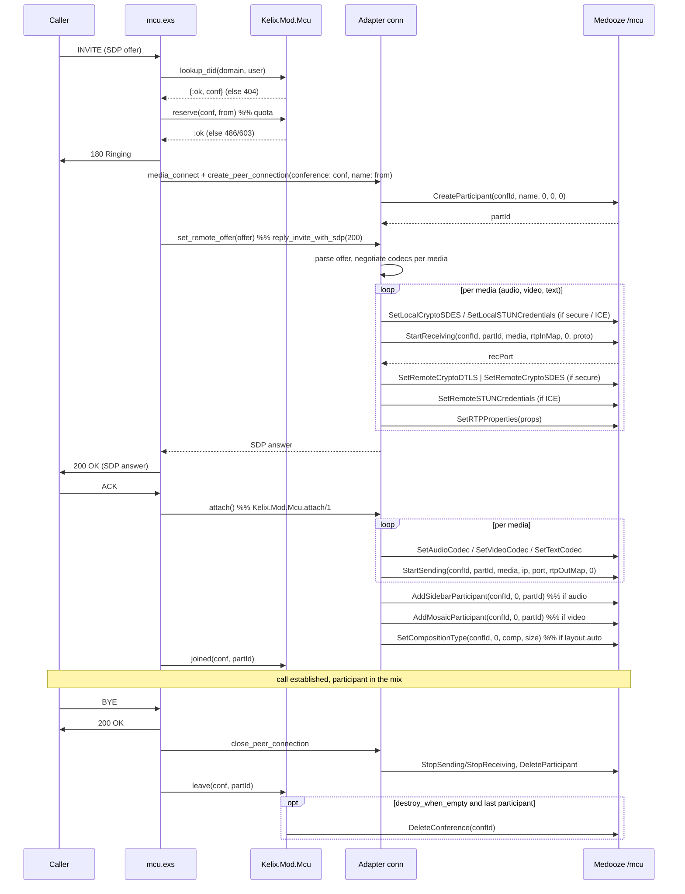

# Reduced MCU — design & specification

A conferencing (MCU) function for **kelixip**, distilled from the Java
`mcuGold` application server and rebuilt on the **Medooze MCU XML-RPC API**
(`POST /mcu`) exposed by `../mediaserver`.

> This document is the **why**: every decision, what was left out and on what
> grounds. For the **how** — configuring a node, the REST/CLI surface, writing a
> script, and reading the logs of a call that failed — see
> [docs/mcu_module_guide.md](../mcu_module_guide.md). Delivery status is §14.

The deliverable is deliberately **two artefacts** — no new frontal, no new
daemon:

| Artefact | Where | What it holds |
|---|---|---|
| `kelixip-mod-mcu` — a loadable module (`Kelix.Mod.Mcu`) | `apps/kelix_modules/lib/kelix/mod/mcu/` | conference registry, MCU XML-RPC client, event queue, the `MediaServer.Behaviour` adapter, the REST + CLI control surface |
| `mcu.exs` — a call script | `apps/kelixip/scripts/mcu.exs` | the SIP side of an inbound call: DID → conference, 180, SDP answer, join on ACK, teardown |

Everything else is existing kelixip machinery: `Kelix.Router` routes the INVITE
through the dial-plan to `mcu.exs`, `Kelix.InstancePool` spawns one scenario
instance per call, `Kelix.ControlAPI` exposes the module's commands under
`/modules/mcu/…`, and `kelictl mcu …` gets the same surface for free
(`docs/design/kelixip_basic_design.md` §8.1, §10).

---

## 1. Scope

### 1.1 In scope

1. **Inbound call handling.** An INVITE whose R-URI user-part matches a
   conference DID joins that conference: SDP offer/answer against the MCU,
   participant creation, mixer join, teardown on BYE/CANCEL/timeout.
2. **A REST API to create, modify and destroy a conference** (plus list/show,
   without which the other three are unusable), exposed through the existing
   module-command mechanism, therefore available identically on `kelictl`.
3. Audio + video mixing on the **default mosaic** and the **default sidebar**,
   with an optional automatic layout that follows the participant count
   (`Kelix.Mod.Mcu.auto_comp/1`: a ladder over the `comp` values of §3.6 — two
   participants side by side rather than a 2x2 with two black tiles). Only **video**
   legs count, and a conference with none issues no mosaic RPC at all.
4. **Total conversation**: T.140 real-time text alongside audio and video, with
   RFC 4103 redundancy (`red`) when the caller offers it. Text is mixed by the
   MCU's own text mixer, which needs no join RPC — the server wires every
   participant into it at `CreateParticipant` — and no layout: a text leg is not
   a mosaic tile. `text_codecs = []` on a conference turns it off, and its `m=text`
   section is then declined with port 0.
5. Plain RTP/AVP, **SDES-SRTP** and **DTLS-SRTP + ICE-lite** call legs (the
   three transports mcuGold supports), so both SIP phones, text terminals and
   WebRTC gateways can join.

### 1.2 Explicitly out of scope

Dropped from mcuGold, and *why it is safe to drop*:

| Dropped | Rationale |
|---|---|
| Conference **templates** & ad-hoc conference creation on an unknown DID | requested; an INVITE to an unknown DID is answered `404` |
| **Admin web UI** (`mcuWeb`, `sip2ajax`, `S2F`) | requested; REST + `kelictl` only |
| Outbound calls (`invitor`, `callParticipant`) | needs the B2BUA leg primitives (`docs/design/b2bua_module.md`), not yet available |
| RTMP / Flash participants, broadcaster, publishing | dead transports |
| Recording (participant & broadcaster), players/announcements | not needed for the reduced perimeter; the RPCs are documented in §3 for later |
| Document sharing / BFCP / slides (`VIDEO_SLIDES` role) | large, self-contained subsystem; the role parameter is still passed correctly (always `0`) so adding it later is additive |
| Extra mosaics & sidebars, per-slot layout pinning, overlay images, display names | only mosaic `0` / sidebar `0` are used |
| SOAP/B2B event listeners, per-conference HTTP callback URLs | replaced by kelixip logs + Prometheus metrics; the event vocabulary is frozen (§11.1) so the transport can be added later |
| Join-time authentication (PIN, digest challenge) | decided out (§6.1.1): the reference script admits whoever reaches the DID; auth belongs to a derived script |
| CDR engine | kelixip has its own observability layer |
| Three-way conferences, RFC 5366 resource lists, profiles as a first-class managed object | a conference carries **one inline video profile** instead |

### 1.3 Non-goals that are worth stating

- **No multi-MCU conference.** One conference lives on exactly one media
  server. A conference is pinned to the MCU chosen at creation time.
- **No conference persistence.** Conferences live in memory; a kelixip restart
  loses them (and §9.4 says what happens to the MCU-side leftovers).
- **No admission control.** Reaching the DID is joining; the conference has no
  notion of an invited or authorised caller (§6.1.1).

---

## 2. What we keep from mcuGold

The Java code is the reference for *call flow correctness*, not for structure.
The three things worth transcribing faithfully:

1. **The RPC ordering** of an inbound call (`RTPParticipant2.onInviteRequest` →
   `accept` → `onAckRequest`). Reproduced in §6.2; getting the order wrong
   yields a media server that answers `returnCode: 1` to everything and sends
   no RTP.
2. **The split between "answer-time" and "ACK-time" work.** mcuGold starts
   *receiving* before answering (it needs the local ports for the SDP) and
   starts *sending* + joins the mixer only on ACK. We keep that split: a caller
   that never ACKs never enters the mix, and no RTP leaves the MCU before the
   call is established.
3. **Who generates what secret.** For SDES the *controller* generates the local
   key and pushes it with `SetLocalCryptoSDES`; for ICE the *controller*
   generates ufrag/pwd and pushes them with `SetLocalSTUNCredentials`; only the
   DTLS fingerprint comes from the server
   (`GetLocalCryptoDTLSFingerprint`, server-wide, cacheable).

Discarded from mcuGold by design: the `Participant`/`RTPParticipant2` god
object (3 700 lines mixing SIP dialog state, SDP parsing, XML-RPC and mixer
policy). Here the SIP state is the scenario instance, the SDP/RPC work is the
adapter, and the mixer policy is the module.

---

## 3. The Medooze MCU API — the subset we use

Reference implementation: `mediaserver/mcu/src/xmlrpcmcu.cpp` (command table
`mcuCmdList`), Java client `XmlRpcMcuClient.java`.

### 3.1 Transport

| Channel | Endpoint |
|---|---|
| Control | `POST http://<host>:8080/mcu` — standard XML-RPC, `Content-Type: text/xml` |
| Events | `GET http://<host>:8080/events/mcu/<queueId>` — HTTP chunked long-poll |

This is a **different endpoint from JSR-309** (`/jsr309`) used by
`MediaServer.Mendooze`; the two APIs are disjoint object models on the same
daemon. The response envelope is the same one documented in
`mediaserver/xmlrpc_jsr309_api.md` §2:

```
success  →  { "returnCode": 1, "returnVal": [ … ] }
error    →  { "returnCode": 0, "errorMsg": "…" }
```

> An HTTP `200` with `returnCode: 0` is an **application error**. Only a
> parameter-parsing failure produces a real XML-RPC fault.

> **`returnVal` *is* the returned value**, not a list wrapping it: the server builds
> `{s:i,s:A}` with the array passed straight in (`mcu/src/xmlhandler.cpp:xmlok`). A
> method returning one integer answers `returnVal: [42]`; a method returning a *list*
> answers `returnVal: [row, row, …]`, and a server holding nothing answers
> `returnVal: []`. Reading the second kind as "the list is at index 0" is a mistake a
> stub happily reproduces — it cost us a garbage collector that silently collected
> nothing (§9.4).

Type notation below: `i` int, `s` string, `S` struct, `A` array.

### 3.2 Conference lifecycle

| Method | Params | Returns |
|---|---|---|
| `EventQueueCreate` | `()` | `(i queueId)` |
| `EventQueueDelete` | `(i queueId)` | — |
| `CreateConference` | `(s tag, i vad, i rate, i queueId)` — 3-arg variant `(s, i vad, i queueId)` omits the rate | `(i confId)` |
| `UpdateConference` | `(i confId, i vad, i rate)` | — |
| `DeleteConference` | `(i confId)` | — |
| `GetConferences` | `()` | `A` of `(i id, s tag, i numPart)` — the rows **are** `returnVal` |
| `SetCompositionType` | `(i confId, i mosaicId, i comp, i size)` | — |

`tag` is the conference's external name (we pass the kelixip UID); it is echoed
in the event stream, which is how an event is mapped back to a conference.

> **`GetConferences` truncated the tag** until 2026-07-30: `ConferenceInfo::name` is a
> `std::wstring` and was handed to xmlrpc-c's `%s`, which reads it as `char*` and stops
> at the first embedded NUL — `"c-a8592bc0"` came back as `"c"`. Fixed in
> `mcu/src/xmlrpcmcu.cpp` (serialise through `UTF8Parser`, as
> `GetBroadcastPublishedStreams` already did), but **deployed builds may predate the
> fix**, so the orphan sweep keys on the MCU-side id instead (§9.4). The *event*
> stream was never affected: it serialises the tag properly.

### 3.3 Participant lifecycle

| Method | Params | Returns |
|---|---|---|
| `CreateParticipant` | `(i confId, s name, i type, i mosaicId, i sidebarId)` | `(i partId)` |
| `DeleteParticipant` | `(i confId, i partId)` | — |
| `AddMosaicParticipant` / `RemoveMosaicParticipant` | `(i confId, i mosaicId, i partId)` | — |
| `AddSidebarParticipant` / `RemoveSidebarParticipant` | `(i confId, i sidebarId, i partId)` | — |
| `SetMute` | `(i confId, i partId, i media, i muted)` | — |
| `SendFPU` | `(i confId, i partId)` | — |
| `GetParticipantStatistics` | `(i confId, i partId)` | `A` of one row per media: `(s media, i isReceiving, i isSending, i lostRecvPackets, i numRecvPackets, i numSendPackets, i totalRecvBytes, i totalSendBytes)` |

`type` is `0` (RTP) for every participant we create; `1` (RTMP) is unused.
`name` must not contain `.` — mcuGold replaces it with `_`; we do the same.

> The statistics rows are **positional, and `isReceiving` precedes `isSending`** —
> the reverse of the order this table used to list them in. `participant.show` names
> the fields (`receiving:`, `sending:`, `lost_recv_packets:`, …) so no caller has to
> know the wire order.

### 3.4 Media setup

| Method | Params | Returns |
|---|---|---|
| `StartReceiving` | `(i confId, i partId, i media, S rtpMap, i role[, i proto])` | `(i recPort, s announcedIp)` — the address to advertise for this media (§16.5); `returnVal[0]` stays the port |
| `StopReceiving` | `(i confId, i partId, i media[, i role])` | — |
| `StartSending` | `(i confId, i partId, i media, s sendIp, i sendPort, S rtpMap[, i role])` | — |
| `StopSending` | `(i confId, i partId, i media[, i role])` | — |
| `SetAudioCodec` | `(i confId, i partId, i codec[, S params])` | — |
| `SetVideoCodec` | `(i confId, i partId, i codec, i mode, i fps, i bitrate, i intraPeriod, S params[, i role])` | — |
| `SetTextCodec` | `(i confId, i partId, i codec)` | — |
| `SetRTPProperties` | `(i confId, i partId, i media, S props[, i role])` | — |

`rtpMap` is a struct **keyed by payload type as a string**, valued with the
Medooze codec constant: `%{"96" => 99, "0" => 0}`. Same shape as the JSR-309
`rtpMap` already produced by `MediaServer.Mendooze.Sdp.local_rtp_map/3`.

`SetRTPProperties` keys observed in mcuGold and supported server-side:
`rtcp-mux`, `secure`, `ssrc`, `cname`, `tmmbr`, `useNACK`, `useFEC`,
`h264.profile-level-id`, plus one entry per RTP header extension
(`<extension-uri> => <id>`).

### 3.5 Security

| Method | Params | Returns |
|---|---|---|
| `SetLocalCryptoSDES` | `(i confId, i partId, i media, s suite, s key[, i role])` | — |
| `SetRemoteCryptoSDES` | `(i confId, i partId, i media, s suite, s key[, i role, i keyRank])` | — |
| `GetLocalCryptoDTLSFingerprint` | `(s hash)` | `(s fingerprint)` |
| `SetRemoteCryptoDTLS` | `(i confId, i partId, i media, i role, s setup, s hash, s fingerprint)` — 6-arg variant drops `role` | — |
| `SetLocalSTUNCredentials` | `(i confId, i partId, i media, s ufrag, s pwd[, i role])` | — |
| `SetRemoteSTUNCredentials` | `(i confId, i partId, i media, s ufrag, s pwd[, i role])` | — |

### 3.6 Enumerations

| Enum | Values |
|---|---|
| `MediaType` | `0` audio, `1` video, `2` text, `3` application |
| `MediaRole` | `0` main, `1` slides (always `0` here) |
| `MediaProtocol` | `0` RTP, `1` RTMP, `2` WS, `3` TCP, `4` UDP |
| `Participant type` | `0` RTP, `1` RTMP |
| VAD | `0` none, `1` basic, `2` full |
| Mosaic layout | `0` 1x1, `1` 2x2, `2` 3x3, `3` 3+4, `4` 1+7, `5` 1+5, `6` 1+1, `7` PIP1, `8` PIP3, `9` 4x4, `10` 1+4, `11` 2+8 |
| Video size | `0` QCIF, `1` CIF, `2` VGA, `3` PAL, `4` HVGA, `5` QVGA, `6` HD720P, `7` WQVGA, `14` XGA, `15` WVGA … (`XmlRpcMcuClient` constants) |

Audio/video codec constants are the ones already tabulated in
`MediaServer.Mendooze.Sdp` (`codecs.h`): PCMU 0, GSM 3, PCMA 8, G722 9,
OPUS 98, telephone-event 100, AMR 118, AMRWB 120 … / H263 34, H264 99,
H263-1998 103, MPEG4 104, VP8 107.

### 3.7 Event stream

`GET /events/mcu/<queueId>` streams XML-RPC-encoded arrays. Two event types
exist (`MediaMixerMCUEventQueue.onEvent`):

| type | payload | meaning |
|---|---|---|
| `1` | `(i confId, s tag, i partId)` | the MCU wants a **full intra-frame** from that participant |
| `2` | `(i confId, s tag, i partId, s status)` | doc-sharing status — **ignored** (out of scope) |

Type `1` is the only one we act on: it becomes a SIP `INFO` carrying
`application/media_control+xml` with `picture_fast_update` (§6.4).

### 3.8 Gaps versus the JSR-309 API — consequences for the design

These are *facts about the MCU API as it stands today*, and each one costs us
something. Three of them are **scheduled to be closed server-side** (§16) — the
design must work without that, and get better with it.

| # | Gap | Consequence | Closed by |
|---|---|---|---|
| G1 | `StartReceiving` returns **only the local port** — no accepted-PT/fmtp struct (JSR-309 returns both since the delegation work) | the SDP answer is built **entirely by kelixip**: no server-side codec arbitration. `MediaServer.Mendooze.Sdp.accepted_pts/2` and friends are *not* usable; `parse/1`, `negotiate/3`, `build/1`, `local_rtp_map/3` are | **S3 / P8** (§16.3) |
| G2 | No `GetMediaCandidates` equivalent | ~~the media IP for `c=` and the ICE host candidates come from **configuration** (`rtp_ip` / `public_ip`), exactly like mcuGold's `MediaMixer.getIp()`~~ — **closed**: `StartReceiving` now returns the address to announce next to the port, so kelixip holds none | **S4** (§16.5) |
| G3 | No `EndpointStartRTPTimeout` equivalent | **no media watchdog**. A silent leg is only detected by SIP (session timers / idle timeout in the script) | **S1 / P7** (§16.1) |
| G4 | No per-participant "media started" event | `:ice_connected` cannot be emitted by the adapter. Scripts must not wait for it | **S2 / P7** (§16.2) |
| G5 | No trickle-ICE input | `add_remote_candidate/2` is a no-op returning `:ok`; ICE-lite + the offerer's candidates are enough for the gateway/WebRTC cases we serve | — (not needed) |

---

## 4. Architecture

```
                                 kelixip node
 ┌───────────────────────────────────────────────────────────────────────────┐
 │  SIP  ──INVITE──▶ Kelix.Router ──dial-plan──▶ InstancePool                 │
 │                                                   │ spawns                 │
 │                                                   ▼                        │
 │                                            ┌─────────────┐                 │
 │                                            │  mcu.exs    │  1 per call     │
 │                                            │ (scenario)  │                 │
 │                                            └──────┬──────┘                 │
 │                        facade calls               │  media DSL             │
 │                    ┌──────────────────────────────┼───────────────┐        │
 │                    ▼                              ▼               │        │
 │        ┌────────────────────────┐      ┌──────────────────────┐   │        │
 │  REST  │      Kelix.Mod.Mcu     │      │ Kelix.Mod.Mcu.Adapter│   │        │
 │  CLI ─▶│  (GenServer + ETS)     │◀────▶│ MediaServer.Behaviour│   │        │
 │        │  conferences, DIDs,    │      │  1 process per call  │   │        │
 │        │  participants, quota   │      └──────────┬───────────┘   │        │
 │        └───────────┬────────────┘                 │               │        │
 │                    │              ┌───────────────┴────────┐      │        │
 │                    ▼              ▼                        │      │        │
 │        ┌───────────────────────────────────┐   ┌───────────▼──┐   │        │
 │        │      Kelix.Mod.Mcu.Client         │   │  Mcu.Sdp     │   │        │
 │        │  XML-RPC POST /mcu (per MCU)      │   │ (offer/answer│   │        │
 │        └───────────────┬───────────────────┘   │  helpers)    │   │        │
 │                        │                       └──────────────┘   │        │
 │        ┌───────────────▼───────────────────┐                      │        │
 │        │    Kelix.Mod.Mcu.EventQueue       │──── FPU ─────────────┘        │
 │        │  GET /events/mcu/<queueId>        │   {:mcu_event, …}             │
 │        └───────────────────────────────────┘                               │
 └───────────────────────────────────────────────────────────────────────────┘
                                    │  HTTP
                                    ▼
                       Medooze mediaserver (mcu :8080)
```

### 4.1 Processes

| Process | Kind | Lifetime | Role |
|---|---|---|---|
| `Kelix.Mod.Mcu` | `GenServer`, registered under the module name | node | conference registry (ETS), DID index, per-MCU connection supervision, control commands |
| `Kelix.Mod.Mcu.Client` | `GenServer`, one per `mendooze` pool entry | node | XML-RPC channel + `queueId`; serialises calls, applies `xmlrpc_timeout_ms` |
| `Kelix.Mod.Mcu.EventQueue` | `GenServer` + a task, one per MCU | node | chunked long-poll, decode, dispatch to the owning participant's scenario pid |
| `Kelix.Mod.Mcu.Adapter` conn | `GenServer`, one per **call leg** | call | holds `{conf_id, part_id, media map, crypto, ports}`; implements `MediaServer.Behaviour` |
| `mcu.exs` instance | scenario | call | the SIP state machine |

Supervision: the module's `child_spec/2` returns a `Supervisor` (rest_for_one — the
registry owns the ETS tables the others read) holding `Kelix.Mod.Mcu` + one
`{Client, EventQueue}` pair per media server. The list comes from
`[mediaserver.pool.*]` (§8.4), read once at boot from `Kelix.Config` — not from
`Kelix.MediaPool`, which the node starts *after* its modules. An MCU that is
unreachable at boot does **not** prevent the module from starting: its client is up
but marked `down`, conferences on it are refused with a clear error (§9.4).

### 4.2 Why the adapter is a `MediaServer.Behaviour`

Because the whole media DSL then works unchanged: `media_connect()`,
`reply_invite_with_sdp/2`, `media_stop()` in `mcu.exs` are the *same* macros
`uas_invite.exs` already uses. The mapping is:

| `MediaServer.Behaviour` | MCU API |
|---|---|
| `connect/1` | resolve the `Client` for that URL; `{:ok, client_pid}` |
| `create_peer_connection/3` | `CreateParticipant` in the conference given by `opts[:conference]` |
| `set_remote_offer/2` | the whole answer-time sequence (§6.2 steps 3-6) → SDP answer |
| `set_remote_answer/2` | unused inbound-only; returns `{:error, :not_supported}` until B2BUA legs exist |
| `get_local_offer/1` | idem |
| `add_remote_candidate/2` | `:ok`, no-op (G5) |
| `close_peer_connection/1` | `StopSending`/`StopReceiving` + `DeleteParticipant` |
| `disconnect/2` | release the client reference (the client itself is node-scoped, not per call) |
| player / recorder / echo callbacks | `{:error, :not_supported}` — out of scope, the MCU API has the RPCs (§1.2) for a later increment |

The conference-level operations have no place in `MediaServer.Behaviour` and
are **not** forced into it: they are plain functions on `Kelix.Mod.Mcu`
(§8.2) and, for the participant-level extras (mute, FPU, stats), on
`Kelix.Mod.Mcu.Adapter`.

---

## 5. Data model

### 5.1 Conference

```elixir
%Kelix.Mod.Mcu.Conference{
  uid:         "c-3f9a…",        # kelixip id, = the MCU `tag`, in the REST Location
  name:        "Sales weekly",
  domain:      "example.com",    # the served domain the DID belongs to
  did:         "8001",           # R-URI user-part that reaches it; unique per domain
                                 #   supplied by the caller, else allocated (§5.3)
  mcu:         "mcu1",           # pool entry name; a conference never migrates
  conf_id:     42,               # MCU-side integer id
  vad:         1,                # 0 none | 1 basic | 2 full
  rate:        32000,            # mixer sampling rate (default, §8.4)
  codecs:      %{audio: ["OPUS","G722","PCMA","PCMU"], video: ["H264"], text: [ "T140", "T140RED"]},
  video:       %{size: 6, fps: 15, bitrate: 1024, intra_period: 300},  # inline profile
  layout:      %{comp: 1, size: 6, auto: true},                        # mosaic 0
  max_participants: 20,
  auto_accept: true,
  destroy_when_empty: false,
  created_at:  ~U[…],
  participants: %{part_id => participant}
}
```

Storage: one ETS table (`:set`, `read_concurrency`) keyed by `uid`, owned by
`Kelix.Mod.Mcu`, plus a `{domain, did} => uid` index table. Reads (the hot path:
one DID lookup per INVITE) go straight to ETS without touching the GenServer —
same pattern as `Kelix.Mod.Registrar` (design §6.1). Writes go through the
GenServer, which is what serialises "create conference" against the MCU.

### 5.2 Participant

```elixir
%{
  part_id:   7,
  conf_uid:  "c-3f9a…",
  name:      "alice@example.com",
  scenario:  #PID<0.812.0>,        # the mcu.exs instance — event routing target
  conn:      #PID<0.813.0>,        # the adapter connection
  state:     :ringing | :connected | :leaving,
  medias:    %{audio: %{rec_port: 52014, send: {"1.2.3.4", 40000}, codec: 98}, …},
  joined_at: ~U[…]
}
```

The participant row is owned by the module (so `list`/`show` can report it and
so the quota is authoritative), but the *media detail* is owned by the adapter
connection; the module keeps only what a human wants to see.

### 5.3 Identity & lifetimes

- A conference `uid` is stable for the conference's life and is what REST
  clients use. The MCU-side `conf_id` is an implementation detail that changes
  if the conference is ever recreated after an MCU restart.
- `did` is unique **per domain**; creating a second conference with the same
  `(domain, did)` is refused (mcuGold does the same, `searchConferenceByDid`).
- **DID allocation.** `create` may omit `did`, in which case the module picks
  the lowest free number in the domain's configured range (`did_range`, §8.4)
  and returns it. An explicit `did` is always honoured, *including one outside
  the range* — the range is an allocation pool, not an admission filter. An
  exhausted range is `{:error, :no_did_available}` (HTTP 409). The allocation
  runs inside the `create` GenServer call, so two concurrent creates cannot get
  the same number.
- A participant dies with its scenario instance: the module monitors
  `participant.scenario` and reaps the MCU-side participant if the instance
  crashes without a clean `leave` (§9.3).

---

## 6. Inbound call handling

### 6.1 Routing

Existing kelixip dispatch, no new mechanism (design §4):

```toml
[[domain.call]]
pattern = "8XXX"          # conference DIDs
script  = "mcu.exs"
```

`Kelix.Router` resolves domain → `calls` → `mcu.exs` and `Kelix.InstancePool`
spawns the instance with `domain:` injected. The script then asks the module
which conference the R-URI user-part designates. **No template, no ad-hoc
creation**: an unknown DID is `404 Not Found`.

Two operational consequences:

- the dial-plan pattern must cover the DID allocation range (§8.4) — the module
  allocates numbers, it does not touch `domains.toml`. A `did_range` outside the
  pattern yields conferences nobody can dial, so `create` **warns** (log +
  `warning` field in the reply) when the allocated DID matches no `mcu.exs`
  dial rule on that domain;
- **no admission control at join time**: anyone who reaches the DID enters the
  conference. Authentication, if a deployment wants it, is a *script* concern —
  see §7.

### 6.1.1 Joining is not authenticated

Decided: the reference `mcu.exs` challenges nobody. The rationale is that the
module has no business owning an auth policy the SIP layer already has three
ways to express (upstream proxy trust, a digest challenge against
`[module.auth_db]`, or a shared secret in the R-URI). A deployment that needs
one copies `mcu.exs`, inserts the challenge before `Kelix.Mod.Mcu.admit/2`, and
points its dial rule at the copy — **no module change, no core change**. What
this costs is recorded as limitation L8 (§12).

### 6.2 Sequence



### 6.3 SDP rules (answerer side)

kelixip is the answerer for every leg in this scope, which removes most of the
hard cases:

1. **Payload types.** RFC 3264 §6: the answer reuses the offer's PT numbering
   for every accepted codec. Both `rtpMap` structs (`StartReceiving` and
   `StartSending`) are therefore keyed with the **offered** PTs — no local
   renumbering, unlike the UAC path in `MediaServer.Mendooze`.
2. **Codec selection.** Intersect the conference's `codecs` list (in conference
   priority order) with the offer; the first match wins per media. An empty
   intersection for audio ⇒ `488 Not Acceptable Here`; for video ⇒ the video
   `m=` line is answered with **port 0** and the call proceeds audio-only
   (mcuGold behaviour, and `Mendooze.Sdp.build/1` already supports the
   `reject_fmt` media spec).
3. **`c=` line and ICE candidates** carry the address `StartReceiving` returned
   for this leg (§16.5, G2 closed) — the media server's own announced address,
   which is the only party that knows it. One host candidate for RTP, plus one
   for RTCP when `rtcp-mux` was not offered (component ids 1 and 2, as mcuGold).
4. **Transport line.** `RTP/AVP`, `RTP/SAVP` (SDES) or `UDP/TLS/RTP/SAVP`
   (DTLS), `F` appended when RTCP feedback was offered — the same
   `protocol_for/1` logic already in `Mendooze.Sdp`.
5. **ICE-lite.** When the offer carries ICE credentials we answer `a=ice-lite`
   with our generated ufrag/pwd. We never gather reflexive candidates.
6. **DTLS.** `a=setup:` mirrors an offer that already committed (`active` →
   `passive`, `passive` → `active`); an `actpass` offer is answered **`passive`**,
   i.e. the MCU is the DTLS *server* and the peer initiates the handshake.
   `a=fingerprint:` is the server's, fetched once per MCU with
   `GetLocalCryptoDTLSFingerprint("SHA-256")` and cached.

   > **Decided 2026-07-30.** RFC 5763 §5 *recommends* `active` for the answerer
   > (it can start the handshake immediately), and this rule said so. It is
   > overruled by interop experience on this same daemon: `MediaServer.Mendooze`
   > answers `passive` on the JSR-309 path with the note "the safe role a
   > browser/gateway expects from the answerer". Since P4's whole point is that a
   > WebRTC gateway leg joins, the empirically-working role wins over the
   > recommendation.
   >
   > What is pushed to `SetRemoteCryptoDTLS` is the peer's **resolved** role — the
   > complement of ours for an `actpass` offer, its own choice otherwise — never the
   > literal `actpass`: the server would otherwise have to resolve it exactly as we
   > did, and a disagreement about who initiates produces a DTLS stall neither side
   > reports.
7. **`a=sendrecv`** is the direction for a mixed participant; a `recvonly`
   offer is answered `sendonly` and vice-versa (`reverse_direction/1`).
8. **Bandwidth.** `b=AS:` on video is `min(offered, conference video.bitrate)`.
9. **H.264 profile.** `profile-level-id` is reflected from the offer when it
   states one, and is otherwise **the conference's own** (`video_fmtp`, default
   `profile-level-id=42e01f;packetization-mode=1`) rather than absent: silence
   means RFC 6184's default — Baseline level 1.0 — to the peer, while the mixer
   encodes HD720p. The value the answer states is also what the encoder is
   configured with, and the two travel from a single decision taken at answer
   time (`neg.answered_profile_level_id`).

   > **Where it is pushed, and why not where it was.** It goes in
   > `SetVideoCodec`'s properties map, *not* `SetRTPProperties`. The module used
   > to send `h264.profile-level-id` in the latter and it never arrived:
   > `VideoStream::SetRTPProperties` keeps only keys prefixed `codec.`, so the
   > unprefixed one fell through to `RTPSession::SetProperties`, which answered
   > `Unknown RTP property` — the reflected profile of §3.4 was therefore never
   > applied either. Prefixing it is not enough: `SetVideoCodec` runs later (ACK
   > time) and **replaces** the whole map (`videoProperties = properties`), which
   > is precisely why that map is the right place. Verified on the live server:
   > `H264Encoder: … profile-level-id 42e01f` where it used to log its own
   > default `42801F`.

   This is L4 in miniature — kelixip decides what the MCU encodes — and §16.3
   (S3/P8) removes the guess by having the server report what it accepted.
10. **T.140 redundancy.** `t140` and `red` are answered like any other codec, in
   the offerer's numbering. When both are answered, `red` carries the RFC 4103
   fmtp naming the T.140 payload type — primary plus two redundant,
   `a=fmtp:<red> <t140>/<t140>/<t140>`, the caller's payload types. It is emitted
   **only** then: `red` quoting a payload type absent from the answer is not
   decodable, which is the same reading the framework's own offer builder applies
   (`Sdp.add_red_fmtp/5`). Preference comes from the conference's `text_codecs`,
   `T140RED` first by default, so a caller offering redundancy gets it — on a lossy
   link a lost packet is a lost character.

The implementation reuses `MediaServer.Mendooze.Sdp` for `parse/1`,
`negotiate/3`, `build/1`, `local_rtp_map/3`, `answer_rtpmaps/2`,
`host_candidates/3`, `negotiate_bandwidth/2` and `reverse_direction/1`, through the
neutral alias **`MediaServer.SdpTools`** — landed as recommended, a rename with no
move, so the MCU adapter does not claim a dependency on the JSR-309 API whose module
they happen to live in.

`parse/1` gained one field for this work: **`fmtp`**, the offer's `a=fmtp` lines as
parsed structs per payload type. It is what lets the answerer reflect H.264's
`profile-level-id` (and push it to the encoder as `h264.profile-level-id`, §3.4)
instead of guessing — the difference between two video phones that see each other and
two that negotiate successfully and decode nothing. Structs rather than raw strings on
purpose: an answerer must reflect `profile-level-id` and must **not** reflect
`sprop-parameter-sets`, which describes the offerer's own encoder.

### 6.4 In-call events

| Event | Handling |
|---|---|
| MCU event type `1` (FPU) | `EventQueue` → owning scenario `{:mcu_event, :fpu_requested}` → script sends `INFO` with `application/media_control+xml` / `picture_fast_update` |
| Inbound `INFO` with `media_control+xml` | script → `Kelix.Mod.Mcu.send_fpu(part)` → `SendFPU(confId, partId)` |
| re-INVITE / UPDATE with SDP | re-run §6.2 steps 3-6 on the **same** participant (`StartReceiving`/`StartSending` are idempotent per media; only changed medias are restarted, following mcuGold's `needUpdateRec`/`needUpdateSend` flags), answer 200 |
| re-INVITE with hold (`a=sendonly`/`inactive`, or `c=0.0.0.0`) | `StopSending` on the held medias; the participant stays in the mix (muted upstream), no mosaic change. From P7: **disarm the watchdog** on those medias (`StartRTPTimeout(…, 0)`), else a legitimate hold reads as a dead leg |
| `CANCEL` | the IST answers 487; script tears the participant down |
| Idle timeout (script `after`) | BYE + teardown; **today the only protection against a dead leg** (G3) — from P7 it becomes the last resort behind the RTP watchdog |
| MCU event type `3` (media timeout) — **P7**, §16.1 | `{:mcu_event, :media_timeout, media}` → BYE + teardown, `participant.left` with `reason: :media_timeout` |
| MCU event type `4` (media connected) — **P7**, §16.2 | `{:ms_event, conn, :ice_connected}` (behaviour-conformant) → optional mosaic join on real video instead of at ACK time |

### 6.5 SIP response mapping

| Situation | Response |
|---|---|
| DID matches no conference | `404 Not Found` |
| Conference full (`max_participants`) | `486 Busy Here` (mcuGold answers `603`; `486` is the correct in-dialog semantics for a full resource) |
| Node/domain call quota reached | `503` — existing `InstancePool` behaviour, untouched |
| No codec in common (audio) | `488 Not Acceptable Here` |
| MCU unreachable / RPC error | `500 Server Internal Error` + `Retry-After` when the MCU is marked down |
| Conference exists but its MCU is down | `503 Service Unavailable` |
| Offer unparsable | `400 Bad Request` |

---

## 7. `mcu.exs` — the call script

Reduced, single-purpose, and — like `registrar.exs` — it **composes SIP
responses from module verdicts**, it does not decide policy.

It is shipped as a **reference script**, not as a fixed part of the module: it
lives in `script_dir`, a domain points at it through an ordinary dial rule, and
a deployment is expected to copy and adapt it (adding a digest challenge, an
IVR-style welcome prompt, a PIN state, a per-caller reject list). The module
API in §8.2 is the stable contract; the script is not.

```elixir
# Sketch, not final code.
defmodule Kelix.Mcu.Call do
  use SIP.Scenario
  use SIP.Session.CallUAS

  uas(:invite)
  config(uses_modules: [:mcu])

  state initial_state do
    goto(wait_invite)
  end

  state wait_invite do
    on_events do
      {:INVITE, req, _trans, dlg} ->
        case Kelix.Mod.Mcu.admit(sip_ctx.domain, req) do
          {:ok, conf, part} ->
            appdata_set(:mcu_part, part)
            # tells the media layer which conference this leg joins (§10, FW-1)
            appdata_set(:media_conn_opts, conference: conf.uid, participant: part.name)
            media_connect()
            reply_invite(180, "Ringing")
            goto(answering)

          {:error, :no_such_conference} -> reply_invite(404, "Not Found") ; scenario_success("404")
          {:error, :full}               -> reply_invite(486, "Busy Here") ; scenario_success("486")
          {:error, :mcu_down}           -> reply_invite(503, "Service Unavailable") ; scenario_success("503")
        end
    after
      30_000 -> scenario_failure("no INVITE")
    end
  end

  state answering do
    reply_invite_with_sdp(200, media: :audio_video)   # → adapter set_remote_offer
    goto(in_call)
  end

  state in_call do
    on_events do
      {:ACK, _req, _trans, _dlg} ->
        Kelix.Mod.Mcu.attach(appdata_get(:mcu_part))   # StartSending + join the mix
        goto(loop, "ACK")

      {:INVITE, _req, _trans, _dlg} -> reply_invite_with_sdp(200) ; goto(loop, "re-INVITE")
      {:UPDATE, _req, _trans, _dlg} -> reply_invite_with_sdp(200) ; goto(loop, "UPDATE")

      {:mcu_event, :fpu_requested}  -> send_info_media_control() ; goto(loop, "FPU")

      {:INFO, req, _trans, dlg} ->
        if media_control?(req), do: Kelix.Mod.Mcu.send_fpu(appdata_get(:mcu_part))
        reply_request(req, 200, "OK")
        goto(loop, "INFO")

      {:BYE, req, _trans, _dlg} ->
        reply_request(req, 200, "OK")
        leave()
        scenario_success("BYE")

      {:CANCEL, _req, _trans, _dlg} -> leave() ; scenario_success("cancelled")
      {:dialog_terminated, _dlg, _r} -> leave() ; scenario_success("dialog ended")
    after
      7_200_000 -> send_BYE() ; goto(hanging_up)      # G3: the only stale-leg guard
    end
  end

  state hanging_up do
    leave()
    on_events do
      {200, _rsp, _t, _d} -> scenario_success("clean shutdown")
    after
      10_000 -> scenario_failure("BYE not answered")
    end
  end

  on_shutdown do
    send_BYE(); leave(); scenario_aborted("mcu stopped gracefully")
  end

  # leave/0 = media_stop() + Kelix.Mod.Mcu.leave(part) — idempotent, safe to call twice.
end
```

Three properties this script must keep:

1. **Idempotent teardown.** `leave/0` is called from five places; the module's
   `leave/1` must tolerate an already-removed participant.
2. **No policy.** Quota, DID resolution, mixer joining and layout live in the
   module. The script maps verdicts onto SIP codes, that is all.
3. **Rescue like `registrar.exs`.** A raised exception in a module call must
   become a `500`, never a silent dead instance — the caller would otherwise
   retransmit into the void.

---

## 8. `Kelix.Mod.Mcu` — the module

### 8.1 `Kelix.Module` callbacks

| Callback | Content |
|---|---|
| `validate_config/1` | rejects unknown keys — including a leftover `mediaserver` sub-block, whose error message names its replacement (§8.4) — and validates the defaults block, the codec vocabulary, the allocation ranges and the timeouts. The media servers are validated by `Kelix.Config`, which owns `[mediaserver.pool.*]` |
| `child_spec/2` | the supervisor described in §4.1 |
| `describe/0` | `%{version: "1.0", exports: [admit: 2, attach: 1, leave: 1, send_fpu: 1, lookup_did: 2, conference: 1]}` |
| `reload/2` | in-place: adds/removes MCU entries and changes defaults **without touching live conferences**; changing an MCU's URL while it hosts conferences is refused (`{:error, :mcu_in_use}`) |
| `describe_control/0` | §8.3 |
| `handle_control/2` | §8.3 |

### 8.2 Facade API (used by `mcu.exs`)

All of these go through `Kelix.Module.safe_call/3`, so a wedged module yields
`{:error, :timeout}` and the script answers `500` instead of hanging the call.

| Function | Returns | Notes |
|---|---|---|
| `admit(domain, req)` | `{:ok, conference, participant}` \| `{:error, :no_such_conference \| :full \| :mcu_down}` | DID lookup + quota reservation + participant row creation, atomically in the GenServer. Does **not** talk to the MCU |
| `attach(part)` | `:ok \| {:error, term}` | ACK-time: codecs, `StartSending`, mixer join, auto-layout |
| `leave(part)` | `:ok` | idempotent; releases the quota slot, deletes the MCU participant, may destroy the conference |
| `send_fpu(part)` | `:ok \| {:error, term}` | `SendFPU` |
| `mute(part, media, bool)` | `:ok \| {:error, term}` | `SetMute` — backs `participant.update` (§8.3.3), exported for completeness |
| `kick(uid, part_id)` | `:ok \| {:error, :not_found}` | backs `participant.delete`: BYE the scenario, then the `leave/1` path |
| `lookup_did(domain, did)` | `{:ok, conference} \| :error` | pure ETS read, no GenServer hop |
| `conference(uid)` | `{:ok, conference} \| :error` | idem |

**Where the MCU-side participant is created.** `admit/2` deliberately does not
call `CreateParticipant`: the adapter does, inside
`create_peer_connection/3`, so that the participant's MCU lifetime is exactly
the adapter connection's lifetime and a crash cannot orphan it. `admit/2`
reserves the *slot* (quota) and the row.

### 8.3 Control surface — REST + CLI

A **resource-oriented** REST surface (`/modules/mcu/conferences/<uid>/…`) is the
target, because that is what a conference API is and what any external client
expects. **Decided: the module control layer gains nested resources** — the
change is generic, lands in the core (FW-4), and every later module inherits it.

§8.3.1 states what the frontal does today, §8.3.2 the mismatches and how each is
settled, §8.3.3 the surface, §8.3.4 the core change, §8.3.5 the compromise that
keeps the module shippable before the core change lands, and §8.3.6 the CLI
parity analysis.

#### 8.3.1 What the module control layer provides today

Verified against `apps/kelixip/lib/kelix/control_api.ex`,
`lib/kelix/control.ex`, `lib/kelix/control/registry.ex`,
`lib/kelix/control/cli.ex` and `lib/kelix/module.ex`:

| Fact | Consequence |
|---|---|
| The only generic route is `match "/modules/:name/:cmd"` — a Plug path param matches **exactly one** segment | `/modules/mcu/conferences/c-123` reaches `match _` ⇒ **404**. Sub-resources are unreachable |
| Dispatch is `Control.module_command(name, cmd, body_map(conn))` → `module.handle_control(cmd, args)` | the command is a **flat identifier**; nothing injects path variables into `args` |
| `control_command.rest` is `{:get \| :post \| :delete, String.t()}` and the **path element is stored but never read** — the route is derived from `name` | the declared path is dead metadata *designed for exactly this*, and `:put`/`:patch` are not in the type |
| `respond/2` maps results to 200 / 400 / 404 only | no `201 Created` + `Location`, no `409` |
| `Plug.Parsers` parses JSON bodies for POST/PUT/PATCH/**DELETE**, not GET | a body works on DELETE/PATCH; GET arguments need FW-2 (query params) |
| `Kelix.ControlAPI.Auth` runs before `:match`, path-agnostic | nesting costs nothing on the auth side |
| `kelictl` parses `[module, cmd | rest]` into `%{"args" => rest}` and **never consults the registry** | CLI parity is by convention, not by construction, whatever we do here |
| `rw: :r \| :w` is stored and currently unused | keep declaring it (it is the hook for read-only tokens) but do not rely on it |

#### 8.3.2 Coherence check of the proposed tree, and how each point is settled

| # | Issue | Settled as |
|---|---|---|
| 1 | **Nested paths are unroutable** (`:cmd` matches one segment) | **FW-4**: the frontal gains generic multi-segment templates. Accepted as a core change |
| 2 | **`UPDATE` is not an HTTP method** | **`PUT`**, with partial-merge semantics stated explicitly (§8.3.3). `PATCH` is accepted as an alias on the same template so a strict client is not forced to send a full representation |
| 3 | **Path variables must reach `handle_control/2`** | FW-4 merges them into the args map; `uid`/`part_id` arrive exactly as they do from the CLI |
| 4 | **`mosaics` / `mixers` exceed the perimeter** | **mosaic `0` + mixer (sidebar) `0` only, in a first step.** The sub-resource paths are **reserved and documented**, and answer `404` until implemented — a REST client must never meet a half-working mosaic API |
| 5 | **`201 Created` + `Location` not expressible** | **Required**, and solved *declaratively*: the command declares `status:` / `location:` / `errors:` and the frontal derives them (§8.3.4). The module never manipulates HTTP |

Nothing in the proposal conflicts with the *module model* itself — the module
still declares its surface once, still holds no auth, still routes through
`handle_control/2`. What it conflicts with is the frontal's **route shape**,
which is a kelixip core limitation, not an MCU one. Fixing it generically is
worth more than working around it locally: any future module (b2bua, presence)
gets resource routes for free, and the `rest:` field finally does what its type
always announced.

**On PUT vs PATCH.** Our update is a merge of the fields present in the body; it
is not a replacement (a conference has server-owned fields — `conf_id`, `uid`,
`created_at`, the participant list — that a client cannot send back). Declaring
`PUT` and implementing a merge is a small, common and *stated* deviation from
RFC 7231 §4.3.4; leaving `PATCH` open on the same template gives a strict client
the honest verb. What we do **not** do is accept a `PUT` that silently resets
omitted fields to their defaults — that would be the dangerous reading of PUT,
and it is explicitly rejected in §8.3.3.

#### 8.3.3 The specified surface

`<base>` = `/modules/mcu`. Every command id below is what `handle_control/2`
receives and what `kelictl mcu <id>` names.

| Command id | Method + path | rw | Args | Result |
|---|---|---|---|---|
| `conference.create` | `POST <base>/conferences` | w | `domain`, `name`, opt. `did` (allocated when absent), `mcu`, `vad`, `rate`, `audio_codecs`, `video_codecs`, `video`, `layout`, `max_participants`, `destroy_when_empty` | `201` + `Location: <base>/conferences/<uid>`, body `{uid, did, conf_id, mcu}` |
| `conference.list` | `GET <base>/conferences` | r | opt. `domain` (query) | `[{uid, did, name, mcu, participants, created_at}]` |
| `conference.show` | `GET <base>/conferences/:uid` | r | `uid` | conference + participants |
| `conference.update` | `PUT` (or `PATCH`) `<base>/conferences/:uid` | w | `uid` + any subset of `name`, `vad`, `rate`, `layout`, `max_participants`, `video`, `destroy_when_empty` | `{uid, changed: [...]}` |
| `conference.delete` | `DELETE <base>/conferences/:uid` | w | `uid`, opt. `force` | `{uid, disconnected: n}` |
| `participant.list` | `GET <base>/conferences/:uid/participants` | r | `uid` | `[{part_id, name, state, medias, joined_at}]` |
| `participant.show` | `GET <base>/conferences/:uid/participants/:part_id` | r | `uid`, `part_id` | participant + `GetParticipantStatistics` |
| `participant.update` | `PUT` (or `PATCH`) `<base>/conferences/:uid/participants/:part_id` | w | `uid`, `part_id`, subset of `muted` (`%{audio: bool, video: bool}`) | `{part_id, changed: [...]}` |
| `participant.delete` | `DELETE <base>/conferences/:uid/participants/:part_id` | w | `uid`, `part_id` | `{part_id}` — BYE + teardown (the former `kick`) |

`mute` and `kick` disappear as standalone verbs: muting is
`participant.update`, kicking is `participant.delete`. That is the one real
simplification the resource shape buys us.

**`PUT` semantics (explicit).** A `PUT` on a conference or a participant **merges
the fields present in the body** and leaves every other field untouched. It never
resets an omitted field to its default, and it never accepts a server-owned
field (`uid`, `conf_id`, `created_at`, `participants`, `part_id`) — sending one
is a `400`, not a silent ignore. `PATCH` on the same path is the same command
with the same semantics; only the verb differs.

**Reserved, not implemented** — a `404`, and §1.2 says why. The first step is
**mosaic `0` and mixer `0` only** (the default mosaic and the default sidebar,
which is what the MCU API calls a sidebar and what mcuGold's UI calls the audio
mixer), so there is nothing to enumerate or create yet:

| Reserved path | Becomes |
|---|---|
| `<base>/conferences/:uid/mosaics[/:mosaic_id]` | video layout management beyond mosaic `0` |
| `<base>/conferences/:uid/mixers[/:mixer_id]` | audio sidebars beyond mixer `0` (`CreateSidebar` & co.) |
| `<base>/conferences/:uid/listeners` | the deferred event callbacks (§11.1) |
| `<base>/mediaservers[/:name]` | this module's own per-MCU view, if it ever needs one the core cannot carry — today the core serves it (`kelictl mediaserver list\|show`, `GET /mediaservers[/<name>]`), reading our `mediaserver/1` for the control-channel health it cannot probe itself |

Reserving them now is what keeps the URL space free of future incompatibilities:
the layout of a *single* mosaic is a field of the conference resource
(`layout` in `conference.update`), and it stays that way even once
`/mosaics` exists — `/mosaics/0` will then be an alias view of it, never a
second source of truth.

**Addressing by DID.** The `(domain, did)` pair is a legitimate second key
(§5.3) but not a second URL: a client that only knows the DID uses
`GET <base>/conferences?domain=example.com&did=8001` and follows the `uid`. One
canonical resource identifier, no aliasing.

Semantics:

- **`conference.create`** validates, allocates the `uid` **and the `did` when
  the caller did not supply one** (§5.3), picks the MCU (explicit `mcu` name,
  else `Kelix.MediaPool.checkout/0`), calls `CreateConference(uid, vad, rate,
  queueId)` then `SetCompositionType(confId, 0, comp, size)`, and only then
  inserts into ETS. A failure at any step leaves **nothing** registered and
  deletes what was created MCU-side. Duplicate `(domain, did)` ⇒
  `{:error, :did_in_use}` (400); exhausted range ⇒
  `{:error, :no_did_available}` (409). The response always carries the
  effective `did`, allocated or not — that is what the client dials.
- **`conference.update`** is a partial update. `vad`/`rate` ⇒
  `UpdateConference`; `layout` ⇒ `SetCompositionType`; `video`,
  `max_participants`, `destroy_when_empty`, `name` are local and apply to
  **new** participants (existing ones keep their negotiated video profile —
  renegotiating a live encoder is out of scope). Lowering `max_participants`
  below the current count never disconnects anyone; it just refuses new ones.
  An unknown field is a `400`, not a silent no-op.
- **`conference.delete`** refuses a non-empty conference unless `force: true`;
  with `force` it sends a BYE to every participant scenario, waits up to
  `shutdown_grace_ms`, then `DeleteConference`. `404` unknown uid, `409`
  non-empty-without-force.
- **`participant.delete`** is idempotent: deleting an already-gone participant
  is `404`, deleting one whose scenario is mid-teardown is `200`.

#### 8.3.4 FW-4 — nested resources for module commands (core change)

The declaration stays the single source of truth; what grows is what the
frontals may derive from it. A command becomes:

```elixir
%{
  name:     "conference.create",            # command id: handle_control/2 + kelictl
  rest:     {:post, "/conferences"},        # method (or [methods]) + path template
  status:   201,                            # success status for REST (default 200)
  location: "/conferences/:uid",            # Location template, filled from the result map
  errors:   %{did_in_use: 400, no_did_available: 409, unknown_mcu: 400},
  rw:       :w,
  args:     [%{name: "domain", required: true}, …],
  help:     "Create a conference"
}
```

Five changes, in `Kelix.Module` (type) and `Kelix.ControlAPI` (derivation):

1. **Templates.** `rest` becomes `{method | [method], path_template}` with
   `method ∈ {:get, :post, :put, :patch, :delete}`; the template is relative to
   `/modules/<name>` and may contain `:param` segments. A method list is what
   lets `conference.update` answer both `PUT` and `PATCH` from one declaration.
2. **Routing.** Replace `match "/modules/:name/:cmd"` with
   `match "/modules/:name/*rest"`, declared *after* the fixed
   `post "/modules/:name/reload"` so config-reload keeps winning. Resolve the
   rest-path against the module's declared templates **most-literal-first**
   (`/conferences` before `/conferences/:uid`); an ambiguous pair is refused at
   **registration** time, not resolved arbitrarily at request time.
3. **Path params into args.** Matched `:param` values are merged into the args
   map under their names, then the query string (FW-2), then the body
   (POST/PUT/PATCH/DELETE). Precedence ascending: **path < query < body**, and a
   body that tries to override a path param is a `400` (`:path_conflict`) —
   never a silent divergence between the URL and the effect.
4. **Declared statuses (the `201 Created` requirement).** The frontal answers
   `status:` on success, adds `Location:` when declared (rendering `:param`
   segments from the result map, so `location: "/conferences/:uid"` needs the
   result to carry `uid`), and maps `{:error, reason}` through `errors:` before
   falling back to today's 404/400 defaults. **`handle_control/2` keeps returning
   plain domain results** — no HTTP tuple, no status in the module. That is what
   makes the same function serve `kelictl` unchanged, and it is why this is
   better than letting the module return `{:ok, value, status: 201}`.
5. **405 vs 404.** A path matching a template but not its method ⇒ `405` with an
   `Allow` header built from the sibling declarations; no template match ⇒
   `404`. Unchanged: auth runs first, so an unauthenticated probe enumerates
   nothing.

Scope: items 1-3 are ~40 lines in `control_api.ex` plus a type widening, item 4
is ~25 lines in `respond/2` + a `Location` renderer, item 5 falls out of item 2.
**No change** to `Kelix.Control`, to `Kelix.Control.Registry` (it already stores
the whole command map) or to any existing module: a current command declares a
single-segment template with no `status`/`errors` and behaves exactly as before.
That backward compatibility is the regression test of §13.

#### 8.3.5 The compromise — the module ships before the core change

The two deliverables must not be serialised behind a core refactor. They are
not, thanks to one deliberate naming choice: **every command id is also a valid
single-segment path** (`conference.create`, `participant.delete`). Therefore

| | Before FW-4 | After FW-4 |
|---|---|---|
| REST | `POST /modules/mcu/conference.create` — works on **today's** frontal, no core change | `POST /modules/mcu/conferences` (canonical) **and** the flat form, both live |
| CLI | `kelictl mcu conference.create …` | identical |
| Module code | unchanged | unchanged |

So the module can be written, packaged and tested against the existing frontal,
and FW-4 later *adds* the canonical URLs without touching the module: only the
`rest:` field of its declaration is read where it previously was ignored.

Consequences we accept:

- the flat form is **kept, not deprecated**. It costs one extra resolution step
  (match the whole rest-path against the command ids before the templates), it
  is what the CLI names, and it is a useful escape hatch for a client that
  cannot build URLs;
- during the transition the same operation has two URLs. Documented, and the
  reserved-path rule of §8.3.3 (single source of truth per field) means they can
  never disagree — they dispatch to the same `handle_control/2` clause.

This turns FW-4 from a blocker into an **independent improvement**: P0 can land
before, with, or after P1 (§14).

#### 8.3.6 CLI parity — examined

Parity is claimed "by construction" in the design (§8.1/§10): both frontals
derive from `describe_control/0`. With nested resources that claim needs
qualifying, because REST gains expressiveness the CLI has no equivalent for.
Where the two stand, honestly:

| Aspect | REST | `kelictl` | Parity |
|---|---|---|---|
| Command set | declared templates | declared ids | **exact** — same registry, same list |
| Arguments | path + query + body, merged | named `k=v` tokens | **exact in content**: the same `%{"uid" => …, "part_id" => …}` map reaches `handle_control/2` either way. Path variables are *ordinary named args* on the CLI |
| Result payload | JSON | rendered text (`render/2`) | **equivalent** — same term, two encodings |
| Status / headers | declared `status`, `Location`, `errors` | exit code from `render/2` | **not applicable**: HTTP-only concerns, derived by the REST frontal alone. The CLI must map `errors:` keys to non-zero exit codes to stay diagnosable — recommended, and the only new CLI work FW-4 implies |
| Discovery | a client can be handed the template list | `kelictl <module> help` + `kelictl module list` render the registry | **closed** — FW-5's discovery half landed: `Kelix.Control.module_commands/0,1` reads the registry once (the `rest:` tuple becomes an explicit method list + template, through `Kelix.Control.Route`) and both frontals format it, REST included (`GET /modules`, `GET /modules/<name>`) |
| Arg shape | decoded JSON object | `%{"args" => ["k=v", …]}` | **gap, pre-existing**: today the *module* normalises both. Fix: FW-3 (CLI builds the map) |

Verdict: parity holds where it matters (command set, arguments, results) and the
two divergences are pre-existing CLI limitations, not consequences of nesting.
Nesting makes them more visible, which is an argument for doing FW-3 and FW-5 —
both small, both optional, neither blocking.

The recommended CLI form is named arguments, mirroring the merged map:

```
kelictl mcu conference.create domain=example.com name=Weekly
kelictl mcu conference.list   domain=example.com
kelictl mcu conference.update uid=c-3f9a layout='{"comp":1,"size":6}'
kelictl mcu participant.delete uid=c-3f9a part_id=7
```

Positional path parameters (`kelictl mcu participant.delete c-3f9a 7`) are
deliberately **not** specified: deriving the order requires the CLI to read the
templates, and a template edit would silently change the CLI's argument order.
If FW-5 lands, positional sugar becomes safe (both come from the same
declaration) and can be added then.

### 8.4 Configuration

`[module.mcu]` lives in **`config.toml`** (it holds infrastructure: mixer
defaults, allocation ranges, timeouts), while the DIDs it serves are ordinary
dial-plan entries in `domains.toml`. The **media servers are not in it**: see the
end of this section.

```toml
[module.mcu]
# defaults applied to a conference created without the corresponding field
vad                 = 1
# Mixer sampling rate. The server accepts 8000 / 16000 / 32000 / 48000
# (`AudioMixer::Init`) and resamples each participant to its own codec rate
# (`PipeAudioInput`/`PipeAudioOutput`, libswresample), so a wideband mixer costs
# a narrowband participant nothing but the transrating.
rate                = 32000
audio_codecs        = ["OPUS", "G722", "PCMA", "PCMU", "TELEPHONE-EVENT"]
video_codecs        = ["H264"]
# T.140 real-time text. Order is preference, so redundancy is used when the caller
# offers it; `[]` turns text off and its m= section is declined with port 0.
text_codecs         = ["T140RED", "T140"]
# H.264 profile announced when the offer states none, and imposed on the encoder.
# `""` announces nothing (the pre-2026-08 behaviour). Goes away with S3/P8.
video_fmtp          = "profile-level-id=42e01f;packetization-mode=1"
max_participants    = 20
destroy_when_empty  = false
auto_layout         = true
# DID allocation pool used when `create` omits `did` (§5.3). `did_range` is the
# fallback for any domain absent from `did_ranges`; omit both to make `did`
# mandatory. An explicit DID outside the range is still accepted.
did_range           = "8000-8099"
did_ranges          = { "example.com" = "8000-8199", "lab.example.com" = "9000-9099" }
# inline video profile
video_size          = 6        # HD720P
video_fps           = 15
video_bitrate       = 1024     # kbps
video_intra_period  = 300
# timeouts
xmlrpc_timeout_ms   = 10000
call_timeout_ms     = 5000     # facade bound (Kelix.Module.safe_call)
shutdown_grace_ms   = 5000
# RTP inactivity watchdog, armed per media after the SDP answer. Ignored until the
# server-side `StartRTPTimeout` of §16.1 ships (P7); 0 disables it. Never applied
# to text (T.140 is legitimately silent between keystrokes).
rtp_timeout_ms      = 10000
```

### The media servers: `[mediaserver.pool.*]`, and only there

They are the pool entries of design §9 — `module` + `url` + `enabled`, nothing
else — and the module opens one control channel per entry whose `module` is
`mendooze` (the dialect its `Client` speaks; the others are named in the boot log
and left to their own adapter).

This **reverses an earlier decision** of this section, which had the module keep
its own `[module.mcu.mediaserver.<name>]` list on the grounds that a per-call pool
does not express a pinned conference. The reasoning was wrong in one step: a
conference is indeed pinned for its whole life (§1.3), but that pinning is a
property of the *conference row* (`Conference.mcu`, honoured by `pick_mcu/2`
whenever `create` names a server), not of the block the list is declared in.
Nothing about a shared declaration unpins anything.

What the duplication actually cost, and why it is gone:

* the same address had to be written twice, and a node whose media server moved
  worked on one path and failed on the other until both were edited;
* `rtp_ip`/`public_ip` were kelixip's answer to G2, and both were **optional**, so
  a perfectly valid config produced a leg that raised at answer time. That whole
  class of failure disappears with S4 (§16.5): the media server reports the
  address to announce on every `StartReceiving`, kelixip stores none, and a server
  too old to report one gets a refused call with an explicit log line rather than
  a guessed address;
* pool entries were never validated (the pool logged and skipped a malformed one).
  They are now decoded and checked in `Kelix.Config`, once, for both consumers: a
  typo aborts the boot.

What the module still asks the pool at `create` time, when no `mcu` is named: the
`enabled` flag (the operator's switch — disabling stops *new* conferences landing
there, live ones stay) and a round-robin turn over what is left. What it
deliberately does **not** ask is the pool's `healthy` flag: that is probed on the
point-to-point adapter's channel (`/jsr309`), whereas a conference rides the one
this module holds (`/mcu`). A server can be up for one and down for the other, so
the health that decides here is the module's own — which is also why §11 exposes
two metrics rather than one.

---

## 9. Failure modes

### 9.1 RPC failure mid-setup

Every multi-RPC sequence is written as "acquire → on error, release what was
acquired". A failure during the answer-time sequence ⇒ `DeleteParticipant`,
`500` to the caller, participant row removed, quota slot released. A failure in
`create` ⇒ `DeleteConference` if the conference had been created.

### 9.2 MCU restart

Detected by the event-queue poller (connection lost, `poller_max_failures`
consecutive failures) or by an RPC returning a transport error. Consequences:

- the MCU entry is marked `down`; `create` on it fails, `admit` on its
  conferences returns `{:error, :mcu_down}` ⇒ `503`;
- every conference on it is marked `stale` and every live participant scenario
  receives `{:mcu_event, :server_disconnected}` ⇒ the script BYEs;
- when the MCU comes back, stale conferences are **recreated** (same `uid`,
  new `conf_id`) so their DIDs work again. Participants are not restored — the
  calls are gone. This is the mcuGold `Conference.restart()` behaviour, minus
  the mosaic/sidebar zoo.

### 9.3 Scenario crash

The module monitors each participant's scenario pid. On `:DOWN`, it runs the
same teardown as `leave/1`. Since P5b it also monitors the **creator** of a
script-made conference (§17.3), which is the same mechanism with a different verdict:
a dead participant is always removed, a dead creator only takes an **empty**
conference with it. This is the safety net that makes the
"participant lifetime = adapter connection lifetime" rule true even for a
`kill`.

### 9.4 kelixip restart

Conferences are in memory only, so after a restart the MCU may hold orphan
conferences. At module start — and again whenever a control channel comes back up —
`GetConferences` is called on that MCU and every conference **whose id our registry
does not hold** is deleted: a garbage collection pass.

It keys on the MCU-side `conf_id` rather than on the `tag`, although the tag *is* our
uid, because a server built before the fix of §3.2 truncates it (`"c"`), so tag
matching would match nothing — and the consequence is not an under-collecting sweep
but the opposite: run right after the recovery of §9.2, it would delete every
conference that recovery had just rebuilt. The pass also **deletes nothing** when the
reply cannot be decoded with confidence, since a misparse here destroys live
conferences rather than leaking dead ones. This is safe because a kelixip node
owns its MCUs exclusively; if that ever stops being true, gate the pass behind
a `gc_orphans = true` config key (recommended default: `true`, with the key
present from day one).

---

## 10. Framework touch-points

One change is required to make a call work at all (FW-1); one is the decided
evolution of the module control layer (FW-4, detailed in §8.3.4); the rest are
CLI quality-of-life.

| # | Change | Where | Required? |
|---|---|---|---|
| **FW-1** | `ensure_peer_connection/3` must merge extra options from the context (`appdata[:media_conn_opts]`) into the `create_peer_connection/3` opts, instead of passing only `[webrtc_support:, media:]` | `apps/elixip2/lib/framework/SIPSessionMedia.ex` | **yes** — this is how the script tells the adapter which conference the leg joins — **landed** as `SIP.Session.Media.extra_conn_opts/1` |
| **FW-1b** | `on_media_error` accepts a `(reason -> {code, reason})` **function**, not only a fixed pair | `apps/elixip2/lib/framework/SIPSessionInvite.ex` | **yes**, discovered while implementing P2: without it §6.5's table is not expressible. "No codec in common" is a `488` (the offer is unusable, retrying is pointless) and a media-server RPC failure a `500` (ours, a retry may work); one code for both tells the peer the wrong thing about what to do next |
| **FW-0** | `Kelix.Router` implements `SIP.Session.Call` and **registers itself** as the call processing module | `apps/kelixip/lib/kelix/router.ex` | **yes**, and it was not in this list: the design assumed the `calls` path was wired. Resolve → quota → spawn was all there, but nothing had registered the callback, so an INVITE was answered `500` however complete the dial plan was |
| **FW-4** | **Nested resources for module commands**: `match "/modules/:name/*rest"` resolved against the path templates already carried by `control_command.rest`, method lists incl. `:put`/`:patch`, path params merged into args (path < query < body), and declared `status:` / `location:` / `errors:` so `201 Created` + `Location` and `409` are derived by the frontal | `apps/kelixip/lib/kelix/control_api.ex`, `lib/kelix/module.ex` | **decided** — but *not* a blocker: §8.3.5 keeps the module reachable at the flat route until it lands |
| **FW-2** | Merge `conn.query_params` into the args map so a `GET` command can be filtered | `apps/kelixip/lib/kelix/control_api.ex` | yes, in practice — `conference.list?domain=…` has no other way to receive its filter. Best done **inside** FW-4: same function, same precedence rule |
| FW-3 | `Kelix.Control.CLI` parses trailing `k=v` tokens into the args map instead of `%{"args" => [...]}` | `apps/kelixip/lib/kelix/control/cli.ex` | no — the module normalises both shapes (§8.3.6) |
| FW-5 | `kelictl` reads `Kelix.Control.Registry` to offer `kelictl <module> help`, and maps a command's declared `errors:` onto non-zero exit codes | `apps/kelixip/lib/kelix/control/cli.ex` | no — but it is what closes the last parity gap of §8.3.6, and it is the prerequisite for positional CLI arguments. **Discovery half landed** (`kelictl module list`, `kelictl <module> help`, `GET /modules[/<name>]`, all from `Kelix.Control.module_commands/0,1`); the `errors:` → exit-code mapping is still open |
| **FW-6** | `Kelix.Control.status/0` collects `status/0` from every loaded module, and `Kelix.Metrics.Poller` samples every module exporting `poll_metrics/0` | `apps/kelixip/lib/kelix/control.ex`, `lib/kelix/metrics/poller.ex` | **landed with P5** — what gives `kelictl status` its `mcu:` line and the §11 gauges their clock. Generic: the core names no module, a module that exports neither contributes nothing |

FW-1 is small and additive (an unknown key in `conn_opts` is ignored by every
existing adapter), and it unblocks any future adapter that needs per-call
context — which is why it is preferred over the alternative of letting the
script poke `:mediapeerconnectionid` into the context by hand.

FW-4 is **backward compatible by construction**: an existing command declares a
single-segment template with no `status`/`errors`, which the new resolver matches
exactly as the old `:cmd` route did, and the module keeps returning plain domain
results — the HTTP concerns stay in the frontal, derived from the declaration.

**No change to `MediaServer.Behaviour`.** Conference-level operations stay
outside it (§4.2); the unsupported callbacks return `{:error, :not_supported}`,
which the DSL already surfaces as a `500`.

---

## 11. Observability

Prometheus, through the existing `Kelix.Metrics.Emit`:

| Metric | Type | Labels |
|---|---|---|
| `kelix_mcu_conferences` | gauge | `mcu` |
| `kelix_mcu_participants` | gauge | `mcu`, `conference` |
| `kelix_mcu_calls_total` | counter | `result` (`joined`,`404`,`486`,`488`,`503`,`500`) |
| `kelix_mcu_rpc_duration_seconds` | histogram | `method` |
| `kelix_mcu_rpc_errors_total` | counter | `method`, `reason` |
| `kelix_mcu_mediaserver_up` | gauge | `mcu` |
| `kelix_mcu_media_timeouts_total` | counter | `media` — **P7** (§16.1); a non-zero rate here is the operator's signal that legs are dying silently, which is invisible today |

Logs: one `info` line per conference create/delete and per participant
join/leave (uid, did, part_id, codecs negotiated), `warning` on any
`returnCode: 0`, `error` on an MCU going down. Every line carries the
conference `uid` so a call can be followed end to end.

`kelictl status` gains an `mcu:` line (conferences, participants, MCUs up) via
the module's `describe/0` — no change to `Kelix.Control.status/0` needed beyond
what modules already contribute.

### 11.1 Event vocabulary — frozen now, transported later

Per-conference HTTP callbacks (mcuGold's `listeners` URL) are **out of scope**
for this increment, but the *vocabulary* is fixed here so that adding them later
is a transport change and not a redesign. Everything the module observes is
emitted internally as one canonical event; today three consumers read it (the
logger, the metrics emitter, and — for two of them — the owning scenario), and a
callback fan-out is a fourth consumer.

```elixir
%Kelix.Mod.Mcu.Event{name: :"participant.joined", uid: "c-3f9a…", at: ~U[…], data: %{…}}
```

| Event | `data` | Emitted when |
|---|---|---|
| `conference.created` | `domain, did, name, mcu, conf_id, allocated_did?` | after the MCU accepted `CreateConference` |
| `conference.updated` | `changed: [atom]` | after `update` succeeded |
| `conference.destroyed` | `reason: :api \| :empty \| :mcu_lost, participants_at_end` | before the row is dropped |
| `conference.layout_changed` | `comp, size, auto?` | after `SetCompositionType` |
| `participant.ringing` | `part_id, name, from, did` | `admit/2` succeeded (before the 180) |
| `participant.joined` | `part_id, name, medias: %{audio: codec, video: codec}` | `attach/1` succeeded (after the ACK) |
| `participant.left` | `part_id, reason: :bye \| :cancel \| :kick \| :timeout \| :media_timeout \| :crash \| :mcu_lost, duration_ms` | teardown, exactly once |
| `participant.rejected` | `did, reason: :no_such_conference \| :full \| :no_codec \| :mcu_down \| :rpc_error, sip_code` | `admit/2` or the answer sequence failed |
| `participant.muted` | `part_id, media, muted` | after `SetMute` |
| `participant.fpu_requested` | `part_id` | MCU event type `1` (§3.7) |
| `participant.media_connected` | `part_id, media` | MCU event type `4` — first validated RTP packet (**P7**, §16.2) |
| `participant.media_timeout` | `part_id, media` | MCU event type `3` — RTP inactivity watchdog (**P7**, §16.1) |
| `mediaserver.up` / `mediaserver.down` | `mcu, reason` | health transition (§9.2) |

The last two are declared here from the start although the server does not emit
them before P7: freezing them now is the whole point of §11.1, and a consumer
written today needs no change when they begin to arrive.

Two rules that make this vocabulary usable by an external UI later:

1. **`participant.left` is emitted exactly once per participant**, whatever the
   teardown path (BYE, kick, crash reaper, MCU loss). This is the invariant the
   idempotent `leave/1` of §8.2 exists to guarantee.
2. **A rejected call never emits `participant.ringing`.** A UI can therefore
   count `ringing − joined` as "abandoned before answer" without correcting for
   404s and 486s.

Of these, only `participant.fpu_requested` and `mediaserver.down` are forwarded
to the scenario instance (as `{:mcu_event, …}`); the rest are node-level
observations the script has no use for.

---

## 12. Known limitations

| # | Limitation | Origin | Lifted by |
|---|---|---|---|
| L1 | No media inactivity watchdog: a leg whose RTP stops is only detected by SIP | G3 | **P7** (§16.1) |
| L2 | No `:ice_connected` notification; scripts cannot gate on media flowing | G4 | **P7** (§16.2) |
| L3 | No trickle ICE | G5 | not planned |
| L4 | Codec arbitration is done by kelixip, not the media server, so an fmtp subtlety the MCU dislikes surfaces as one-way media rather than a negotiation failure. Narrowed 2026-08-01: the H.264 profile is now stated in every answer and imposed on the encoder (§6.3 rule 9), so the two at least agree — but it is still kelixip that decides | G1 | **P8** (§16.3) |
| L5 | Conferences do not survive a kelixip restart | §1.3 | not planned (§15.1) |
| L6 | No outbound calls (dial-out into a conference) | needs B2BUA legs | not planned (§15.1) |
| L7 | A live participant's video profile is not renegotiated when the conference profile changes | §8.3 |
| L8 | **Anyone who can dial the DID joins the conference.** No PIN, no digest challenge in the reference script; the perimeter must be protected upstream (trusted proxy, ACL) or by a derived script | §6.1.1 |
| L9 | Event callbacks to an external UI are not delivered — only logged/metered. The vocabulary is frozen (§11.1), the transport is not built | §1.2 |
| L10 | With **P5b**, a script may create conferences, so the perimeter protection L8 recommends stops being merely prudent: whoever reaches an ad-hoc DID can create a room, not just join one. The module still creates nothing by itself (§17.4) | §17 |

---

## 13. Test plan

| Level | What |
|---|---|
| Unit (`apps/kelix_modules/test/`) | conference registry (create/update/delete, DID uniqueness, **DID allocation**: lowest free number, explicit DID outside the range accepted, exhausted range ⇒ `:no_did_available`, no collision under concurrent creates), quota, auto-destroy, arg normalisation (REST map vs CLI `k=v`), the control-command table (every declared command answers), SDP answer construction per transport (AVP / SAVP-SDES / DTLS+ICE) against captured offers |
| Unit, events | the §11.1 invariants: exactly one `participant.left` per participant on each teardown path, no `ringing` for a rejected call |
| Unit, core (FW-4, `apps/kelixip/test/`) | template resolution most-literal-first, ambiguous templates refused **at registration**, path params merged into args, `path < query < body` precedence, `:path_conflict` ⇒ 400, method list (`PUT` **and** `PATCH` on one declaration), method mismatch ⇒ 405 + `Allow`, no template ⇒ 404, declared `status`/`location`/`errors` → `201` + `Location` + `409`, and two **regression tests**: every pre-existing single-segment command still routes, and the flat form of a nested command still dispatches to the same clause (§8.3.5) |
| Unit, REST surface | each command of §8.3.3 reachable at its declared method+path **and** at its flat form; a `PUT` with an omitted field leaves that field untouched; a `PUT` carrying a server-owned field ⇒ 400; reserved paths (`mosaics`, `mixers`, `listeners`) answer 404 |
| Unit, mocked MCU | a `Kelix.Mod.Mcu.Client` stub asserting the **exact RPC order** of §6.2 — this is the regression net for the ordering rule of §2 |
| Integration | `mcu.exs` driven by the existing scenario test harness with the mocked client: 404 on unknown DID, 486 when full, 488 with no common codec, full join/leave, ACK-less caller (no mixer join), CANCEL before answer, scenario crash ⇒ participant reaped |
| Integration, two legs | two `elixipp` UAC scenarios joining the same conference against a **real** mediaserver, tagged `:live`, asserting `GetParticipantStatistics` shows RTP in both directions |
| Manual | one SIP phone + one WebRTC gateway leg in the same conference, checking audio mix and the 1+1 mosaic |
| P7, integration | mocked event queue injecting event `3` ⇒ the script BYEs and the slot is freed; event `4` ⇒ `:ice_connected` reaches the scenario; **the watchdog is armed after the 200 OK and never on text**; a hold re-INVITE disarms it (no false timeout while on hold) |
| P7, `:live` | a real leg whose network is cut is reaped within `rtp_timeout_ms`, and a leg that answers but never sends media is reaped too (the "answered, no media" case a SIP-only timeout never catches) |
| P8 | the RPC-order test is **updated**: `SetRTPProperties(codec.*)` before `StartReceiving`, transport keys after. Answer construction from a server-returned `fmtpByPt`, including the two boundary cases of the contract: an accepted PT with an empty fmtp is advertised, an absent PT is not |

---

## 14. Delivery phases

Status as of 2026-08-01: **P0′ through P5c are implemented**, each verified against
the live media server as well as against the recording stub. **S4 (§16.5) shipped
out of order**, on the server *and* in the module, because it removes a whole class
of configuration failure rather than adding a feature; P6 to P8 are open.

| Phase | Status | Content | Done when |
|---|---|---|---|
| **P1** | ✔ | `Client` (XML-RPC subset §3.2-3.5), `EventQueue`, conference registry + DID allocation, `conference.create/list/show/delete` declared with their templates | `kelictl mcu conference.create domain=… name=…` returns an allocated DID, the flat REST form answers, and the conference shows in `GetConferences` |
| **P0′** | ✔ | FW-4 (+FW-2) in the kelixip core: nested templates, path params in args, declared `status`/`location`/`errors` | `POST /modules/mcu/conferences` answers `201` + `Location`, `GET …/conferences/:uid/participants` routes, **and** every pre-existing flat command still answers identically |
| **P2** | ✔ | Adapter + FW-1 + `mcu.exs`, audio only, plain RTP | a SIP phone joins and hears the mix |
| **P3** | ✔ | Video: mosaic join, `SetVideoCodec`, auto-layout, FPU both ways | two video phones see each other |
| **P4** | ✔ | SDES + DTLS/ICE-lite legs | a WebRTC gateway leg joins |
| **P5** | ✔ | `conference.update`, `participant.*`, metrics, orphan GC, MCU-restart recovery | §9 and §11 fully covered |
| **P5b** | ✔ | **Conference lifecycle from a scenario** (§17): `create_conference/2`, `ensure_conference/3`, `update_conference/2`, `destroy_conference/1` as plain Elixir functions a script calls in-call, with creator ownership | a script creates a conference on an unknown DID, the caller joins it, and the conference goes away with the call that made it |
| **P5c** | → | **Documentation** (§18): the design doc reconciled with what shipped, the operator/developer guides, and the "test without packaging" recipe | a reader who never saw this work can configure a node, dial a conference and drive it from a script, from the docs alone |
| **P6** |  | Packaging: `kelixip-mod-mcu` RPM/deb, sample config, docs | `dnf install kelixip-mod-mcu` + a config snippet gets a working conference |
| **P7** |  | **Server-side (Mendooze), §16.1-16.2**: `StartRTPTimeout` RPC + MCU event types `3` (media timeout) and `4` (media connected); kelixip arms/disarms the watchdog after the answer and handles both events | unplugging a phone's network mid-call frees its slot and its mosaic tile within `rtp_timeout_ms`, and the adapter emits `:ice_connected` on real media — **L1 and L2 lifted** |
| **P8** |  | **Server-side (Mendooze), §16.3**: `StartReceiving` returns `(recPort, fmtpByPt)`; kelixip deletes its local codec arbitration and moves `SetRTPProperties(codec.*)` before `StartReceiving` | the SDP answer carries the fmtp the MCU will actually use, verbatim — **L4 lifted**; mcuGold on the same server is unaffected |
| **TC** | ✔ | **Total conversation** (§1.1 point 4): T.140 + RFC 4103 redundancy on the conference leg — `@supported_medias` gains `:text`, `SetTextCodec` at ACK time, the `red` fmtp in the answer, and the reference scripts ask for `media: :tc` | a terminal offering `m=text` with `red`+`t140` is answered on both, `SetTextCodec` carries `T140RED`, and the three medias flow on one leg |
| **S4** | ✔ | **Server-side (Mendooze), §16.5**: `--public-ip` as the one announced address, read by `GetMediaCandidates` *and* returned by `StartReceiving`; the module drops `rtp_ip`/`public_ip` and takes its media servers from `[mediaserver.pool.*]` | a conference leg's `c=` line carries the address the *server* reported, a node behind NAT is fixed by one server flag, and the module declares no media server of its own — **G2 lifted** |

Phases P1-P2 are the minimum viable increment; everything after is additive and
independently shippable. **P0′ is deliberately not numbered first**: it is the
core evolution of §8.3.4 and, thanks to the flat-route compromise of §8.3.5, it
can land before, between or after P1-P2 without changing a line of the module.
The only ordering constraint is that the canonical URLs (and therefore `201` +
`Location`) are not advertised to any client until P0′ is in.

---

## 15. Decisions (resolved)

The questions this design opened, and how they were settled. Each is now
reflected in the body of the document — this section is the record, not the
specification.

| # | Question | Decision | Where it lands |
|---|---|---|---|
| 1 | Conference addressing | **One DID per conference**, fixed at creation time. No `?conf=` parameter, no PIN-based routing | §5.1, §6.1 |
| 2 | DID allocation | `create` **allocates** the lowest free DID in the domain's range when the caller omits `did`, and **honours an explicit one** — including outside the range | §5.3, §8.3, §8.4 (`did_range` / `did_ranges`) |
| 3 | Authentication of joiners | **None in the module.** The reference `mcu.exs` challenges nobody; a deployment needing auth derives its own script. Recorded as limitation L8 | §6.1.1, §7, §12 |
| 4 | Per-conference event callbacks | **Deferred**, but the event vocabulary is **frozen now** so adding a transport later is not a redesign. Recorded as limitation L9 | §11.1, §12 |
| 5 | Mixer rate | **Fixed 32 kHz**, with the server transrating to each participant's codec rate. Still overridable per conference via `rate` | §5.1, §8.4 |
| 6 | REST shape | **Nested resources**, adopted as a generic evolution of the module control layer (FW-4), not as an MCU workaround. `mute`/`kick` collapse into `participant.update`/`participant.delete` | §8.3, §10, §14 (P0′) |
| 6a | Update verb | **`PUT`** (`UPDATE` was a slip), with `PATCH` accepted as an alias and **partial-merge semantics stated** — a `PUT` never resets an omitted field | §8.3.2, §8.3.3 |
| 6b | Mosaics / mixers | **mosaic `0` + mixer `0` only** in a first step; the sub-resource paths are reserved and answer `404`, and a single mosaic's layout stays a *field* of the conference resource | §8.3.3 |
| 6c | `201 Created` | **Required**, obtained **declaratively**: the command declares `status:` / `location:` / `errors:` and the frontal derives status, `Location` and the error codes. `handle_control/2` keeps returning plain domain results | §8.3.4 |
| 6d | Sequencing | **Compromise**: command ids are valid single-segment paths, so the module ships on today's flat route and FW-4 *adds* the canonical URLs later — the two coexist, dispatching to the same clause | §8.3.5, §14 |
| 6e | CLI parity | **Examined** (§8.3.6): exact on command set, arguments and results; HTTP status/headers are REST-only by design; the two real gaps (arg shape, discoverability) are pre-existing CLI limitations ⇒ FW-3 and the new FW-5, both optional | §8.3.6, §10 |

Three consequences worth flagging to whoever implements P0-P1:

- decision 2 makes the module an allocator but *not* a dial-plan editor — the
  `did_range` and the `mcu.exs` dial rule are configured independently and can
  drift apart. §6.1 specifies the warning that makes the drift visible instead
  of silent;
- decision 5 is safe against the server: `AudioMixer::Init` accepts
  8000/16000/32000/48000 and refuses anything else, and the per-participant
  resampling is unconditional (`PipeAudioInput`/`PipeAudioOutput`), so a G.711
  phone in a 32 kHz conference works without special-casing;
- decision 6 changes the **kelixip core**, for what is otherwise a self-contained
  module. Accepted deliberately: the alternatives were a second HTTP frontal
  (rejected, §1.2) or flat verbs no REST client will like, and FW-4 is generic —
  the cost is paid once, for every module that follows. The compromise of §8.3.5
  keeps it off the critical path, so the *only* thing that must not happen is
  publishing the canonical URLs before P0′ ships.

### 15.1 Still open

Nothing blocking P1-P2. Deliberately left for later, in rough priority order:

1. the **event callback transport** of decision 4 (`mcu.listener` command,
   per-conference URL, retry policy);
2. **outbound calls** into a conference (L6), gated on the B2BUA leg primitives;
3. **conference persistence** across a kelixip restart (L5) — only worth doing
   if scheduled/long-lived conferences become a requirement;
4. **recording** the mix (`StartRecordingBroadcaster`), whose RPCs are already
   tabulated in §3.

The two *server-side* evolutions that close L1/L2/L4 are not "open questions":
they are specified in §16 and scheduled as P7/P8.

---

## 16. Server-side evolutions (Mendooze) — P7 & P8

§3 documents the MCU API **as it is today**; this section specifies the changes
to make to the media server (`../mediaserver`, the Mendooze fork) so that the MCU
API reaches feature parity with JSR-309 on the two points that actually hurt: no
media watchdog (G3/L1) and no delegated codec negotiation (G1/L4). A third
capability (G4/L2, "media established") falls out of the same wiring as the
first, for free.

**Why this is small.** The mechanisms already exist in **shared** server code and
are already exercised by the JSR-309 path; what is missing is the MCU-side
wiring and the RPC/event surface:

| Mechanism | Where it already lives | Used today by |
|---|---|---|
| RTP inactivity watchdog | `RTPSession::ArmRTPTimeout` + `Listener::onRTPTimeout` (`mcu/src/rtpsession.cpp`, `mcu/include/rtpsession.h`) | JSR-309 (`MediaSession::EndpointStartRTPTimeout`) |
| "first RTP packet received" | `RTPSession::Listener::onRTPPacketReceived` + `ArmRTPReceivedNotification` | JSR-309 (`EndpointConnectedEvent`) |
| Codec negotiation + local fmtp derivation | `CodecNegotiator::Negotiate` (**libmedikit**, `third_party/fontventa/libmedikit/medkit/negotiator.h`) | JSR-309 (`Endpoint::Port::NegotiateReceiving`) |
| `codec.*` property intake | `VideoStream::SetRTPProperties` / `AudioStream::SetRTPProperties` (`mcu/src/videostream.cpp:199`, `audiostream.cpp:127`) | **the MCU path itself** — the JSR-309 code documents that it copied this convention |

Both listener hooks are **non-pure** virtuals, so `RTPParticipant` can implement
them without touching JSR-309 or any other `RTPSession::Listener`.

> **Wire contract.** `MCU::Events` codes (`mcu/include/mcu.h`) are shared with
> every controller — mcuGold included. New types are **appended**; existing codes
> are never renumbered nor reused. Same discipline as `JSR309Event::Events`.

### 16.1 S1 — RTP inactivity watchdog for MCU participants (P7)

Closes **L1 (G3)**: today a participant whose RTP stops stays in the mix, holds
its quota slot and keeps a mosaic tile, until the script's idle timeout — hours.

**New RPC**, mirroring `EndpointStartRTPTimeout`:

| Method | Params | Returns |
|---|---|---|
| `StartRTPTimeout` | `(i confId, i partId, i media, i timeoutMs[, i role])` | `[]` |

`timeoutMs > 0` (re)configures the threshold **and arms** the watchdog, with the
chronometer starting *now*; `0` disarms. Arming from the answer instant (not from
participant creation) is what makes "answered but no media ever arrived"
detectable while never surveilling the ringing phase — the same reasoning as the
JSR-309 flow, where the call is armed after the SDP answer is sent.

**New event**, appended to `MCU::Events`:

| Type | Name | Tuple |
|---|---|---|
| `3` | `ParticipantMediaTimeout` | `(i type, i confId, s tag, i partId, i media, i role)` |

Emitted **once** per active→inactive transition, following the existing FPU
path: `RTPParticipant::onRTPTimeout` (new override) → new
`MultiConf::Listener::onParticipantMediaTimeout` → `MCU::onParticipantMediaTimeout`
→ `eventMngr->AddEvent(queueId, new ParticipantMediaTimeoutEvent(…))`, next to
`PlayerRequestFPUEvent` in `mcu/include/mcu.h`.

**kelixip side.** The adapter arms the watchdog per media **right after the SDP
answer is sent** (a new step 7 in §6.2, after the 200 OK, not before it),
disarms it (`timeoutMs = 0`) when a media is put on hold, and **never arms it on
text** — T.140 is silent between keystrokes and would false-positive. The event
becomes `{:mcu_event, :media_timeout, media}`; `mcu.exs` sends BYE and leaves,
exactly as it does for `:server_disconnected`. New config key
`rtp_timeout_ms` in `[module.mcu]` (default `10000`, `0` disables), mirroring
`MediaServer.Mendooze`'s. New metric
`kelix_mcu_media_timeouts_total{media}`; new event
`participant.media_timeout` in the §11.1 vocabulary.

### 16.2 S2 — "media established" event (P7, same wiring)

Closes **L2 (G4)** at no extra cost, since `onRTPPacketReceived` is the sibling
hook of `onRTPTimeout` on the same listener:

| Type | Name | Tuple |
|---|---|---|
| `4` | `ParticipantMediaConnected` | `(i type, i confId, s tag, i partId, i media, i role)` |

Emitted once per media **per reception cycle** — the first validated RTP/SRTP
packet, which for a secure leg intrinsically proves the DTLS handshake completed
— and re-armed by a `StopReceiving` → `StartReceiving` cycle.

**kelixip side.** The adapter can finally honour the behaviour's
`{:ms_event, conn, :ice_connected}`, which makes `Kelix.Mod.Mcu.Adapter`
event-complete against `MediaServer.Behaviour` and lets a script gate on media
actually flowing. Two immediate uses: joining the mosaic **when video really
arrives** rather than at ACK time (materially better for WebRTC legs, and it is
what mcuGold approximates with its `onMediaChanged` heuristic), and reporting a
`participant.media_connected` event for the operator view.

### 16.3 S3 — delegated codec negotiation on the MCU API (P8)

Closes **L4 (G1)**: today kelixip arbitrates codecs alone and guesses the fmtp
the MCU will actually use, so a disagreement surfaces as one-way media instead of
a negotiation failure.

**Enriched return**, mirroring the JSR-309 delegation work:

| Method | Params | Returns |
|---|---|---|
| `StartReceiving` | unchanged | `(i recPort, S fmtpByPt)` |

Contract, identical to the JSR-309 one (and this is the part that must not be
approximated): **every accepted payload type is a key** of `fmtpByPt`, *including
codecs that have no fmtp* (value = empty string); an **absent** PT means
filtered/unsupported. The presence of the key is the accept signal — that is how
the controller derives the accepted set, so "accepted with no fmtp" and
"rejected" must be distinguishable.

**Ascending compatible**: `returnVal[0]` is still the port, so every current
client — including mcuGold's `XmlRpcMcuClient`, which reads index 0 — is
unaffected. This is what makes S3 safe to deploy on a server that still hosts
mcuGold.

**Server work.** In `RTPParticipant`'s receive path, per media: call
`CodecNegotiator::Negotiate(media, proposedMap, codecProperties, NULL, result)`,
install `result.acceptedMap` (the **filtered** map) on the RTP session instead of
the proposed one, and memorise `negotiatedFmtp[pt] = codec.fmtp`; then have
`xmlrpcmcu.cpp:StartReceiving` serialise it as the second `returnVal` element —
the same ~20 lines as `xmlrpcjsr309.cpp:1204`. The `codec.*` input already
arrives through the MCU's own `SetRTPProperties`, so nothing new is needed on
that side.

**kelixip side — this one is a *deletion*.** The adapter drops its local
arbitration and reuses the delegated helpers that already exist for the JSR-309
adapter: `accepted_pts/2`, `pt_rtpmap/2`, `code_rtpmap/2`,
`restrict_send_map/3`, and the fmtp strings emitted **verbatim** in the answer.

One consequence to plan for: **the RPC order of §6.2 changes.**
`SetRTPProperties` splits in two — the `codec.*` keys must be sent **before**
`StartReceiving` (they drive the local fmtp), the transport keys (`rtcp-mux`,
`secure`, `ssrc`, `useNACK`…) stay after it. The §13 "exact RPC order" test is
therefore updated in P8, not merely extended; that test existing is precisely
what makes the change safe.

### 16.4 Sequencing and risk

| | P7 (S1 + S2) | P8 (S3) | S4 (done) |
|---|---|---|---|
| Server change | additive: 1 RPC, 2 event types, 2 listener overrides | 1 return value enriched, 1 negotiator call | 1 argument, 1 global setting, 1 return value enriched |
| Breaks an existing client? | no (append-only) | no (`returnVal[0]` unchanged) | no (`returnVal[0]` unchanged) |
| kelixip change | arm/disarm + 2 event handlers | removes local arbitration, reorders `SetRTPProperties` | reads the address, deletes two config keys |
| Closes | L1, L2 | L4 | G2 |
| Risk if skipped | dead legs occupy the mix for hours | silent one-way media on exotic fmtp | media that connects and never arrives behind NAT |

P7 first: it is smaller, purely additive on both sides, and fixes an operational
hazard rather than an interop refinement. Both are independent of P0′-P6 and of
each other — S3 does not need the watchdog, and the watchdog does not need the
enriched return.

### 16.5 S4 — the media server announces its own address (DONE, 2026-08-01)

Closes **G2**, and it is the one server-side change already shipped.

The address to put in the SDP answer (`c=` line and ICE host candidates) was the
only thing about a leg that kelixip could not learn from the media server. The
conference API has no `GetMediaCandidates`, so §8.4 carried `rtp_ip`/`public_ip`
per MCU entry — an address duplicated in the controller's config, optional (hence a
leg that raised at answer time when both were absent), and impossible to get right
behind a NAT for the *point-to-point* path, which derived it server-side from
`gethostname()` with no way to override.

Both halves are now one server-wide setting:

| Where | What changed |
|---|---|
| `mcu/src/main.cpp` | new `--public-ip <ip>`, resolved **before** any server starts. Absent ⇒ the previous auto-detection (first non-loopback IPv4 of the host name), now done once at startup and logged |
| `RTPSession::Set/GetAnnouncedIp` | the single holder, next to `SetPortRange` — the RTP sockets bind `INADDR_ANY`, so what is *announced* is the only address there is to choose |
| `Endpoint::GetMediaCandidates` (JSR-309) | reads it instead of re-deriving it per call. Fixes the p2p path behind NAT with **no** kelixip change — the adapter already parses the candidate |
| `StartReceiving` (MCU) | returns `(i recPort, s ip)` |

**Return shape.** Positional append: `returnVal[0]` is still the port, so
mcuGold's `XmlRpcMcuClient` (which reads that index and ignores the rest) is
unaffected, and the `fmtpByPt` struct of S3 (§16.3) appends at index 2 rather than
displacing anything. Breaking the Java client was authorised and turned out to be
unnecessary.

**No announceable address ⇒ the server refuses to start**, naming the host name it
tried and the two fixes. That is what lets the controller treat the value as always
present: a server that answers has one.

**kelixip side.** `Adapter.Conn` reads the address off the first `StartReceiving`
and keeps it for the leg (it is server-wide, so not per `m=` line);
`rtp_ip`/`public_ip` are gone from the config, and with them the `raise` that had no
answer. A server that returns the port alone yields `{:error, :no_media_ip}` — a
`500` with a log line naming the remedy. **No fallback on purpose**: a guessed
address produces a `200 OK` whose media silently goes nowhere, which is strictly
worse than a refused call. Consequence to plan for: **the media server must be
upgraded before or with kelixip** on any node running conferences.

---

## 17. P5b — driving a conference from a scenario

### 17.1 What it is for

Today a conference is an *administrative* object: REST or `kelictl` creates it, and
`mcu.exs` only ever **joins** the one a DID already designates. That covers the
booked-conference case and nothing else. Three requested flows need a script to own
the conference itself:

| Flow | What the script does |
|---|---|
| **Ad-hoc room on a DID nobody booked** | the first caller on `8042` creates the conference, later callers join the same one |
| **Room per caller / per account** | the conference is created with the caller's own DID range, name or codec set, from data only the script has (the `From`, an `auth_db` lookup, a REFER) |
| **Room that outlives its creator, or does not** | a "meet me" room the script tears down when the last leg goes, versus a room the operator keeps |

None of this is expressible through the control API from inside a call: the script
would have to talk HTTP to its own node.

### 17.2 The API

Five functions on `Kelix.Mod.Mcu`, alongside `admit/2` and friends, all going through
`Kelix.Module.safe_call/3` so a wedged module is an error the script answers with —
never a hung call:

| Function | Returns |
|---|---|
| `create_conference(domain, opts)` | `{:ok, conference}` \| `{:error, :did_in_use \| :no_did_available \| :did_required \| :unknown_mcu \| :no_mediaserver \| :mcu_down \| :rpc_error}` |
| `ensure_conference(domain, did, opts)` | `{:ok, conference, :created \| :existing}` \| the same errors |
| `update_conference(uid, changes)` | `{:ok, changed :: [atom]}` \| `{:error, :not_found \| …}` |
| `destroy_conference(uid, opts)` | `:ok` \| `{:error, :not_found \| :not_empty}` |
| `conferences(domain)` | `[conference]` — pure ETS read, for a script that lists |

`opts` is a **keyword list with atom keys** (`name:`, `did:`, `mcu:`, `vad:`,
`rate:`, `audio_codecs:`, `video_codecs:`, `video:`, `layout:`,
`max_participants:`, `destroy_when_empty:`, `owner:`), not the string-keyed map the
control commands receive. That is the one real asymmetry, and it is the right one: a
script writes Elixir, not JSON.

**One validation, two shapes.** The control commands become thin: `handle_control/2`
normalises its arguments (`Args`) and then calls these functions. The GenServer
messages, the RPC sequences and the §11.1 events stay where they are, so a
conference created from a script and one created from REST are indistinguishable
afterwards — same rollback on failure (§9.1), same DID allocation (§5.3), same
recovery (§9.2).

### 17.3 Ownership — the decision that shapes the rest

A conference created from a script starts with **zero** participants, and
`destroy_when_empty` only fires when the *last participant leaves*. A script that
creates a conference and then dies before anyone joins would therefore leak it
permanently: the §9.4 sweep cannot help, since our own registry still holds the row.

**Decided (2026-07-30): the creating scenario owns it.** `create_conference/2`
defaults to `owner: :caller`: the module monitors the calling instance and, when it
dies, destroys the conference **if it is empty**. A conference with participants
survives — the creator was merely the first to arrive, and dropping a live mix
because one leg hung up would be absurd.

```elixir
create_conference(domain, owner: :caller)   # default: dies empty with its creator
create_conference(domain, owner: :none)     # a persistent room, destroyed explicitly
```

Rejected alternatives, and why:

* **no ownership at all** (consistent with REST): one crashed instance leaks a
  conference for good, and nothing collects it. The consistency is not worth a
  permanent leak on a path scripts will take by the thousand;
* **a TTL on an empty conference**: it covers REST typos and abandoned rooms too, and
  subsumes ownership. But it is a timer per conference and it changes the semantics
  of conferences this module did not create. Kept as a later refinement (§17.6), not
  a prerequisite.

Implementation: the same `monitors` map that reaps participants (§9.3), keyed the
same way. Nothing new to invent, and the reaper already runs in the registry.

### 17.4 Ad-hoc creation, and what §1.2 actually forbade

§1.2 drops "conference **templates** & ad-hoc conference creation on an unknown DID"
and §6.1 says an unknown DID is a `404`. `ensure_conference/3` appears to reopen
that. It does not, and the distinction is worth stating precisely:

> The **module** still never creates a conference by itself. There is no template, no
> implicit creation, no rule in the module that turns an unknown DID into a room. What
> changes is that a **script** may now decide to, with an explicit call, on a DID
> pattern its own dial-plan rule matched.

That is the same separation the whole design rests on (§7: the module decides
resource policy, the script decides SIP policy) and the same reason joining is not
authenticated (§6.1.1): the reference `mcu.exs` keeps answering `404` on an unknown
DID, and a deployment that wants ad-hoc rooms copies it and inserts the call. L8
already says the perimeter must be protected upstream; ad-hoc creation makes that
advice load-bearing rather than merely prudent, and §12 gains a limitation row
saying so.

`ensure_conference/3` is **atomic** — it runs inside the registry GenServer — because
the alternative is a race a script cannot fix: two INVITEs arriving together on the
same unknown DID would both see "no conference", both create one, and the second
would fail on `:did_in_use` with a caller already ringing.

### 17.5 What the reference script gains

`mcu.exs` stays as it is — it is the *booked-conference* reference and must keep
answering `404` on an unknown DID. P5b ships a second reference script,
`mcu_adhoc.exs`, differing in one clause:

```elixir
{:INVITE, req, _trans, dialog_pid} ->
  did = ruri_user(req)

  case Kelix.Mod.Mcu.ensure_conference(sip_ctx.domain, did, name: "Ad-hoc #{did}",
                                       destroy_when_empty: true) do
    {:ok, conf, _created_or_existing} ->
      # …identical to mcu.exs from here: admit, media_connect, 180, answer
    {:error, reason} ->
      reply(dialog_pid, req, code_for(reason), ...)
  end
```

`destroy_when_empty: true` plus `owner: :caller` is the pair that makes an ad-hoc
room behave the way a caller expects: it appears on the first INVITE, it survives as
long as someone is in it, and it disappears with the last leg — or with the creating
call if nobody ever joined.

### 17.6 Scope, and what is deliberately left out

| In | Out |
|---|---|
| the five functions, creator ownership, the `mcu_adhoc.exs` reference | a TTL on empty conferences (a refinement of §17.3, its own increment) |
| `handle_control/2` refactored to call them, so both frontals share one validation | per-script quotas on how many conferences one instance may create — the node-wide `max_calls` and the DID range already bound it |
| `participant`-level functions: already there (`attach/1`, `leave/2`, `mute/3`, `send_fpu/1`) | creating a conference on an MCU the module does not have configured |

### 17.7 Test plan

| Level | What |
|---|---|
| Unit | each function against a recording client: the same RPC sequence as the equivalent control command, the same rollback on failure |
| Unit, ownership | the creator dies **empty** ⇒ `DeleteConference` and the row gone; the creator dies **with participants** ⇒ the conference survives; `owner: :none` ⇒ survives either way |
| Unit, atomicity | N concurrent `ensure_conference/3` on the same unknown DID produce **one** conference and N `:existing`/`:created` answers that agree on its uid |
| Unit, parity | a conference created from a script and one created from REST are byte-identical in `conference.show`, minus `created_at` |
| Integration | `mcu_adhoc.exs` driven by the scenario harness: first INVITE creates + joins, second INVITE joins the same conference, last BYE destroys it |
| Integration | the creating call is killed (`Process.exit`) before anyone joins ⇒ nothing leaks, on the MCU or in the registry |

---

## 18. P5c — documentation

The code shipped ahead of the prose in several places, and three of those gaps are
the kind that cost a reader an afternoon. P5c closes them **before** packaging, so
what P6 ships is documented rather than merely installed.

### 18.1 This design document

| Where | What it says today | What shipped |
|---|---|---|
| §6.3 rule 6 | amended in place already (DTLS `passive`) | ✔ done |
| §3.2 / §3.3 | `GetConferences` "A of (id, name, numPart)", statistics as "S per media" | `returnVal` **is** the row list, and both are arrays of positional rows; `isReceiving` precedes `isSending`. The tag was truncated by the server until the `xmlrpcmcu.cpp` fix of 2026-07-30 — worth a footnote, since a deployment may run an older build |
| §6.3 | lists the `Mendooze.Sdp` functions reused | `parse/1` now also exposes the offer's `fmtp` per payload type, which is what makes the H.264 profile reflection of P3 possible; the neutral alias `MediaServer.SdpTools` landed |
| §10 (FW-1) | "must merge extra options from the context" | landed as `SIP.Session.Media.extra_conn_opts/1`; **`on_media_error` also accepts a per-cause function**, which §6.5's table needs to be achievable at all — not in the FW list today |
| §10 | FW-4 as a decided change | landed, with `Kelix.Control.Route` as the resolver; the `calls` path of the router had to be *registered* too (`SIP.Session.Call`), which the design assumed was already there |
| §9.4 | "every conference whose `tag` is not in our registry is deleted" | keyed on the MCU-side **id**, for the truncation reason above |
| §8.3.3 / §8.4 | the codec vocabulary is validated for the **config block** | it is validated wherever codecs enter, including `conference.create`'s own `audio_codecs`: found while writing P5b's tests, where `audio_codecs: ["SPEEX"]` was accepted and would have raised inside the SDP builder at answer time — the very failure §8.4 refuses for the config. `Config.validate_codecs/2` is now the single vocabulary, and an explicit audio list decides that conference's DTMF the way the block's does |
| §1.1 point 3 | "an optional automatic layout that follows the participant count" | the ladder is `auto_comp/1`; only video legs count, and an audio-only conference issues no mosaic RPC |
| §11 | the metric table | landed, plus the generic core seams that carry it (`poll_metrics/0`, `status/0` per module) |
| §14 | phases | P0′-P5 done; P5b/P5c added |

The point is not bookkeeping: a design doc that disagrees with the code is worse than
none, because the next reader trusts it.

### 18.2 A module guide — `docs/mcu_module_guide.md` (new)

The design doc explains *why*; nothing explains *how* to an operator or to whoever
writes the next script. One new document, three audiences:

1. **Operator** — the `[module.mcu]` block key by key, plus where the media servers
   are actually declared and why the announced address is the *server's* setting
   (`--public-ip`), which is what behind-NAT deployments get wrong; the dial-plan rule
   the DID range needs; what `kelictl status`'s `mcu:` line means; the REST/CLI surface
   as a table of curl and `kelictl` one-liners; the metrics and what a non-zero
   `kelix_mcu_rpc_errors_total` means.
2. **Script author** — the facade (`admit/2` → `attach/1` → `leave/2`, plus P5b's
   lifecycle functions), the verdict-to-SIP-code table of §6.5, and why teardown must
   be idempotent.
3. **Whoever debugs a call** — the log line sequence of one successful join, and the
   three failures that look alike from outside (no codec, secure offer refused, MCU
   down) with the log that tells them apart.

### 18.3 Testing without packaging — the recipe, in `BUILD.md`

Verified on 2026-07-30 against a live media server; it belongs next to the release
instructions rather than in a chat log.

In dev the modules come from the umbrella's own `ebin`, so `module_dir` stays empty
and nothing needs installing. What is missing is only that `config/runtime.exs`
guards the TOML paths on `:prod`, so a dev boot reads no configuration:

```elixir
# iex -S mix, from the umbrella root
Application.stop(:kelixip)
Application.put_env(:kelixip, :config_path, "/path/to/config.toml")
Application.put_env(:kelixip, :domains_path, "/path/to/domains.toml")
Application.ensure_all_started(:kelixip)
```

with a `config.toml` carrying `[module.mcu]` + a `[mediaserver.pool.<name>]` entry
pointed at a real `mediaserver --http-port`, and a `domains.toml` whose dial rule
sends the DID pattern to `mcu.exs`. From there `kelictl status`, the REST API and a
real SIP call all work against the real MCU.

**Recommended alongside it (small, dev-ergonomics):** honour `KELIXIP_CONFIG` /
`KELIXIP_DOMAINS` in every environment instead of only `:prod`, so the recipe becomes
one command line. The guard exists so `mix test` boots empty — which an unset
variable already achieves.

### 18.4 The kelixip design document

`docs/design/kelixip_basic_design.md` describes the module control layer and the
dispatch path this work changed:

* §8.1/§10 — the control-command declaration now carries path templates, method
  lists and derived `status`/`location`/`errors` (FW-4). Its own text still describes
  the single-segment route;
* §4 — the `calls` path is wired: `Kelix.Router` implements `SIP.Session.Call` and
  registers itself, which is what makes any INVITE dispatch at all;
* §11 — `Kelix.Control.status/0` gained `module_status`, and the metrics poller
  samples modules exporting `poll_metrics/0`.

### 18.5 `CLAUDE.md` and `BUILD.md`

Both enumerate the provided modules as `registrar, auth_db`. `mcu` is a third, with a
media-server dependency the other two do not have — which changes what "install the
module" means (a reachable MCU, not just a `.beam`).

### 18.6 Done when

A reader who never saw this work can, from the documents alone: configure a node with
a conference DID, dial into it, drive it from REST and from `kelictl`, write a script
that creates its own conference, and tell the three look-alike failures apart. Every
statement in §3 matches what the server actually sends.
