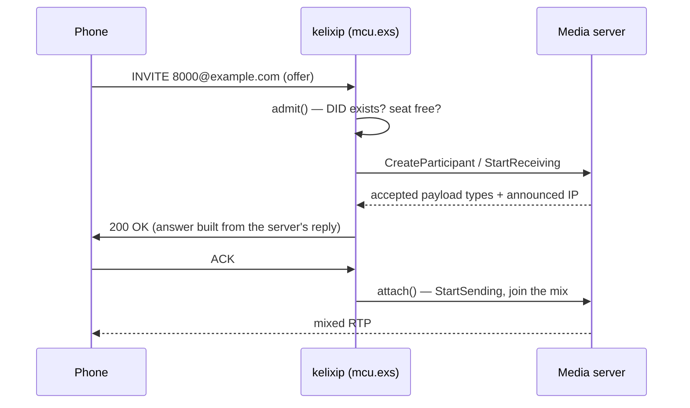

# mcu — operating and troubleshooting guide

Running a conferencing node: what must be true for a call to work, what the node is
telling you, and where to look when it does not work.

The reference — installing the module, every `[module.mcu]` key, the script macros, the
`kelictl` commands — is [mcu.md](mcu.md), and the wire contract is
[mcu-api.md](mcu-api.md). The decisions that shape what you see at runtime are stated
here, where they matter; [../../design/DESIGN-MCU.md](../../design/DESIGN-MCU.md) holds
the long form for whoever wants it.

---

## 1. For the operator

### 1.1 What must be true before a call can succeed

Four things, and a missing one fails as something else:

1. the **media server** is reachable (`kelictl status` → `mediaservers 1/1 up`);
2. a **conference exists** on the dialled DID (`kelictl mcu conference.list`);
3. a **dial rule** routes that DID to `mcu.exs`. The module allocates DIDs, it never
   edits `domains.toml`, so the two can drift; `create` warns when they have;
4. the module is **loaded** (`kelictl status`, `modules:` line).

### 1.2 The join, end to end



Two rules follow from it:

* **the ACK puts the leg in the mix.** A caller that never ACKs holds its seat and
  hears nothing — no RTP leaves the mixer before the call is established;
* **the answer is the media server's**, not kelixip's: accepted codecs, `fmtp` and the
  `c=` address all come back from `StartReceiving` and go on the wire verbatim.

### 1.3 The announced address — `--public-ip`

```
   caller ──RTP──►  1.2.3.4:40000        (what the answer's c= line says)
                       │
              NAT / firewall
                       ▼
   mediaserver binds 0.0.0.0, announces what --public-ip says
```

The media server decides the address it announces; kelixip only relays it.

* `mediaserver --public-ip <ip>` — **mandatory behind a NAT**: the bound address
  (`0.0.0.0`) is never the reachable one;
* without it, the server takes the first non-loopback IPv4 of its host name — right on
  a flat network, wrong behind NAT;
* it logs its choice at startup (`-RTPSession announced IP …`) and refuses to start
  without one;
* a server too old to report an address gets its calls refused with `500`. Kelixip
  keeps no fallback: a guessed address gives a call that connects and carries nothing.

Note also that `url` in `[mediaserver.pool.*]` is the XML-RPC port (`--http-port`,
9090 in the IVèS deployment — *not* 8080). The module posts to `<url>/mcu`, not to the
`/jsr309` the point-to-point adapter uses.

### 1.4 No codec list to configure

The offer is the menu: kelixip proposes every payload type the caller offered that it
can name, forwards the caller's `a=fmtp`, and the media server answers with what it
accepted. H.264 `profile-level-id`, `packetization-mode` and
`level-asymmetry-allowed` come from the encoder, so SDP and stream cannot disagree
(`H264Encoder: … profile-level-id …` in the server's log).

Consequences: a codec this MCU used to exclude (G.729, iLBC…) now works if the server
supports it; and there is no way to *prefer* one codec over another — the caller's
order wins, as an answerer should.

Two policy keys replace the old lists, because turning a media off is a deployment
decision, not a codec capability: **`medias`** (an omitted media is answered **port 0**,
RFC 3264 §6) and **`dtmf`** (telephone-event, RFC 4733 — a stream the mixer never
encodes).

> **Upgrading from 1.2.** `audio_codecs`, `video_codecs`, `text_codecs` and
> `video_fmtp` are accepted, ignored and warned about; they become an error in the next
> release. An `audio_codecs` without `TELEPHONE-EVENT` no longer turns DTMF off (use
> `dtmf = false`), and `text_codecs = []` no longer turns text off (drop `"text"` from
> `medias`).

Text needs nothing else: the server mixes it on its own text mixer — a text leg is not
a mosaic tile and does not move the automatic layout. And `rate` is the mixer's
sampling rate, not a constraint on the legs: everyone is resampled to it.

### 1.5 Metrics

Prometheus, on the `[metrics]` port:

| Metric | Read it for |
|---|---|
| `kelix_mcu_calls_total{result}` | the funnel: `joined` vs `404`/`486`/`488`/`503`/`500`. Rising `486` = conferences full; rising `488` = offers the server rejects |
| `kelix_mcu_conferences{mcu}`, `kelix_mcu_participants{mcu,conference}` | occupancy |
| `kelix_mcu_mediaserver_up{mcu}` | the module's view of its own control channel — not `kelix_mediaserver_up`, which is the point-to-point pool's |
| `kelix_mcu_rpc_duration_seconds{method}` | slow call setup: each leg is a handful of these in series |
| `kelix_mcu_rpc_errors_total{method,reason}` | any non-zero value. `reason` is bounded; the server's own message is the log line above |

---

## 2. For whoever writes a script

The module decides resource policy, the script decides SIP policy — which is what lets
a deployment change SIP behaviour without touching the module. The macros are in
[mcu.md](mcu.md#using-the-module-in-an-elixip-script) and
[`mcu.exs`](../../../apps/kelixip/scripts/mcu.exs) is the whole thing in one file.
What follows is what they do not say.

### 2.1 Verdicts and their SIP codes

| Verdict (`sip_ctx.lasterr`) | Code | Why |
|---|---|---|
| `{:error, :no_such_conference}` | `404` | the DID designates nothing |
| `{:error, :full}` | `486` | `max_participants` reached |
| `{:error, :mcu_down}` | `503` | the conference exists, its media server does not answer |
| `{:error, :down \| :timeout}` | `500` | the module is wedged or absent |
| media `:no_common_codec` | `488` | retrying is pointless |
| media `:secure_not_supported` | `488` | a DTLS offer while the script passed `webrtc: :no` |
| media `{:bad_offer, _}` | `400` | the SDP did not parse |
| any other media error | `500` | ours; a retry may work |

Module calls go through `safe_call/3`, so a wedged module is an error you answer with.
**Rescue anyway**: a module that is not installed raises `UndefinedFunctionError`, and
an unrescued raise leaves the caller with *no* response — worse than any code, since it
retransmits into the void.

### 2.2 Teardown and ownership

`leave/1` tolerates an already-removed participant: call it from every teardown path,
unguarded. Skipping one path is the bug that leaves a ghost in the mix.

`owner: :caller` (the default of `create_conference` / `ensure_conference`) is the leak
guard: if the creating instance dies before anyone joins, the module destroys the
**empty** conference. A conference somebody joined survives its creator.

The module never creates a conference by itself — no template, no implicit rule. Ad-hoc
rooms are a script's decision (`mcu_adhoc.exs`); `mcu.exs` answers `404`.

---

## 3. For whoever debugs a call

### 3.1 What a successful join looks like

Every line carries the conference `uid`, so a call reads end to end:

```
conference.created c-3f9a2b10: name=Weekly domain=example.com mcu=mcu1 conf_id=42 did=8000
participant.ringing c-3f9a2b10: name=alice@phone_example_com from=alice@phone.example.com did=8000
conference c-3f9a2b10: participant 7 (alice@phone_example_com) created on mcu1
participant.joined c-3f9a2b10: part_id=7 name=alice@phone_example_com medias=%{audio: "PCMA"}
participant.left c-3f9a2b10: part_id=7 reason=bye duration_ms=45120
```

`ringing` without a later `joined` is a caller who never made it into the mix; a
rejected call emits no `ringing` at all, so `ringing − joined` is exactly "abandoned
before answer".

### 3.2 The failures that look alike from outside

The caller sees a code; only the log tells them apart.

| Symptom | Log line | Cause |
|---|---|---|
| `488` | `offer refused (:no_common_codec)` | **every** offered media came back empty. The `proposed N pt, accepted M` line above says what was turned down; a single empty media is answered port 0, not `488` |
| `488` | `offer refused (:secure_not_supported)` | a DTLS/SDES offer while the script passed `webrtc: :no` |
| `503` | `mediaserver.down : mcu=mcu1` earlier | control channel down; `kelictl status` shows `0/1 up` |
| `500` | `mcu mcu1: <Method> failed: …` | an RPC failed — the method and the server's message are on that line |
| `500` | `mcu mcu1 returned no media IP from StartReceiving` | media server too old to announce an address (§1.3) — upgrade it |
| `404` | `participant.rejected: reason=no_such_conference` | check `conference.list` and the dial rule |

### 3.3 Connected but no audio

1. **the announced address** (§1.3) — compare the server's `-RTPSession announced IP`
   with what the caller can route to. `participant.show` settles it: `num_recv_packets`
   at 0 means nothing arrives; non-zero `num_send_packets` with silence at the far end
   means our address is wrong;
2. **no ACK** — the leg never joined; `participant.list` shows `state: ringing`;
3. **firewall** on the server's `--min-rtp-port/--max-rtp-port` range.

One-way video: look for `h264.profile-level-id` in the `SetRTPProperties` log. The
media server negotiates the profile and binds its encoder to it, so the SDP and the
stream agree by construction; a handset seeing nothing is one whose declared level or
profile the stream respects but whose decoder does not — the answer names what it will
receive, compare the two.

### 3.4 The silent leg — the RTP watchdog

A leg whose media stops is reaped by the media server, not by SIP. `rtp_timeout_ms`
(default 10 s, `0` disables) is armed **per media at the ACK**, and four rules follow
from what a conference actually looks like:

* **text is never armed** — T.140 is legitimately silent between keystrokes;
* **a media the peer says it will not send is disarmed** (`recvonly`, `inactive`,
  `c=0.0.0.0`). Without that, a hold longer than the timeout would hang up a working
  call — ten seconds is an ordinary consultation transfer;
* **one dead media does not kill the leg.** The timeouts are ANDed: a lost media is
  logged (`lost video, still has [:audio] — leg kept`) and the leg goes only when
  every watched media is silent. A media that comes back clears its flag, so a leg
  that flapped once is not reaped at the next hiccup. That arbitration is kelixip's
  on purpose — the server reports facts, "how many dead medias make a dead leg" is
  policy;
* **it is best-effort.** A media server predating the RPC answers "method not found";
  the leg is set up anyway and the failure is logged — a leg that carries media is
  worth more than a leg that is monitored. A fleet where nothing is ever armed says so
  in the log rather than passing for working.

The script gets `{:mcu_event, :media_timeout, media}` on the fatal one (`mcu.exs` BYEs
and leaves) and `{:mcu_event, :media_connected, media}` on the first validated packet
of a reception cycle — on a secure leg, that event *is* the proof the DTLS handshake
completed.

### 3.5 Behaviours that are not bugs

* **conferences do not survive a kelixip restart**: they live in memory, and
  persistence was left out. What the media server still holds is swept at the next
  start (`gc_orphans`), keyed on the MCU-side conference id; a reply the module cannot
  decode with confidence deletes **nothing**, since a misparse here would destroy live
  conferences rather than leak dead ones;
* **a recording is not resumed** after a media-server restart, and the partial file is
  left in place — deliberate: it is evidence, and half a file beats none;
* **an unreadable `logo` is not reported**: the server answers OK whatever the picture
  did. An empty slot with no logo is the only symptom;
* **a collaboration message that "does not arrive"**: the receiving script did not call
  `mcu_accept_messages()`. Nothing is delivered to a leg that did not ask, and the
  sender sees it as a `skipped` entry rather than a silent loss.

---

## 4. Testing a node without packaging

See [BUILD.md](../../../BUILD.md#running-the-mcu-module-from-a-checkout): in dev the
modules come from the umbrella's own `ebin`, so `module_dir` stays empty and nothing
needs installing — point `KELIXIP_CONFIG` / `KELIXIP_DOMAINS` at a TOML pair carrying
`[module.mcu]` and a dial rule, with a real `mediaserver --http-port` running.

---

## 5. Operational notes

### 5.1 One media server per conference

A conference lives on exactly one media server: there is no multi-MCU conference, so it
is pinned to the MCU chosen at creation and never migrates. `create` without an `mcu`
takes the `[mediaserver.pool.*]` entries in turn, `create` with one honours it; either
way it then stays put.

Two flags decide eligibility for a **new** conference:

* the pool's `enabled` — the operator's switch. Disabling stops new conferences (and
  new point-to-point calls) landing there; live ones stay, and naming the server
  explicitly still works;
* the module's own `status` (`kelictl status`, `n/m up`) — health of the `/mcu` channel
  the conferences ride, which is **not** what the pool probes for point-to-point calls
  (`/jsr309`). A server can be up for one and down for the other; hence two metrics.

### 5.2 Reloading and restarting

* `kelictl module reload mcu` — no in-place reload: the module restarts cleanly, which
  **drops the live conferences** (their rows; the media server's are swept at the next
  start);
* an **MCU restart** is handled: conferences go `stale`, their scenarios are told, and
  the conferences come back with the same `uid` when the server returns. The calls are
  gone, the rooms and their DIDs are not;
* a **kelixip restart** loses the conferences; `gc_orphans = true` deletes what the
  media server still holds.

### 5.3 What is not there, and why

| Absent | Why |
|---|---|
| **Conference templates**, and creation on an unknown DID by the module | a room appearing because someone dialled a number is a *script's* decision, not the module's. `mcu_adhoc.exs` does it; `mcu.exs` answers `404` |
| **PIN or digest at join** | whoever reaches the DID enters. Admission is policy: protect the perimeter upstream (trusted proxy, ACL) or challenge in a derived script |
| **Outbound calls** (dial-out into a conference) | needs the B2BUA leg primitives, which came later |
| **Admin web UI** | REST + `kelictl` only, so there is one control surface to secure and to document |
| **Event callbacks to an external UI** | events are logged and metered instead. Their vocabulary is frozen, so a transport can be added without touching what emits them |
| **Document sharing / BFCP** | a large self-contained subsystem. The role parameter is passed correctly (always `0`), so adding it stays additive |
| **Extra mosaics and sidebars** | only mosaic `0` / sidebar `0` are used — `recording.*` and `slot.*` therefore always address that one |
| **Conference persistence** | see §3.5; scheduling a conference would need a store the module does not have |
